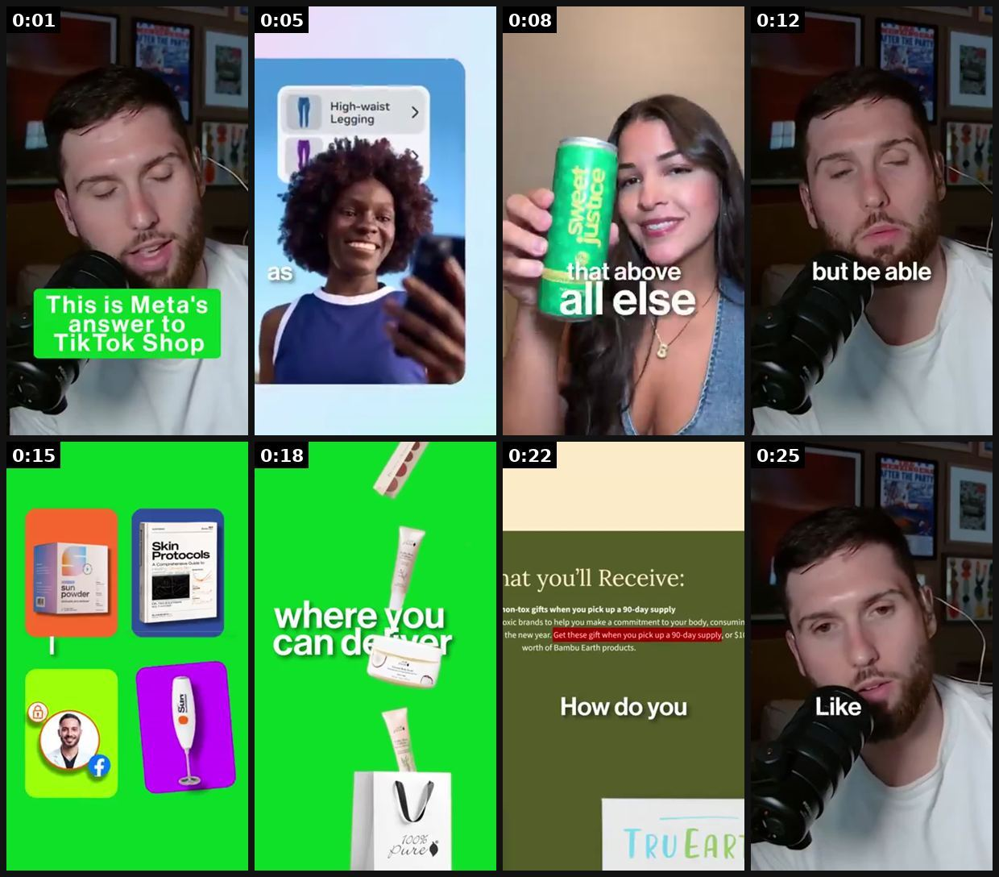
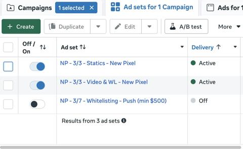
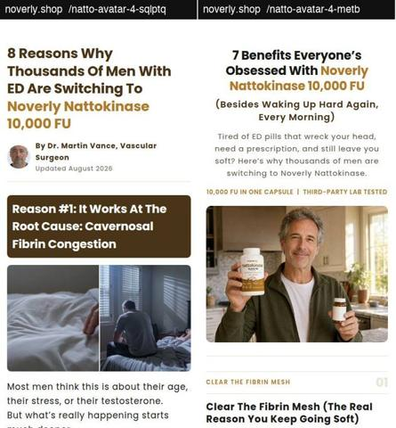

# 80 · Persona pages: ads run from named narrator pages (catalog of the pattern + LC-safe version): see it, then make it

[](https://x.com/Seanfrank/status/2094988024211812654)

**The example:** [@Seanfrank on X](https://x.com/Seanfrank/status/2094988024211812654) · 0:27 video · 140 likes, 55K views

**Watch it:** [open the post on X](https://x.com/Seanfrank/status/2094988024211812654) · [play the video file](https://video.twimg.com/amplify_video/2094987997385228288/vid/avc1/320x568/M9DgP2BSpr7kE_Qv.mp4?tag=29)

> "Ill just whitelist" Whitelisting is fine. But meta is REWARDING accounts that commit to partnership ads. This is fully tin foil hat theory now... but I have seen first hand lower CPMs, higher click through rates, and better CACs from partnership ads. I think there is a finger on the scale. These massive companies have huge teams with product adoption KPIs. If they want you to change your behavior, they will reward y…

## What you are seeing

A creator talking to camera ("This is Meta's answer to TikTok Shop") with cutaways to persona-style pages: a woman holding a drink can, product screenshots, a "where you can deliver" card and a landing page. It explains how persona pages run ads natively.

## Beat by beat

The storyboard above samples the video every 0:03. Lines are the transcript for that stretch; on-screen text comes from OCR, so treat it as rough.

| Frame | Time | On screen | Said / sung |
|---|---|---|---|
| 1 | 0:00–0:03 | · | We want partnership ads in your ad account. Met is leaning into partnership ads harder and harder. |
| 2 | 0:03–0:06 | · | They see it as their competition to TikTok shop. So prioritize that above all else. |
| 3 | 0:06–0:10 | · | · |
| 4 | 0:10–0:13 | but be able | It's better to have a worse partnership handle, but be able to control the creative. |
| 5 | 0:13–0:17 | · | Sunpowder has the best bundled offer. I think they are punching people in the face with that. |
| 6 | 0:17–0:20 | · | Look for things like that where you can deliver tons of value to your customers, |
| 7 | 0:20–0:24 | vat you'll Receive: … gifts when you pick up a 90-day supply … brands to help you make a commitment to your body, … the new year. Get these gift when you pick u | where it doesn't cost you anything. How do you get the number to be attractive |
| 8 | 0:24–0:27 | · | and to make the order a no brainer? Like we're looking for no brainer offers. |

<details><summary>Full transcript (timestamped)</summary>

- `0:00` We want partnership ads in your ad account. Met is leaning into partnership ads harder and harder.
- `0:04` They see it as their competition to TikTok shop. So prioritize that above all else.
- `0:08` It's better to have a worse partnership handle, but be able to control the creative.
- `0:13` Sunpowder has the best bundled offer. I think they are punching people in the face with that.
- `0:17` Look for things like that where you can deliver tons of value to your customers,
- `0:20` where it doesn't cost you anything. How do you get the number to be attractive
- `0:23` and to make the order a no brainer? Like we're looking for no brainer offers.

</details>

## More real examples (3)

Other posts that show this format, or a close cousin of it. Click a thumbnail to open it on X.

| | | |
|---|---|---|
| [](https://x.com/vincenzo_micale/status/2105349586717950002)<br>**@vincenzo_micale** · images · 4K views<br>Menopause bracelet brand: 1,592 active Meta ads, 107 days, 59% US — saturation-level creative volume in wearable/jewelry. | [](https://x.com/benradack/status/2078473442714616149)<br>**@benradack** · image · 2K views<br>I consolidated our whitelisting ads into one ad set with our brand videos. My CBO performs better with fewer ad sets running. So instead of keeping wh | [](https://x.com/DTC_Quizbuilder/status/2107516274142285842)<br>**@DTC_Quizbuilder** · image · 643 views<br>Noverly's copy is built around one idea: ED isn't age or testosterone, it's a clogged pipe They sell it through a doctor-bylined listicle The buyer th |

## How to make one like it

**The format in one line:** Big direct-response brands run hundreds of ads from pages named after a narrator ("Sarah Bennett", "Your Health Journal", "Dr. Lisa Downing") instead of the brand page. Each persona has an age, situation and voice and writes first-person natives. LC-safe version: real people (founder, CS lead, real customers with consent) as named narrators, clearly connected to LC, never invented people presented

**Why it works:** - A first-person narrator page reads like a person, not a brand. - Persona × angle multiplies ad diversity (more distinct "entities"). - Lets one product speak to many avatars (brides, mothers, swimmers).

**Contents:** [1. Structure](#1-copy-the-structure) · [2. Shot by shot](#2-shot-by-shot-remake) · [3. Script and hooks](#3-write-the-script) · [4. Prompts](#4-prompts) · [5. Tools and settings](#5-tools-and-settings) · [6. Louise Carter remake](#6-louise-carter-remake) · [7. Variants and test](#7-variants-and-test-plan) · [8. Pitfalls](#8-pitfalls)

### 1. Copy the structure

Use the example's timing as your beat sheet. Keep the beat, change the words and the product.

| Beat | Time | In the example | Your version |
|---|---|---|---|
| 1 | 0:01 | We want partnership ads in your ad account. Met is leaning into partnership ads harder and harder. | … |
| 2 | 0:05 | We want partnership ads in your ad account. Met is leaning into partnership ads harder and harder. They see it as their competition to TikTo | … |
| 3 | 0:08 | They see it as their competition to TikTok shop. So prioritize that above all else. It's better to have a worse partnership handle, but be a | … |
| 4 | 0:12 | It's better to have a worse partnership handle, but be able to control the creative. | … |
| 5 | 0:15 | Sunpowder has the best bundled offer. I think they are punching people in the face with that. | … |
| 6 | 0:18 | Look for things like that where you can deliver tons of value to your customers, | … |
| 7 | 0:22 | where it doesn't cost you anything. How do you get the number to be attractive | … |
| 8 | 0:25 | and to make the order a no brainer? Like we're looking for no brainer offers. | … |

### 2. Shot-by-shot remake

**Target length / size:** System: 2-4 narrator Pages, each running 3-6 native story ads (image + 150-400 word post) to a matching advertorial

| # | Time / slot | What we see (visual + camera) | Dialogue / on-screen text |
|---|---|---|---|
| 1 | Page setup (day 0) | A Facebook/IG Page with a narrator name ("Dana on Jewelry"), a real face (founder, staff or a consenting creator), a cover photo of her jewellery box, and a bio that says "Content by Louise Carter" | Bio: "Ex-stylist. I test jewellery in the sea so you don't have to. Partnered with Louise Carter." |
| 2 | Organic seed (week 1) | 6-10 ordinary posts so the Page looks lived in: outfit photos, a "what I packed" carousel, a reply to a follower | Plain first-person captions, no links |
| 3 | Ad 1: story post | Phone photo of her hand on a beach towel wearing the stack, slight grain, no logo | Opening line: "I've ruined 4 necklaces in the sea. This one's on month 9." 200-word story, link at the end |
| 4 | Ad 2: listicle post | Flat-lay of 5 pieces on a white bedsheet | "5 pieces I never take off (and the one I stopped wearing)" |
| 5 | Ad 3: reply post | Screenshot of a real comment she got, then her answer | "Someone asked if gold-plated really survives showers. Honest answer:" |
| 6 | Landing | Advertorial written in the same narrator voice, with a "This post is sponsored by Louise Carter" line at the top | Ends in the any-7 offer with a single CTA |

<details><summary>Playbook shot list (Louise Carter version from the README)</summary>

| Time / slot | Visual | Audio / copy |
|---|---|---|
| Page | "Notes from Louise" (real founder) or "Jess from LC customer care" | first-person natives |
| Ad | Long-copy native about a real customer story (with consent) | "Here's what Maria told me…" |

</details>

### 3. Write the script

Open with one of these hooks (first 1–3 seconds, or the headline on a static):

- "Notes from our customer-care desk"
- "A bride wrote to us last week…"
- "I'm the founder, and this email made me cry"

Then fill the beats from the table above. Pull the wording from real customer reviews, not from ad copy: a review line beats a copywriter line almost every time. Read every line out loud and cut anything you would not say to a friend. Ready-made Louise Carter scripts are in section 6; hand [BOT.md](BOT.md) to any AI agent to write versions for another brand.

### 4. Prompts

**Claude (narrator bible)**

```text
Create a narrator for [brand]: name, age, job, why she wears the product, 3 phrases she always uses, 3 things she would never say. Then write 6 organic posts and 3 native story ads (150-300 words each) in her voice. Every claim must come from this product page: [paste]. Disclose the brand partnership in each ad.
```

**Meta setup**

```text
Add the Page to Business Manager; run ads from the narrator Page with the brand as paid-partnership label where possible; same pixel and UTM pattern utm_campaign=F80-<narrator>.
```

**Image (real, not AI)**

```text
Shoot on iPhone, natural light, slightly imperfect framing; no studio lighting, no logo overlays.
```

**Full creative-agent prompt (from the playbook):**

```
Using real stories {{CUSTOMER_STORIES}} (with consent), write 6 first-person natives, one per LC avatar, each ≤250 words, told by the real customer or a named LC staff member.
```

### 5. Tools and settings

1. Map 6 real LC avatars (bride, swimmer, nurse, mother-of-the-bride, gift-giver, traveller).
2. Use real narrators with consent; ads clearly from LC.
3. Write 4 natives per avatar; rotate.

| Setting | Value |
|---|---|
| What you are building | A repeatable system (account, page, offer or pipeline), not one ad |
| Cadence | Decide the posting or launch rhythm up front (e.g. daily, or 3 new ads a week) and keep it for 30 days |
| Template | Lock one caption, layout and naming template so output is consistent |
| Tracking | One UTM pattern per system (`utm_campaign=F<NN>`) and a weekly sheet: spend, CTR, hook rate, CPA |
| Tools | Meta Ads Manager / TikTok Ads Manager, a shared Drive folder per format, the agent brief in BOT.md |

### 6. Louise Carter remake

- A · Mother of the bride.
- B · Daily swimmer.
- C · Nurse who washes hands 60× a day.

Brand rules, claims you can and cannot make, and more scripts: [brands/louise-carter.md](brands/louise-carter.md). Step-by-step from idea to scale: [STAGES.md](STAGES.md).

### 7. Variants and test plan

- Avatar
- Founder vs customer narrator

**Test plan:** - **Budget/structure:** 6 natives, $15/day each, 7 days - **Primary KPIs:** CPA by avatar; Omni (F80-*) - **Kill rule:** CPA >1.8× - **Scale rule:** Scale the winning avatar with more stories - **Naming:** `utm_content=F80-<concept>-<variant>`; weekly Omni roll-up of new-customer revenue by format.

**Naming:** `F80-<variant>-<hook##>-<date>` so results map back to this folder. Change one thing per test (hook, narrator, length or offer), never two.

### 8. Pitfalls

- Never invent a credentialed persona (doctor, dermatologist) or a fake real-person identity; Meta treats undisclosed persona pages as inauthentic behaviour.
- The narrator must be a real person who agreed to it, or clearly a brand character.
- One narrator per angle; do not run the same story from three narrators.
- If the Page gets comments asking "is this an ad?", answer honestly and pin the answer.
- Changing the template every week: the system only learns if it stays consistent for at least 30 days.
- No tracking: without one naming and UTM pattern you cannot tell which piece of the system works.

**Compliance:** Baseline: [_COMPLIANCE.md](../_COMPLIANCE.md) (no fake testimonials, AI disclosure, no bulk/spoofed accounts, copy structure not assets, PDP-only claims). - Do NOT invent personas or fake doctors (FTC endorsement guides; Meta inauthentic-behavior rules). Real people, real consent, clear brand connection.

## Field notes

Newer observations live in the playbook: [Wave 2d update: Resilia's 12 authority-persona Pages (do not copy)](README.md) · [Wave 8 update: Voynov page, Adam Taylor teardowns, queued posts (Oct 9, 2026)](README.md) · [Wave 3 update: brands & apps crushing it (Oct 2026)](README.md) · [Wave 4 update: Fedotoff October 2026 swipe boards](README.md)

## More examples

Every post we found for this format, with transcripts: [examples/](examples/README.md). Playbook: [README.md](README.md). Agent brief: [BOT.md](BOT.md).
