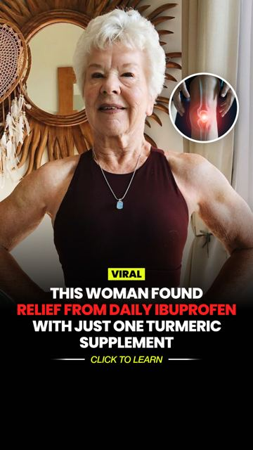

# Meta ad-library examples for F80

<!-- WAVE4 -->
## Wave 4: Alex Fedotoff's October 2026 swipe boards (GetHookd public previews)

Each ad below is from the free 10-ad preview of a public GetHookd board that [@FedotOff90](https://x.com/FedotOff90) shared on X. Days live are as of 2026-10-09; brand claims are the advertisers', not verified.

### Dr Ruth White: Persona-page "this woman found relief" static (Dr Ruth White) (416 days live)

- **Board:** [AI Storytelling Ads: 13 Brands x 50 Longest-Running (Oct 2026)](https://x.com/FedotOff90/status/2107177846070202853) · dco
- **What happens:** An older woman with a red-glowing knee inset; black bar: "VIRAL: THIS WOMAN FOUND RELIEF FROM DAILY IBUPROFEN WITH JUST ONE TURMERIC SUPPLEMENT · CLICK TO LEARN". Run from the persona page "Dr Ruth White". DCO with 22 media.
- **Why it lasts:** 416 days (the sibling ran 446 and 400 days). Third-person news framing on a persona page; it replaces a drug habit (ibuprofen).
- **How to make one:** A persona page, a photo of an avatar-age woman, a pain inset, a "this woman found relief from [drug] with just one [product]" headline.
- **LC remake:** "This woman stopped buying replacement jewelry with just one set."

