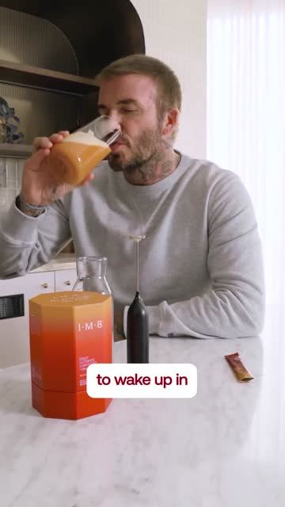
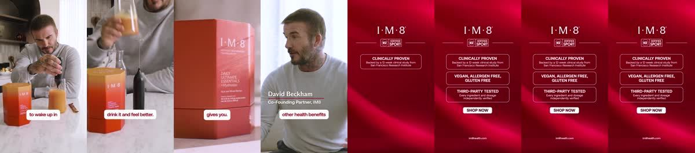

# Meta ad-library examples for F80

<!-- WAVE7 -->
## Wave 7: Lachezar Voynov's "Ad Bible" libraries (Oct 2026)

On Oct 6, 2026 [@LachezarVoynov](https://x.com/LachezarVoynov/status/2107498173384061027) named five Meta pages as "Ad Bibles" for AI ads: Seora Skincare (realistic AI UGC), Koriderm (AI drama), Azure Boutique (AI skits), IM8 Health (AI timeline) and a Resilia page (Suno songs, no active ads when we checked on Oct 9). We pulled each page sorted by impressions and picked the longest-running unique ads. Days live are counted to 2026-10-09, and the brands' claims are not verified.

### The Dodo: The Beckham Standard of Nutrition (28 days live)

- **Ad:** [Meta Ad Library #27787187210963625](https://www.facebook.com/ads/library/?id=27787187210963625) · video 0:17 · page “The Dodo” · started 2026-09-11 · from the “AI timeline ads” library [@LachezarVoynov](https://x.com/LachezarVoynov/status/2107498173384061027) calls an ‘Ad Bible’ ([page](https://www.facebook.com/ads/library/?active_status=active&ad_type=all&country=ALL&search_type=page&view_all_page_id=345914995276546))
- **What happens:** David Beckham mixing a drink: "I want to be able to wake up in the morning, mix a drink up, drink it and feel better". Then IM8 brand cards. Posted as a branded-content ad from **The Dodo** page, labelled #ad.
- **Why it works:** This is the legitimate version of a persona page: a real publisher page runs the brand's ad as a disclosed partnership (Meta branded content), borrowing the publisher's reach and trust. IM8 ran the same week from Sports Illustrated and Thrillist.
- **How to make one:** Through Meta's branded-content tools, partner with real publishers or creators to run ads from their page with the "Paid partnership" label.
- **LC remake:** Partner with a real lifestyle or wedding publisher page to run the LC "never take it off" ad as a labelled paid partnership.

Transcript (auto, first 90 s)

> I want to be able to wake up in the morning, mix a drink up, drink it and feel better, and that's what I am going to give you. That's with all of the other health benefits that we have.

<!-- /WAVE7 -->

<!-- WAVE6 -->
## Wave 6: Resilia & Smooche live Meta ads (Oct 2026)

Pulled from the public Meta Ad Library on 2026-10-09 (Resilia: aged garlic, Ceylon cinnamon, oil of oregano; Smooche: color-changing foundation, Reverse Time peptide serum). Days live are counted to 2026-10-09; most video ads were new tests that week, while the long runners are statics and catalog templates. Transcripts are automatic. Brand claims are the advertisers', not verified, and many are health claims we would never make. The **Do not copy** line flags deceptive tactics (persona "publication" pages, undisclosed AI actors and "experts", fake stock counts).

### Smooche · Cosmetic Times: “I thought foundation was over for me at 52” (17 days live)

- **Ad:** [Meta Ad Library #1075860478768510](https://www.facebook.com/ads/library/?id=1075860478768510) · static image · page “Cosmetic Times” · started 2026-09-21 · 1 copies · lands on `smooche.com/pages/bestfoundation`
- **What happens:** "I thought foundation was over for me at 52": a Smooche first-person ad run from the "Cosmetic Times" page, styled as a beauty publication.
- **Why it works:** The persona network: ads for Resilia run from 20+ named "publication" and narrator pages (Natural Defense Report, Arterial Health Review, Gut Health Insider, Health Insider Daily…), and Smooche from Cosmetic Times, Korean Beauty Tips, James Miami MUA and Aging Queens Magazine. Every page links to the same store.
- **How to make one:** The legitimate version: real creators or a transparently branded editorial page ("by LC").
- **Do not copy:** Pages posing as independent publications and reviewers are deceptive. Do not copy.
- **LC remake:** "The LC Edit" as a branded editorial page, clearly LC.

Primary text

> For years, every foundation I tried would settle into my fine lines, turn orange by noon, and make me look older instead of younger. I'd accepted that foundation just wasn't for mature skin anymore. Then I discovered color-adapting technology that actually works WITH aging skin instead of against it. No settling. No oxidizing. No cakey texture. Within minutes, I looked 10 years younger—and it lasted all day. If you've been struggling with foundation that makes you look older, this might change everything.

### Smooche · Aging Queens Magazine: “I thought foundation was over for me at 52” (6 days live)

- **Ad:** [Meta Ad Library #2560331541128371](https://www.facebook.com/ads/library/?id=2560331541128371) · static image · page “Aging Queens Magazine” · started 2026-10-02 · 1 copies · lands on `smooche.com/pages/bestfoundation`
- **What happens:** "I thought foundation was over for me at 52": the same copy run again from a second persona page, "Aging Queens Magazine".
- **Why it works:** The persona network: ads for Resilia run from 20+ named "publication" and narrator pages (Natural Defense Report, Arterial Health Review, Gut Health Insider, Health Insider Daily…), and Smooche from Cosmetic Times, Korean Beauty Tips, James Miami MUA and Aging Queens Magazine. Every page links to the same store.
- **How to make one:** The legitimate version: real creators or a transparently branded editorial page ("by LC").
- **Do not copy:** Pages posing as independent publications and reviewers are deceptive. Do not copy.
- **LC remake:** "The LC Edit" as a branded editorial page, clearly LC.

Primary text

> For years, every foundation I tried would settle into my fine lines, turn orange by noon, and make me look older instead of younger. I'd accepted that foundation just wasn't for mature skin anymore. Then I discovered color-adapting technology that actually works WITH aging skin instead of against it. No settling. No oxidizing. No cakey texture. Within minutes, I looked 10 years younger—and it lasted all day. If you've been struggling with foundation that makes you look older, this might change everything.

<!-- /WAVE6 -->

<!-- WAVE4 -->
## Wave 4: Alex Fedotoff's October 2026 swipe boards (GetHookd public previews)

Each ad below is from the free 10-ad preview of a public GetHookd board that [@FedotOff90](https://x.com/FedotOff90) shared on X. Days live are as of 2026-10-09; brand claims are the advertisers', not verified.

### Dr Ruth White: Persona-page "this woman found relief" static (Dr Ruth White) (416 days live)

- **Board:** [AI Storytelling Ads: 13 Brands x 50 Longest-Running (Oct 2026)](https://x.com/FedotOff90/status/2107177846070202853) · dco
- **What happens:** An older woman with a red-glowing knee inset; black bar: "VIRAL: THIS WOMAN FOUND RELIEF FROM DAILY IBUPROFEN WITH JUST ONE TURMERIC SUPPLEMENT · CLICK TO LEARN". Run from the persona page "Dr Ruth White". DCO with 22 media.
- **Why it lasts:** 416 days (the sibling ran 446 and 400 days). Third-person news framing on a persona page; it replaces a drug habit (ibuprofen).
- **How to make one:** A persona page, a photo of an avatar-age woman, a pain inset, a "this woman found relief from [drug] with just one [product]" headline.
- **LC remake:** "This woman stopped buying replacement jewelry with just one set."

