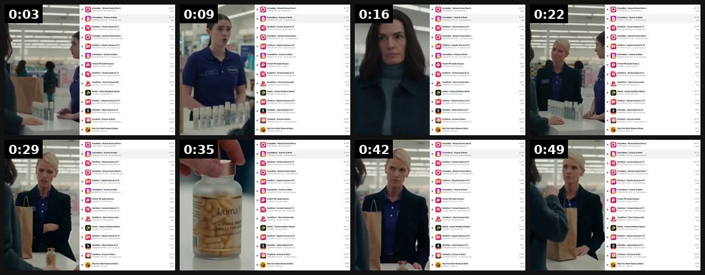
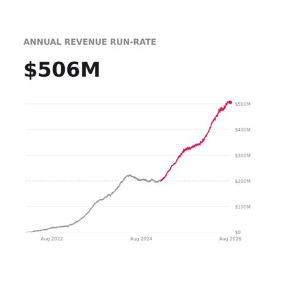

# 81 · Fiction serial native (an episodic short story told across a run of ads): see it, then make it

[](https://x.com/adriamatz/status/2108190619449372721)

**The example:** [@adriamatz on X](https://x.com/adriamatz/status/2108190619449372721) · 0:52 video · 7 likes, 1K views

**Watch it:** [open the post on X](https://x.com/adriamatz/status/2108190619449372721) · [play the video file](https://video.twimg.com/amplify_video/2108190428713439232/vid/avc1/468x360/8fy9qV8xPc5K5Pz9.mp4?tag=29)

> DramaBox makes $20M a month on iOS with short dramas So Arcads built a way to turn your product into one This drama is an ad, made 100% with AI You don't notice until the product shows up in the plot

## What you are seeing

An Arcads demo of a short-drama ad: office scenes with actors, split with a script panel, styled like DramaBox micro-dramas but built around a product.

## Beat by beat

The storyboard above samples the video every 0:06. Lines are the transcript for that stretch; on-screen text comes from OCR, so treat it as rough.

| Frame | Time | On screen | Said / sung |
|---|---|---|---|
| 1 | 0:00–0:06 | · | Mari, Inaan accept these. It've all been opened. They didn't work. |
| 2 | 0:06–0:13 | · | You can't return 12 open bottles because they didn't work? |
| 3 | 0:13–0:19 | · | · |
| 4 | 0:19–0:26 | ramadan seem bee | They didn't work for two |
| 5 | 0:26–0:32 | Seam bee 87 as | · |
| 6 | 0:32–0:39 | · | · |
| 7 | 0:39–0:45 | mate tee tome … a. ramadan seem tee are … ramen romans ore | Six weeks. It stopped falling out. I stopped finding it on my pillow. |
| 8 | 0:45–0:52 | nate rape ramen Sheen | It's called Lumo 100. Now, my refund. |

<details><summary>Full transcript (timestamped)</summary>

- `0:01` Mari, Inaan accept these. It've all been opened.
- `0:04` They didn't work.
- `0:08` You can't return 12 open bottles because they didn't work?
- `0:12` They didn't work for two
- `0:40` Six weeks. It stopped falling out. I stopped finding it on my pillow.
- `0:44` It's called Lumo 100. Now, my refund.

</details>

## More real examples (1)

Other posts that show this format, or a close cousin of it. Click a thumbnail to open it on X.

| | | |
|---|---|---|
| [](https://x.com/FedotOff90/status/2101445743412138341)<br>**@FedotOff90** · images · 83K views<br>Pocket FM storytelling drama ads — 199 longest-running; serial episode logic. |   |   |

## How to make one like it

**The format in one line:** Long-copy image ads that each carry one episode of a story (clearly labelled fiction) with a recurring character. Each ends on a cliffhanger; the product is a quiet constant in every episode. Retarget each episode's readers with the next one.

**Why it works:** - Serial cliffhangers bring readers back. - Fiction is honest when labelled, and it builds affinity. - Retargeting by episode creates a natural sequence.

**Contents:** [1. Structure](#1-copy-the-structure) · [2. Shot by shot](#2-shot-by-shot-remake) · [3. Script and hooks](#3-write-the-script) · [4. Prompts](#4-prompts) · [5. Tools and settings](#5-tools-and-settings) · [6. Louise Carter remake](#6-louise-carter-remake) · [7. Variants and test](#7-variants-and-test-plan) · [8. Pitfalls](#8-pitfalls)

### 1. Copy the structure

Use the example's timing as your beat sheet. Keep the beat, change the words and the product.

| Beat | Time | In the example | Your version |
|---|---|---|---|
| 1 | 0:03 | Mari, Inaan accept these. It've all been opened. They didn't work. | … |
| 2 | 0:09 | You can't return 12 open bottles because they didn't work? | … |
| 3 | 0:16 | (visual beat, see frame 3) | … |
| 4 | 0:22 | They didn't work for two | … |
| 5 | 0:29 | on screen: Seam bee 87 as | … |
| 6 | 0:35 | (visual beat, see frame 6) | … |
| 7 | 0:42 | Six weeks. It stopped falling out. I stopped finding it on my pillow. | … |
| 8 | 0:49 | It's called Lumo 100. Now, my refund. | … |

### 2. Shot-by-shot remake

**Target length / size:** 6-episode serial: 6 image ads with 300-600 words each, sequenced 2-3 days apart

| # | Time / slot | What we see (visual + camera) | Dialogue / on-screen text |
|---|---|---|---|
| 1 | Episode 1 image | Illustration or moody phone photo: a woman at an airport gate touching her necklace. Same style every episode | Header text on image: "The Necklace · Episode 1" |
| 2 | Ep 1 copy | Labelled "(A short story. Fiction.)" on line 1 | Sets up the character and her problem: her late grandmother's chain turned green the night before her sister's wedding. Ends on a cliffhanger. |
| 3 | Ep 2-3 | Same character, new setting each time (sister's house, the beach) | The new necklace is just part of her routine: she showers, swims, forgets it's on. Never a pitch. |
| 4 | Ep 4-5 | Tension: someone notices, asks where it's from | Dialogue between characters carries the product facts naturally |
| 5 | Ep 6 (finale) | Wedding photo moment | Resolution + a soft line at the end: "The stack in this story is Louise Carter's. Any 7 for $85." |

<details><summary>Playbook shot list (Louise Carter version from the README)</summary>

| Time / slot | Visual | Audio / copy |
|---|---|---|
| Ep1 static | Illustration or photo, "Episode 1: The summer she stopped taking it off" | 1,200-char story, cliffhanger |
| Ep2 | Retarget Ep1 engagers | continues; product appears |
| Ep3 | Retarget Ep2 | resolution + offer |

</details>

### 3. Write the script

Open with one of these hooks (first 1–3 seconds, or the headline on a static):

- "Episode 1: The necklace that went everywhere"
- "A short story in 3 parts"

Then fill the beats from the table above. Pull the wording from real customer reviews, not from ad copy: a review line beats a copywriter line almost every time. Read every line out loud and cut anything you would not say to a friend. Ready-made Louise Carter scripts are in section 6; hand [BOT.md](BOT.md) to any AI agent to write versions for another brand.

### 4. Prompts

**Claude (serial)**

```text
Write a 6-episode fiction serial, 350-450 words per episode, about [character]. Episode 1 opens with a concrete problem; each ends on a cliffhanger; the product appears as a quiet constant (never pitched) until a 1-line note at the end of episode 6. Label each as fiction.
```

**Midjourney / illustration**

```text
editorial illustration, woman in her 30s at an airport gate touching a thin gold necklace, warm muted palette, gouache texture, consistent character --ar 4:5 --cref [ep1 image] --sref [ep1 image]
```

**Meta sequencing**

```text
Ep1 to a broad audience; Ep2 to people who engaged with Ep1 (post engagement 7d); and so on. Cap frequency at 2 per episode.
```

**Full creative-agent prompt (from the playbook):**

```
Write a 3-episode fiction serial for LC (each ≤1,200 characters, ending on a cliffhanger) about a recurring character; the necklace appears in each; Ep3 ends with the offer. Label it as fiction.
```

### 5. Tools and settings

1. Write a 3-episode arc; label it "a short story".
2. Ep1 cold; Ep2/Ep3 to engagers.
3. Keep the product a quiet constant, never a pitch, until Ep3.

| Setting | Value |
|---|---|
| Canvas | 1080×1920 (9:16) master; crop a 1080×1350 (4:5) cut for feed placements |
| Frame rate | 30 fps (shoot 60 fps for slow-motion water or sparkle shots) |
| Camera | Phone main lens at 1x, exposure locked on skin, HDR off, grid on; tripod or a phone clamp for product shots |
| Light | One soft key at 45° (window or ring light), white card as fill; side light for metal sparkle |
| Audio | Lavalier or phone 15–20 cm from the mouth; mix voice at -14 LUFS, music at -28 to -30 dB under voice |
| Captions | Burned in, 2–5 words per line, 64–80 px bold sans, white with a black stroke or pill; keep text inside the safe zone (top 220 px and bottom 420 px clear, 64 px side margins) |
| Pacing | A visual change every 1.5–3 s; the hook lands in the first 1.5 s with no logo intro |
| Edit / export | CapCut or Premiere; H.264, 12–20 Mbps, AAC 320 kbps; upload natively to each platform, not via links |

### 6. Louise Carter remake

- A · Summer romance.
- B · Bridesmaids road trip.
- C · Mother & daughter.

Brand rules, claims you can and cannot make, and more scripts: [brands/louise-carter.md](brands/louise-carter.md). Step-by-step from idea to scale: [STAGES.md](STAGES.md).

### 7. Variants and test plan

- Illustration vs photo
- Weekly vs daily cadence

**Test plan:** - **Budget/structure:** 3 episodes, $15/day, 14 days - **Primary KPIs:** Ep1→Ep2 read-through, CPA; Omni (F81-*) - **Kill rule:** Ep1 CTR <0.5% - **Scale rule:** Continue if read-through holds - **Naming:** `utm_content=F81-<concept>-<variant>`; weekly Omni roll-up of new-customer revenue by format.

**Naming:** `F81-<variant>-<hook##>-<date>` so results map back to this folder. Change one thing per test (hook, narrator, length or offer), never two.

### 8. Pitfalls

- Label fiction clearly in every ad; never present it as a true story.
- Sequencing needs engagement audiences; without them, people see episode 4 first and the story makes no sense.
- Keep the character consistent (same face and style) or the serial breaks.
- Slow open: if the first 1.5 s does not show the hook visually, most people swipe.
- Logo or brand intro at the start reads as an ad; put the brand at the end.
- Captions covered by the platform UI: check the safe zone on a real phone before posting.
- Music over the voice: keep music at least 14 dB under speech.

**Compliance:** Baseline: [_COMPLIANCE.md](../_COMPLIANCE.md) (no fake testimonials, AI disclosure, no bulk/spoofed accounts, copy structure not assets, PDP-only claims). - Clearly fiction; no implied real testimonials.

## More examples

Every post we found for this format, with transcripts: [examples/](examples/README.md). Playbook: [README.md](README.md). Agent brief: [BOT.md](BOT.md).
