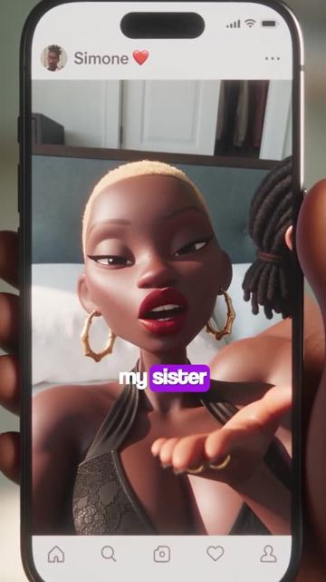
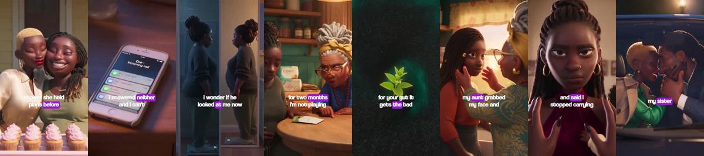
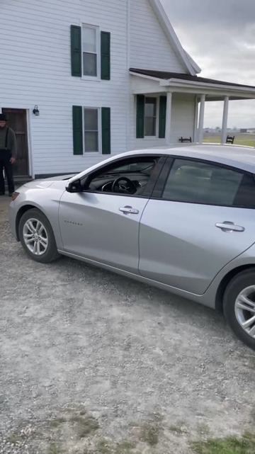
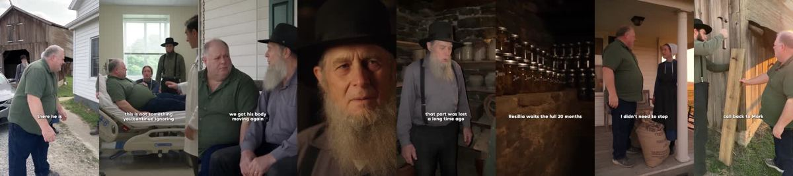
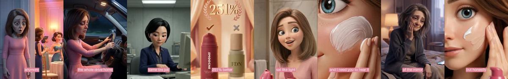
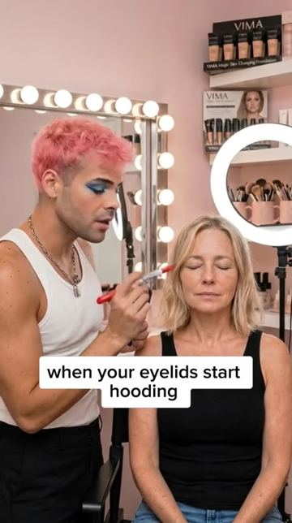
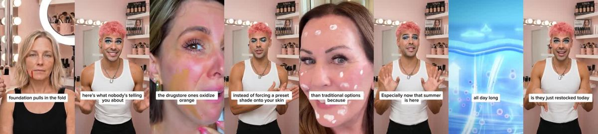
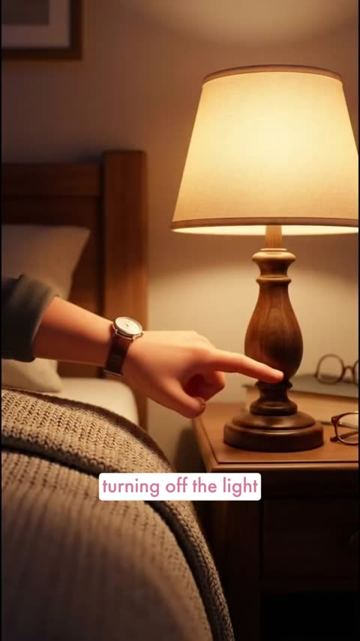
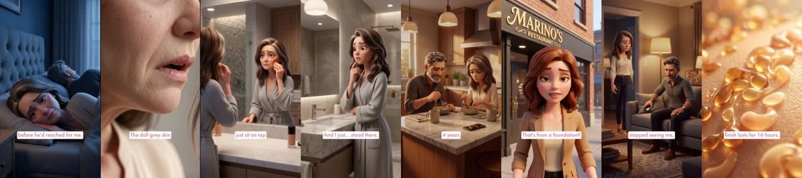

# Meta ad-library examples for F81

<!-- WAVE6 -->
## Wave 6: Resilia & Smooche live Meta ads (Oct 2026)

Pulled from the public Meta Ad Library on 2026-10-09 (Resilia: aged garlic, Ceylon cinnamon, oil of oregano; Smooche: color-changing foundation, Reverse Time peptide serum). Days live are counted to 2026-10-09; most video ads were new tests that week, while the long runners are statics and catalog templates. Transcripts are automatic. Brand claims are the advertisers', not verified, and many are health claims we would never make. The **Do not copy** line flags deceptive tactics (persona "publication" pages, undisclosed AI actors and "experts", fake stock counts).

### Resilia · Gut Health Insider: “My husband slept with my sister I was four months pregnant I found the…” (1 day live)

- **Ad:** [Meta Ad Library #2050050738955489](https://www.facebook.com/ads/library/?id=2050050738955489) · video 5:06 · page “Gut Health Insider” · started 2026-10-07 · 1 copies · lands on `resilia.shop/products/resilia-oil-of-oregano-softgels`
- **What happens:** Opens: “My husband slept with my sister I was four months pregnant I found the messages on a Saturday morning while he was at the gym The name on his phone with a heart emoji next to it, my own sister The…” The same script appears in 2 ads across 1 pages (Gut Health Insider).
- **Why it works:** The same storyline (the Koji tree-climbing dad; the "messages on a Saturday morning" betrayal; the mother-in-law at the dress fitting) is re-cut into several ads, so a viewer who saw episode 1 recognises episode 2.
- **How to make one:** Write one 5-act story and cut it into 3-5 ads that each end on a different beat. Keep the same faces, names and locations. Run the episodes as one ad set.
- **Do not copy:** The characters are presented as real people. Label it as a series or fiction.
- **LC remake:** "The Necklace Diaries": one character, one LC necklace, five life moments (first job, breakup, beach trip, wedding, baby).

Transcript (auto, first ~70 s)

> My husband slept with my sister I was four months pregnant I found the messages on a Saturday morning while he was at the gym The name on his phone with a heart emoji next to it, my own sister The messages went back eleven months before the pregnancy

### Resilia · Active Longevity Review: “Dad! Look at you. You made it…” (1 day live)

- **Ad:** [Meta Ad Library #2502843990211816](https://www.facebook.com/ads/library/?id=2502843990211816) · video 10:02 · page “Active Longevity Review” · started 2026-10-07 · 1 copies · lands on `resilia.shop/products/resilia-aged-odorless-garlic`
- **What happens:** Opens: “Dad! Look at you.” The same script appears in 2 ads across 1 pages (Active Longevity Review).
- **Why it works:** The same storyline (the Koji tree-climbing dad; the "messages on a Saturday morning" betrayal; the mother-in-law at the dress fitting) is re-cut into several ads, so a viewer who saw episode 1 recognises episode 2.
- **How to make one:** Write one 5-act story and cut it into 3-5 ads that each end on a different beat. Keep the same faces, names and locations. Run the episodes as one ad set.
- **Do not copy:** The characters are presented as real people. Label it as a series or fiction.
- **LC remake:** "The Necklace Diaries": one character, one LC necklace, five life moments (first job, breakup, beach trip, wedding, baby).

Transcript (auto, first ~70 s)

> Dad! Look at you. You made it. Dad? Huh, I'm fine. Just the car. 14 hours sitting in that seat. That's all it is. Good to finally meet you in person. You too. Where's the little guy? There he is. I drove halfway a for this. Dad, I can take him. I've got him. Give me a second can. Dad?

### Smooche · Cosmetic Times: “At 58, I went to my school reunion and barely recognized myself in the…” (21 days live)

- **Ad:** [Meta Ad Library #2004434913598003](https://www.facebook.com/ads/library/?id=2004434913598003) · video 5:57 · page “Cosmetic Times” · started 2026-09-17 · 1 copies · lands on `smooche.com/pages/bestfoundation`
- **What happens:** Opens: “At 58, I went to my school reunion and barely recognized myself in the mirror that night. I'd been the pretty one back in school, homecoming queen and everyone spotlight.” The same script appears in 2 ads across 1 pages (Cosmetic Times).
- **Why it works:** The same storyline (the Koji tree-climbing dad; the "messages on a Saturday morning" betrayal; the mother-in-law at the dress fitting) is re-cut into several ads, so a viewer who saw episode 1 recognises episode 2.
- **How to make one:** Write one 5-act story and cut it into 3-5 ads that each end on a different beat. Keep the same faces, names and locations. Run the episodes as one ad set.
- **Do not copy:** The characters are presented as real people. Label it as a series or fiction.
- **LC remake:** "The Necklace Diaries": one character, one LC necklace, five life moments (first job, breakup, beach trip, wedding, baby).

Transcript (auto, first ~70 s)

> At 58, I went to my school reunion and barely recognized myself in the mirror that night. I'd been the pretty one back in school, homecoming queen and everyone spotlight. So I 굉장 I'd be fine, I figured I'd walk in like before and that I was the worst part of it all

### Smooche · Cosmetic Times: “When your eyelids start hooding, right here, foundation transfers onto…” (9 days live)

- **Ad:** [Meta Ad Library #2977679275941475](https://www.facebook.com/ads/library/?id=2977679275941475) · video 2:36 · page “Cosmetic Times” · started 2026-09-29 · 1 copies · lands on `smooche.com/pages/makeupartist`
- **What happens:** Opens: “When your eyelids start hooding, right here, foundation transfers onto the crease all day. And when Jaws drop at your Jaws line, foundationsations for mature skin, they just took the regular formula,…” The same script appears in 2 ads across 1 pages (Cosmetic Times).
- **Why it works:** The same storyline (the Koji tree-climbing dad; the "messages on a Saturday morning" betrayal; the mother-in-law at the dress fitting) is re-cut into several ads, so a viewer who saw episode 1 recognises episode 2.
- **How to make one:** Write one 5-act story and cut it into 3-5 ads that each end on a different beat. Keep the same faces, names and locations. Run the episodes as one ad set.
- **Do not copy:** The characters are presented as real people. Label it as a series or fiction.
- **LC remake:** "The Necklace Diaries": one character, one LC necklace, five life moments (first job, breakup, beach trip, wedding, baby).

Transcript (auto, first ~70 s)

> When your eyelids start hooding, right here, foundation transfers onto the crease all day. And when Jaws drop at your Jaws line, foundationsations for mature skin, they just took the regular formula, added the word lifting, and slapped a higher price on it. same heavy oils, same heavy formulas. So when your skin goes through hormonal shifts, that foundation still behaves like your 25. The drugstore ones oxidize orange, the one settle into every crease, the luxury ones cake under the eyes. But South Korean cosmetic did something entirely different. They built a formula from scratch for mature skin chemistry. Smooch completely takes the stress out of picking a shade. Instead of forcing a preset shade onto your skin, it dispenses

### Smooche · Korean Beauty Tips: “My husband started turning off the light while we had sex We've been…” (7 days live)

- **Ad:** [Meta Ad Library #1486779516613700](https://www.facebook.com/ads/library/?id=1486779516613700) · video 12:27 · page “Korean Beauty Tips” · started 2026-10-01 · 1 copies · lands on `smooche.com/pages/reverse`
- **What happens:** Opens: “My husband started turning off the light while we had sex We've been married for 22 years And I still saw him the way I did when I was 30 But somewhere in the last few years he started flinching when…” The same script appears in 2 ads across 1 pages (Korean Beauty Tips).
- **Why it works:** The same storyline (the Koji tree-climbing dad; the "messages on a Saturday morning" betrayal; the mother-in-law at the dress fitting) is re-cut into several ads, so a viewer who saw episode 1 recognises episode 2.
- **How to make one:** Write one 5-act story and cut it into 3-5 ads that each end on a different beat. Keep the same faces, names and locations. Run the episodes as one ad set.
- **Do not copy:** The characters are presented as real people. Label it as a series or fiction.
- **LC remake:** "The Necklace Diaries": one character, one LC necklace, five life moments (first job, breakup, beach trip, wedding, baby).

Transcript (auto, first ~70 s)

> My husband started turning off the light while we had sex We've been married for 22 years And I still saw him the way I did when I was 30 But somewhere in the last few years he started flinching when I touched him For more than two decades this man made me feel like he wanted No one wanted to see me All of me in my imperfections and insecurities He always wanted me random Tuesday Or anniversary it did But reaching for the light switch Before he'd reached for just like that out loud So here's what happened We've known each other since we were six years old Best friends before we were...

### Resilia · Blood Sugar Wellness: “Come on, Dad. Climb with me. Like before…” (0 days live)

- **Ad:** [Meta Ad Library #1681288066673794](https://www.facebook.com/ads/library/?id=1681288066673794) · video 7:11 · page “Blood Sugar Wellness” · started 2026-10-09 · 1 copies · lands on `resilia.shop/products/resilia-ceylon-cinnamon`
- **What happens:** Opens: “Come on, Dad. Climb with me.”
- **Why it works:** The same storyline (the Koji tree-climbing dad; the "messages on a Saturday morning" betrayal; the mother-in-law at the dress fitting) is re-cut into several ads, so a viewer who saw episode 1 recognises episode 2.
- **How to make one:** Write one 5-act story and cut it into 3-5 ads that each end on a different beat. Keep the same faces, names and locations. Run the episodes as one ad set.
- **Do not copy:** The characters are presented as real people. Label it as a series or fiction.
- **LC remake:** "The Necklace Diaries": one character, one LC necklace, five life moments (first job, breakup, beach trip, wedding, baby).

Transcript (auto, first ~70 s)

> Come on, Dad. Climb with me. Like before. Not today, buddy. You always say that now. I know. I'm going to fix it. I promise. What happened? Was it the dizziness again? Yeah. My vision went blurry up there. My hand started shaking. A diabetic episode. A stroke? I can't lose you like that.

<!-- /WAVE6 -->

