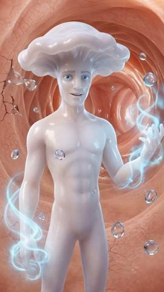
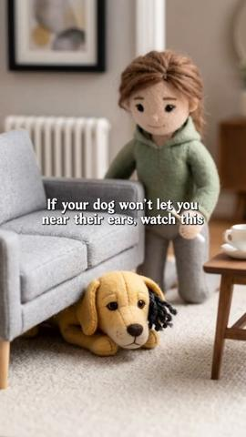
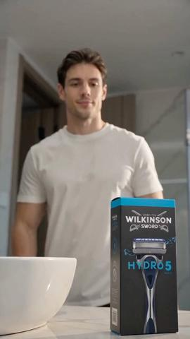

# 82 · Hyperreal CGI mechanism / 'x-ray' shot (inside the material) + villain monologue: see it, then make it

[](https://x.com/FedotOff90/status/2106401392374186396)

**The example:** [@FedotOff90 on X](https://x.com/FedotOff90/status/2106401392374186396) · 3:28 video · 103 likes, 8K views

**Watch it:** [open the post on X](https://x.com/FedotOff90/status/2106401392374186396) · [play the video file](https://video.twimg.com/amplify_video/2106400932410150912/vid/avc1/320x568/TyfIAquKBQAHBDxG.mp4?tag=29)

> There are 5 AI ad formats actually scaling right now: 1. AI podcast 2. AI UGC 3. AI doctor avatar 4. AI listicle 5. AI animation (claymation, CGI) An AI podcast ad hit 280 days live when I pulled it. Longest-running ad in my entire formats swipe. Not UGC. Not a founder. A fake podcast. Full breakdown of the one printing hardest. No comment or follow needed. https://rural-lifeboat-196.notion.site/3addb9d7074d8137bd78e…

## What you are seeing

A woman in a white coat with a stethoscope talking to camera, with a hook caption ("Chronic bad breath has 3 layers!") pinned on top for the whole video and cutaways to mouth CGI.

## Beat by beat

The storyboard above samples the video every 0:26. Lines are the transcript for that stretch; on-screen text comes from OCR, so treat it as rough.

| Frame | Time | On screen | Said / sung |
|---|---|---|---|
| 1 | 0:00–0:26 | Chronic bad breath has layers! a Vi ep people think food fi | All right if you want your tongue to look like this you are only seeing the first layer of the problem and let me show you what is underneath. Okay so layer one that white coating that is what you can see and most people think it is food residue or dead cells it is not it is biofilm a slimy protecti |
| 2 | 0:26–0:52 | · | the bacteria underneath this is what your scraper never reaches underneath that biofilm colonies of bacteria are alive anchor to your tongue feeding on food particles and producing volatile sulfur compounds as waste the two most common are hydrogen sulfide and methyl marcaptan the first one smells l |
| 3 | 0:52–1:18 | · | not the coating itself the gas that is being produced under it layer three and this is what most people never find out these same bacteria don't just live on your tongue they live throughout your throat and your upper gut that is why you can scrape your tongue perfectly clean and still have breath t |
| 4 | 1:18–1:44 | Chronic bad breath has layers ay hi | to break through the biofilm kill the bacteria underneath and rebalance the environment all the way from your tongue throughout your throat and to your gut to get rid of layer one the biofilm take chlorophyllin it's a plant-based derived compound that doesn't scrape the surface like your tongue scra |
| 5 | 1:44–2:10 | Chronic bad breath has layers!! ff love peppermint | sulfur compounds on contact that white coating isn't being scraped off and rebuilt by lunch it is being broken down at the structural level to get rid of layer two the bacteria producing the gas that's clove bud oil and peppermint once chlorophyllin breaks the biofilm open these natural antibacteria |
| 6 | 2:10–2:36 | Chronic bad breath has layers restore vr ag | of the day and for layer three the throat and gut where the deepest bacteria live that is green tea parsley and lemon bomb green tea and parsley flush the sulfur waste out and restore that clean fresh feeling from the inside out and lemon bomb consy inflammation in your throat and gut that allows th |
| 7 | 2:36–3:02 | Chronic bad breath has layers! a as touches te rr | few hours so the good news is that you don't have to find all of these yourself in different places they are all inside whisper this is an herbal gel and the gel format is what makes it work a mouthwash switches and spits it touches the surface for seconds a pill bypasses your mouth entirely this ge |
| 8 | 3:02–3:28 | Chronic bad breath has cas met’, iF it come | starts clearing the white coating things within two to three weeks layer two is under control the sour morning taste fades and by week three or four layer three catches up the breath doesn't come back between meals between conversations between brushings because all three layers are finally dealt wi |

<details><summary>Full transcript (timestamped)</summary>

- `0:00` All right if you want your tongue to look like this you are only seeing the first layer of the
- `0:05` problem and let me show you what is underneath. Okay so layer one that white coating that is
- `0:11` what you can see and most people think it is food residue or dead cells it is not it is biofilm
- `0:17` a slimy protective layer that bacteria build around themselves in order to survive layer two
- `0:23` the bacteria underneath this is what your scraper never reaches underneath that biofilm colonies
- `0:29` of bacteria are alive anchor to your tongue feeding on food particles and producing volatile sulfur
- `0:36` compounds as waste the two most common are hydrogen sulfide and methyl marcaptan the first one smells
- `0:44` like rotten eggs and the other one smells like something decomposing that's your bad breath
- `0:49` not the coating itself the gas that is being produced under it layer three and this is what
- `0:56` most people never find out these same bacteria don't just live on your tongue they live throughout
- `1:02` your throat and your upper gut that is why you can scrape your tongue perfectly clean and still have
- `1:08` breath that smells the source is deeper than anything on the surface so if you actually want
- `1:14` the white coating gone and the breath fixed you cannot just scrape the first layer you have
- `1:20` to break through the biofilm kill the bacteria underneath and rebalance the environment all the
- `1:26` way from your tongue throughout your throat and to your gut to get rid of layer one the biofilm
- `1:32` take chlorophyllin it's a plant-based derived compound that doesn't scrape the surface like
- `1:37` your tongue scraper does it actually dissolves the biofilm layer itself and neutralizes the
- `1:43` sulfur compounds on contact that white coating isn't being scraped off and rebuilt by lunch
- `1:49` it is being broken down at the structural level to get rid of layer two the bacteria producing
- `1:55` the gas that's clove bud oil and peppermint once chlorophyllin breaks the biofilm open these natural
- `2:01` antibacterials kill the bacteria that were hiding underneath the ones your scraper was
- `2:06` sliding right over the ones producing hydrogen sulfide and methyl more captain every second
- `2:12` of the day and for layer three the throat and gut where the deepest bacteria live that is green
- `2:17` tea parsley and lemon bomb green tea and parsley flush the sulfur waste out and restore that clean
- `2:24` fresh feeling from the inside out and lemon bomb consy inflammation in your throat and gut that
- `2:29` allows the biofilm to rebuild so that the cycle actually breaks instead of restarting every
- `2:35` few hours so the good news is that you don't have to find all of these yourself in different
- `2:41` places they are all inside whisper this is an herbal gel and the gel format is what makes
- `2:46` it work a mouthwash switches and spits it touches the surface for seconds a pill bypasses
- `2:52` your mouth entirely this gel coats your mouth your throat and your upper gut all three layers
- `2:57` and stays in contact with your tissues four hours two scoops a day within a week layer one
- `3:03` starts clearing the white coating things within two to three weeks layer two is under control
- `3:09` the sour morning taste fades and by week three or four layer three catches up the breath
- `3:15` doesn't come back between meals between conversations between brushings because all three layers are
- `3:22` finally dealt with 50 off right now 60 day money back guarantee if it doesn't work you get your money back

</details>

## More real examples (3)

Other posts that show this format, or a close cousin of it. Click a thumbnail to open it on X.

| | | |
|---|---|---|
| [](https://x.com/D_Only_Aji/status/2091972209178796230)<br>**@D_Only_Aji** · 0:25 video · 603 views<br>Just wrapped up this 3D animated performance ad for Rejuvenate, built from the ground up using an AI-assisted production workflow. From creative direc | [](https://x.com/FedotOff90/status/2072477830861254686)<br>**@FedotOff90** · 0:52 video · 10K views<br>66-day cartoon AI ad: people know it is AI and still buy; 278 AI animation board. | [](https://x.com/HikeMyTraffic/status/2082004242471268500)<br>**@HikeMyTraffic** · 0:23 video · 65 views<br>Team HikeMyTraffic created this stunning Wilkinson Sword Hydro 5 razor commercial entirely with AI. 🎬AI Product Videos \| CGI Ads \| Social Creatives Hi |

## How to make one like it

**The format in one line:** An AI/CGI shot goes where no camera can: inside the metal, the bonded layer, shower spray hitting the surface. Often paired with a villain monologue (Tarnish, Green Stain) failing to get in. Rotate styles (claymation → CGI → Pixar → diorama) so the feed never learns the pattern.

**Why it works:** - Shows the mechanism visually, the hardest thing to film. - Novel visuals stop the scroll; audiences accept that it is CGI. - Villain framing turns a spec into a story.

**Contents:** [1. Structure](#1-copy-the-structure) · [2. Shot by shot](#2-shot-by-shot-remake) · [3. Script and hooks](#3-write-the-script) · [4. Prompts](#4-prompts) · [5. Tools and settings](#5-tools-and-settings) · [6. Louise Carter remake](#6-louise-carter-remake) · [7. Variants and test](#7-variants-and-test-plan) · [8. Pitfalls](#8-pitfalls)

### 1. Copy the structure

Use the example's timing as your beat sheet. Keep the beat, change the words and the product.

| Beat | Time | In the example | Your version |
|---|---|---|---|
| 1 | 0:13 | All right if you want your tongue to look like this you are only seeing the first layer of the problem and let me show you what is underneat | … |
| 2 | 0:39 | the bacteria underneath this is what your scraper never reaches underneath that biofilm colonies of bacteria are alive anchor to your tongue | … |
| 3 | 1:05 | not the coating itself the gas that is being produced under it layer three and this is what most people never find out these same bacteria d | … |
| 4 | 1:31 | to break through the biofilm kill the bacteria underneath and rebalance the environment all the way from your tongue throughout your throat | … |
| 5 | 1:57 | sulfur compounds on contact that white coating isn't being scraped off and rebuilt by lunch it is being broken down at the structural level | … |
| 6 | 2:23 | of the day and for layer three the throat and gut where the deepest bacteria live that is green tea parsley and lemon bomb green tea and par | … |
| 7 | 2:49 | few hours so the good news is that you don't have to find all of these yourself in different places they are all inside whisper this is an h | … |
| 8 | 3:15 | starts clearing the white coating things within two to three weeks layer two is under control the sour morning taste fades and by week three | … |

### 2. Shot-by-shot remake

**Target length / size:** 15-25s, 1080x1920, CGI + real product end

| # | Time / slot | What we see (visual + camera) | Dialogue / on-screen text |
|---|---|---|---|
| 1 | 0-2s | Extreme macro CGI: the camera dives into a chain link until the metal layers are visible like geological strata | Villain VO (gravelly): "I'm Tarnish. I live on cheap jewellery." |
| 2 | 2-6s | Cutaway: a cheap plated chain under shower water; the thin top layer flakes off, grey metal shows through | "A little water. A little sweat. I eat the plating right off." |
| 3 | 6-12s | Same water hits the PVD chain; droplets bead and roll off; a glowing bonded layer stays intact | Villain, confused: "Wait... why can't I get in?" |
| 4 | 12-16s | Labelled cross-section: stainless steel core / bonded PVD gold layer | Narrator (warm): "14K PVD gold, bonded to stainless steel. Nothing to flake." |
| 5 | 16-20s | Real product footage: a hand in the sea wearing the stack | Villain, defeated: "Fine. I'll go find a $9 necklace." |
| 6 | End card | Product grid + offer | "Any 7 for $85. Waterproof." |

<details><summary>Playbook shot list (Louise Carter version from the README)</summary>

| Time / slot | Visual | Audio / copy |
|---|---|---|
| 0-3s | Macro CGI: water droplets hit gold at 1000× | "This is your necklace in the shower." |
| 3-15s | Villain "Tarnish" (claymation goo) tries to get through the bonded layer and bounces off | villain VO: "Ugh, PVD again." |
| 15-25s | Pull out to a real necklace on real skin | "14K PVD. Any 7 for $85." |

</details>

### 3. Write the script

Open with one of these hooks (first 1–3 seconds, or the headline on a static):

- "What happens to your gold necklace in the shower (1000× zoom)"
- "Meet Tarnish. He hates this necklace."

Then fill the beats from the table above. Pull the wording from real customer reviews, not from ad copy: a review line beats a copywriter line almost every time. Read every line out loud and cut anything you would not say to a friend. Ready-made Louise Carter scripts are in section 6; hand [BOT.md](BOT.md) to any AI agent to write versions for another brand.

### 4. Prompts

**Veo 3 / Kling 2**

```text
hyperreal CGI macro, camera dives into a single gold chain link, cross-section reveals a stainless steel core with a thin glowing gold bonded layer, water droplets bead and roll off, cinematic lighting, 5s, 9:16
```

**Contrast shot**

```text
macro, cheap gold-plated chain under shower spray, plating flaking to reveal grey base metal, slow motion, 4s, 9:16
```

**ElevenLabs (villain)**

```text
Gravelly theatrical villain, slightly comic, stability 35, style 60. Narrator: warm female voice, stability 55.
```

**Full creative-agent prompt (from the playbook):**

```
Storyboard a 25s LC CGI mechanism ad: 6 shots (macro water on PVD gold, a villain "Tarnish" bouncing off, pull-back to real skin), shot prompts, and VO. Accurate to {{PDP_FACTS}}.
```

### 5. Tools and settings

1. Storyboard 6 shots; generate frames first, then animate (Higgsfield/Kling-class tools).
2. End on real product footage on real skin.
3. Label as animation; no "real result" implication.

| Setting | Value |
|---|---|
| Canvas | 1080×1920 (9:16) master; crop a 1080×1350 (4:5) cut for feed placements |
| Frame rate | 30 fps (shoot 60 fps for slow-motion water or sparkle shots) |
| Camera | Phone main lens at 1x, exposure locked on skin, HDR off, grid on; tripod or a phone clamp for product shots |
| Light | One soft key at 45° (window or ring light), white card as fill; side light for metal sparkle |
| Audio | Lavalier or phone 15–20 cm from the mouth; mix voice at -14 LUFS, music at -28 to -30 dB under voice |
| Captions | Burned in, 2–5 words per line, 64–80 px bold sans, white with a black stroke or pill; keep text inside the safe zone (top 220 px and bottom 420 px clear, 64 px side margins) |
| Pacing | A visual change every 1.5–3 s; the hook lands in the first 1.5 s with no logo intro |
| Edit / export | CapCut or Premiere; H.264, 12–20 Mbps, AAC 320 kbps; upload natively to each platform, not via links |

### 6. Louise Carter remake

- A · Shower x-ray.
- B · Ocean salt vs plating.
- C · Villain monologue "Tarnish".

Brand rules, claims you can and cannot make, and more scripts: [brands/louise-carter.md](brands/louise-carter.md). Step-by-step from idea to scale: [STAGES.md](STAGES.md).

### 7. Variants and test plan

- CGI vs claymation villain
- Style rotation each batch

**Test plan:** - **Budget/structure:** 2 ads, $30/day, 7 days - **Primary KPIs:** Hold rate, CPA; Omni (F82-*) - **Kill rule:** Hold <25% - **Scale rule:** Rotate style every 2-3 weeks - **Naming:** `utm_content=F82-<concept>-<variant>`; weekly Omni roll-up of new-customer revenue by format.

**Naming:** `F82-<variant>-<hook##>-<date>` so results map back to this folder. Change one thing per test (hook, narrator, length or offer), never two.

### 8. Pitfalls

- The CGI must match the real material and process; don't show layers or effects that don't exist.
- Show the cheap plating failing in a way that is true; don't exaggerate it.
- Finish on real product footage; ads that are all CGI read as fake.
- Keep the villain under 4 lines; it is a device, not the star.
- Slow open: if the first 1.5 s does not show the hook visually, most people swipe.
- Logo or brand intro at the start reads as an ad; put the brand at the end.
- Captions covered by the platform UI: check the safe zone on a real phone before posting.
- Music over the voice: keep music at least 14 dB under speech.

**Compliance:** Baseline: [_COMPLIANCE.md](../_COMPLIANCE.md) (no fake testimonials, AI disclosure, no bulk/spoofed accounts, copy structure not assets, PDP-only claims). - Animation must not misrepresent the material; no implied lab claims beyond the PDP.

## More examples

Every post we found for this format, with transcripts: [examples/](examples/README.md). Playbook: [README.md](README.md). Agent brief: [BOT.md](BOT.md).
