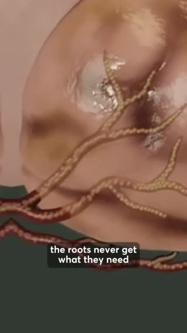

# Meta ad-library examples for F82

<!-- WAVE4 -->
## Wave 4: Alex Fedotoff's October 2026 swipe boards (GetHookd public previews)

Each ad below is from the free 10-ad preview of a public GetHookd board that [@FedotOff90](https://x.com/FedotOff90) shared on X. Days live are as of 2026-10-09; brand claims are the advertisers', not verified.

### StellaLife, Inc.: Clinical CGI explainer (mouth lesions) (1189 days live)

- **Board:** [AI & CGI Ads That Actually Convert](https://x.com/FedotOff90/status/2107892934050037807) · video 98 s
- **What happens:** "Suffering from mucositis? Natural relief from lesions and inflammation…" A clinical 3D mouth animation with captions. 98 s.
- **Why it lasts:** 1,189 days, the longest AI/CGI ad on the board. Clinical CGI for a specific medical audience.
- **How to make one:** A sober medical 3D animation, a name-the-condition hook, the mechanism, the product.
- **LC remake:** Not core for LC.

### Deborah Hayes: "Spa treatments for belly fat don't work" two-layer explainer (286 days live)

- **Board:** [AI & CGI Ads That Actually Convert](https://x.com/FedotOff90/status/2107892934050037807) · video 126 s
- **What happens:** "Spa treatments for belly fat don't work. And there's a scientific reason why… I did six spa sessions… $1,200… Your belly fat has two types of fat… these only work on surface fat." UGC plus a medical-paper insert plus CGI. 126 s.
- **Why it lasts:** 286 days. A "what you tried doesn't work, here's the layer it misses" reframe, the same skeleton as F108's "3 layers".
- **How to make one:** List what they tried with money spent, then a 2-layer mechanism, then the product reaches layer 2.
- **LC remake:** "I spent $600 on plated jewelry that turned green. Here's the layer they skip."

### Petra Weber: "Swiss urologist challenge" CGI x-ray explainer (prostate) (265 days live)

- **Board:** [AI & CGI Ads That Actually Convert](https://x.com/FedotOff90/status/2107892934050037807) · video 78 s
- **What happens:** "Swiss urologist challenge: if you're not sleeping through the night within five days using this method, your prostate problems aren't what you think… Austrian urologists found… inflamed prostate tissue blocks the active ingredients…" CGI anatomy plus a plant-watering analogy. 78 s.
- **Why it lasts:** 265 days. Foreign-insider authority ("Swiss / Austrian research") plus a 5-day challenge plus an x-ray mechanism plus an analogy.
- **How to make one:** A challenge hook with a time limit, a foreign-research mechanism, CGI anatomy inserts, a simple analogy (watering leaves versus roots).
- **LC remake:** "The 7-day shower challenge."

### Dr. Lisa Downing: Pixar-style organ-and-pills CGI (kidneys) (217 days live)

- **Board:** [AI & CGI Ads That Actually Convert](https://x.com/FedotOff90/status/2107892934050037807) · video 123 s
- **What happens:** Pixar-style 3D characters around organs and a pill bottle, with captions like "That foam was protein leaking through stressed kidneys… By day 15…" 123 s.
- **Why it lasts:** 217 days, 1,357 page ads. The organ is made visible as a character; Fedotoff's CGI Machine style.
- **How to make one:** Choose one organ, make it a character, show it struggling then recovering, with a day-count timeline.
- **LC remake:** Not core for LC.

