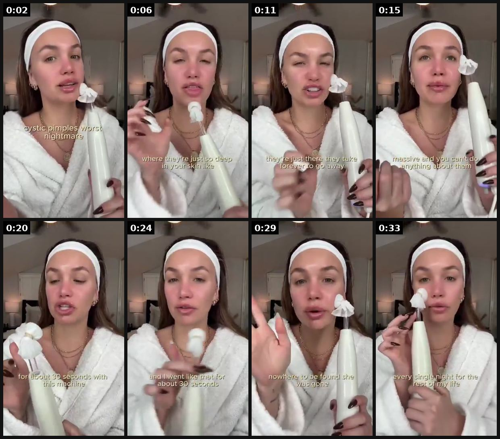
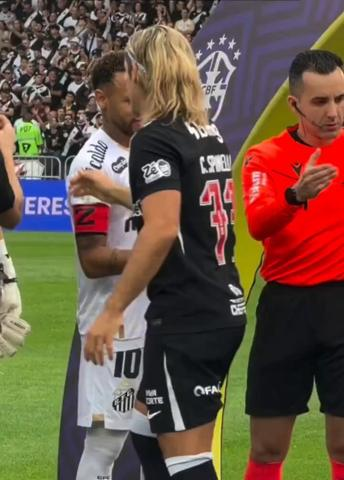
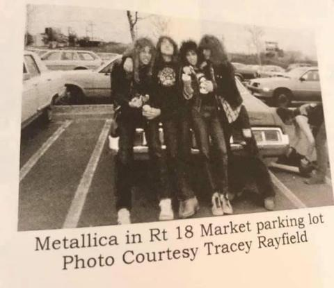

# 83 · Shock & gross visual (the problem in close-up): see it, then make it

[](https://x.com/FedotOff90/status/2099967483071582480)

**The example:** [@FedotOff90 on X](https://x.com/FedotOff90/status/2099967483071582480) · 0:35 video · 3 likes, 2K views

**Watch it:** [open the post on X](https://x.com/FedotOff90/status/2099967483071582480) · [play the video file](https://video.twimg.com/amplify_video/2099967317308551168/vid/avc1/320x568/td6iAWU69bgJe429.mp4?tag=29)

> Gross ads get banned in every "clean creative" guide. They keep making money anyway. A gross picture (the parasite, the plaque, the gunk in your pillow) stops the thumb for 2 seconds. The ad uses those 2 seconds to explain how the product works, not to show the product. Gross https://t.co/8FNAeoLURA

## What you are seeing

A woman in a robe and headband doing a close-up demo of a gross-but-satisfying product, with captions, filmed in one take in her bathroom.

## Beat by beat

The storyboard above samples the video every 0:04. Lines are the transcript for that stretch; on-screen text comes from OCR, so treat it as rough.

| Frame | Time | On screen | Said / sung |
|---|---|---|---|
| 1 | 0:00–0:04 | · | If you have acne, this product is going to be your new best run. |
| 2 | 0:04–0:08 | · | So last night, I had one of those pimples where they're just so deep in your skin, |
| 3 | 0:08–0:13 | he Eva Just | like you know the ones where you can't pop them, they're just there, they take forever to go away, |
| 4 | 0:13–0:17 | · | they're just like massive and you can't do anything about them. I zapped that pimple |
| 5 | 0:17–0:22 | · | for about 30 seconds with this machine so I just held it up to my chin. |
| 6 | 0:22–0:26 | · | And I went like that for about 30 seconds. I woke up in the morning when I tell you my |
| 7 | 0:26–0:31 | · | pimple was gone, like nowhere to be found, she was gone. So it's safe to say that I'm going to be |
| 8 | 0:31–0:35 | · | using this product every single night for the rest of my life. |

<details><summary>Full transcript (timestamped)</summary>

- `0:00` If you have acne, this product is going to be your new best run.
- `0:03` So last night, I had one of those pimples where they're just so deep in your skin,
- `0:08` like you know the ones where you can't pop them, they're just there, they take forever to go away,
- `0:13` they're just like massive and you can't do anything about them. I zapped that pimple
- `0:18` for about 30 seconds with this machine so I just held it up to my chin.
- `0:23` And I went like that for about 30 seconds. I woke up in the morning when I tell you my
- `0:27` pimple was gone, like nowhere to be found, she was gone. So it's safe to say that I'm going to be
- `0:31` using this product every single night for the rest of my life.

</details>

## More real examples (4)

Other posts that show this format, or a close cousin of it. Click a thumbnail to open it on X.

| | | |
|---|---|---|
| [](https://x.com/jadorz/status/2100011962352513295)<br>**@jadorz** · 0:07 video · 670 views<br>tried $2 ring gimmick and it turned my finger green | [](https://x.com/Nerdspringbreak/status/1919742776255635591)<br>**@Nerdspringbreak** · image · 942 views<br>Worst birthday is when my boyfriend bought me ring that turned my finger green and a man's size trench coat from Rt 18 flea market. I still miss the U | [](https://x.com/huntingbygones/status/1948169528703398314)<br>**@huntingbygones** · image · 96 views<br>me at the doctor showing them how my cheap ring turned my finger green |
| [](https://x.com/drebabys/status/1819923093139165232)<br>**@drebabys** · video · 64 views<br>my TikTok ring turned my finger green…. |   |   |

## How to make one like it

**The format in one line:** The opening image is the ugliest, most specific version of the problem: a green ring mark on a finger, black flakes of plating, a discoloured line on the neck. The shock stops the scroll; the solution follows.

**Why it works:** - Disgust and recognition are strong stop signals. - A specific problem visual beats an abstract claim (7 Trends #1). - The viewer self-identifies instantly.

**Contents:** [1. Structure](#1-copy-the-structure) · [2. Shot by shot](#2-shot-by-shot-remake) · [3. Script and hooks](#3-write-the-script) · [4. Prompts](#4-prompts) · [5. Tools and settings](#5-tools-and-settings) · [6. Louise Carter remake](#6-louise-carter-remake) · [7. Variants and test](#7-variants-and-test-plan) · [8. Pitfalls](#8-pitfalls)

### 1. Copy the structure

Use the example's timing as your beat sheet. Keep the beat, change the words and the product.

| Beat | Time | In the example | Your version |
|---|---|---|---|
| 1 | 0:02 | If you have acne, this product is going to be your new best run. | … |
| 2 | 0:06 | So last night, I had one of those pimples where they're just so deep in your skin, | … |
| 3 | 0:11 | like you know the ones where you can't pop them, they're just there, they take forever to go away, | … |
| 4 | 0:15 | they're just like massive and you can't do anything about them. I zapped that pimple | … |
| 5 | 0:20 | for about 30 seconds with this machine so I just held it up to my chin. | … |
| 6 | 0:24 | And I went like that for about 30 seconds. I woke up in the morning when I tell you my | … |
| 7 | 0:29 | pimple was gone, like nowhere to be found, she was gone. So it's safe to say that I'm going to be | … |
| 8 | 0:33 | using this product every single night for the rest of my life. | … |

### 2. Shot-by-shot remake

**Target length / size:** Static 1080x1350, or a 10-15s video

| # | Time / slot | What we see (visual + camera) | Dialogue / on-screen text |
|---|---|---|---|
| 1 | 0-2s (or main image) | Harsh macro of the problem: a green ring mark on a finger, a flaking chain on a neck. Shot with side light so the texture shows | Text: "This is what $20 'gold' does." |
| 2 | 2-5s | Same finger, now wearing the PVD ring, clean skin, natural light | "This is 6 months of showers in Louise Carter." |
| 3 | 5-9s | Quick proof: ring under the tap, then wiped dry, still bright | "14K PVD. Doesn't turn green." |
| 4 | End | Offer card | "Any 7 for $85." |

<details><summary>Playbook shot list (Louise Carter version from the README)</summary>

| Time / slot | Visual | Audio / copy |
|---|---|---|
| 0-2s | Macro: green band on a finger | "This is what cheap gold does to your skin." |
| 2-10s | Flaking chain under a loupe | — |
| 10-20s | LC piece, same finger after 3 months | "14K PVD. Bonded." |

</details>

### 3. Write the script

Open with one of these hooks (first 1–3 seconds, or the headline on a static):

- "This is what cheap gold does to your finger"
- "Zoom in on your plated necklace"

Then fill the beats from the table above. Pull the wording from real customer reviews, not from ad copy: a review line beats a copywriter line almost every time. Read every line out loud and cut anything you would not say to a friend. Ready-made Louise Carter scripts are in section 6; hand [BOT.md](BOT.md) to any AI agent to write versions for another brand.

### 4. Prompts

**Shoot**

```text
Macro lens or iPhone macro mode, a single hard side light for the "before" (texture), soft window light for the "after". Same hand, same angle, same framing.
```

**Sourcing the problem shot**

```text
Use a real photo from a team member or customer (with permission); never fake the discolouration with makeup or editing.
```

**Copy (Claude)**

```text
Write 10 one-line captions that name the problem bluntly without insulting the viewer, max 8 words each.
```

**Full creative-agent prompt (from the playbook):**

```
Write 4 shock-visual openers for LC (what the macro shot shows, first line), each followed by a 15s solution arc. No medical claims.
```

### 5. Tools and settings

1. Shoot real green-stain marks (own tests); no customer photos without consent.
2. Keep it tasteful: no medical skin conditions.
3. Static + 15s video.

| Setting | Value |
|---|---|
| Canvas | 1080×1920 (9:16) master; crop a 1080×1350 (4:5) cut for feed placements |
| Frame rate | 30 fps (shoot 60 fps for slow-motion water or sparkle shots) |
| Camera | Phone main lens at 1x, exposure locked on skin, HDR off, grid on; tripod or a phone clamp for product shots |
| Light | One soft key at 45° (window or ring light), white card as fill; side light for metal sparkle |
| Audio | Lavalier or phone 15–20 cm from the mouth; mix voice at -14 LUFS, music at -28 to -30 dB under voice |
| Captions | Burned in, 2–5 words per line, 64–80 px bold sans, white with a black stroke or pill; keep text inside the safe zone (top 220 px and bottom 420 px clear, 64 px side margins) |
| Pacing | A visual change every 1.5–3 s; the hook lands in the first 1.5 s with no logo intro |
| Edit / export | CapCut or Premiere; H.264, 12–20 Mbps, AAC 320 kbps; upload natively to each platform, not via links |

### 6. Louise Carter remake

- A · Green finger band.
- B · Flaking plating under a loupe.
- C · Tarnished tray vs LC tray.

Brand rules, claims you can and cannot make, and more scripts: [brands/louise-carter.md](brands/louise-carter.md). Step-by-step from idea to scale: [STAGES.md](STAGES.md).

### 7. Variants and test plan

- Static vs video
- Shock level

**Test plan:** - **Budget/structure:** 4 ads, $20/day, 5 days - **Primary KPIs:** Thumb-stop, CPA; Omni (F83-*) - **Kill rule:** Negative feedback rate > account avg - **Scale rule:** Keep top 1; cap frequency - **Naming:** `utm_content=F83-<concept>-<variant>`; weekly Omni roll-up of new-customer revenue by format.

**Naming:** `F83-<variant>-<hook##>-<date>` so results map back to this folder. Change one thing per test (hook, narrator, length or offer), never two.

### 8. Pitfalls

- Only show real problems; faked damage breaks ad rules and trust.
- Meta restricts "shocking" or body-focused imagery; keep it to jewellery and skin marks, never wounds.
- Don't shame the viewer ("you're wearing junk"); shame the cheap product.
- Slow open: if the first 1.5 s does not show the hook visually, most people swipe.
- Logo or brand intro at the start reads as an ad; put the brand at the end.
- Captions covered by the platform UI: check the safe zone on a real phone before posting.
- Music over the voice: keep music at least 14 dB under speech.

**Compliance:** Baseline: [_COMPLIANCE.md](../_COMPLIANCE.md) (no fake testimonials, AI disclosure, no bulk/spoofed accounts, copy structure not assets, PDP-only claims). - No medical-condition imagery; follow Meta policy on negative self-perception (no body shaming).

## Field notes

Newer observations live in the playbook: [Wave 4 update: Fedotoff October 2026 swipe boards](README.md)

## More examples

Every post we found for this format, with transcripts: [examples/](examples/README.md). Playbook: [README.md](README.md). Agent brief: [BOT.md](BOT.md).
