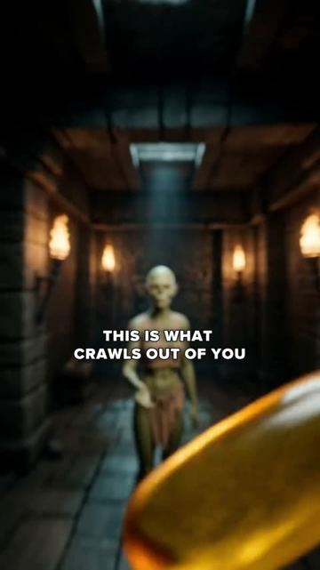

# Meta ad-library examples for F83

<!-- WAVE6 -->
## Wave 6: Resilia & Smooche live Meta ads (Oct 2026)

Pulled from the public Meta Ad Library on 2026-10-09 (Resilia: aged garlic, Ceylon cinnamon, oil of oregano; Smooche: color-changing foundation, Reverse Time peptide serum). Days live are counted to 2026-10-09; most video ads were new tests that week, while the long runners are statics and catalog templates. Transcripts are automatic. Brand claims are the advertisers', not verified, and many are health claims we would never make. The **Do not copy** line flags deceptive tactics (persona "publication" pages, undisclosed AI actors and "experts", fake stock counts).

### Resilia · Natural Defense Report: “This is what crawls out of you when you Carve a crawl in Time-o-o-o-one…” (0 days live)

- **Ad:** [Meta Ad Library #1440073978004059](https://www.facebook.com/ads/library/?id=1440073978004059) · video 2:59 · page “Natural Defense Report” · started 2026-10-08 · 1 copies · lands on `resilia.shop/products/resilia-oil-of-oregano-softgels`
- **What happens:** Opens: “This is what crawls out of you when you Carve a crawl in Time-o-o-o-one for two weeks straight Day one you swallow two soft gels Nothing dramatic By evening a faint gurgling Something's waking up in…”
- **Why it works:** "This is what crawls out of you when you…" uses disgust as the hook.
- **How to make one:** Avoid it for LC. If you use a shock visual, it must be a true, documentable effect.
- **Do not copy:** Parasite "crawls out of you" claims are unsupported and misleading.
- **LC remake:** Not a fit for LC beyond a green-finger close-up (F83 tarnish macro).

Transcript (auto, first ~70 s)

> This is what crawls out of you when you Carve a crawl in Time-o-o-o-one for two weeks straight Day one you swallow two soft gels Nothing dramatic By evening a faint gurgling Something's waking up in You Day three you're stomach rumbles The carve a reggano oil is dissolving the biofilm shield Parasites out at every life stage Now that the biofilm is gone Ad about larvae eggs

<!-- /WAVE6 -->

<!-- WAVE4 -->
## Wave 4: Alex Fedotoff's October 2026 swipe boards (GetHookd public previews)

Each ad below is from the free 10-ad preview of a public GetHookd board that [@FedotOff90](https://x.com/FedotOff90) shared on X. Days live are as of 2026-10-09; brand claims are the advertisers', not verified.

### Male Health Tips: Elder "ancient remedy" doctor (men's health, gut-blood-flow claim) (222 days live)

- **Board:** [AI UGC + Doctor Avatars — Health & Wellness](https://x.com/FedotOff90/status/2106401392374186396) · video 41 s
- **What happens:** A grey-bearded man in a suit vest holds a dropper bottle; captions read "Dr. Sebi exposed how to increase size QUICKLY". Script: "Most men don't realize… It all comes down to blood flow and what's happening in your gut… berberine and sodium alginate…". 41 s, 222 days.
- **Why it lasts:** It ties a primal desire (size) to a gut mechanism and an "ancient" ingredient. The claims are extreme; this is the risky end of the format.
- **How to make one:** An elder-authority avatar, an "ancient remedy" story, one mechanism. Avoid health claims you can't substantiate.
- **LC remake:** Not for LC.

