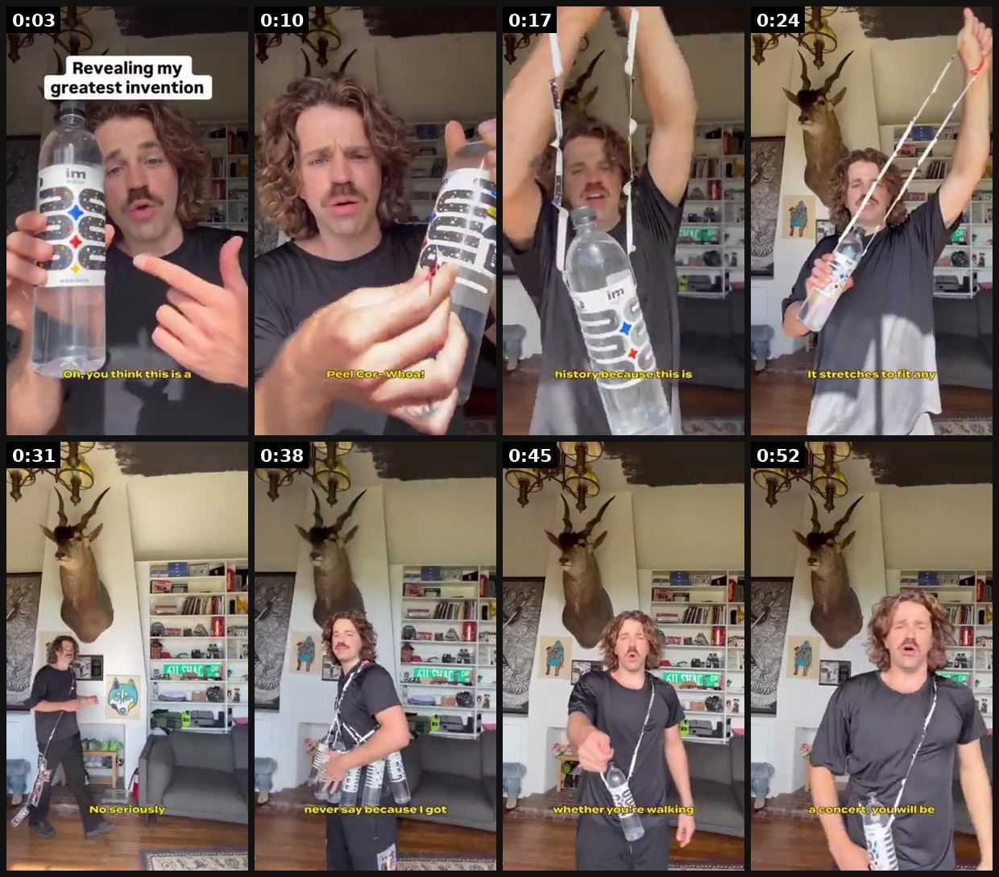
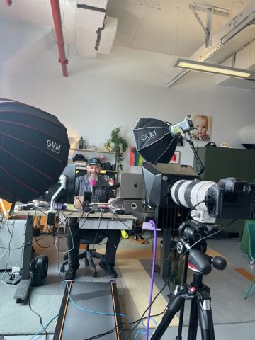
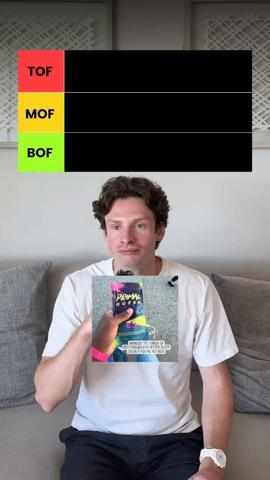

# 84 · 'Ugly ad': an unusual or weird visual + long copy (native image): see it, then make it

[](https://x.com/alexgoughcooper/status/2092657905002529270)

**The example:** [@alexgoughcooper on X](https://x.com/alexgoughcooper/status/2092657905002529270) · 0:55 video · 61 likes, 9K views

**Watch it:** [open the post on X](https://x.com/alexgoughcooper/status/2092657905002529270) · [play the video file](https://video.twimg.com/amplify_video/2092653139442708480/vid/avc1/320x568/Lg0pt6Trlodm2vuQ.mp4?tag=29)

> This video did 32M views and is a masterclass in ugly ads. Why? Because it’s authentic. You keep trying to make ‘UGC’ or ‘ugly ads’ that are fully scripted. But the best creators don’t want that. They want the freedom to play and show their personality. And in a feed where https://t.co/O16sNHVRXR

## What you are seeing

A man in a lab-like room holding a big water bottle with a goofy caption ("Revealing my greatest invention"), swinging it around, a cheap and odd look that stops the scroll, 32M views.

## Beat by beat

The storyboard above samples the video every 0:06. Lines are the transcript for that stretch; on-screen text comes from OCR, so treat it as rough.

| Frame | Time | On screen | Said / sung |
|---|---|---|---|
| 1 | 0:00–0:07 | · | This is the product that almost got me thrown in jail. Oh, you think this is a regular bottle of water? |
| 2 | 0:07–0:13 | · | What about this little sticker here that says peel corner peel corn? Well, whoa? whoa |
| 3 | 0:13–0:20 | · | You are witnessing history because this is the world's first |
| 4 | 0:20–0:27 | rae a er hf oF Ss TS 814 a fi tia Se | wearable water Let's go. It stretches to fit any size human being ever |
| 5 | 0:27–0:34 | ah cS Thi 123 a a5 es TS fas ls res an Sees | made No seriously any size. I love drinking water, but I hate carrying it |
| 6 | 0:34–0:41 | · | It's something you will never say because I got two gallons on me hands-free |
| 7 | 0:41–0:48 | · | Imagine the future whether you're walking your dog |
| 8 | 0:48–0:55 | EE AJ fi Ae | working or at a concert You will be hydrated |

<details><summary>Full transcript (timestamped)</summary>

- `0:00` This is the product that almost got me thrown in jail. Oh, you think this is a regular bottle of water?
- `0:05` What about this little sticker here that says peel corner peel corn? Well, whoa?
- `0:11` whoa
- `0:15` You are witnessing history because this is the world's first
- `0:20` wearable water
- `0:21` Let's go. It stretches to fit any size human being ever
- `0:29` made
- `0:30` No seriously any size. I love drinking water, but I hate carrying it
- `0:36` It's something you will never say because I got two gallons on me hands-free
- `0:43` Imagine the future whether you're walking your dog
- `0:47` working or at a concert
- `0:51` You will be
- `0:53` hydrated

</details>

## More real examples (2)

Other posts that show this format, or a close cousin of it. Click a thumbnail to open it on X.

| | | |
|---|---|---|
| [](https://x.com/FedotOff90/status/2107184145541853536)<br>**@FedotOff90** · image · 5K views<br>"The ugly ads print" — weird visuals stop the scroll, long copy sells; 122-ad Native Unusual Visuals board. | [](https://x.com/Simon__Rob/status/2089448804676239424)<br>**@Simon__Rob** · 1:27 video · 5K views<br>this is how your Meta ad account should be built if you're a brand: - ugly static ads and yapping videos stop cold traffic - testimonials and stats co |   |

## How to make one like it

**The format in one line:** A deliberately odd, low-polish photo (product in a weird place, strange crop, unexpected object) paired with long, story-driven primary text. Steal the visual idea and keep your own copy.

**Why it works:** - Weirdness beats beauty for stopping the scroll. - A low-polish look reads as organic. - Long copy does the selling once the visual earns the pause.

**Contents:** [1. Structure](#1-copy-the-structure) · [2. Shot by shot](#2-shot-by-shot-remake) · [3. Script and hooks](#3-write-the-script) · [4. Prompts](#4-prompts) · [5. Tools and settings](#5-tools-and-settings) · [6. Louise Carter remake](#6-louise-carter-remake) · [7. Variants and test](#7-variants-and-test-plan) · [8. Pitfalls](#8-pitfalls)

### 1. Copy the structure

Use the example's timing as your beat sheet. Keep the beat, change the words and the product.

| Beat | Time | In the example | Your version |
|---|---|---|---|
| 1 | 0:03 | This is the product that almost got me thrown in jail. Oh, you think this is a regular bottle of water? | … |
| 2 | 0:10 | What about this little sticker here that says peel corner peel corn? Well, whoa? whoa | … |
| 3 | 0:17 | You are witnessing history because this is the world's first | … |
| 4 | 0:24 | wearable water Let's go. It stretches to fit any size human being ever | … |
| 5 | 0:31 | made No seriously any size. I love drinking water, but I hate carrying it | … |
| 6 | 0:38 | It's something you will never say because I got two gallons on me hands-free | … |
| 7 | 0:45 | Imagine the future whether you're walking your dog | … |
| 8 | 0:52 | You will be hydrated | … |

### 2. Shot-by-shot remake

**Target length / size:** 1 odd image (1080x1350) + 250-500 word primary text

| # | Time / slot | What we see (visual + camera) | Dialogue / on-screen text |
|---|---|---|---|
| 1 | Image | A deliberately strange but relevant photo: the necklace in a fish tank, on a lemon, coiled in a cereal bowl. Phone-shot, slightly off-centre, no text on image | - |
| 2 | Copy line 1 | - | Explains the weirdness: "Yes, that's our necklace in my son's fish tank. It's been in there 3 weeks." |
| 3 | Copy body | - | The story: why it's there (a dare / a test), what happened, what it proves (waterproof) |
| 4 | Copy close | - | Offer + a P.S. that callbacks the image: "P.S. The fish are fine." |

<details><summary>Playbook shot list (Louise Carter version from the README)</summary>

| Time / slot | Visual | Audio / copy |
|---|---|---|
| Static | Necklace frozen inside an ice cube / in a glass of seawater / on a lemon | Primary: 300-word first-person story |

</details>

### 3. Write the script

Open with one of these hooks (first 1–3 seconds, or the headline on a static):

- "I left my necklace in a glass of seawater for 30 days"
- "Why is there a necklace in my ice tray?"

Then fill the beats from the table above. Pull the wording from real customer reviews, not from ad copy: a review line beats a copywriter line almost every time. Read every line out loud and cut anything you would not say to a friend. Ready-made Louise Carter scripts are in section 6; hand [BOT.md](BOT.md) to any AI agent to write versions for another brand.

### 4. Prompts

**Idea bank (Claude)**

```text
List 20 weird-but-true places to photograph [product] that each prove one benefit (water, sweat, durability, giftability). For each, a first line that explains the photo in under 15 words.
```

**Shoot**

```text
iPhone, daylight, no styling; the image should look like a friend sent it.
```

**Full creative-agent prompt (from the playbook):**

```
List 10 weird-but-true visual scenes for LC that also prove durability, then write a 250-word native primary text for the top 3.
```

### 5. Tools and settings

1. Brainstorm 10 weird but true scenes (real tests: ice, saltwater, lemon juice).
2. Shoot on phone, flash on.
3. Pair with F09 long-copy natives.

| Setting | Value |
|---|---|
| Canvas | 1080×1920 (9:16) master; crop a 1080×1350 (4:5) cut for feed placements |
| Frame rate | 30 fps (shoot 60 fps for slow-motion water or sparkle shots) |
| Camera | Phone main lens at 1x, exposure locked on skin, HDR off, grid on; tripod or a phone clamp for product shots |
| Light | One soft key at 45° (window or ring light), white card as fill; side light for metal sparkle |
| Audio | Lavalier or phone 15–20 cm from the mouth; mix voice at -14 LUFS, music at -28 to -30 dB under voice |
| Captions | Burned in, 2–5 words per line, 64–80 px bold sans, white with a black stroke or pill; keep text inside the safe zone (top 220 px and bottom 420 px clear, 64 px side margins) |
| Pacing | A visual change every 1.5–3 s; the hook lands in the first 1.5 s with no logo intro |
| Edit / export | CapCut or Premiere; H.264, 12–20 Mbps, AAC 320 kbps; upload natively to each platform, not via links |

### 6. Louise Carter remake

- A · Necklace in a jar of seawater, day 30.
- B · Frozen in ice.
- C · In a lemon.

Brand rules, claims you can and cannot make, and more scripts: [brands/louise-carter.md](brands/louise-carter.md). Step-by-step from idea to scale: [STAGES.md](STAGES.md).

### 7. Variants and test plan

- Weird level
- Proof vs pure oddity

**Test plan:** - **Budget/structure:** 5 statics, $15/day, 7 days - **Primary KPIs:** Thumb-stop, CPA; Omni (F84-*) - **Kill rule:** CPA >1.8× - **Scale rule:** Keep winners evergreen - **Naming:** `utm_content=F84-<concept>-<variant>`; weekly Omni roll-up of new-customer revenue by format.

**Naming:** `F84-<variant>-<hook##>-<date>` so results map back to this folder. Change one thing per test (hook, narrator, length or offer), never two.

### 8. Pitfalls

- Weird, not misleading: the photo must show something that really happened.
- If the image needs explaining, line 1 of the copy must explain it.
- Don't test more than one weird image per ad set; you won't know which one worked.
- Slow open: if the first 1.5 s does not show the hook visually, most people swipe.
- Logo or brand intro at the start reads as an ad; put the brand at the end.
- Captions covered by the platform UI: check the safe zone on a real phone before posting.
- Music over the voice: keep music at least 14 dB under speech.

**Compliance:** Baseline: [_COMPLIANCE.md](../_COMPLIANCE.md) (no fake testimonials, AI disclosure, no bulk/spoofed accounts, copy structure not assets, PDP-only claims). - Any "test" shown must be real.

## More examples

Every post we found for this format, with transcripts: [examples/](examples/README.md). Playbook: [README.md](README.md). Agent brief: [BOT.md](BOT.md).
