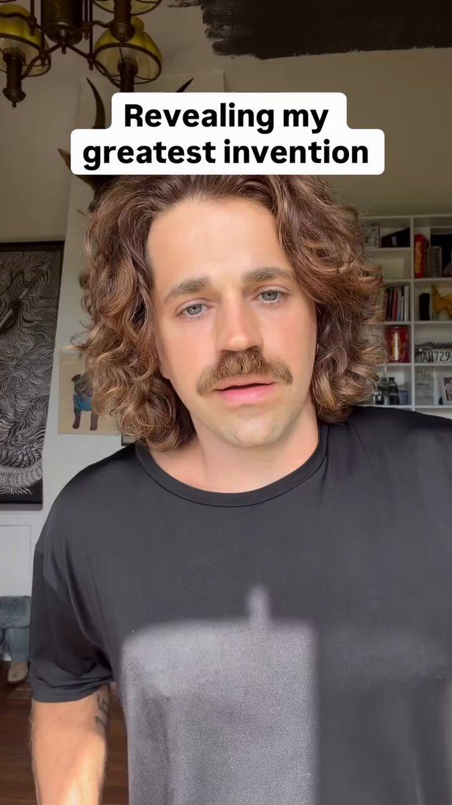

# 84 · "Ugly ad": an unusual or weird visual + long copy (native image)

<!-- HERO:START -->
[](EXAMPLE.md)

**[See the example and how to make it →](EXAMPLE.md)** · [watch on X](https://x.com/alexgoughcooper/status/2092657905002529270)
<!-- HERO:END -->


> **LC priority P2** · evidence: Medium (boards) · hype risk: Low · cost $0 · 20 min

## What it is
A deliberately odd, low-polish photo (product in a weird place, strange crop, unexpected object) paired with long, story-driven primary text. Steal the visual idea and keep your own copy.

## Why it works
- Weirdness beats beauty for stopping the scroll.
- A low-polish look reads as organic.
- Long copy does the selling once the visual earns the pause.

## Shot-by-shot (LC version)

| Time / slot | Visual | Audio / copy |
|---|---|---|
| Static | Necklace frozen inside an ice cube / in a glass of seawater / on a lemon | Primary: 300-word first-person story |

## Hooks (swap-in openers)
- "I left my necklace in a glass of seawater for 30 days"
- "Why is there a necklace in my ice tray?"

## Real examples from X (studied)
- @FedotOff90: "The ugly ads print… 122 native ads with unusual visuals in one board" ([post](https://x.com/FedotOff90/status/2107184145541853536)).
- @FedotOff90: 777 native images + long-form copy board ([post](https://x.com/FedotOff90/status/2104253649346068682)).

## Production recipe
1. Brainstorm 10 weird but true scenes (real tests: ice, saltwater, lemon juice).
2. Shoot on phone, flash on.
3. Pair with F09 long-copy natives.

## Bot prompt (copy into the creative agent)
```
List 10 weird-but-true visual scenes for LC that also prove durability, then write a 250-word native primary text for the top 3.
```

## 3 LC scripts
- A · Necklace in a jar of seawater, day 30.
- B · Frozen in ice.
- C · In a lemon.

## Variants to test
- Weird level
- Proof vs pure oddity

## Omni test plan
- **Budget/structure:** 5 statics, $15/day, 7 days
- **Primary KPIs:** Thumb-stop, CPA; Omni (F84-*)
- **Kill rule:** CPA >1.8×
- **Scale rule:** Keep winners evergreen
- **Naming:** `utm_content=F84-<concept>-<variant>`; weekly Omni roll-up of new-customer revenue by format.

## Compliance
Baseline: [_COMPLIANCE.md](../_COMPLIANCE.md) (no fake testimonials, AI disclosure, no bulk/spoofed accounts, copy structure not assets, PDP-only claims).
- Any "test" shown must be real.

## Related
- Strategies: 41-von-restorff-static-copy-prompt, 03-creative-volume-flooding
- Formats: [09-native-story-static-to-advertorial](../09-native-story-static-to-advertorial/README.md), [10-shock-headline-text-static](../10-shock-headline-text-static/README.md)

<!-- EVIDENCE:START -->
## Wave 3 update: Meta ad-library long-runners (Fedotoff gut-health board)
- WebMD: Editorial flat-lay food static (WebMD 'Polyphenols'), 253 days live. Looks like editorial content, not an ad; curiosity click to an article.
- Stills, transcripts and LC remakes: [adlibrary/](adlibrary/README.md).

## Evidence from X discovery (auto-generated)

| Date | Author | Post | Engagement | Grade | Gist |
|---|---|---|---|---|---|
| 2026-09-27 | [@FedotOff90](https://x.com/FedotOff90) | [link](https://x.com/FedotOff90/status/2104253649346068682) | 68L/98BM/6kV | SOME | 777 native images + long-form copy swipe board. |
| 2026-10-05 | [@FedotOff90](https://x.com/FedotOff90) | [link](https://x.com/FedotOff90/status/2107184145541853536) | 41L/53BM/5kV | SOME | "The ugly ads print" — weird visuals stop the scroll, long copy sells; 122-ad Native Unusual Visuals board. |
<!-- EVIDENCE:END -->
