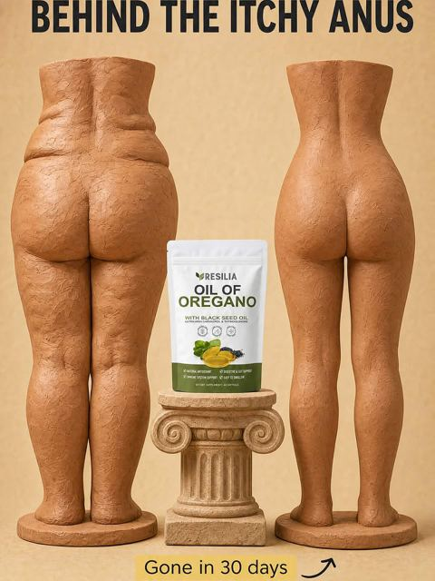
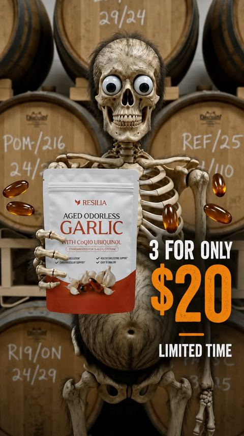

# Meta ad-library examples for F84 (GetHookd board 155932, gut health)

<!-- WAVE6 -->
## Wave 6: Resilia & Smooche live Meta ads (Oct 2026)

Pulled from the public Meta Ad Library on 2026-10-09 (Resilia: aged garlic, Ceylon cinnamon, oil of oregano; Smooche: color-changing foundation, Reverse Time peptide serum). Days live are counted to 2026-10-09; most video ads were new tests that week, while the long runners are statics and catalog templates. Transcripts are automatic. Brand claims are the advertisers', not verified, and many are health claims we would never make. The **Do not copy** line flags deceptive tactics (persona "publication" pages, undisclosed AI actors and "experts", fake stock counts).

### Resilia · Gut Health Insider: “BEHIND THE ITCHY ANUS” (0 days live)

- **Ad:** [Meta Ad Library #2180454472852052](https://www.facebook.com/ads/library/?id=2180454472852052) · static image · page “Gut Health Insider” · started 2026-10-08 · 1 copies · lands on `resilia.shop/products/resilia-oil-of-oregano-softgels`
- **What happens:** "BEHIND THE ITCHY ANUS": marble statues from behind on a plinth, with the pouch.
- **Why it works:** Ugly ads: classical marble statues of buttocks ("Behind the itchy anus") and skeletons among barrels. They are weird enough to stop the scroll, with the long copy doing the selling.
- **How to make one:** Use an odd, slightly absurd image, a blunt caption, and a small product in the corner. Let the primary text sell.
- **LC remake:** A Roman bust wearing a modern LC chain: "Gold that outlived the empire."

Primary text

> Introducing Resilia Oil of Oregano — premium dual-action softgels that support your body's natural drainage and everyday vitality. 💧 Supports natural cleansing and healthy circulation 💧 Helps reduce puffiness and water retention 💧 Supports healthy fluid balance and lighter-feeling days 💧 Promotes clearer-looking skin and steady energy ✅ Dual-action blend of Oil of Oregano + Black Seed Oil ✅ 3rd-party tested in the USA, Non-GMO, no aftertaste ✨ No messy liquids — just two easy softgels each morning 🌿 Inspired by tradition, made for modern life ❤️‍🩹 Two softgels a day to help you feel light and vibrant again. Tap Shop Now to reclaim your flow with Resilia Oil of Oregano! 🌿 Don’t Just Mask It: Help your body fix the source. Support your natural drainage with the power of Resilia.

### Resilia · Vascular Wellness Report: A skeleton among wine barrels holding the garlic pouch (1 day live)

- **Ad:** [Meta Ad Library #1685452743151829](https://www.facebook.com/ads/library/?id=1685452743151829) · static image · page “Vascular Wellness Report” · started 2026-10-07 · lands on `resilia.shop/products/resilia-aged-odorless-garlic`
- **What happens:** A skeleton among wine barrels holding the garlic pouch, with a "3 for $20" badge.
- **Why it works:** Ugly ads: classical marble statues of buttocks ("Behind the itchy anus") and skeletons among barrels. They are weird enough to stop the scroll, with the long copy doing the selling.
- **How to make one:** Use an odd, slightly absurd image, a blunt caption, and a small product in the corner. Let the primary text sell.
- **LC remake:** A Roman bust wearing a modern LC chain: "Gold that outlived the empire."

Primary text

> Looking to Take Control of Your Heart Health Naturally?❤️ Experience the Power of Resilia Aged Garlic Extract! ✅: Supports cardiovascular health naturally ✅: Completely odorless formula ✅: Supports arterial health ✅: 20-month aging process ✅: 900+ clinical studies ✅: SAC-standardized aged garlic extract ✅: Plus CoQ10 Ubiquinol & Vitamin K2 MK-7 Transform your cardiovascular health with three clinically studied ingredients backed by modern science — 30-Day Risk-Free Guarantee.

<!-- /WAVE6 -->

From [@FedotOff90](https://x.com/FedotOff90/status/2108212319113412929)'s public board preview. Days live are as of 2026-10-09. Full board breakdown is in the internal sources folder.

## WebMD: Editorial flat-lay food static (WebMD 'Polyphenols') (253 days live)

- **What happens:** Overhead flat-lay of polyphenol foods (berries, olives, nuts, dark chocolate, cinnamon) with a handwritten 'POLYPHENOLS' label in a star bowl.
- **Why it lasts:** 253 days live. Looks like editorial content, not an ad; curiosity click to an article.
- **How to make one:** Overhead shot, natural light, slate or linen, one handwritten word; no product claims on the image.
- **LC remake:** Overhead flat-lay of an LC jewelry box on linen with handwritten label 'things I never take off' → blog/advertorial.

<!-- WAVE4 -->
## Wave 4: Alex Fedotoff's October 2026 swipe boards (GetHookd public previews)

Each ad below is from the free 10-ad preview of a public GetHookd board that [@FedotOff90](https://x.com/FedotOff90) shared on X. Days live are as of 2026-10-09; brand claims are the advertisers', not verified.

### Alicia Darling: Gym-clock POV with sticky caption ("Black leggings so I hope no one notices") (319 days live)

- **Board:** [Native Unusual Visuals — Sep 2026](https://x.com/FedotOff90/status/2107184145541853536) · image
- **What happens:** A POV of sneakers on a gym floor, a flip-clock "10:45" overlay, a white caption bubble: "Black leggings so I hope no one notices 😅". 4 variants ("At least no one else will smell me now"). Alicia Darling has 710 ads.
- **Why it lasts:** 319 days. An embarrassing secret told as a caption over a mundane POV; the product is implied (period / odor).
- **How to make one:** A phone POV of a mundane moment, a timestamp sticker, a one-line confession caption. No product in frame.
- **LC remake:** POV: a pool ladder with "Wearing my necklace in so I hope it doesn't turn green 😅".

### Skincare Tips: Mundane car-door POV (Skincare Tips) (290 days live)

- **Board:** [Native Unusual Visuals — Sep 2026](https://x.com/FedotOff90/status/2107184145541853536) · image
- **What happens:** A POV of legs in denim shorts getting into a car, holding keys. Nothing explained; the copy does the selling.
- **Why it lasts:** 290 days. The "ugly ads print" thesis: weird or mundane visuals stop the scroll and long copy sells.
- **How to make one:** An unpolished phone photo of a body or ordinary moment; put the story in the primary text.
- **LC remake:** Ordinary wrist-on-steering-wheel photo with long-copy story.

### Raising Toddlers with Bec: Vintage anatomy diagram static ("2 years in diapers vs 4 years") (278 days live)

- **Board:** [Native Unusual Visuals — Sep 2026](https://x.com/FedotOff90/status/2107184145541853536) · image
- **What happens:** A vintage medical-illustration-style diagram comparing two toddlers' brain-bladder connection ("active connection" versus "signal suppression"). Raising Toddlers with Bec.
- **Why it lasts:** 278 days. An old-textbook look reads as education, not an ad, and it is unusual in the feed.
- **How to make one:** A vintage anatomical illustration (AI image) with 2 labelled states side by side and handwritten-style labels.
- **LC remake:** A vintage diagram: "plated brass versus PVD steel" cross-section.

### Pet PA: Horse-nose-in-lens static (Pet PA) (176 days live)

- **Board:** [iPhone Notes / Text Messages / Reddit / Google Search / Breaking News / DMs / Amazon Review / TikTok Comments](https://x.com/FedotOff90/status/2106046297434374289) · image
- **What happens:** A horse's nose fills the camera, with a "Save an extra 5% with auto delivery" bar and products below.
- **Why it lasts:** 176 days. An unusual visual paired with a plain offer.
- **How to make one:** One weird close-up that fills the frame, plus an offer bar.
- **LC remake:** A cat sniffing a wrist stack.

