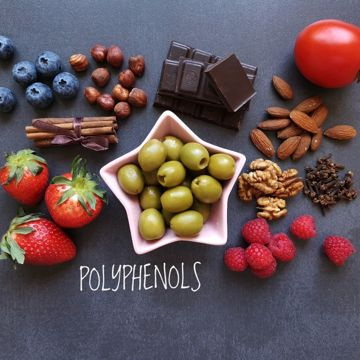
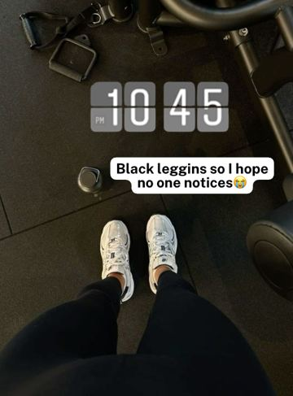
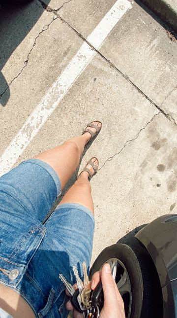
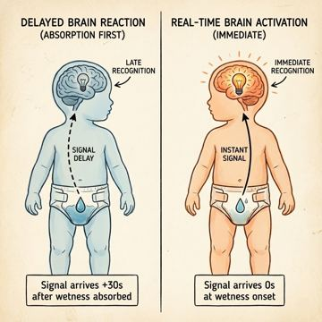
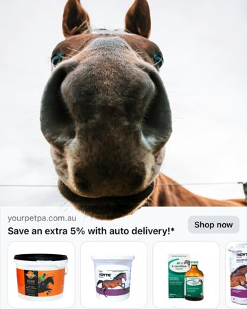

# Meta ad-library examples for F84 (GetHookd board 155932, gut health)

From [@FedotOff90](https://x.com/FedotOff90/status/2108212319113412929)'s public board preview. Days live are as of 2026-10-09. Full board breakdown is in the internal sources folder.

## WebMD: Editorial flat-lay food static (WebMD 'Polyphenols') (253 days live)

- **What happens:** Overhead flat-lay of polyphenol foods (berries, olives, nuts, dark chocolate, cinnamon) with a handwritten 'POLYPHENOLS' label in a star bowl.
- **Why it lasts:** 253 days live. Looks like editorial content, not an ad; curiosity click to an article.
- **How to make one:** Overhead shot, natural light, slate or linen, one handwritten word; no product claims on the image.
- **LC remake:** Overhead flat-lay of an LC jewelry box on linen with handwritten label 'things I never take off' → blog/advertorial.

<!-- WAVE4 -->
## Wave 4: Alex Fedotoff's October 2026 swipe boards (GetHookd public previews)

Each ad below is from the free 10-ad preview of a public GetHookd board that [@FedotOff90](https://x.com/FedotOff90) shared on X. Days live are as of 2026-10-09; brand claims are the advertisers', not verified.

### Alicia Darling: Gym-clock POV with sticky caption ("Black leggings so I hope no one notices") (319 days live)

- **Board:** [Native Unusual Visuals — Sep 2026](https://x.com/FedotOff90/status/2107184145541853536) · image
- **What happens:** A POV of sneakers on a gym floor, a flip-clock "10:45" overlay, a white caption bubble: "Black leggings so I hope no one notices 😅". 4 variants ("At least no one else will smell me now"). Alicia Darling has 710 ads.
- **Why it lasts:** 319 days. An embarrassing secret told as a caption over a mundane POV; the product is implied (period / odor).
- **How to make one:** A phone POV of a mundane moment, a timestamp sticker, a one-line confession caption. No product in frame.
- **LC remake:** POV: a pool ladder with "Wearing my necklace in so I hope it doesn't turn green 😅".

### Skincare Tips: Mundane car-door POV (Skincare Tips) (290 days live)

- **Board:** [Native Unusual Visuals — Sep 2026](https://x.com/FedotOff90/status/2107184145541853536) · image
- **What happens:** A POV of legs in denim shorts getting into a car, holding keys. Nothing explained; the copy does the selling.
- **Why it lasts:** 290 days. The "ugly ads print" thesis: weird or mundane visuals stop the scroll and long copy sells.
- **How to make one:** An unpolished phone photo of a body or ordinary moment; put the story in the primary text.
- **LC remake:** Ordinary wrist-on-steering-wheel photo with long-copy story.

### Raising Toddlers with Bec: Vintage anatomy diagram static ("2 years in diapers vs 4 years") (278 days live)

- **Board:** [Native Unusual Visuals — Sep 2026](https://x.com/FedotOff90/status/2107184145541853536) · image
- **What happens:** A vintage medical-illustration-style diagram comparing two toddlers' brain-bladder connection ("active connection" versus "signal suppression"). Raising Toddlers with Bec.
- **Why it lasts:** 278 days. An old-textbook look reads as education, not an ad, and it is unusual in the feed.
- **How to make one:** A vintage anatomical illustration (AI image) with 2 labelled states side by side and handwritten-style labels.
- **LC remake:** A vintage diagram: "plated brass versus PVD steel" cross-section.

### Pet PA: Horse-nose-in-lens static (Pet PA) (176 days live)

- **Board:** [iPhone Notes / Text Messages / Reddit / Google Search / Breaking News / DMs / Amazon Review / TikTok Comments](https://x.com/FedotOff90/status/2106046297434374289) · image
- **What happens:** A horse's nose fills the camera, with a "Save an extra 5% with auto delivery" bar and products below.
- **Why it lasts:** 176 days. An unusual visual paired with a plain offer.
- **How to make one:** One weird close-up that fills the frame, plus an offer bar.
- **LC remake:** A cat sniffing a wrist stack.

