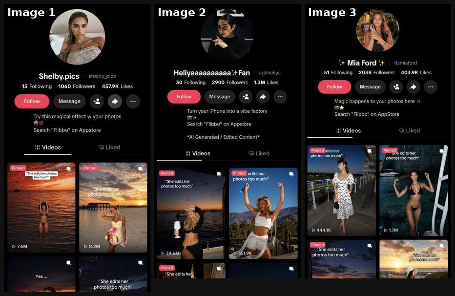
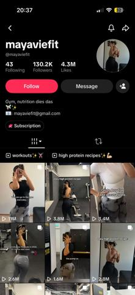
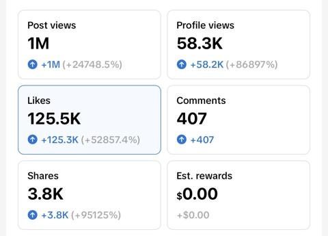
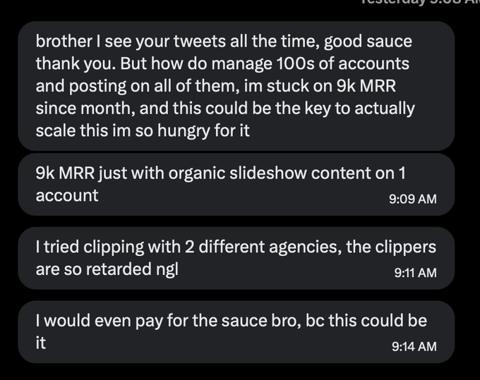
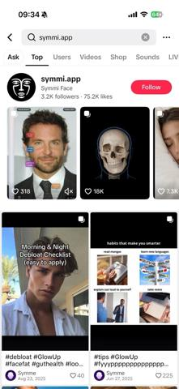

# 85 · Persona aesthetic slideshow account with one recurring caption template: see it, then make it

[](https://x.com/yurahulei/status/2108224536902815967)

**The example:** [@yurahulei on X](https://x.com/yurahulei/status/2108224536902815967) · 3 images

**Watch it:** [open the post on X](https://x.com/yurahulei/status/2108224536902815967)

> Imagine your AI agent posting 1000s of viral TikTok slideshows like this, every single day 🤯 And ALL of them are promoting your product You can literally get your Claude/Codex/GrokBot to set this up for you in 10 minutes. Here are 7 steps to actually make it work: - Rent US iPhones on http://minionix.com - Create TikTok accounts with usernames, bios & profile pictures - Start warming them up in your niche - Generate …

## What you are seeing

Three TikTok profiles of AI persona pages, each a consistent aesthetic girl (beach, sunset, bikini photos) posting templated captioned slideshows at scale.

## Image by image

| Image | Text on it (OCR, rough) |
|---|---|
| 1 | shelby pics 15 Following 1060 Followers 457.9K Likes Try this magical effect your photos … it Videos Liked too |
| 2 | Fan 30 Following 2900 Followers 1.3M Likes Turn your iPhone into a vibe factory Search … Generated Edited Content … Videos Liked Pinned a She edits her photos too much … 51.9K She edits |
| 3 | a Mia Ford … 51 Following 2038 Followers 403.9K Likes Follow Nee Magic happens to your photos here … edits her too much … 17M Ore her photos too |

## More real examples (5)

Other posts that show this format, or a close cousin of it. Click a thumbnail to open it on X.

| | | |
|---|---|---|
| [](https://x.com/rsalimx/status/2108629140480168133)<br>**@rsalimx** · images · 2K views<br>nah bro 😭 this is a fitness account with nothing in the bio 😭💔 every post is the exact same mirror selfie she’s prolly pulling 20m+ views a month and | [](https://x.com/onlinedopamine/status/2082813772373098530)<br>**@onlinedopamine** · images · 3K views<br>these are the types of outsized organic views you get on new accounts when you nail &gt; understanding of your target audience (= pinterest aesthetic | [](https://x.com/g_buildz_apps/status/2096288782517457130)<br>**@g_buildz_apps** · image · 1K views<br>I started this account last month Over 1M+ views just on slideshows This brought me 10,000 downloads btw One slideshow account. https://t.co/plkjEqnwZ |
| [](https://x.com/yassratti/status/2100554319070212573)<br>**@yassratti** · image · 5K views<br>bro is doing $9k a month with a single tiktok slideshow account 😭 that's wild as fuck and it's your wake up call build an app that fits a format explo | [](https://x.com/onlinedopamine/status/2077706055656558799)<br>**@onlinedopamine** · 0:31 video · 5K views<br>this slideshow account is literally leaving money on the table, it's almost infuriating the account owner is going viral on basically every second pos |   |

## How to make one like it

**The format in one line:** A themed "persona" account (e.g. an aesthetic travel girl) posts photo slideshows of aspirational moments with the same short meme caption on the cover every time. The bio carries the CTA. The repeated caption becomes a recognisable series; volume finds the outliers.

**Why it works:** - One proven caption × endless images = cheap volume testing. - Aspirational photos are inherently shareable. - The bio CTA avoids an in-post sales pitch.

**Contents:** [1. Structure](#1-copy-the-structure) · [2. Shot by shot](#2-shot-by-shot-remake) · [3. Script and hooks](#3-write-the-script) · [4. Prompts](#4-prompts) · [5. Tools and settings](#5-tools-and-settings) · [6. Louise Carter remake](#6-louise-carter-remake) · [7. Variants and test](#7-variants-and-test-plan) · [8. Pitfalls](#8-pitfalls)

### 1. Copy the structure

The skeleton every version follows: **hook → problem or tension → turn (the product shows up) → proof → one clear ask.** The shot-by-shot below fills it in.

### 2. Shot-by-shot remake

**Target length / size:** Daily 4-6 slide TikTok photo-mode slideshows from one aesthetic account

| # | Time / slot | What we see (visual + camera) | Dialogue / on-screen text |
|---|---|---|---|
| 1 | Cover slide | Aesthetic photo in the persona's world (morning coffee, beach bag, mirror selfie with the stack) | Same caption template every post: "things that just make sense: ___" |
| 2 | Slides 2-5 | One "thing that makes sense" per slide; the product is one of them, never the first | e.g. "a necklace you never take off" |
| 3 | Last slide | A soft pointer | "my stack is in my bio" |
| 4 | Audio | Trending soft sound at low volume | - |

<details><summary>Playbook shot list (Louise Carter version from the README)</summary>

| Time / slot | Visual | Audio / copy |
|---|---|---|
| Cover | Beach sunset, wearer in profile, necklace catching light | Caption: "she never takes her jewelry off" |
| Slides 2-5 | Ocean, shower, dinner, airport, same chain | — |
| Bio | "waterproof 14K stacks · louisecarter.com" | — |

</details>

### 3. Write the script

Open with one of these hooks (first 1–3 seconds, or the headline on a static):

- "she never takes her jewelry off"
- "she wears it in the ocean"
- "her jewelry has been to 9 countries"

Then fill the beats from the table above. Pull the wording from real customer reviews, not from ad copy: a review line beats a copywriter line almost every time. Read every line out loud and cut anything you would not say to a friend. Ready-made Louise Carter scripts are in section 6; hand [BOT.md](BOT.md) to any AI agent to write versions for another brand.

### 4. Prompts

**Caption template**

```text
Pick ONE template ("things that just make sense", "soft life essentials", "signs you're the friend with good taste") and reuse it on every post for 30 days.
```

**Image sourcing**

```text
Shoot a library of 100 aesthetic photos in one day (same light, same palette), then mix and match; label any AI images as AI.
```

**Full creative-agent prompt (from the playbook):**

```
Write 20 one-line cover captions in the "she never takes her jewelry off" family for an LC aesthetic slideshow account, plus a 5-slide image brief per caption using only owned/licensed photos.
```

### 5. Tools and settings

1. ONE (or a few) clearly LC-affiliated accounts; no account farms, no bought/warmed accounts.
2. Use only LC-owned, creator-licensed or customer-consented photos (not Pinterest scrapes).
3. Pick 1 caption template; post daily for 30 days; keep the outliers.

| Setting | Value |
|---|---|
| Canvas | 1080×1350 (4:5) per slide; 1080×1920 for TikTok photo mode |
| Slides | 5–10; slide 1 is the hook only, last slide is the ask (save / follow / shop) |
| Type | 64–96 px headline per slide, one idea per slide, consistent position across slides |
| Continuity | Same template, colour and font on every slide so it reads as one piece |
| Audio (TikTok) | Add a trending sound at low volume; photo mode auto-advances |
| Tools | Canva or Figma template; Postnitro or ChatGPT for drafts; export PNG, sRGB |

### 6. Louise Carter remake

- A · "she never takes her jewelry off".
- B · "her jewelry has seen more oceans than you".
- C · "she got 3 compliments before boarding".

Brand rules, claims you can and cannot make, and more scripts: [brands/louise-carter.md](brands/louise-carter.md). Step-by-step from idea to scale: [STAGES.md](STAGES.md).

### 7. Variants and test plan

- Caption template
- Travel vs everyday imagery

**Test plan:** - **Budget/structure:** 30 days organic, 1-2 posts/day - **Primary KPIs:** Views/post, profile clicks, link clicks; Omni (F85-*) - **Kill rule:** <1K median views after 20 posts - **Scale rule:** Spark-boost outliers - **Naming:** `utm_content=F85-<concept>-<variant>`; weekly Omni roll-up of new-customer revenue by format.

**Naming:** `F85-<variant>-<hook##>-<date>` so results map back to this folder. Change one thing per test (hook, narrator, length or offer), never two.

### 8. Pitfalls

- AI persona accounts must be labelled as AI.
- One template, many posts; changing it weekly resets the account.
- The product must be one tip among several; if every slide sells, it reads as an ad.
- A weak first slide: nobody swipes past a boring cover.
- No reason to save: give a list, a checklist or a reference people come back to.

**Compliance:** Baseline: [_COMPLIANCE.md](../_COMPLIANCE.md) (no fake testimonials, AI disclosure, no bulk/spoofed accounts, copy structure not assets, PDP-only claims). - No multi-account farms, rented-device networks, or fake personas (TikTok rules on inauthentic behavior). Image rights required. Disclose brand affiliation in the bio.

## Field notes

Newer observations live in the playbook: [Wave 5 update: @mayaviefit same-selfie system (Oct 2026)](README.md)

## More examples

Every post we found for this format, with transcripts: [examples/](examples/README.md). Playbook: [README.md](README.md). Agent brief: [BOT.md](BOT.md).
