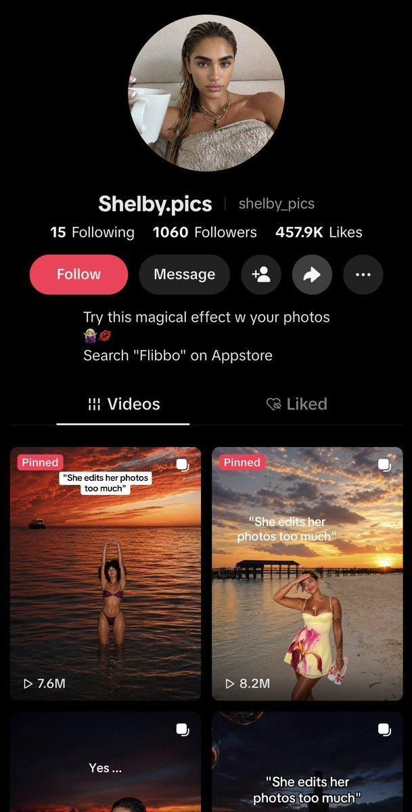

# 85 · Persona aesthetic slideshow account with one recurring caption template

<!-- HERO:START -->
[](EXAMPLE.md)

**[See the example and how to make it →](EXAMPLE.md)** · [watch on X](https://x.com/yurahulei/status/2108224536902815967)
<!-- HERO:END -->


> **LC priority P2** · evidence: Medium (screenshots; vendor post) · hype risk: High · cost $0 · 10 min/post

## What it is
A themed "persona" account (e.g. an aesthetic travel girl) posts photo slideshows of aspirational moments with the same short meme caption on the cover every time. The bio carries the CTA. The repeated caption becomes a recognisable series; volume finds the outliers.

## Why it works
- One proven caption × endless images = cheap volume testing.
- Aspirational photos are inherently shareable.
- The bio CTA avoids an in-post sales pitch.

## Shot-by-shot (LC version)

| Time / slot | Visual | Audio / copy |
|---|---|---|
| Cover | Beach sunset, wearer in profile, necklace catching light | Caption: "she never takes her jewelry off" |
| Slides 2-5 | Ocean, shower, dinner, airport, same chain | — |
| Bio | "waterproof 14K stacks · louisecarter.com" | — |

## Hooks (swap-in openers)
- "she never takes her jewelry off"
- "she wears it in the ocean"
- "her jewelry has been to 9 countries"

## Real examples from X (studied)
- @yurahulei: "1000s of viral TikTok slideshows… 100 accounts posting once a day = 3,000 slideshows a month", tools Minionix (rented US iPhones) and a 100K Pinterest image DB ([post](https://x.com/yurahulei/status/2108224536902815967)).

## Production recipe
1. ONE (or a few) clearly LC-affiliated accounts; no account farms, no bought/warmed accounts.
2. Use only LC-owned, creator-licensed or customer-consented photos (not Pinterest scrapes).
3. Pick 1 caption template; post daily for 30 days; keep the outliers.

## Bot prompt (copy into the creative agent)
```
Write 20 one-line cover captions in the "she never takes her jewelry off" family for an LC aesthetic slideshow account, plus a 5-slide image brief per caption using only owned/licensed photos.
```

## 3 LC scripts
- A · "she never takes her jewelry off".
- B · "her jewelry has seen more oceans than you".
- C · "she got 3 compliments before boarding".

## Variants to test
- Caption template
- Travel vs everyday imagery

## Omni test plan
- **Budget/structure:** 30 days organic, 1-2 posts/day
- **Primary KPIs:** Views/post, profile clicks, link clicks; Omni (F85-*)
- **Kill rule:** <1K median views after 20 posts
- **Scale rule:** Spark-boost outliers
- **Naming:** `utm_content=F85-<concept>-<variant>`; weekly Omni roll-up of new-customer revenue by format.

## Compliance
Baseline: [_COMPLIANCE.md](../_COMPLIANCE.md) (no fake testimonials, AI disclosure, no bulk/spoofed accounts, copy structure not assets, PDP-only claims).
- No multi-account farms, rented-device networks, or fake personas (TikTok rules on inauthentic behavior). Image rights required. Disclose brand affiliation in the bio.

## Related
- Strategies: 01-viral-slideshow-recreation, 24-niche-character-account-network
- Formats: [01-faceless-niche-slideshow](../01-faceless-niche-slideshow/README.md), [56-emotional-relatable-slideshow](../56-emotional-relatable-slideshow/README.md)

<!-- EVIDENCE:START -->
## Wave 5 update: @mayaviefit same-selfie system (Oct 2026)
- This is the purest version of F85: an identical mirror-selfie aesthetic on every cover and a one-line caption template, at 400K-11M views per post on a 130K-follower account with nothing in the bio ([@rsalimx](https://x.com/rsalimx/status/2108629140480168133)). The consistency is the brand; the caption line changes the promise.
- LC remake: a 'jewelry girl' persona account. Same bathroom-mirror selfie in every post (hand on the collarbone, LC stack visible) with a caption template like "jewelry that survives: <gym / beach / shower / 12h shift>". Slides 2-5 are tips, slide 4 is the LC product.

## Evidence from X discovery (auto-generated)

| Date | Author | Post | Engagement | Grade | Gist |
|---|---|---|---|---|---|
| 2026-10-08 | [@yurahulei](https://x.com/yurahulei) | [link](https://x.com/yurahulei/status/2108224536902815967) | 49L/91BM/3kV | SOME | AI agent posting 1000s of TikTok slideshows: rented US iPhones (Minionix), warmed accounts, 100K Pinterest image DB; screenshots: persona accounts, same caption, 7.6M-34.6M views. Account-farm = ToS risk. |
<!-- EVIDENCE:END -->
