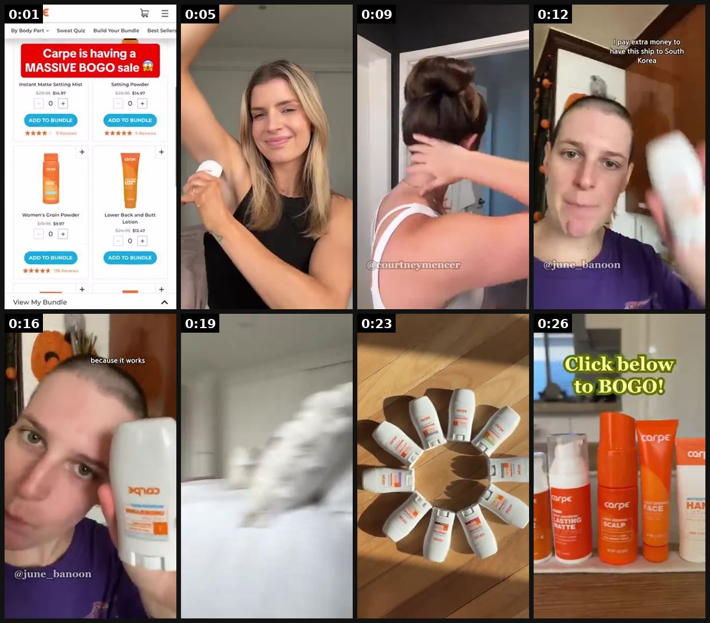
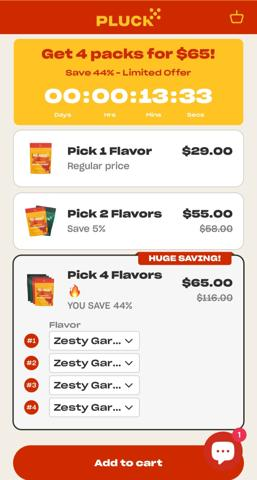
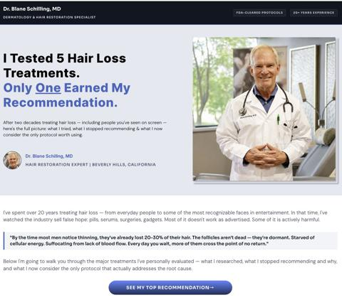
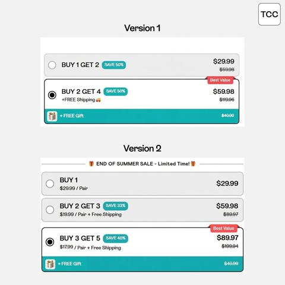

# 86 · Offer-architecture ads: build-your-own bundle / any-N picker / mystery box / free-plus-shipping: see it, then make it

[](https://x.com/mattepstein/status/1840692048787042431)

**The example:** [@mattepstein on X](https://x.com/mattepstein/status/1840692048787042431) · 0:28 video · 2 likes, 709 views

**Watch it:** [open the post on X](https://x.com/mattepstein/status/1840692048787042431) · [play the video file](https://video.twimg.com/ext_tw_video/1840692007896850432/pu/vid/avc1/320x568/yqHoGtQqpViV5RfB.mp4?tag=12)

> 3. Offer focussed UGC ad that brings you straight to a build your own bundle page MY guess? This ad targets existing customers or people deep in the funnel to maximize AOV

## What you are seeing

A UGC ad that sends people straight to a build-your-own-bundle page: it opens on the store's 'massive BOGO sale' bundle page, then a creator shows the sunscreen products on her skin and around the house, ending on a stack of products and "Click below to BOGO".

## Beat by beat

The storyboard above samples the video every 0:03. Lines are the transcript for that stretch; on-screen text comes from OCR, so treat it as rough.

| Frame | Time | On screen | Said / sung |
|---|---|---|---|
| 1 | 0:00–0:03 | By Body Part Sweat Quiz Build Your Bundle Best Sellers … is having a MASSIVE … sale Instant Matte Setting Mist Setting Powder $14.97 $14.97 … Women's Groin Powd | Carpe's having a massive buy one, get one sale. |
| 2 | 0:03–0:07 | · | These products use skin safe ingredients, a dermatologist tested and a viral on TikTok for a reason. |
| 3 | 0:07–0:10 | · | My hair is dry and I usually get soft and wet |
| 4 | 0:10–0:14 | money to have this ship to South Korea | on the nights of fun. I pay extra money to have this shipped to South Korea. |
| 5 | 0:14–0:17 | because it works | You know why? Because it works. Everyone has been telling me to try Carpe. |
| 6 | 0:17–0:21 | · | They've sold out before and they will sell out again. |
| 7 | 0:21–0:25 | · | If you're still on the fence, they have a risk-free money-back guarantee. |
| 8 | 0:25–0:28 | · | There is no better time to try Carpe. Link the link below to get yours today. |

<details><summary>Full transcript (timestamped)</summary>

- `0:00` Carpe's having a massive buy one, get one sale.
- `0:02` These products use skin safe ingredients,
- `0:04` a dermatologist tested and a viral on TikTok for a reason.
- `0:08` My hair is dry and I usually get soft and wet
- `0:11` on the nights of fun.
- `0:12` I pay extra money to have this shipped to South Korea.
- `0:14` You know why?
- `0:15` Because it works.
- `0:16` Everyone has been telling me to try Carpe.
- `0:18` They've sold out before and they will sell out again.
- `0:21` If you're still on the fence,
- `0:22` they have a risk-free money-back guarantee.
- `0:24` There is no better time to try Carpe.
- `0:26` Link the link below to get yours today.

</details>

## More real examples (4)

Other posts that show this format, or a close cousin of it. Click a thumbnail to open it on X.

| | | |
|---|---|---|
| [](https://x.com/andrewdilullo/status/1891876658027823589)<br>**@andrewdilullo** · image · 30 views<br>New offer → Build your own bundle. Instead of a single product, we introduced a “Buy More, Save More” option. Customers could mix and match flavors, c | [](https://x.com/CORSETDEAL/status/1870738559134581077)<br>**@CORSETDEAL** · 0:25 video · 15 views<br>✨ Big Savings Alert! ✨ 🔥 Bundle & Save: Pick any 3 for $99 – Style, comfort, and elegance in one irresistible offer! 🔥 Flat 40% OFF: Treat yourself to | [](https://x.com/FedotOff90/status/2094854572623675832)<br>**@FedotOff90** · image · 47K views<br>6 lander/advertorial types (news mimic, story, listicle, quiz, authority, comparison) — 53-format lander database. |
| [](https://x.com/ArijanJanes/status/2098456656711467183)<br>**@ArijanJanes** · image · 4K views<br>We changed our offer and got a $20 better AOV with roughly the same CVR... All while sending LESS items to the customer. Version 1: - Highest AOV opti |   |   |

## How to make one like it

**The format in one line:** Ads whose creative is the offer mechanic itself: a picker grid "choose any 7" with a running counter, a mystery-box reveal, "free chain, just pay shipping" for first orders, or tiered "buy 4 get 20%". The landing page is the matching picker or offer page, not a generic PDP.

**Why it works:** - The mechanic is the hook: choosing feels like play, and the flat price removes math. - Offer-forward creative converts warm and product-aware traffic. - A matching picker lander keeps the promise from the ad.

**Contents:** [1. Structure](#1-copy-the-structure) · [2. Shot by shot](#2-shot-by-shot-remake) · [3. Script and hooks](#3-write-the-script) · [4. Prompts](#4-prompts) · [5. Tools and settings](#5-tools-and-settings) · [6. Louise Carter remake](#6-louise-carter-remake) · [7. Variants and test](#7-variants-and-test-plan) · [8. Pitfalls](#8-pitfalls)

### 1. Copy the structure

Use the example's timing as your beat sheet. Keep the beat, change the words and the product.

| Beat | Time | In the example | Your version |
|---|---|---|---|
| 1 | 0:01 | Carpe's having a massive buy one, get one sale. These products use skin safe ingredients, | … |
| 2 | 0:05 | These products use skin safe ingredients, a dermatologist tested and a viral on TikTok for a reason. | … |
| 3 | 0:09 | a dermatologist tested and a viral on TikTok for a reason. My hair is dry and I usually get soft and wet on the nights of fun. | … |
| 4 | 0:12 | My hair is dry and I usually get soft and wet on the nights of fun. I pay extra money to have this shipped to South Korea. You know why? | … |
| 5 | 0:16 | I pay extra money to have this shipped to South Korea. You know why? Because it works. Everyone has been telling me to try Carpe. | … |
| 6 | 0:19 | Everyone has been telling me to try Carpe. They've sold out before and they will sell out again. If you're still on the fence, | … |
| 7 | 0:23 | If you're still on the fence, they have a risk-free money-back guarantee. There is no better time to try Carpe. | … |
| 8 | 0:26 | There is no better time to try Carpe. Link the link below to get yours today. | … |

### 2. Shot-by-shot remake

**Target length / size:** Static 1080x1350 + a 15-20s screen-record video

| # | Time / slot | What we see (visual + camera) | Dialogue / on-screen text |
|---|---|---|---|
| 1 | 0-3s | Screen recording of the bundle picker on the site, finger taps products | Text: "Pick any 7. Pay $85." |
| 2 | 3-10s | Counter climbs: 3/7, 5/7, 7/7, price stays $85 | VO: "Mix necklaces, rings, earrings. Doesn't matter." |
| 3 | 10-15s | Cut to the 7 pieces arriving in a box, then worn stacked | "That's about $12 a piece." |
| 4 | Static version | A 3x3 grid of products with 7 ticked, a price bar at the bottom | "7 for $85 — you pick" |
| 5 | Mystery-box variant | Closed gift box, then a quick reveal | "Can't decide? Let us pick." |

<details><summary>Playbook shot list (Louise Carter version from the README)</summary>

| Time / slot | Visual | Audio / copy |
|---|---|---|
| 0-3s | Screen recording: tapping 7 pieces into a bundle builder, counter 1/7 → 7/7 | "Any 7. $85. Go." |
| 3-12s | Pieces dropping into a gift box | — |
| 12-15s | Price card | "Waterproof 14K PVD" |

</details>

### 3. Write the script

Open with one of these hooks (first 1–3 seconds, or the headline on a static):

- "Pick any 7. $85. That's it."
- "Build your stack in 20 seconds"
- "Mystery 3-piece box: guess what's inside"
- "First chain free, just pay shipping" (test only if margins allow)

Then fill the beats from the table above. Pull the wording from real customer reviews, not from ad copy: a review line beats a copywriter line almost every time. Read every line out loud and cut anything you would not say to a friend. Ready-made Louise Carter scripts are in section 6; hand [BOT.md](BOT.md) to any AI agent to write versions for another brand.

### 4. Prompts

**Figma (static)**

```text
Grid of 9 products on cream, 7 with gold tick badges, a bottom bar "7/7 · $85 · Free shipping", headline 96px
```

**Screen record**

```text
iPhone screen record of the real picker, 60fps, then crop to 9:16 and add taps with a touch indicator
```

**Full creative-agent prompt (from the playbook):**

```
Write 5 offer-architecture ads for LC: picker screen-record script, mystery box reveal, gift-box build, "your stack, your rules" static, tiered offer static. Match each to a landing-page spec (preloaded cart or picker).
```

### 5. Tools and settings

1. Record the real picker flow on louisecarter.com (or build one).
2. Make 3 mechanics: picker, mystery box, gift-box build.
3. Send each to the matching page with the bundle preloaded.

| Setting | Value |
|---|---|
| What you are building | A repeatable system (account, page, offer or pipeline), not one ad |
| Cadence | Decide the posting or launch rhythm up front (e.g. daily, or 3 new ads a week) and keep it for 30 days |
| Template | Lock one caption, layout and naming template so output is consistent |
| Tracking | One UTM pattern per system (`utm_campaign=F<NN>`) and a weekly sheet: spend, CTR, hook rate, CPA |
| Tools | Meta Ads Manager / TikTok Ads Manager, a shared Drive folder per format, the agent brief in BOT.md |

### 6. Louise Carter remake

- A · Picker screen-record "any 7, $85".
- B · Mystery 3-piece box (if offered).
- C · "Build her gift in 20 seconds".

Brand rules, claims you can and cannot make, and more scripts: [brands/louise-carter.md](brands/louise-carter.md). Step-by-step from idea to scale: [STAGES.md](STAGES.md).

### 7. Variants and test plan

- Mechanic
- Cold vs retargeting

**Test plan:** - **Budget/structure:** 3 mechanics, $40/day, 7 days - **Primary KPIs:** CVR, AOV, CPA; Omni (F86-*) - **Kill rule:** CPA >1.5× - **Scale rule:** Always-on BOFU; seasonal skins - **Naming:** `utm_content=F86-<concept>-<variant>`; weekly Omni roll-up of new-customer revenue by format.

**Naming:** `F86-<variant>-<hook##>-<date>` so results map back to this folder. Change one thing per test (hook, narrator, length or offer), never two.

### 8. Pitfalls

- The ad must match the real checkout exactly (price, number of items, shipping).
- Show the per-piece maths only if it is accurate.
- Mystery boxes need a clear value floor; don't imply rare items you won't send.
- Changing the template every week: the system only learns if it stays consistent for at least 30 days.
- No tracking: without one naming and UTM pattern you cannot tell which piece of the system works.

**Compliance:** Baseline: [_COMPLIANCE.md](../_COMPLIANCE.md) (no fake testimonials, AI disclosure, no bulk/spoofed accounts, copy structure not assets, PDP-only claims). - Offer terms exact; free-plus-shipping must state the shipping cost clearly; no fake countdowns.

## Field notes

Newer observations live in the playbook: [Wave 3 update: brands & apps crushing it (Oct 2026)](README.md)

## More examples

Every post we found for this format, with transcripts: [examples/](examples/README.md). Playbook: [README.md](README.md). Agent brief: [BOT.md](BOT.md).
