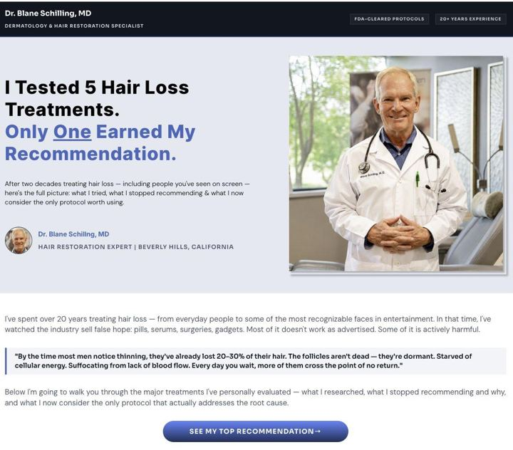

# 86 · Offer-architecture ads: build-your-own bundle / any-N picker / mystery box / free-plus-shipping

<!-- HERO:START -->
[](EXAMPLE.md)

**[See the example and how to make it →](EXAMPLE.md)** · [watch on X](https://x.com/FedotOff90/status/2094854572623675832)
<!-- HERO:END -->


> **LC priority P0** · evidence: High (many live offer pages) · hype risk: Low · cost $0-100 · 1 h

## What it is
Ads whose creative is the offer mechanic itself: a picker grid "choose any 7" with a running counter, a mystery-box reveal, "free chain, just pay shipping" for first orders, or tiered "buy 4 get 20%". The landing page is the matching picker or offer page, not a generic PDP.

## Why it works
- The mechanic is the hook: choosing feels like play, and the flat price removes math.
- Offer-forward creative converts warm and product-aware traffic.
- A matching picker lander keeps the promise from the ad.

## Shot-by-shot (LC version)

| Time / slot | Visual | Audio / copy |
|---|---|---|
| 0-3s | Screen recording: tapping 7 pieces into a bundle builder, counter 1/7 → 7/7 | "Any 7. $85. Go." |
| 3-12s | Pieces dropping into a gift box | — |
| 12-15s | Price card | "Waterproof 14K PVD" |

## Hooks (swap-in openers)
- "Pick any 7. $85. That's it."
- "Build your stack in 20 seconds"
- "Mystery 3-piece box: guess what's inside"
- "First chain free, just pay shipping" (test only if margins allow)

## Real examples from X (studied)
- Lander DB, Offer Architecture: buy-X-get-Y% mix-and-match (Ramen Bae 98d), build-your-own bundle, any-N-for-flat-price picker, bundle-app builder, mystery box PDP, UGC order-packing → offer page; Free-Plus-Shipping: free sample pay shipping, free starter box, free trial box ([db](https://rural-lifeboat-196.notion.site/3c6db9d7074d81fcb0b6cd81a4527126)).
- @FedotOff90 "37 Ad Formats That Print" verified swipe: Outfigured, 32 days live ("Bundle offer" format, 145 brand ads). [ad](https://app.gethookd.ai/share/ad/149373680?signature=e9e608dafffe602d5295d9ac8c637bfb93ff013a456c75cba3392a8f570d3879) · [doc](https://rural-lifeboat-196.notion.site/3c8db9d7074d81548084c2b25d1be1ef) · [post](https://x.com/FedotOff90/status/2104949773539442831)
- @FedotOff90 "335 top BOFU ads in ONE swipe file" (BOFU offers board, 333 ads) ([post](https://x.com/FedotOff90/status/2091884660871585977)).

## Production recipe
1. Record the real picker flow on louisecarter.com (or build one).
2. Make 3 mechanics: picker, mystery box, gift-box build.
3. Send each to the matching page with the bundle preloaded.

## Bot prompt (copy into the creative agent)
```
Write 5 offer-architecture ads for LC: picker screen-record script, mystery box reveal, gift-box build, "your stack, your rules" static, tiered offer static. Match each to a landing-page spec (preloaded cart or picker).
```

## 3 LC scripts
- A · Picker screen-record "any 7, $85".
- B · Mystery 3-piece box (if offered).
- C · "Build her gift in 20 seconds".

## Variants to test
- Mechanic
- Cold vs retargeting

## Omni test plan
- **Budget/structure:** 3 mechanics, $40/day, 7 days
- **Primary KPIs:** CVR, AOV, CPA; Omni (F86-*)
- **Kill rule:** CPA >1.5×
- **Scale rule:** Always-on BOFU; seasonal skins
- **Naming:** `utm_content=F86-<concept>-<variant>`; weekly Omni roll-up of new-customer revenue by format.

## Compliance
Baseline: [_COMPLIANCE.md](../_COMPLIANCE.md) (no fake testimonials, AI disclosure, no bulk/spoofed accounts, copy structure not assets, PDP-only claims).
- Offer terms exact; free-plus-shipping must state the shipping cost clearly; no fake countdowns.

## Related
- Strategies: 05-offer-page-engineering, 18-upsell-ecosystem
- Formats: [37-urgency-offer-statics](../37-urgency-offer-statics/README.md), [62-catalog-collection-dpa-ads](../62-catalog-collection-dpa-ads/README.md)

<!-- EVIDENCE:START -->
## Evidence from X discovery (auto-generated)

| Date | Author | Post | Engagement | Grade | Gist |
|---|---|---|---|---|---|
| 2026-09-01 | [@FedotOff90](https://x.com/FedotOff90) | [link](https://x.com/FedotOff90/status/2094854572623675832) | 175L/385BM/47kV | VALUE | 6 lander/advertorial types (news mimic, story, listicle, quiz, authority, comparison) — 53-format lander database. |
| 2026-08-25 | [@FedotOff90](https://x.com/FedotOff90) | [link](https://x.com/FedotOff90/status/2092382176738202057) | 145L/318BM/11kV | VALUE | 24 landing page formats with live ad→lander pairs (breaking news, investigation, as-seen-on-TV, doctor warning…). |
| 2026-08-28 | [@FedotOff90](https://x.com/FedotOff90) | [link](https://x.com/FedotOff90/status/2093350155751924213) | 238L/632BM/20kV | SOME | 7,500+ winning Meta ads sorted by format across public boards (top-50 DTC, beauty, natives, listicles, shock & gross, BOFU). |
<!-- EVIDENCE:END -->
