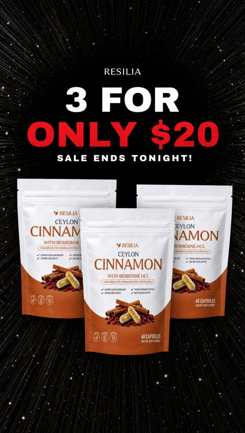
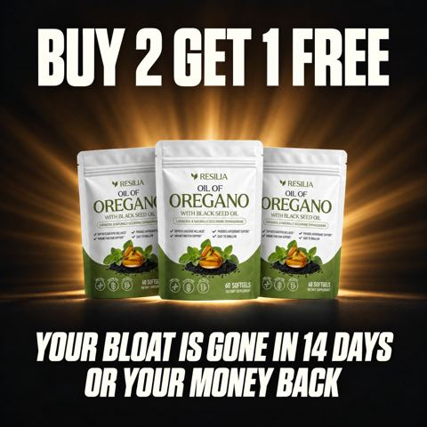
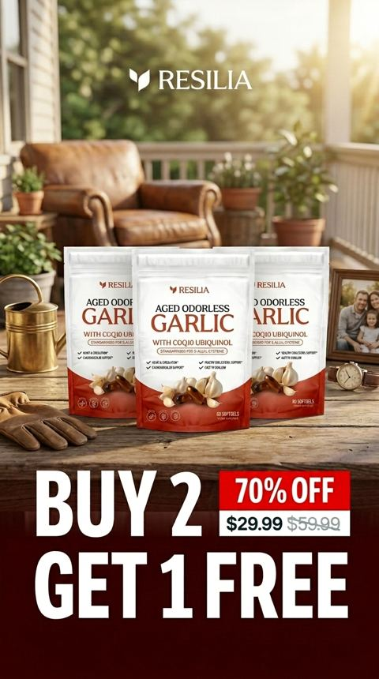
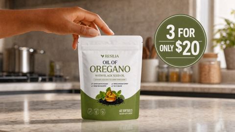

# Meta ad-library examples for F86

<!-- WAVE6 -->
## Wave 6: Resilia & Smooche live Meta ads (Oct 2026)

Pulled from the public Meta Ad Library on 2026-10-09 (Resilia: aged garlic, Ceylon cinnamon, oil of oregano; Smooche: color-changing foundation, Reverse Time peptide serum). Days live are counted to 2026-10-09; most video ads were new tests that week, while the long runners are statics and catalog templates. Transcripts are automatic. Brand claims are the advertisers', not verified, and many are health claims we would never make. The **Do not copy** line flags deceptive tactics (persona "publication" pages, undisclosed AI actors and "experts", fake stock counts).

### Resilia · Metabolic Health Review: “3 FOR ONLY $20. SALE ENDS TONIGHT!” (1 day live)

- **Ad:** [Meta Ad Library #4176782875954116](https://www.facebook.com/ads/library/?id=4176782875954116) · static image · page “Metabolic Health Review” · started 2026-10-07 · lands on `resilia.shop/products/resilia-ceylon-cinnamon`
- **What happens:** "3 FOR ONLY $20. SALE ENDS TONIGHT!" with three cinnamon pouches on black.
- **Why it works:** "3 for only $20, sale ends tonight", "Buy 2 get 1 free", "Buy 3 get 2 free" and "bloat gone in 14 days or your money back". Bundle math is the headline.
- **How to make one:** Give a big bundle number, show a hand placing the product, add the deadline, and add the guarantee.
- **LC remake:** "ANY 7 FOR $85": seven pieces in a row, a hand adding the 7th.

Primary text

> Want to Support Healthy Blood Sugar — All Day Long? ❤️ Experience the Power of Resilia Ceylon Cinnamon + Berberine! ✅ Supports healthy blood sugar levels ✅ Supports healthy insulin response ✅ Supports healthy glucose metabolism ✅ Supports healthy post-meal blood sugar ✅ 1,000mg True Ceylon Cinnamon Extract ✅ Standardized for cinnamaldehyde & polyphenols ✅ Plus 500mg Berberine HCl Support your metabolic health with two powerful ingredients working together — 30-Day Risk-Free Guarantee.

### Resilia · Resilia: “BUY 2 GET 1 FREE. YOUR BLOAT IS GONE IN 14 DAYS OR YOUR MONEY BACK” (1 day live)

- **Ad:** [Meta Ad Library #1096144816487131](https://www.facebook.com/ads/library/?id=1096144816487131) · static image · page “Resilia” · started 2026-10-07 · lands on `resilia.shop/products/resilia-oil-of-oregano-softgels`
- **What happens:** "BUY 2 GET 1 FREE. YOUR BLOAT IS GONE IN 14 DAYS OR YOUR MONEY BACK."
- **Why it works:** "3 for only $20, sale ends tonight", "Buy 2 get 1 free", "Buy 3 get 2 free" and "bloat gone in 14 days or your money back". Bundle math is the headline.
- **How to make one:** Give a big bundle number, show a hand placing the product, add the deadline, and add the guarantee.
- **LC remake:** "ANY 7 FOR $85": seven pieces in a row, a hand adding the 7th.

Primary text

> Resilia is powered by oil of oregano and cold-pressed black seed oil — two of nature's most time-tested botanicals. Our easy-to-swallow softgels feature premium oil of oregano with naturally occurring carvacrol and black seed oil with thymoquinone. Clean, no-BS ingredients, third-party tested, and shipped right from the USA to deliver daily support for a healthy gut, a healthy inflammatory response, and your body's natural defenses. Just two softgels a day, no powders or routines to remember.

### Resilia · Vascular Wellness Report: “BUY 2 GET 1 FREE, 70% OFF” (1 day live)

- **Ad:** [Meta Ad Library #2555542751581638](https://www.facebook.com/ads/library/?id=2555542751581638) · static image · page “Vascular Wellness Report” · started 2026-10-07 · lands on `resilia.shop/products/resilia-aged-odorless-garlic`
- **What happens:** "BUY 2 GET 1 FREE, 70% OFF" with three pouches on a kitchen counter.
- **Why it works:** "3 for only $20, sale ends tonight", "Buy 2 get 1 free", "Buy 3 get 2 free" and "bloat gone in 14 days or your money back". Bundle math is the headline.
- **How to make one:** Give a big bundle number, show a hand placing the product, add the deadline, and add the guarantee.
- **LC remake:** "ANY 7 FOR $85": seven pieces in a row, a hand adding the 7th.

Primary text

> Looking to Take Control of Your Heart Health Naturally?❤️ Experience the Power of Resilia Aged Garlic Extract! ✅: Supports cardiovascular health naturally ✅: Completely odorless formula ✅: Supports arterial health ✅: 20-month aging process ✅: 900+ clinical studies ✅: SAC-standardized aged garlic extract ✅: Plus CoQ10 Ubiquinol & Vitamin K2 MK-7 Transform your cardiovascular health with three clinically studied ingredients backed by modern science — 30-Day Risk-Free Guarantee.

### Resilia · Resilia: A hand placing the pouch on a counter (1 day live)

- **Ad:** [Meta Ad Library #1042182052189223](https://www.facebook.com/ads/library/?id=1042182052189223) · static image · page “Resilia” · started 2026-10-07 · 1 copies · lands on `resilia.shop/products/resilia-oil-of-oregano-softgels`
- **What happens:** A hand placing the pouch on a counter with a "3 for only $20" roundel.
- **Why it works:** "3 for only $20, sale ends tonight", "Buy 2 get 1 free", "Buy 3 get 2 free" and "bloat gone in 14 days or your money back". Bundle math is the headline.
- **How to make one:** Give a big bundle number, show a hand placing the product, add the deadline, and add the guarantee.
- **LC remake:** "ANY 7 FOR $85": seven pieces in a row, a hand adding the 7th.

Primary text

> Resilia is powered by oil of oregano and cold-pressed black seed oil — two of nature's most time-tested botanicals. Our easy-to-swallow softgels feature premium oil of oregano with naturally occurring carvacrol and black seed oil with thymoquinone. Clean, no-BS ingredients, third-party tested, and shipped right from the USA to deliver daily support for a healthy gut, a healthy inflammatory response, and your body's natural defenses. Just two softgels a day, no powders or routines to remember.

<!-- /WAVE6 -->

