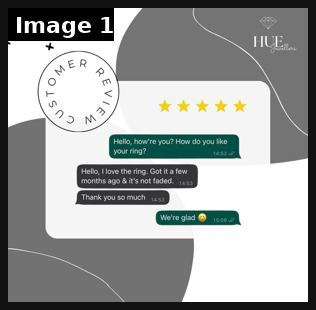

# 87 · Customer-photo hashtag UGC turned into Story & retargeting ads: see it, then make it

[](https://x.com/huejewellers/status/2099792841115386168)

**The example:** [@huejewellers on X](https://x.com/huejewellers/status/2099792841115386168) · 1 image · 1 likes, 20 views

**Watch it:** [open the post on X](https://x.com/huejewellers/status/2099792841115386168)

> “I love the ring. Got it a few months ago & it’s not faded.” Real feedback from real customers. Thank you for trusting HUE Jewellers #HueJewellers #CustomerReview #HappyCustomer #QualityJewelry

## What you are seeing

A customer-review static for a jewelry brand: "Customer Review" in a circle stamp, five gold stars and a WhatsApp-style chat ("I love the ring. Got it a few months ago & it's not faded.").

## Image by image

| Image | Text on it (OCR, rough) |
|---|---|
| 1 | ER Hello, you? How do you like your ring? Hello, love the ring. Got it a few months ago it’s not faded |

## How to make one like it

**The format in one line:** Run a branded hashtag ("#LCinTheOcean"), collect customer photos with explicit rights, and turn them into Story ads and retargeting carousels, with the customer's handle shown. Real wearers in real places beat studio shots for warm audiences.

**Why it works:** - Real customers in the wild are the strongest proof for a durability claim. - A constant supply of fresh creative fights fatigue. - Featuring customers builds community and more submissions.

**Contents:** [1. Structure](#1-copy-the-structure) · [2. Shot by shot](#2-shot-by-shot-remake) · [3. Script and hooks](#3-write-the-script) · [4. Prompts](#4-prompts) · [5. Tools and settings](#5-tools-and-settings) · [6. Louise Carter remake](#6-louise-carter-remake) · [7. Variants and test](#7-variants-and-test-plan) · [8. Pitfalls](#8-pitfalls)

### 1. Copy the structure

The skeleton every version follows: **hook → problem or tension → turn (the product shows up) → proof → one clear ask.** The shot-by-shot below fills it in.

### 2. Shot-by-shot remake

**Target length / size:** Story ads + retargeting carousels from customer photos

| # | Time / slot | What we see (visual + camera) | Dialogue / on-screen text |
|---|---|---|---|
| 1 | Collect | Branded hashtag (#LCinTheOcean) on packaging and in emails | - |
| 2 | Ads | Customer photo, handle shown, short caption | "@maria wore hers in Lisbon" |
| 3 | Retarget | Carousel of 5 customer photos | - |

<details><summary>Playbook shot list (Louise Carter version from the README)</summary>

| Time / slot | Visual | Audio / copy |
|---|---|---|
| Story ad | Customer selfie in the sea, handle tag | "@handle · 4 months, still gold" |
| Carousel | 6 customer photos | "Where our stacks have been" |

</details>

### 3. Write the script

Open with one of these hooks (first 1–3 seconds, or the headline on a static):

- "Where have your LC pieces been?"
- "Real customers, real oceans"

Then fill the beats from the table above. Pull the wording from real customer reviews, not from ad copy: a review line beats a copywriter line almost every time. Read every line out loud and cut anything you would not say to a friend. Ready-made Louise Carter scripts are in section 6; hand [BOT.md](BOT.md) to any AI agent to write versions for another brand.

### 4. Prompts

**Rights request**

```text
Comment: "We love this! Can we feature it in our ads? Reply #yesLC to agree to our terms [link]."
```

**Full creative-agent prompt (from the playbook):**

```
Write a hashtag launch kit for LC: hashtag, packaging insert copy, rights-request DM, 3 Story ad templates and 1 carousel template using customer photos.
```

### 5. Tools and settings

1. Launch the hashtag on packaging and in the post-purchase email.
2. Collect written usage rights (e.g. reply "#yesLC").
3. Refresh the retargeting carousel weekly.

| Setting | Value |
|---|---|
| What you are building | A repeatable system (account, page, offer or pipeline), not one ad |
| Cadence | Decide the posting or launch rhythm up front (e.g. daily, or 3 new ads a week) and keep it for 30 days |
| Template | Lock one caption, layout and naming template so output is consistent |
| Tracking | One UTM pattern per system (`utm_campaign=F<NN>`) and a weekly sheet: spend, CTR, hook rate, CPA |
| Tools | Meta Ads Manager / TikTok Ads Manager, a shared Drive folder per format, the agent brief in BOT.md |

### 6. Louise Carter remake

- A · #LCinTheOcean.
- B · #7for85stack.
- C · Bridal party photos.

Brand rules, claims you can and cannot make, and more scripts: [brands/louise-carter.md](brands/louise-carter.md). Step-by-step from idea to scale: [STAGES.md](STAGES.md).

### 7. Variants and test plan

- Story vs carousel
- With vs without handle

**Test plan:** - **Budget/structure:** $20/day retargeting, ongoing - **Primary KPIs:** Retargeting CPA; Omni (F87-*) - **Kill rule:** CPA > other retargeting - **Scale rule:** Feed winners to cold - **Naming:** `utm_content=F87-<concept>-<variant>`; weekly Omni roll-up of new-customer revenue by format.

**Naming:** `F87-<variant>-<hook##>-<date>` so results map back to this folder. Change one thing per test (hook, narrator, length or offer), never two.

### 8. Pitfalls

- Get explicit rights for ad use, not just a repost.
- Changing the template every week: the system only learns if it stays consistent for at least 30 days.
- No tracking: without one naming and UTM pattern you cannot tell which piece of the system works.

**Compliance:** Baseline: [_COMPLIANCE.md](../_COMPLIANCE.md) (no fake testimonials, AI disclosure, no bulk/spoofed accounts, copy structure not assets, PDP-only claims). - Written usage rights; credit handles; no editing that changes the result shown.

## More examples

Every post we found for this format, with transcripts: [examples/](examples/README.md). Playbook: [README.md](README.md). Agent brief: [BOT.md](BOT.md).
