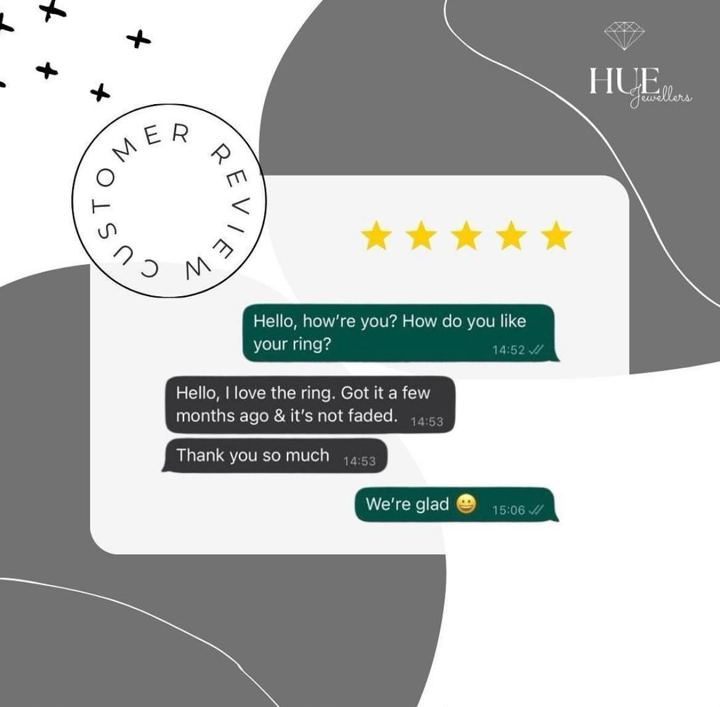

# 87 · Customer-photo hashtag UGC turned into Story & retargeting ads

<!-- HERO:START -->
[](EXAMPLE.md)

**[See the example and how to make it →](EXAMPLE.md)** · [watch on X](https://x.com/huejewellers/status/2099792841115386168)
<!-- HERO:END -->


> **LC priority P1** · evidence: Medium (brand case studies) · hype risk: Low · cost $0 + rights mgmt · 30 min/week

## What it is
Run a branded hashtag ("#LCinTheOcean"), collect customer photos with explicit rights, and turn them into Story ads and retargeting carousels, with the customer's handle shown. Real wearers in real places beat studio shots for warm audiences.

## Why it works
- Real customers in the wild are the strongest proof for a durability claim.
- A constant supply of fresh creative fights fatigue.
- Featuring customers builds community and more submissions.

## Shot-by-shot (LC version)

| Time / slot | Visual | Audio / copy |
|---|---|---|
| Story ad | Customer selfie in the sea, handle tag | "@handle · 4 months, still gold" |
| Carousel | 6 customer photos | "Where our stacks have been" |

## Hooks (swap-in openers)
- "Where have your LC pieces been?"
- "Real customers, real oceans"

## Real examples from X (studied)
- GetHookd "3 Instagram UGC Ads Examples": Meller (Stories from customer photos), Parachute (#MyParachuteHome → retargeting), Timberland ([article](https://www.gethookd.ai/learn/3-instagram-ugc-ads-examples-that-work-in-2026/)).

## Production recipe
1. Launch the hashtag on packaging and in the post-purchase email.
2. Collect written usage rights (e.g. reply "#yesLC").
3. Refresh the retargeting carousel weekly.

## Bot prompt (copy into the creative agent)
```
Write a hashtag launch kit for LC: hashtag, packaging insert copy, rights-request DM, 3 Story ad templates and 1 carousel template using customer photos.
```

## 3 LC scripts
- A · #LCinTheOcean.
- B · #7for85stack.
- C · Bridal party photos.

## Variants to test
- Story vs carousel
- With vs without handle

## Omni test plan
- **Budget/structure:** $20/day retargeting, ongoing
- **Primary KPIs:** Retargeting CPA; Omni (F87-*)
- **Kill rule:** CPA > other retargeting
- **Scale rule:** Feed winners to cold
- **Naming:** `utm_content=F87-<concept>-<variant>`; weekly Omni roll-up of new-customer revenue by format.

## Compliance
Baseline: [_COMPLIANCE.md](../_COMPLIANCE.md) (no fake testimonials, AI disclosure, no bulk/spoofed accounts, copy structure not assets, PDP-only claims).
- Written usage rights; credit handles; no editing that changes the result shown.

## Related
- Strategies: 11-social-proof-credibility-engine, 15-community-led-discovery
- Formats: [40-testimonial-mashup](../40-testimonial-mashup/README.md), [74-verbatim-review-static](../74-verbatim-review-static/README.md)

<!-- EVIDENCE:START -->
## Evidence from X discovery (auto-generated)

| Date | Author | Post | Engagement | Grade | Gist |
|---|---|---|---|---|---|
<!-- EVIDENCE:END -->
