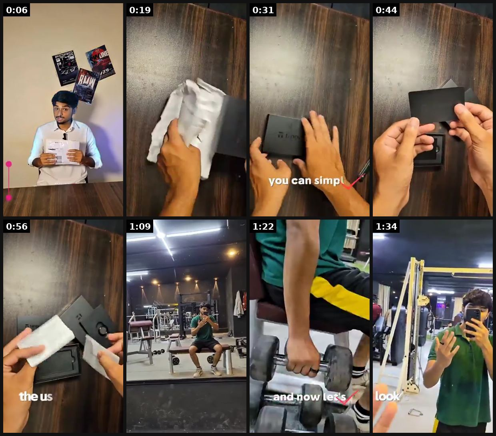

# 88 · Challenge ad ('the 30-day never-take-it-off challenge'): see it, then make it

[](https://x.com/0xShahzaib_/status/2104901293190119594)

**The example:** [@0xShahzaib_ on X](https://x.com/0xShahzaib_/status/2104901293190119594) · 1:41 video · 59 likes, 16K views

**Watch it:** [open the post on X](https://x.com/0xShahzaib_/status/2104901293190119594) · [play the video file](https://video.twimg.com/amplify_video/2104900084400070656/vid/avc1/320x568/Wzs2XFcZ7pim3U1l.mp4?tag=29)

> Got my @Tangem Ring today and decided to put it through a real workout. Wore it for push ups and dumbbell exercises to see how it feels during normal activity. It stayed comfortable on my finger and handled the workout just fine. A crypto hardware wallet you can actually wear in your everyday life. Sharing my full test below 👇

## What you are seeing

A real-world stress test: a creator unboxes a smart ring, then wears it through a gym workout (push-ups, dumbbells, machines) to see whether it holds up.

## Beat by beat

The storyboard above samples the video every 0:12. Lines are the transcript for that stretch; on-screen text comes from OCR, so treat it as rough.

| Frame | Time | On screen | Said / sung |
|---|---|---|---|
| 1 | 0:00–0:12 | · | Can this tiny thing actually survive the real work out? I just received the TENJUM RING today and I am going to put it through some serious test. Let's unbox it first. |
| 2 | 0:12–0:25 | · | Alright, let's open the package and see what we have inside. And here we have the TENJUM RING box. The TENJUM RING is a crypto hardware wallet designed in the form of a ring. |
| 3 | 0:25–0:37 | ig ui Th a you can | So instead of getting our traditional hardware wallet, you can simply wear it on your finger. And here it is, the TENJUM RING. |
| 4 | 0:37–0:50 | ADs is ut wD ia if fe | And it has a really simple and pretty design, so it doesn't look like a hardware wallet. Along with the ring, we also get two bags. This is card number one and this is card two. |
| 5 | 0:50–1:03 | · | These are used as a bag of options for accessing your wallet. Of course, we also get the user manual, which honestly we probably never read. Now here is how it is looked. |
| 6 | 1:03–1:15 | al List ma Mea: ASA rh | So let's go with me and test it while doing our gym workout. Now it's time for the real test. Let's see how the TENJUM RING handles an actual workout. First we are starting with push-ups. |
| 7 | 1:15–1:28 | · | I am keeping the ring on and putting it through a normal workout. And now let's make it a little more challenging. Some dumbbell exercise while wearing the ring. |
| 8 | 1:28–1:41 | · | And that's the workout done. The ring stayed on throughout the workout and it still looked completely fine. |

<details><summary>Full transcript (timestamped)</summary>

- `0:01` Can this tiny thing actually survive the real work out?
- `0:04` I just received the TENJUM RING today and I am going to put it through some serious test.
- `0:10` Let's unbox it first.
- `0:14` Alright, let's open the package and see what we have inside.
- `0:19` And here we have the TENJUM RING box.
- `0:22` The TENJUM RING is a crypto hardware wallet designed in the form of a ring.
- `0:28` So instead of getting our traditional hardware wallet, you can simply wear it on your finger.
- `0:33` And here it is, the TENJUM RING.
- `0:37` And it has a really simple and pretty design, so it doesn't look like a hardware wallet.
- `0:44` Along with the ring, we also get two bags.
- `0:47` This is card number one and this is card two.
- `0:50` These are used as a bag of options for accessing your wallet.
- `0:54` Of course, we also get the user manual, which honestly we probably never read.
- `1:00` Now here is how it is looked.
- `1:02` So let's go with me and test it while doing our gym workout.
- `1:07` Now it's time for the real test.
- `1:09` Let's see how the TENJUM RING handles an actual workout.
- `1:13` First we are starting with push-ups.
- `1:15` I am keeping the ring on and putting it through a normal workout.
- `1:20` And now let's make it a little more challenging.
- `1:24` Some dumbbell exercise while wearing the ring.
- `1:27` And that's the workout done.
- `1:29` The ring stayed on throughout the workout and it still looked completely fine.

</details>

## More real examples (6)

Other posts that show this format, or a close cousin of it. Click a thumbnail to open it on X.

| | | |
|---|---|---|
| [](https://x.com/TheModernElder/status/2093143918355357888)<br>**@TheModernElder** · 1:00 video · 167 views<br>DAY 10 OF UGC 30 DAY CHALLENGE Today video creation is officially running on repeat in my head. Reaching Day 10 has shifted my focus from making conte | [](https://x.com/KimRaceRod/status/2097084996548726860)<br>**@KimRaceRod** · 1:05 video · 125 views<br>Day 21 of Creator Quest UGC 30 day challenge!!! I can't count and did two 19s🤦🏻‍♀️ Heading it to the last week and learning a ton🙌🏼 #cqchallenge #ugc | [](https://x.com/KimRaceRod/status/2096026203589095690)<br>**@KimRaceRod** · 0:43 video · 123 views<br>Day 18 of the Creator Quest UGC 30 day challenge!! I can't wait to land some gigs☺️ #cqchallenge #ugc @UGCbyBrandon https://t.co/wgkLXo5eXM |
| [](https://x.com/KimRaceRod/status/2094998935949427016)<br>**@KimRaceRod** · 0:59 video · 107 views<br>Day 15 of the Creator Quest 30 day challenge!!! I did a reach out with my comment banner and it does look more professional!!! #cqchallenge #ugc @UGCb | [](https://x.com/KimRaceRod/status/2100366661324779651)<br>**@KimRaceRod** · 0:53 video · 79 views<br>Day 30 of the Creator Quest UGC 30 day challenge 🙌🏼 We made and I learned so much!!! It's just the beginning 🙌🏼 #cqchallenge #ugc @UGCbyBrandon https: | [](https://x.com/KimRaceRod/status/2093064218568233104)<br>**@KimRaceRod** · 1:04 video · 139 views<br>Day 9 of the Creator Quest UGC 30 day challenge. Working on sharpening and adding to my Fiverr, thumbnails to look more professional and mock videos t |

## How to make one like it

**The format in one line:** An ad that invites the viewer into a time-boxed challenge ("30 days, never take it off"), with a start date, rules and a reward (feature, gift card, entry). Participants post check-ins, which become new creative.

**Why it works:** - Participation beats persuasion; the viewer becomes the demo. - A dated challenge creates urgency without discounts. - It generates UGC and streak content (F68).

**Contents:** [1. Structure](#1-copy-the-structure) · [2. Shot by shot](#2-shot-by-shot-remake) · [3. Script and hooks](#3-write-the-script) · [4. Prompts](#4-prompts) · [5. Tools and settings](#5-tools-and-settings) · [6. Louise Carter remake](#6-louise-carter-remake) · [7. Variants and test](#7-variants-and-test-plan) · [8. Pitfalls](#8-pitfalls)

### 1. Copy the structure

Use the example's timing as your beat sheet. Keep the beat, change the words and the product.

| Beat | Time | In the example | Your version |
|---|---|---|---|
| 1 | 0:06 | Can this tiny thing actually survive the real work out? I just received the TENJUM RING today and I am going to put it through some serious | … |
| 2 | 0:19 | Alright, let's open the package and see what we have inside. And here we have the TENJUM RING box. The TENJUM RING is a crypto hardware wall | … |
| 3 | 0:31 | So instead of getting our traditional hardware wallet, you can simply wear it on your finger. And here it is, the TENJUM RING. | … |
| 4 | 0:44 | And it has a really simple and pretty design, so it doesn't look like a hardware wallet. Along with the ring, we also get two bags. This is | … |
| 5 | 0:56 | These are used as a bag of options for accessing your wallet. Of course, we also get the user manual, which honestly we probably never read. | … |
| 6 | 1:09 | So let's go with me and test it while doing our gym workout. Now it's time for the real test. Let's see how the TENJUM RING handles an actua | … |
| 7 | 1:22 | I am keeping the ring on and putting it through a normal workout. And now let's make it a little more challenging. Some dumbbell exercise wh | … |
| 8 | 1:34 | And that's the workout done. The ring stayed on throughout the workout and it still looked completely fine. | … |

### 2. Shot-by-shot remake

**Target length / size:** Launch ad (20-30s, 1080x1920) + participant posts + a wrap-up ad

| # | Time / slot | What we see (visual + camera) | Dialogue / on-screen text |
|---|---|---|---|
| 1 | 0-3s | Founder or creator to camera, holding up the necklace | "30 days. Never take it off. Not in the shower, not in the sea." |
| 2 | 3-10s | The rules on screen while she talks | "Start Monday. Post day 1 and day 30 with #30DayLC. Best results win $500 of jewellery." |
| 3 | 10-20s | Fast montage of her own first days: shower, gym, pool | "I'll go first." |
| 4 | Updates (week 2-3) | Repost participant clips (with permission) as Stories and a weekly ad | "Day 14: still gold." |
| 5 | Wrap-up ad | Grid of day-30 photos + winners announced | "312 of you did it. Here's what 30 days looks like." |

<details><summary>Playbook shot list (Louise Carter version from the README)</summary>

| Time / slot | Visual | Audio / copy |
|---|---|---|
| 0-5s | Creator: "I'm not taking this off for 30 days." | — |
| 5-20s | Rules on screen: shower, swim, gym, sleep | "Join: post day 1 with #LCchallenge" |
| 20-30s | Prize / feature | "Best day-30 photo gets featured" |

</details>

### 3. Write the script

Open with one of these hooks (first 1–3 seconds, or the headline on a static):

- "30 days. Never take it off. Join me."
- "The LC shower challenge starts Monday"

Then fill the beats from the table above. Pull the wording from real customer reviews, not from ad copy: a review line beats a copywriter line almost every time. Read every line out loud and cut anything you would not say to a friend. Ready-made Louise Carter scripts are in section 6; hand [BOT.md](BOT.md) to any AI agent to write versions for another brand.

### 4. Prompts

**Official rules (Claude)**

```text
Write official rules for a 30-day wear challenge: dates, eligibility by country, how to enter, judging criteria, prize, how winners are notified, no purchase necessary wording where required.
```

**Content plan**

```text
Post day 1, 7, 14, 21 and 30 updates; collect clips via a form with a rights checkbox.
```

**Full creative-agent prompt (from the playbook):**

```
Design a 30-day LC challenge: name, rules, check-in prompts for days 1/7/14/30, prize mechanics (compliant), ad script (30s) and 3 recap post templates.
```

### 5. Tools and settings

1. Write rules and prize terms (sweepstakes law if prizes).
2. Seed with 10-20 creators (F43).
3. Run the ad to customers and lookalikes; repost check-ins.

| Setting | Value |
|---|---|
| Canvas | 1080×1920 (9:16) master; crop a 1080×1350 (4:5) cut for feed placements |
| Frame rate | 30 fps (shoot 60 fps for slow-motion water or sparkle shots) |
| Camera | Phone main lens at 1x, exposure locked on skin, HDR off, grid on; tripod or a phone clamp for product shots |
| Light | One soft key at 45° (window or ring light), white card as fill; side light for metal sparkle |
| Audio | Lavalier or phone 15–20 cm from the mouth; mix voice at -14 LUFS, music at -28 to -30 dB under voice |
| Captions | Burned in, 2–5 words per line, 64–80 px bold sans, white with a black stroke or pill; keep text inside the safe zone (top 220 px and bottom 420 px clear, 64 px side margins) |
| Pacing | A visual change every 1.5–3 s; the hook lands in the first 1.5 s with no logo intro |
| Edit / export | CapCut or Premiere; H.264, 12–20 Mbps, AAC 320 kbps; upload natively to each platform, not via links |

### 6. Louise Carter remake

- A · 30-day shower challenge.
- B · Summer swim challenge.
- C · Bridal-party challenge.

Brand rules, claims you can and cannot make, and more scripts: [brands/louise-carter.md](brands/louise-carter.md). Step-by-step from idea to scale: [STAGES.md](STAGES.md).

### 7. Variants and test plan

- Prize vs feature-only
- Customer vs creator seeding

**Test plan:** - **Budget/structure:** $30/day for 14 days around launch - **Primary KPIs:** Entries, UGC count, CPA; Omni (F88-*) - **Kill rule:** <50 entries - **Scale rule:** Repeat seasonally - **Naming:** `utm_content=F88-<concept>-<variant>`; weekly Omni roll-up of new-customer revenue by format.

**Naming:** `F88-<variant>-<hook##>-<date>` so results map back to this folder. Change one thing per test (hook, narrator, length or offer), never two.

### 8. Pitfalls

- Prize promotions have legal rules per country (no-purchase-necessary, registration); check before launch.
- Don't promise results; show what participants actually posted.
- Plan for the quiet middle (days 8-20) with your own content.
- Slow open: if the first 1.5 s does not show the hook visually, most people swipe.
- Logo or brand intro at the start reads as an ad; put the brand at the end.
- Captions covered by the platform UI: check the safe zone on a real phone before posting.
- Music over the voice: keep music at least 14 dB under speech.

**Compliance:** Baseline: [_COMPLIANCE.md](../_COMPLIANCE.md) (no fake testimonials, AI disclosure, no bulk/spoofed accounts, copy structure not assets, PDP-only claims). - Official rules for prizes (no purchase necessary where required); disclose creator partnerships.

## More examples

Every post we found for this format, with transcripts: [examples/](examples/README.md). Playbook: [README.md](README.md). Agent brief: [BOT.md](BOT.md).
