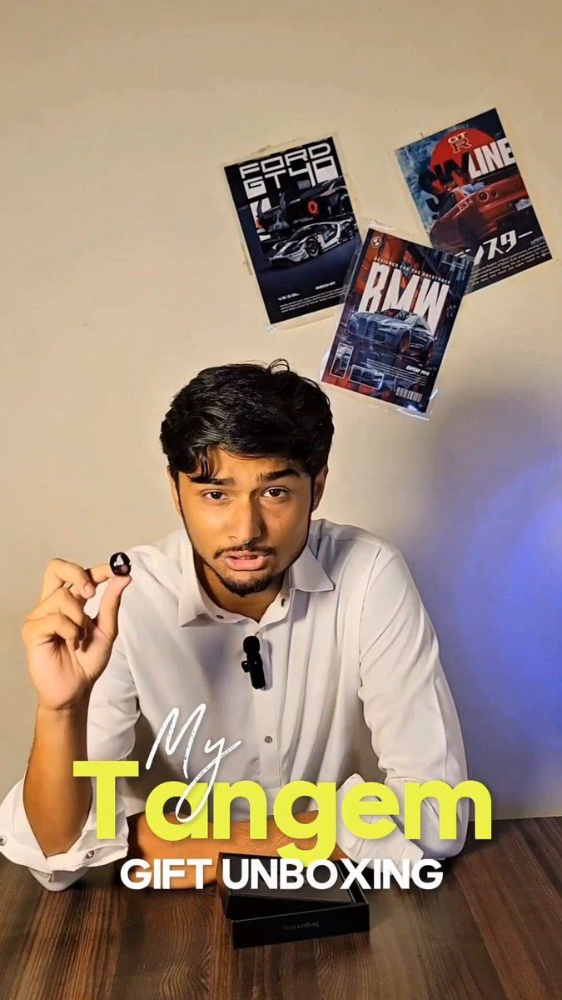

# 88 · Challenge ad ("the 30-day never-take-it-off challenge")

<!-- HERO:START -->
[](EXAMPLE.md)

**[See the example and how to make it →](EXAMPLE.md)** · [watch on X](https://x.com/0xShahzaib_/status/2104901293190119594)
<!-- HERO:END -->


> **LC priority P2** · evidence: Low-medium (case studies) · hype risk: Medium · cost $0-200 · 1 h

## What it is
An ad that invites the viewer into a time-boxed challenge ("30 days, never take it off"), with a start date, rules and a reward (feature, gift card, entry). Participants post check-ins, which become new creative.

## Why it works
- Participation beats persuasion; the viewer becomes the demo.
- A dated challenge creates urgency without discounts.
- It generates UGC and streak content (F68).

## Shot-by-shot (LC version)

| Time / slot | Visual | Audio / copy |
|---|---|---|
| 0-5s | Creator: "I'm not taking this off for 30 days." | — |
| 5-20s | Rules on screen: shower, swim, gym, sleep | "Join: post day 1 with #LCchallenge" |
| 20-30s | Prize / feature | "Best day-30 photo gets featured" |

## Hooks (swap-in openers)
- "30 days. Never take it off. Join me."
- "The LC shower challenge starts Monday"

## Real examples from X (studied)
- GetHookd "3 Successful Yoga Studio Ads Examples": YOGABODY 21-Day Happy Back Challenge ([article](https://www.gethookd.ai/learn/3-successful-yoga-studio-ads-examples-to-inspire-you-in-2026/)).
- GetHookd "3 Top Instagram Makeup Ads Examples": Rhode viral challenge + seeding ([article](https://www.gethookd.ai/learn/3-top-instagram-makeup-ads-examples-that-work-in-2026/)).

## Production recipe
1. Write rules and prize terms (sweepstakes law if prizes).
2. Seed with 10-20 creators (F43).
3. Run the ad to customers and lookalikes; repost check-ins.

## Bot prompt (copy into the creative agent)
```
Design a 30-day LC challenge: name, rules, check-in prompts for days 1/7/14/30, prize mechanics (compliant), ad script (30s) and 3 recap post templates.
```

## 3 LC scripts
- A · 30-day shower challenge.
- B · Summer swim challenge.
- C · Bridal-party challenge.

## Variants to test
- Prize vs feature-only
- Customer vs creator seeding

## Omni test plan
- **Budget/structure:** $30/day for 14 days around launch
- **Primary KPIs:** Entries, UGC count, CPA; Omni (F88-*)
- **Kill rule:** <50 entries
- **Scale rule:** Repeat seasonally
- **Naming:** `utm_content=F88-<concept>-<variant>`; weekly Omni roll-up of new-customer revenue by format.

## Compliance
Baseline: [_COMPLIANCE.md](../_COMPLIANCE.md) (no fake testimonials, AI disclosure, no bulk/spoofed accounts, copy structure not assets, PDP-only claims).
- Official rules for prizes (no purchase necessary where required); disclose creator partnerships.

## Related
- Strategies: 16-rewards-streaks-earned-discounts, 28-ugc-creator-network-per-video-pay
- Formats: [68-streak-calendar-static](../68-streak-calendar-static/README.md), [43-hudson-method-creator-swarm](../43-hudson-method-creator-swarm/README.md)

<!-- EVIDENCE:START -->
## Evidence from X discovery (auto-generated)

| Date | Author | Post | Engagement | Grade | Gist |
|---|---|---|---|---|---|
<!-- EVIDENCE:END -->
