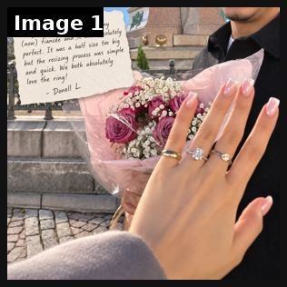
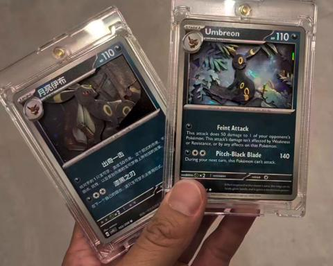
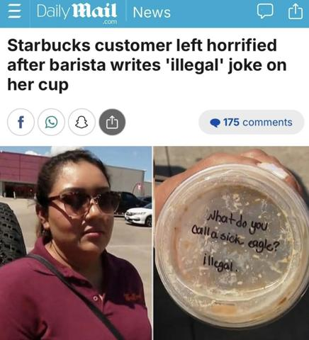
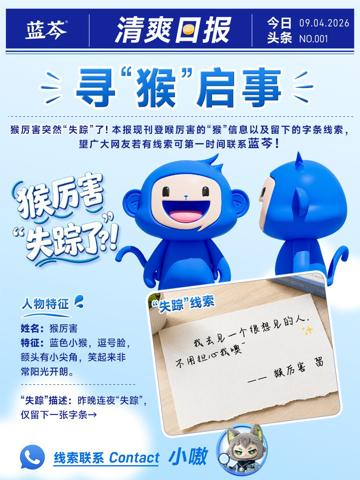

# 89 · Customer thank-you / shout-out turned into an ad: see it, then make it

[](https://x.com/LorelDiamonds/status/2099906094990508266)

**The example:** [@LorelDiamonds on X](https://x.com/LorelDiamonds/status/2099906094990508266) · 1 image · 0 likes, 2 views

**Watch it:** [open the post on X](https://x.com/LorelDiamonds/status/2099906094990508266)

> The loveliest part of creating jewellery is hearing what it means to the person wearing it. 🤍 Thank you to our customer for sharing their experience. #LorelDiamonds #CustomerReview #FineJewellery

## What you are seeing

A fine-jewellery brand's thank-you post: a customer's hand wearing her ring next to flowers and the note she sent about what the piece means to her. The caption: "The loveliest part of creating jewellery is hearing what it means to the person wearing it. Thank you to our customer for sharing their experience."

## Image by image

| Image | Text on it (OCR, rough) |
|---|---|
| 1 | ht a 3, carat ring for it was see! Dg ta eS fi and Tt was a hal if size too big was. simple but the ee ee both absolutely and love the a git, bale sae anti I, 72 |

## More real examples (3)

Other posts that show this format, or a close cousin of it. Click a thumbnail to open it on X.

| | | |
|---|---|---|
| [](https://x.com/E_S_Collectible/status/2082178074108637387)<br>**@E_S_Collectible** · 0:07 video · 3K views<br>Huge shoutout to our customer @GamecockCards for creating these two incredible custom 3D cards! The detail and depth look amazing in person. Please ch | [](https://x.com/Nate_Google_/status/2090789562121359452)<br>**@Nate_Google_** · image · 23K views<br>this is a PRIME EXAMPLE of why native style creative wins 600k views on this article post in 5 hours nobody scrolls past a handwritten note on a cup. | [](https://x.com/envyofyibo/status/2095707442294448570)<br>**@envyofyibo** · image · 2K views<br>Lanqin Lozenges Weibo "Lanqin Lozenges's Monkey Lily suddenly disappeared last night!! We found a handwritten note on his workstation. 🔍 It said he wa |

## How to make one like it

**The format in one line:** The brand publicly thanks one real customer (a note, video or photo) for their story or photo: "Thank you, Maria, for wearing your stack through a whole summer of sea swims." Gratitude makes the proof feel human and specific.

**Why it works:** - Gratitude is disarming; the ad doesn't ask for anything. - One named story is more believable than an average. - Customers love being featured, which encourages more submissions.

**Contents:** [1. Structure](#1-copy-the-structure) · [2. Shot by shot](#2-shot-by-shot-remake) · [3. Script and hooks](#3-write-the-script) · [4. Prompts](#4-prompts) · [5. Tools and settings](#5-tools-and-settings) · [6. Louise Carter remake](#6-louise-carter-remake) · [7. Variants and test](#7-variants-and-test-plan) · [8. Pitfalls](#8-pitfalls)

### 1. Copy the structure

The skeleton every version follows: **hook → problem or tension → turn (the product shows up) → proof → one clear ask.** The shot-by-shot below fills it in.

### 2. Shot-by-shot remake

**Target length / size:** Static 1080x1350 or a 15-25s video

| # | Time / slot | What we see (visual + camera) | Dialogue / on-screen text |
|---|---|---|---|
| 1 | 0-3s / image | The customer's own photo or clip (wearing the piece), with permission | Text: "Thank you, Maria." |
| 2 | 3-12s | Her words, quoted verbatim on screen or read by the founder | "I wore it every day of my mum's last summer. It's the one thing I never take off now." |
| 3 | 12-18s | Founder to camera, a short genuine reply | "This is why we make it waterproof." |
| 4 | End | Product in the photo + soft CTA | "The Mae Necklace. Any 7 for $85." |

<details><summary>Playbook shot list (Louise Carter version from the README)</summary>

| Time / slot | Visual | Audio / copy |
|---|---|---|
| Static | Handwritten thank-you card next to the customer's photo (with consent) | "Thank you, Maria" |
| Video 20s | Founder reads the customer's message, then thanks her | — |

</details>

### 3. Write the script

Open with one of these hooks (first 1–3 seconds, or the headline on a static):

- "Thank you, Maria."
- "A note to the customer who wore it up Kilimanjaro"

Then fill the beats from the table above. Pull the wording from real customer reviews, not from ad copy: a review line beats a copywriter line almost every time. Read every line out loud and cut anything you would not say to a friend. Ready-made Louise Carter scripts are in section 6; hand [BOT.md](BOT.md) to any AI agent to write versions for another brand.

### 4. Prompts

**Consent ask**

```text
DM: "Your message made our week. Would you be OK with us sharing your photo and words in a thank-you post and ads? We'll credit you however you like."
```

**Copy (Claude)**

```text
Write a 40-word thank-you caption that quotes the customer verbatim and adds one sentence from the founder; no sales language until the last line.
```

**Full creative-agent prompt (from the playbook):**

```
Write 3 customer thank-you ads for LC (card text ≤50 words + 20s founder VO) from {{STORIES}} with consent.
```

### 5. Tools and settings

1. Pick 3 customer stories with written consent.
2. The founder writes and reads the thank-you.
3. Run to warm audiences first.

| Setting | Value |
|---|---|
| Canvas | 1080×1920 (9:16) master; crop a 1080×1350 (4:5) cut for feed placements |
| Frame rate | 30 fps (shoot 60 fps for slow-motion water or sparkle shots) |
| Camera | Phone main lens at 1x, exposure locked on skin, HDR off, grid on; tripod or a phone clamp for product shots |
| Light | One soft key at 45° (window or ring light), white card as fill; side light for metal sparkle |
| Audio | Lavalier or phone 15–20 cm from the mouth; mix voice at -14 LUFS, music at -28 to -30 dB under voice |
| Captions | Burned in, 2–5 words per line, 64–80 px bold sans, white with a black stroke or pill; keep text inside the safe zone (top 220 px and bottom 420 px clear, 64 px side margins) |
| Pacing | A visual change every 1.5–3 s; the hook lands in the first 1.5 s with no logo intro |
| Edit / export | CapCut or Premiere; H.264, 12–20 Mbps, AAC 320 kbps; upload natively to each platform, not via links |

### 6. Louise Carter remake

- A · Ocean swimmer.
- B · Bride.
- C · Nurse.

Brand rules, claims you can and cannot make, and more scripts: [brands/louise-carter.md](brands/louise-carter.md). Step-by-step from idea to scale: [STAGES.md](STAGES.md).

### 7. Variants and test plan

- Card vs video

**Test plan:** - **Budget/structure:** 3 ads, $15/day, 7 days - **Primary KPIs:** CPA, comments; Omni (F89-*) - **Kill rule:** CPA >2× - **Scale rule:** Monthly series - **Naming:** `utm_content=F89-<concept>-<variant>`; weekly Omni roll-up of new-customer revenue by format.

**Naming:** `F89-<variant>-<hook##>-<date>` so results map back to this folder. Change one thing per test (hook, narrator, length or offer), never two.

### 8. Pitfalls

- Explicit consent from the customer is required for ads.
- Never polish or rewrite her words.
- Don't use grief or sensitive stories without the customer's clear OK.
- Slow open: if the first 1.5 s does not show the hook visually, most people swipe.
- Logo or brand intro at the start reads as an ad; put the brand at the end.
- Captions covered by the platform UI: check the safe zone on a real phone before posting.
- Music over the voice: keep music at least 14 dB under speech.

**Compliance:** Baseline: [_COMPLIANCE.md](../_COMPLIANCE.md) (no fake testimonials, AI disclosure, no bulk/spoofed accounts, copy structure not assets, PDP-only claims). - Consent; no health claims attributed to the product.

## More examples

Every post we found for this format, with transcripts: [examples/](examples/README.md). Playbook: [README.md](README.md). Agent brief: [BOT.md](BOT.md).
