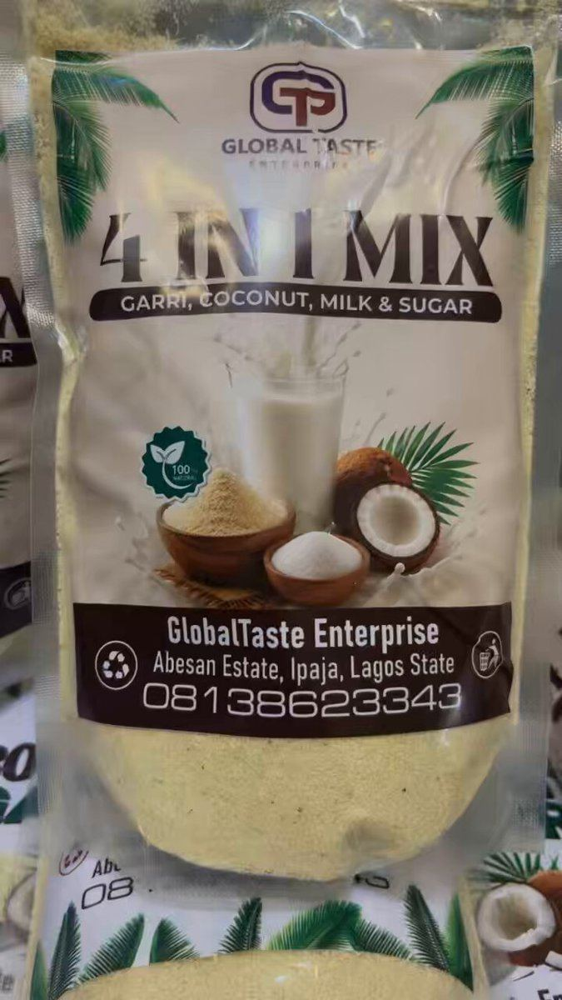

# 89 · Customer thank-you / shout-out turned into an ad

<!-- HERO:START -->
[](EXAMPLE.md)

**[See the example and how to make it →](EXAMPLE.md)** · [watch on X](https://x.com/Zobo_Konect/status/2100470193377923466)
<!-- HERO:END -->


> **LC priority P2** · evidence: Low-medium · hype risk: Low · cost $0 · 20 min

## What it is
The brand publicly thanks one real customer (a note, video or photo) for their story or photo: "Thank you, Maria, for wearing your stack through a whole summer of sea swims." Gratitude makes the proof feel human and specific.

## Why it works
- Gratitude is disarming; the ad doesn't ask for anything.
- One named story is more believable than an average.
- Customers love being featured, which encourages more submissions.

## Shot-by-shot (LC version)

| Time / slot | Visual | Audio / copy |
|---|---|---|
| Static | Handwritten thank-you card next to the customer's photo (with consent) | "Thank you, Maria" |
| Video 20s | Founder reads the customer's message, then thanks her | — |

## Hooks (swap-in openers)
- "Thank you, Maria."
- "A note to the customer who wore it up Kilimanjaro"

## Real examples from X (studied)
- GetHookd "4 Best Facebook Car Detailing Ads Examples": Attention 2 Detail, a customer thank-you turned into an ad ([article](https://www.gethookd.ai/learn/4-best-facebook-car-detailing-ads-examples-that-work-in-2026/)).

## Production recipe
1. Pick 3 customer stories with written consent.
2. The founder writes and reads the thank-you.
3. Run to warm audiences first.

## Bot prompt (copy into the creative agent)
```
Write 3 customer thank-you ads for LC (card text ≤50 words + 20s founder VO) from {{STORIES}} with consent.
```

## 3 LC scripts
- A · Ocean swimmer.
- B · Bride.
- C · Nurse.

## Variants to test
- Card vs video

## Omni test plan
- **Budget/structure:** 3 ads, $15/day, 7 days
- **Primary KPIs:** CPA, comments; Omni (F89-*)
- **Kill rule:** CPA >2×
- **Scale rule:** Monthly series
- **Naming:** `utm_content=F89-<concept>-<variant>`; weekly Omni roll-up of new-customer revenue by format.

## Compliance
Baseline: [_COMPLIANCE.md](../_COMPLIANCE.md) (no fake testimonials, AI disclosure, no bulk/spoofed accounts, copy structure not assets, PDP-only claims).
- Consent; no health claims attributed to the product.

## Related
- Strategies: 11-social-proof-credibility-engine, 17-review-prompt-timing
- Formats: [74-verbatim-review-static](../74-verbatim-review-static/README.md), [26-founder-surprise-customer-call](../26-founder-surprise-customer-call/README.md)

<!-- EVIDENCE:START -->
## Evidence from X discovery (auto-generated)

| Date | Author | Post | Engagement | Grade | Gist |
|---|---|---|---|---|---|
<!-- EVIDENCE:END -->
