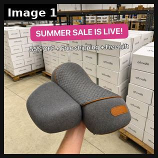
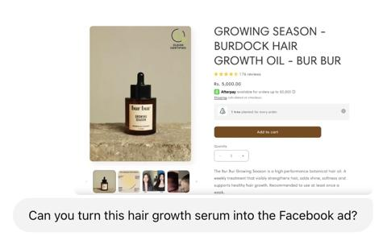
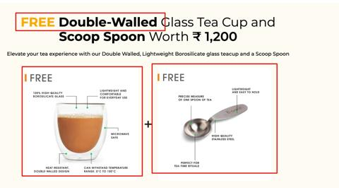

# 90 · 'Fake PDP': a product-page screenshot as the ad (+ app-settings / Trustpilot / comment screenshots): see it, then make it

[](https://x.com/FedotOff90/status/2106046297434374289)

**The example:** [@FedotOff90 on X](https://x.com/FedotOff90/status/2106046297434374289) · 1 image · 151 likes, 11K views

**Watch it:** [open the post on X](https://x.com/FedotOff90/status/2106046297434374289)

> **How close is this example?** Weak: a breakdown post; no clean fake-PDP ad found. The gallery below has more examples.

> The statics printing hardest right now don't look like ads at all: 1. iPhone Notes 2. iMessage chat 3. Reddit post 4. Tweet screenshot 5. Email screenshot 6. App settings screen 7. Breaking news 8. Fake product page People scroll past ads. They stop for screenshots. 200 of them on one board: https://app.gethookd.ai/share/board/316157?signature=6463fea37ec0ee501a9ba4ce646de753aedd78e3d96b396378d984e83644b146 And the s…

## What you are seeing

A native-looking warehouse photo: a hand holding the product (a grey neck pillow) in front of stacked shipping boxes with a pink "SUMMER SALE IS LIVE! 55% OFF + Free shipping + Free gift" banner. It looks like a store update, not a designed ad.

## Image by image

| Image | Text on it (OCR, rough) |
|---|---|
| 1 | (mostly visual) |

## More real examples (2)

Other posts that show this format, or a close cousin of it. Click a thumbnail to open it on X.

| | | |
|---|---|---|
| [](https://x.com/callmenirmal/status/1905160356810625284)<br>**@callmenirmal** · images · 650 views<br>4. Turn into ADS/Creatives. This part blew my mind 🤯 I literally just took a screenshot of the product page (PDP) and told GPT-4o: “Make an ad out of | [](https://x.com/reemaabajaj/status/1869425787805262293)<br>**@reemaabajaj** · images · 2K views<br>I love this ad by @TeaboxTea Typical Ugly Ad 2.0 Here's why👇 💚 Headline hook with a freebie offer They don’t just mention a freebie; they boost its pe |   |

## How to make one like it

**The format in one line:** A static that looks like a phone screenshot of a product page (price, stars, "add to cart", bullets) or other UI (iOS Settings toggles "Take off before shower: OFF", a Trustpilot card, a TikTok comment, a Google search). It extends F32 with the UI types Fedotoff found running.

**Why it works:** - Familiar UI looks like content, not an ad, so people stop for screenshots. - The PDP mock pre-sells the offer before the click. - The settings-toggle joke communicates benefits instantly.

**Contents:** [1. Structure](#1-copy-the-structure) · [2. Shot by shot](#2-shot-by-shot-remake) · [3. Script and hooks](#3-write-the-script) · [4. Prompts](#4-prompts) · [5. Tools and settings](#5-tools-and-settings) · [6. Louise Carter remake](#6-louise-carter-remake) · [7. Variants and test](#7-variants-and-test-plan) · [8. Pitfalls](#8-pitfalls)

### 1. Copy the structure

The skeleton every version follows: **hook → problem or tension → turn (the product shows up) → proof → one clear ask.** The shot-by-shot below fills it in.

### 2. Shot-by-shot remake

**Target length / size:** 1 static 1080x1350 (phone-screenshot look)

| # | Time / slot | What we see (visual + camera) | Dialogue / on-screen text |
|---|---|---|---|
| 1 | Main image | A phone screenshot of the real product page: product photo, title, price, star rating with review count, 3 bullets, a gold "Add to bag" button | - |
| 2 | Overlay | One handwritten-style circle or arrow around the reviews count | "4,812 reviews" |
| 3 | Variant A | iOS Settings-style toggles | "Take off before shower: OFF · Turns green: OFF · Compliments: ON" |
| 4 | Variant B | Trustpilot-style review card screenshot | One real 5-star review |
| 5 | Primary text | - | "Screenshot this for later." |

<details><summary>Playbook shot list (Louise Carter version from the README)</summary>

| Time / slot | Visual | Audio / copy |
|---|---|---|
| Static A | PDP screenshot: Chelsea Herringbone, real ★ rating, "Any 7 for $85", "Waterproof ✓" | — |
| Static B | iOS Settings: "Take jewelry off to shower: OFF", "Green neck: OFF", "Compliments: ON" | — |
| Static C | TikTok comment: "where is your necklace from??" + reply | — |

</details>

### 3. Write the script

Open with one of these hooks (first 1–3 seconds, or the headline on a static):

- Settings: "Take jewelry off before shower: OFF"
- "where is your necklace from??" (comment screenshot)

Then fill the beats from the table above. Pull the wording from real customer reviews, not from ad copy: a review line beats a copywriter line almost every time. Read every line out loud and cut anything you would not say to a friend. Ready-made Louise Carter scripts are in section 6; hand [BOT.md](BOT.md) to any AI agent to write versions for another brand.

### 4. Prompts

**Figma**

```text
Recreate the PDP at 1170x2532 (iPhone), then crop to 1080x1350 keeping price + stars + button; use the real numbers.
```

**Settings variant**

```text
iOS Settings UI kit (Figma community), 4 toggles, SF Pro, a product photo as the profile image.
```

**Full creative-agent prompt (from the playbook):**

```
Create copy for 6 UI-screenshot statics for LC: PDP mock, Settings toggles, TikTok comment + reply, Trustpilot card (real review), Google search "waterproof gold necklace that doesn't turn green", an email from the founder. Real data only.
```

### 5. Tools and settings

1. Use only real ratings and real comments (with consent).
2. Design 3 UI types; keep native fonts and spacing.
3. Avoid mimicking a platform so closely that it implies an endorsement.

| Setting | Value |
|---|---|
| Canvas | 1080×1350 (4:5) for feed; 1080×1920 (9:16) story/reel version with the same elements stacked |
| Type | Headline 80–110 px, max 8 words; body 36–44 px; at most 2 typefaces |
| Layout | Headline readable at thumbnail size; product at least 40% of the canvas; logo small, bottom corner |
| Safe zone | Keep text out of the bottom 20% on 9:16 (UI overlays) |
| Tools | Figma or Canva for layout; Photoshop or Photoroom to cut out product; Midjourney or Flux only for backgrounds, never for the product itself |
| Export | PNG or JPG at quality 90, sRGB, under 1 MB |

### 6. Louise Carter remake

- A · Settings toggles.
- B · PDP mock "any 7 for $85".
- C · Comment screenshot.

Brand rules, claims you can and cannot make, and more scripts: [brands/louise-carter.md](brands/louise-carter.md). Step-by-step from idea to scale: [STAGES.md](STAGES.md).

### 7. Variants and test plan

- UI type

**Test plan:** - **Budget/structure:** 6 statics, $15/day, 7 days - **Primary KPIs:** CTR, CPA; Omni (F90-*) - **Kill rule:** CPA >1.8× - **Scale rule:** Fold winners into the F32 rotation - **Naming:** `utm_content=F90-<concept>-<variant>`; weekly Omni roll-up of new-customer revenue by format.

**Naming:** `F90-<variant>-<hook##>-<date>` so results map back to this folder. Change one thing per test (hook, narrator, length or offer), never two.

### 8. Pitfalls

- Price, rating and review count must be real and current.
- Don't imitate Amazon, Apple or Trustpilot logos; use their look, not their trademarks.
- Update the ad when the price changes.
- Too much text: if it cannot be read in 1 second at thumbnail size, cut it.
- AI-generated product images: show the real product; AI is fine for backgrounds only.

**Compliance:** Baseline: [_COMPLIANCE.md](../_COMPLIANCE.md) (no fake testimonials, AI disclosure, no bulk/spoofed accounts, copy structure not assets, PDP-only claims). - Real ratings/reviews only; don't use third-party trademarks in a way that implies endorsement; no fake UI that misleads about function.

## More examples

Every post we found for this format, with transcripts: [examples/](examples/README.md). Playbook: [README.md](README.md). Agent brief: [BOT.md](BOT.md).
