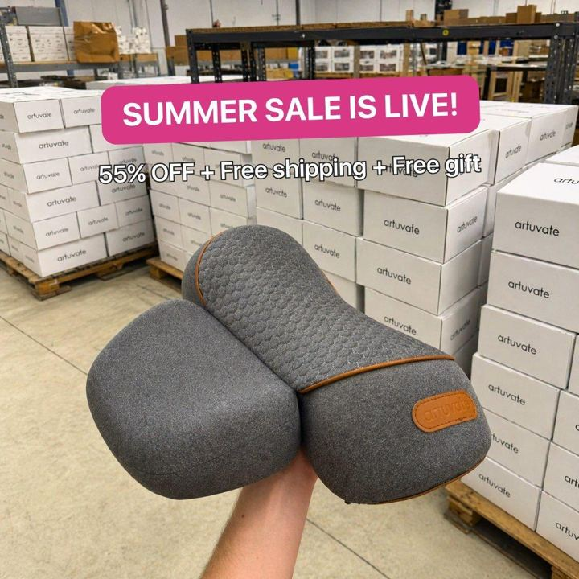

# 90 · "Fake PDP": a product-page screenshot as the ad (+ app-settings / Trustpilot / comment screenshots)

<!-- HERO:START -->
[](EXAMPLE.md)

**[See the example and how to make it →](EXAMPLE.md)** · [watch on X](https://x.com/FedotOff90/status/2106046297434374289)
<!-- HERO:END -->


> **LC priority P1** · evidence: Medium (live ads + board) · hype risk: Low · cost $0 · 20 min

## What it is
A static that looks like a phone screenshot of a product page (price, stars, "add to cart", bullets) or other UI (iOS Settings toggles "Take off before shower: OFF", a Trustpilot card, a TikTok comment, a Google search). It extends F32 with the UI types Fedotoff found running.

## Why it works
- Familiar UI looks like content, not an ad, so people stop for screenshots.
- The PDP mock pre-sells the offer before the click.
- The settings-toggle joke communicates benefits instantly.

## Shot-by-shot (LC version)

| Time / slot | Visual | Audio / copy |
|---|---|---|
| Static A | PDP screenshot: Chelsea Herringbone, real ★ rating, "Any 7 for $85", "Waterproof ✓" | — |
| Static B | iOS Settings: "Take jewelry off to shower: OFF", "Green neck: OFF", "Compliments: ON" | — |
| Static C | TikTok comment: "where is your necklace from??" + reply | — |

## Hooks (swap-in openers)
- Settings: "Take jewelry off before shower: OFF"
- "where is your necklace from??" (comment screenshot)

## Real examples from X (studied)
- @FedotOff90 "37 Ad Formats That Print" verified swipe: Feel Reformed, 99 (52 at the Aug pull) days live ("The Fake PDP"; brand runs 990 ads). [ad](https://app.gethookd.ai/share/ad/117707731?signature=7f83d9d590b875ca7a43a16967df6f0aedb6ec4dbfe64986ab0ec93a11535791) · [doc](https://rural-lifeboat-196.notion.site/3c8db9d7074d81548084c2b25d1be1ef) · [post](https://x.com/FedotOff90/status/2104949773539442831)
- @FedotOff90 "37 Ad Formats That Print" verified swipe: The Purest Co, 28 days live (App Settings UI). [ad](https://app.gethookd.ai/share/ad/128831875?signature=c886371e8563484cde1e694ea6b4c3a52df09b7c6c0b884da0593e273ba37008) · [doc](https://rural-lifeboat-196.notion.site/3c8db9d7074d81548084c2b25d1be1ef) · [post](https://x.com/FedotOff90/status/2104949773539442831)
- @FedotOff90: statics that don't look like ads: iPhone Notes, iMessage, Reddit, Tweet, Email, App settings, Breaking news, Fake product page; 200 on one board ([post](https://x.com/FedotOff90/status/2106046297434374289)).

## Production recipe
1. Use only real ratings and real comments (with consent).
2. Design 3 UI types; keep native fonts and spacing.
3. Avoid mimicking a platform so closely that it implies an endorsement.

## Bot prompt (copy into the creative agent)
```
Create copy for 6 UI-screenshot statics for LC: PDP mock, Settings toggles, TikTok comment + reply, Trustpilot card (real review), Google search "waterproof gold necklace that doesn't turn green", an email from the founder. Real data only.
```

## 3 LC scripts
- A · Settings toggles.
- B · PDP mock "any 7 for $85".
- C · Comment screenshot.

## Variants to test
- UI type

## Omni test plan
- **Budget/structure:** 6 statics, $15/day, 7 days
- **Primary KPIs:** CTR, CPA; Omni (F90-*)
- **Kill rule:** CPA >1.8×
- **Scale rule:** Fold winners into the F32 rotation
- **Naming:** `utm_content=F90-<concept>-<variant>`; weekly Omni roll-up of new-customer revenue by format.

## Compliance
Baseline: [_COMPLIANCE.md](../_COMPLIANCE.md) (no fake testimonials, AI disclosure, no bulk/spoofed accounts, copy structure not assets, PDP-only claims).
- Real ratings/reviews only; don't use third-party trademarks in a way that implies endorsement; no fake UI that misleads about function.

## Related
- Strategies: 41-von-restorff-static-copy-prompt, 03-creative-volume-flooding
- Formats: [32-screenshot-native-static-pack](../32-screenshot-native-static-pack/README.md), [37-urgency-offer-statics](../37-urgency-offer-statics/README.md)

<!-- EVIDENCE:START -->
## Evidence from X discovery (auto-generated)

| Date | Author | Post | Engagement | Grade | Gist |
|---|---|---|---|---|---|
| 2026-10-02 | [@FedotOff90](https://x.com/FedotOff90) | [link](https://x.com/FedotOff90/status/2106046297434374289) | 151L/268BM/11kV | VALUE | Statics that do not look like ads: Notes, iMessage, Reddit, tweet, email, app settings, breaking news, fake product page; 200 on one board + Native Statics Machine doc. |
| 2026-09-29 | [@FedotOff90](https://x.com/FedotOff90) | [link](https://x.com/FedotOff90/status/2104949773539442831) | 110L/208BM/9kV | VALUE | "37 ad formats printing right now" — verified Notion swipe (live ad, days active, brand ad count per format) + 132-ad FORMATS board. |
<!-- EVIDENCE:END -->
