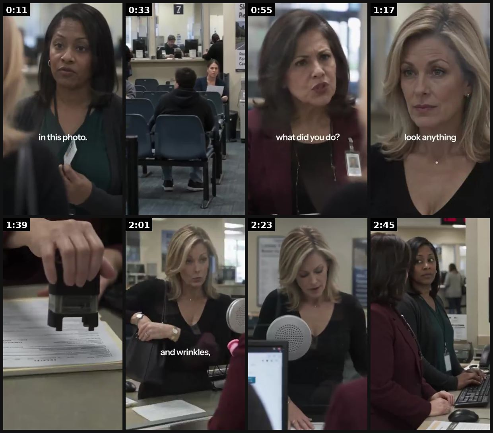
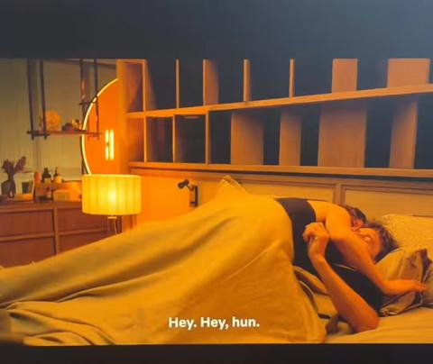
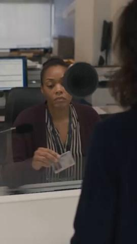

# 91 · AI melodrama mini-movie (2-10 min soap opera, humiliation → mentor → vindication, product after the midpoint): see it, then make it

[](https://x.com/TheIvanKreimer/status/2107808445508321597)

**The example:** [@TheIvanKreimer on X](https://x.com/TheIvanKreimer/status/2107808445508321597) · 2:56 video · 1 likes, 62 views

**Watch it:** [open the post on X](https://x.com/TheIvanKreimer/status/2107808445508321597) · [play the video file](https://video.twimg.com/amplify_video/2107808237755990016/vid/avc1/320x568/OWv3_kpb4rmEDQcn.mp4?tag=29)

> AI melodramatic ads are the new mini VSL. They're getting millions of views and dozens of brands are using them. Why? Because they entertain and they don't look like ads. Take a look at this ad by Smooche. A woman goes to a government office and gets told she's not the woman of the photo ID because she doesn't look the age on it. The woman gets upset, asks for the manager, and the manager acknowledges the woman is te…

## What you are seeing

An AI live-action melodrama (Smooche): a woman at an ID-photo desk being told she looks old ("in this photo", "what did you do?"), office scenes with colleagues, and the product only appearing around 1:54.

## Beat by beat

The storyboard above samples the video every 0:22. Lines are the transcript for that stretch; on-screen text comes from OCR, so treat it as rough.

| Frame | Time | On screen | Said / sung |
|---|---|---|---|
| 1 | 0:00–0:22 | · | Ma'am I cannot accept this the woman in this photo is 61. I am 61. You are not 61 Look at the mouth in this photo. Those lines are not on your face Because I fixed them You can't just fix that |
| 2 | 0:22–0:44 | · | I've been in this room waiting for two hours. I need to get this done. I can't verify this document verify what my own face Ma'am lower your voice. There's nothing I can do Let me speak to your manager right? Now ma'am calm down your manager now The ID doesn't match |
| 3 | 0:44–1:06 | a what did you do? | It is her it is not Monique. It is her look at the photograph. That isn't her. I see the photo ma'am. What did you do? I? Need my paper stamp so I can go home. Did you get Botox surgery? No Fillers threads one of those laser treatments. No |
| 4 | 1:06–1:28 | · | Then it must be a cream. Is it a cream if I tell you will you stamp it so I can leave? My sister spends $400 a jar on her serum and she doesn't look anything like you. What is it? What is it? Listen, I've tried it all nothing did anything for over ten years. Then what did? |
| 5 | 1:28–1:50 | · | stamp it Ma'am tell me you want to know and I want to go home stamp my paper there There now what is it? |
| 6 | 1:50–2:12 | tp a and wrinkles, wa aw a | Fine the deal is a deal This is it This says it's for dark spots. It is and wrinkles fine lines and plumping all in one formula. This this is incredible It took me ten years to find something that works. There's a reason they only sell it online and why they're often sold out |
| 7 | 2:12–2:34 | · | Can I have this one? You know what take it? I have a fresh one at home. What about me? Go online and get one if it doesn't work. They have a 30-day money-back guarantee, so there's no risk |
| 8 | 2:34–2:56 | · | That's how confident they are you ladies enjoy now. Thank you Smooch reverse time serum you may want to update your ID photo once you start using it click shop now below |

<details><summary>Full transcript (timestamped)</summary>

- `0:00` Ma'am I cannot accept this the woman in this photo is 61. I am 61. You are not 61
- `0:08` Look at the mouth in this photo. Those lines are not on your face
- `0:17` Because I fixed them
- `0:18` You can't just fix that
- `0:21` I've been in this room waiting for two hours. I need to get this done. I can't verify this document verify what my own face
- `0:30` Ma'am lower your voice. There's nothing I can do
- `0:35` Let me speak to your manager right? Now ma'am calm down your manager now
- `0:43` The ID doesn't match
- `0:45` It is her it is not Monique. It is her look at the photograph. That isn't her. I see the photo ma'am. What did you do? I?
- `0:57` Need my paper stamp so I can go home. Did you get Botox surgery? No
- `1:02` Fillers threads one of those laser treatments. No
- `1:06` Then it must be a cream. Is it a cream if I tell you will you stamp it so I can leave?
- `1:13` My sister spends $400 a jar on her serum and she doesn't look anything like you. What is it? What is it?
- `1:22` Listen, I've tried it all nothing did anything for over ten years. Then what did?
- `1:27` stamp it
- `1:31` Ma'am tell me you want to know and I want to go home stamp my paper there
- `1:47` There now what is it?
- `1:50` Fine the deal is a deal
- `1:52` This is it
- `1:53` This says it's for dark spots. It is and wrinkles fine lines and plumping all in one formula. This this is incredible
- `2:06` It took me ten years to find something that works. There's a reason they only sell it online and why they're often sold out
- `2:12` Can I have this one? You know what take it? I have a fresh one at home. What about me?
- `2:21` Go online and get one if it doesn't work. They have a 30-day money-back guarantee, so there's no risk
- `2:28` That's how confident they are you ladies enjoy now. Thank you
- `2:49` Smooch reverse time serum you may want to update your ID photo once you start using it click shop now below

</details>

## More real examples (6)

Other posts that show this format, or a close cousin of it. Click a thumbnail to open it on X.

| | | |
|---|---|---|
| [](https://x.com/ViralOps_/status/2108255353016406383)<br>**@ViralOps_** · 1:00 video · 589 views<br>Koriderm is absolutely CRUSHING with these DRAMA ads rn. they're literally making mini movies just to sell skincare products 😭 and i think this could | [](https://x.com/zedmadeit/status/2102176819709673703)<br>**@zedmadeit** · 1:36 video · 3K views<br>heres how to make ai drama ads for your brand ai dramas are the new trend and theyre great for engagement but you want the right kind the kind that ac | [](https://x.com/0xROAS/status/2104589798208065796)<br>**@0xROAS** · 2:23 video · 23K views<br>100% AI drama ad (Seedance): turn the winning ad into a 2-3 min story; Resilia hooks: cheating husband/wife, compared to another girl. |
| [](https://x.com/SGradon/status/2101705439565979947)<br>**@SGradon** · 0:40 video · 2K views<br>In 2026 creative strategists should steal from screenwriters AI drama ads are becoming a trend, and everyone's about to copy the same 5 stories. Here' | [](https://x.com/tryatria_AI/status/2100612079891755286)<br>**@tryatria_AI** · 2:59 video · 11K views<br>AI ANIMATED STORYTELLING ADS SHOULDN’T WORK THIS WELL. BUT THEY DO. 👀 Cartoon characters. Dramatic storylines. Pixar-style animation. Ridiculous plot | [](https://x.com/whotanish/status/2100587035786715295)<br>**@whotanish** · 4:33 video · 2K views<br>All the big brands have already catching up too the AI drama ads . users have organically have been watching the micro dramas for really long It has b |

## How to make one like it

**The format in one line:** A single, self-contained short film (not a series) told like a daytime soap: the hero is publicly humiliated (ex shows up with a younger partner, an ID clerk says "that's not you", husband mistaken for the caterer), tries everything, then a close, credible mentor hands over the product; the climax replays the opening scene with the roles reversed. The pitch is the last ~30-60 s. Resilia and Smooch

**Why it works:** - It does not look like an ad, so cold audiences watch; the people still watching at minute 2 are pre-qualified buyers. - The pain is social (being seen, being compared), not product-level, which is far stronger than a benefit claim. - The mentor (sister, best friend who is a dermatologist, Seoul colleague) delivers the mechanism as overheard dialogue, which reads as discovery rather than a pitch (@Inceptly). - Caveat: @TheIvanKreimer measured 90-95% drop-off before the product appears. You pay 

**Contents:** [1. Structure](#1-copy-the-structure) · [2. Shot by shot](#2-shot-by-shot-remake) · [3. Script and hooks](#3-write-the-script) · [4. Prompts](#4-prompts) · [5. Tools and settings](#5-tools-and-settings) · [6. Louise Carter remake](#6-louise-carter-remake) · [7. Variants and test](#7-variants-and-test-plan) · [8. Pitfalls](#8-pitfalls)

### 1. Copy the structure

Use the example's timing as your beat sheet. Keep the beat, change the words and the product.

| Beat | Time | In the example | Your version |
|---|---|---|---|
| 1 | 0:11 | Ma'am I cannot accept this the woman in this photo is 61. I am 61. You are not 61 Look at the mouth in this photo. Those lines are not on yo | … |
| 2 | 0:33 | I've been in this room waiting for two hours. I need to get this done. I can't verify this document verify what my own face Ma'am lower your | … |
| 3 | 0:55 | It is her it is not Monique. It is her look at the photograph. That isn't her. I see the photo ma'am. What did you do? I? Need my paper stam | … |
| 4 | 1:17 | Then it must be a cream. Is it a cream if I tell you will you stamp it so I can leave? My sister spends $400 a jar on her serum and she does | … |
| 5 | 1:39 | stamp it Ma'am tell me you want to know and I want to go home stamp my paper there There now what is it? | … |
| 6 | 2:01 | Fine the deal is a deal This is it This says it's for dark spots. It is and wrinkles fine lines and plumping all in one formula. This this i | … |
| 7 | 2:23 | Can I have this one? You know what take it? I have a fresh one at home. What about me? Go online and get one if it doesn't work. They have a | … |
| 8 | 2:45 | That's how confident they are you ladies enjoy now. Thank you Smooch reverse time serum you may want to update your ID photo once you start | … |

### 2. Shot-by-shot remake

**Target length / size:** 3-8 min film (9:16), plus a 60s cut-down

| # | Time / slot | What we see (visual + camera) | Dialogue / on-screen text |
|---|---|---|---|
| 1 | 0:00-0:20 Humiliation | Office ID-photo counter; clerk looks at her photo then at her | Clerk: "Ma'am, that's not you in this photo." She touches her bare neck. |
| 2 | 0:20-1:30 Wound | Close-ups at home; old jewellery in a box, green-tinged | Her sister on the phone: "Just buy something new." "I did. Three times." |
| 3 | 1:30-2:30 Mentor | A friend at a café, unbothered, sea-swim hair | Friend: "I haven't taken mine off in a year." Slides a small box across the table. |
| 4 | 2:30-4:00 Climb | Montage: shower, beach, a work presentation; the necklace catches light | Little or no dialogue; music builds |
| 5 | 4:00-5:00 Vindication | Back at the same counter | Clerk: "...You look different." She smiles. |
| 6 | Last 30s | Brand card, offer, AI-generated label | "Any 7 for $85. This film uses AI-generated actors." |

<details><summary>Playbook shot list (Louise Carter version from the README)</summary>

| Time / slot | Visual | Audio / copy |
|---|---|---|
| 0:00-0:08 | Cold open on the humiliation: ex-husband at the daughter's graduation with his new partner; she touches her bare neck | VO: "I had to sit next to my ex-husband and the woman he left me for…" |
| 0:08-0:40 | Rewind: years of putting herself last, stopped buying anything for herself, jewelry box of green-stained pieces | "Everything I wore turned my skin green, so I stopped wearing anything." |
| 0:40-1:10 | Mentor scene: best friend (real jeweller or long-time customer) hands her a small box | "Sit down. Don't argue. Wear this to the graduation and don't take it off." |
| 1:10-1:40 | Doubt → small wins: showers in it, swims in it, coworker compliments | "Day 4: still gold. Day 9: someone asked where it's from." |
| 1:40-2:10 | Vindication: same graduation photo line, the new partner asks where the necklace is from | "'Where is that from?' she asked. I just smiled." |
| 2:10-2:30 | Pitch card: any 7 for $85, waterproof 14K PVD | "Louise Carter. Any 7 for $85. Link below." |

</details>

### 3. Write the script

Open with one of these hooks (first 1–3 seconds, or the headline on a static):

- "I had to sit next to my ex-husband and the woman he left me for."
- "The clerk said I didn't look like my own ID photo."
- "At my 40th anniversary party, they thought my husband was the caterer's date."

Then fill the beats from the table above. Pull the wording from real customer reviews, not from ad copy: a review line beats a copywriter line almost every time. Read every line out loud and cut anything you would not say to a friend. Ready-made Louise Carter scripts are in section 6; hand [BOT.md](BOT.md) to any AI agent to write versions for another brand.

### 4. Prompts

**Veo 3 (scene)**

```text
live-action melodrama, a 55-year-old woman at an office ID-photo counter, a clerk says "Ma'am, that's not you in this photo", soft fluorescent light, handheld, 8s, 9:16
```

**Character consistency**

```text
Generate a reference sheet for each character first, then use it as image input for every shot (Kling Elements / Veo ingredients).
```

**Claude (script)**

```text
Write a 5-minute melodrama: humiliation, failed fixes, mentor, gift, doubt, climb, vindication, pitch. Product appears only at the gift. Dialogue under 15 words per line.
```

**Full creative-agent prompt (from the playbook):**

```
Write a 2:30 melodrama ad script for Louise Carter (waterproof 14K PVD jewelry, any 7 for $85). Sub-avatar: {{AVATAR}}. Use the 12-beat structure: humiliation in the first line, wound deepens, hero freezes, failed fixes (green-staining jewelry, taking it off, stopped wearing any), close credible mentor gifts the piece, doubt, week-by-week small wins noticed by others, vindication that reverses the opening scene, 25-second pitch. Mark it as a dramatisation. No health, income or "real customer" claims.
```

### 5. Tools and settings

1. Pick one sub-avatar (e.g. 52, divorced, "stopped buying herself anything") and write her private fear in one line.
2. Write the 12 beats (Maxfusion): ordinary world, humiliation, wound deepens, frozen, sees it too, failed fixes, mentor, gift, doubt, climb, vindication, pitch.
3. Mentor = someone close AND credible (friend who is a jeweller, sister, mother). Never a salesperson.
4. Produce a 90 s and a 2:30 cut; product enters after 55-60% of runtime; captions burned in.
5. Real actors, or clearly fictional AI characters with a "dramatisation" label; never present it as a real customer story.

| Setting | Value |
|---|---|
| Canvas | 1080×1920 (9:16) master; crop a 1080×1350 (4:5) cut for feed placements |
| Frame rate | 30 fps (shoot 60 fps for slow-motion water or sparkle shots) |
| Camera | Phone main lens at 1x, exposure locked on skin, HDR off, grid on; tripod or a phone clamp for product shots |
| Light | One soft key at 45° (window or ring light), white card as fill; side light for metal sparkle |
| Audio | Lavalier or phone 15–20 cm from the mouth; mix voice at -14 LUFS, music at -28 to -30 dB under voice |
| Captions | Burned in, 2–5 words per line, 64–80 px bold sans, white with a black stroke or pill; keep text inside the safe zone (top 220 px and bottom 420 px clear, 64 px side margins) |
| Pacing | A visual change every 1.5–3 s; the hook lands in the first 1.5 s with no logo intro |
| Edit / export | CapCut or Premiere; H.264, 12–20 Mbps, AAC 320 kbps; upload natively to each platform, not via links |

### 6. Louise Carter remake

- A · Graduation: ex + new partner; mentor = best friend; vindication = the new partner asks where the necklace is from.
- B · Reunion: 25-year class reunion, she "stopped wearing jewelry because it all turned green"; mentor = her daughter; vindication = old rival asks.
- C · Anniversary: husband mistaken for someone else's date; mentor = sister; vindication = renewal-of-vows photo.

Brand rules, claims you can and cannot make, and more scripts: [brands/louise-carter.md](brands/louise-carter.md). Step-by-step from idea to scale: [STAGES.md](STAGES.md).

### 7. Variants and test plan

- Spoken vs sung (F04)
- 90 s vs 2:30
- Product at 40% vs 60%
- Revenge vs reconciliation ending

**Test plan:** - **Budget/structure:** 2 scripts × 2 lengths, $100/day each, 7 days - **Primary KPIs:** Hold rate at 50%, CPA, ThruPlay cost; Omni (F91-*) - **Kill rule:** CPA >2× account after $250, or <3% reach the product beat - **Scale rule:** Winner → 6 sub-avatar reskins (F97) - **Naming:** `utm_content=F91-<concept>-<variant>`; weekly Omni roll-up of new-customer revenue by format.

**Naming:** `F91-<variant>-<hook##>-<date>` so results map back to this folder. Change one thing per test (hook, narrator, length or offer), never two.

### 8. Pitfalls

- Label AI actors.
- No fake credentials for the mentor.
- Most viewers drop before the product appears; test 60s and 3-minute cuts.
- Keep the humiliation light; cruelty reads badly for a gift brand.
- Slow open: if the first 1.5 s does not show the hook visually, most people swipe.
- Logo or brand intro at the start reads as an ad; put the brand at the end.
- Captions covered by the platform UI: check the safe zone on a real phone before posting.
- Music over the voice: keep music at least 14 dB under speech.

**Compliance:** Baseline: [_COMPLIANCE.md](../_COMPLIANCE.md) (no fake testimonials, AI disclosure, no bulk/spoofed accounts, copy structure not assets, PDP-only claims). - Label as dramatisation; no implied real testimonial. - Do not copy the Resilia/Smooche "ex-husband" scripts verbatim; swipe the structure only. - Smooche and Resilia were criticised for pre-selected subscriptions and AI "doctors"; LC must not borrow those mechanics.

## Field notes

Newer observations live in the playbook: [Wave 3 update: brands & apps crushing it (Oct 2026)](README.md)

## More examples

Every post we found for this format, with transcripts: [examples/](examples/README.md). Playbook: [README.md](README.md). Agent brief: [BOT.md](BOT.md).
