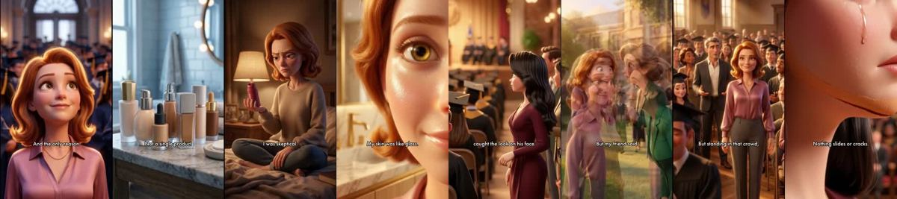
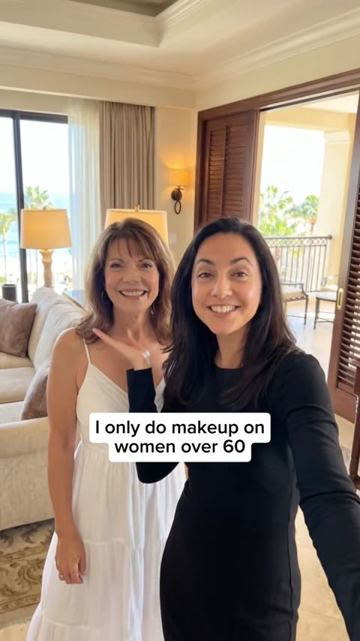
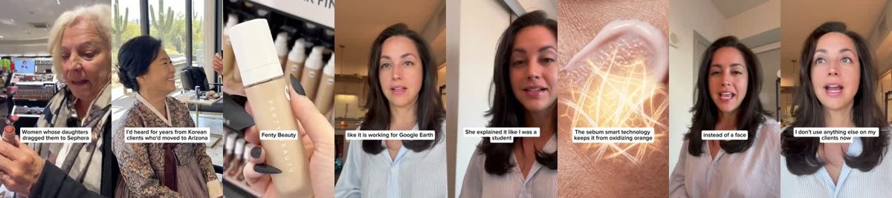

# Meta ad-library examples for F91

<!-- WAVE6 -->
## Wave 6: Resilia & Smooche live Meta ads (Oct 2026)

Pulled from the public Meta Ad Library on 2026-10-09 (Resilia: aged garlic, Ceylon cinnamon, oil of oregano; Smooche: color-changing foundation, Reverse Time peptide serum). Days live are counted to 2026-10-09; most video ads were new tests that week, while the long runners are statics and catalog templates. Transcripts are automatic. Brand claims are the advertisers', not verified, and many are health claims we would never make. The **Do not copy** line flags deceptive tactics (persona "publication" pages, undisclosed AI actors and "experts", fake stock counts).

### Smooche · Cosmetic Times: “I had a sit next to my Miss it it was my daughter So I had to walk in…” (44 days live)

- **Ad:** [Meta Ad Library #1086996320450354](https://www.facebook.com/ads/library/?id=1086996320450354) · video 10:35 · page “Cosmetic Times” · started 2026-08-25 · 1 copies · lands on `smooche.com/pages/bestfoundation`
- **What happens:** Opens: “I had a sit next to my Miss it it was my daughter So I had to walk in In front of everyone and be seen and the only reason I walked in with my head up was because of what my best friend Handed me…”
- **Why it works:** Watch time. Resilia runs 4-13 minute AI-generated soap operas (cheating husbands, cruel in-laws, a dad who collapses in a tree) from wellness persona pages. The product shows up as the turning point in act 2, and the payoff is the vindication scene.
- **How to make one:** Three acts: humiliation (0-60 s), discovery of the fix from a mentor figure (the product is the mentor's secret), vindication in public. Keep the cast consistent across scenes, use burned-in subtitles, and put the product reveal in the second third.
- **Do not copy:** Most of these are fully AI-generated actors and are not labelled as such, and the health outcomes in the plots are dramatised. Disclose AI and keep any claim inside what you can substantiate.
- **LC remake:** "She mocked my cheap jewelry at the engagement party" → the grandmother's advice ("buy once, wear forever") → LC set still gleaming at the wedding a year later.

Transcript (auto, first ~70 s)

> I had a sit next to my Miss it it was my daughter So I had to walk in In front of everyone and be seen and the only reason I walked in with my head up was because of what my best friend Handed me three nights before I didn't believe her when she said it would that fast I was wrong So here's what happened my friend Lisa had Before with the bottle of wine and the specific energy of someone who's decided she's not leaving Until you listen to her Eight months after the divorce was finalized eight months of staring at myself in the mirror every morning When I started looking so old I spent the whole week dreading it not because of him Because of my face. I didn't want a crowd of families seeing me as the wrinkled old woman The husband traded in for a bright shiny new toy. I didn't want their pity Am I right? The fine lines around my eyes and mouth seem to be deeper every morning The dull gray skin that made me look exhausted even when I wasn't The texture that no amount of makeup could hide I'm 50 and the divorce hit harder than I let anyone see I've spent over two thousand dollars on makeup McNars I stay water Lumber my bathroom counter looked like Ulta Exploded nothing works not a single product made of visible difference at night. We support the wine and I started crying before she'd even sat down I can't sit in those photos. Next to him and her looking. He left and I'm the one who looks like she lost Everything I put on my face just sits there and does nothing. I've tried every thing she didn't even has a tape Lisa has been a dermatologist for 15 years Like other people know

### Smooche · Cosmetic Times: “I had to sit next to my ex husband So I had to walk in front of…” (44 days live)

- **Ad:** [Meta Ad Library #943746994691946](https://www.facebook.com/ads/library/?id=943746994691946) · video 10:35 · page “Cosmetic Times” · started 2026-08-25 · 2 copies · lands on `smooche.com/pages/bestfoundation`
- **What happens:** Opens: “I had to sit next to my ex husband So I had to walk in front of everyone and be seen And the the only reason I walked in with my head up was because of what my best friend handed me three nights…”
- **Why it works:** Watch time. Resilia runs 4-13 minute AI-generated soap operas (cheating husbands, cruel in-laws, a dad who collapses in a tree) from wellness persona pages. The product shows up as the turning point in act 2, and the payoff is the vindication scene.
- **How to make one:** Three acts: humiliation (0-60 s), discovery of the fix from a mentor figure (the product is the mentor's secret), vindication in public. Keep the cast consistent across scenes, use burned-in subtitles, and put the product reveal in the second third.
- **Do not copy:** Most of these are fully AI-generated actors and are not labelled as such, and the health outcomes in the plots are dramatised. Disclose AI and keep any claim inside what you can substantiate.
- **LC remake:** "She mocked my cheap jewelry at the engagement party" → the grandmother's advice ("buy once, wear forever") → LC set still gleaming at the wedding a year later.

Transcript (auto, first ~70 s)

> I had to sit next to my ex husband So I had to walk in front of everyone and be seen And the the only reason I walked in with my head up was because of what my best friend handed me three nights Before I didn't believe her when she said it would work that fast I was wrong So here's what happened my friend Lisa had come over the Wednesday before with the bottle of wine And the specific energy of someone who's decided she's not leaving until you listen to her

### Smooche · Cosmetic Times: “He's not leaving until you listen to her 8 months after the divorce was…” (44 days live)

- **Ad:** [Meta Ad Library #1077317484787947](https://www.facebook.com/ads/library/?id=1077317484787947) · video 10:35 · page “Cosmetic Times” · started 2026-08-25 · 1 copies · lands on `smooche.com/pages/bestfoundation`
- **What happens:** Opens: “He's not leaving until you listen to her 8 months after the divorce was finalized 8 months of staring at myself in the mirror every morning When I started looking so old I spent the whole week…”
- **Why it works:** Watch time. Resilia runs 4-13 minute AI-generated soap operas (cheating husbands, cruel in-laws, a dad who collapses in a tree) from wellness persona pages. The product shows up as the turning point in act 2, and the payoff is the vindication scene.
- **How to make one:** Three acts: humiliation (0-60 s), discovery of the fix from a mentor figure (the product is the mentor's secret), vindication in public. Keep the cast consistent across scenes, use burned-in subtitles, and put the product reveal in the second third.
- **Do not copy:** Most of these are fully AI-generated actors and are not labelled as such, and the health outcomes in the plots are dramatised. Disclose AI and keep any claim inside what you can substantiate.
- **LC remake:** "She mocked my cheap jewelry at the engagement party" → the grandmother's advice ("buy once, wear forever") → LC set still gleaming at the wedding a year later.

Transcript (auto, first ~70 s)

> He's not leaving until you listen to her 8 months after the divorce was finalized 8 months of staring at myself in the mirror every morning When I started looking so old I spent the whole week Commissioning Not because of him Because of my face I didn't want to crowd a family seeing me as the wrinkled old woman The husband traded in Before a bright shiny new toy

### Smooche · Smooche: “My ex has been locked in A woman he left me for Young enough to be her…” (21 days live)

- **Ad:** [Meta Ad Library #1820776122428554](https://www.facebook.com/ads/library/?id=1820776122428554) · video 10:01 · page “Smooche” · started 2026-09-17 · 1 copies · lands on `smooche.com/pages/reverse`
- **What happens:** Opens: “My ex has been locked in A woman he left me for Young enough to be her daughter On the first date, I've been on in 22 years And the only reason I didn't fall apart On both of them So, the day before,…”
- **Why it works:** Watch time. Resilia runs 4-13 minute AI-generated soap operas (cheating husbands, cruel in-laws, a dad who collapses in a tree) from wellness persona pages. The product shows up as the turning point in act 2, and the payoff is the vindication scene.
- **How to make one:** Three acts: humiliation (0-60 s), discovery of the fix from a mentor figure (the product is the mentor's secret), vindication in public. Keep the cast consistent across scenes, use burned-in subtitles, and put the product reveal in the second third.
- **Do not copy:** Most of these are fully AI-generated actors and are not labelled as such, and the health outcomes in the plots are dramatised. Disclose AI and keep any claim inside what you can substantiate.
- **LC remake:** "She mocked my cheap jewelry at the engagement party" → the grandmother's advice ("buy once, wear forever") → LC set still gleaming at the wedding a year later.

Transcript (auto, first ~70 s)

> My ex has been locked in A woman he left me for Young enough to be her daughter On the first date, I've been on in 22 years And the only reason I didn't fall apart On both of them So, the day before, so here Here's what happened, my daughter had set up a dating app for me Because I couldn't figure it out She kept saying mom, your 48 not a year Three months after the divorce was finalized Three months of staring at myself Then the mirror every morning wondering when I started looking so tired Hi, hi, hi, hi I spent the whole week dreading that day Not because of him, because of my face The lines around my eye seem deeper every morning The dull grey skin that made me look exhausted

### Smooche · Cosmetic Times: “I only do makeup on women over 60. That's it. That's it…” (21 days live)

- **Ad:** [Meta Ad Library #1631287241901838](https://www.facebook.com/ads/library/?id=1631287241901838) · video 5:56 · page “Cosmetic Times” · started 2026-09-17 · 1 copies · lands on `smooche.com/pages/makeupartist`
- **What happens:** Opens: “I only do makeup on women over 60. That's it.”
- **Why it works:** Watch time. Resilia runs 4-13 minute AI-generated soap operas (cheating husbands, cruel in-laws, a dad who collapses in a tree) from wellness persona pages. The product shows up as the turning point in act 2, and the payoff is the vindication scene.
- **How to make one:** Three acts: humiliation (0-60 s), discovery of the fix from a mentor figure (the product is the mentor's secret), vindication in public. Keep the cast consistent across scenes, use burned-in subtitles, and put the product reveal in the second third.
- **Do not copy:** Most of these are fully AI-generated actors and are not labelled as such, and the health outcomes in the plots are dramatised. Disclose AI and keep any claim inside what you can substantiate.
- **LC remake:** "She mocked my cheap jewelry at the engagement party" → the grandmother's advice ("buy once, wear forever") → LC set still gleaming at the wedding a year later.

Transcript (auto, first ~70 s)

> I only do makeup on women over 60. That's it. That's it. That's it. That's it. That's it. That's it. That's it. I loved my work. But I had a secret problem. No matter how good I got by hour four of any event, my clients' foundation was failing them. Every single time. I'd pretend not to notice. They'd pretend not to notice. We'd both know. Last March, I flew to Seoul. Not for fun. I was done. I was going to either find something that actually worked on mature skin with the industry. I'd heard for years from Korean clients who'd moved to Arizona that what they used back home was different.

<!-- /WAVE6 -->

<!-- WAVE4 -->
## Wave 4: Alex Fedotoff's October 2026 swipe boards (GetHookd public previews)

Each ad below is from the free 10-ad preview of a public GetHookd board that [@FedotOff90](https://x.com/FedotOff90) shared on X. Days live are as of 2026-10-09; brand claims are the advertisers', not verified.

### PopDrama 02: Long-form short-drama episode ad (PopDrama, 19:41) (406 days live)

- **Board:** [Drama Brand Names (3min+ English)](https://x.com/FedotOff90/status/2106865528883007825) · video 1181 s
- **What happens:** A full episode of a ReelShort-style drama (a boardroom, a betrayed heroine, a CEO), running 958-1,181 s, used as a Meta ad by the drama app.
- **Why it lasts:** 406-408 days. Fedotoff: drama is "best TOFU format along with VSLs… average watch time is through the roof".
- **How to make one:** For ecom, borrow the structure: humiliation, then reversal, then a cliffhanger, and embed the product transition (F91, F105, F106).
- **LC remake:** See F105/F106: a revenge drama in which LC is the survivor.

### Olivia Ramirez: English soap-style drama ad (Olivia Ramirez, 4:40) (277 days live)

- **Board:** [Drama Brand Names (3min+ English)](https://x.com/FedotOff90/status/2106865528883007825) · video 280 s
- **What happens:** An English live-action melodrama: a cheating confrontation, "I've been using my money and living under my roof… kick this woman out", and a bank-card reveal. 274-280 s.
- **Why it lasts:** 277 days. Live-action English soap at 4-5 min, run from a persona page.
- **How to make one:** A 4-5 min English melodrama with 3 acts and a twist, run from a persona page.
- **LC remake:** A 4-min melodrama with the LC revenge-gift twist (F91).

