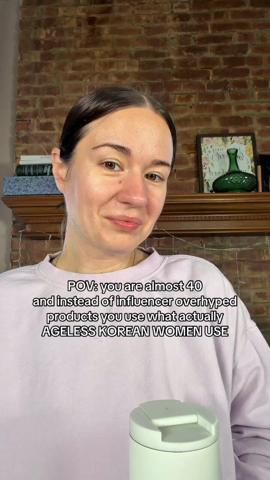

# 92 · Foreign-insider story ('I lived in Seoul for 2 years and learned what Korean women actually use'): see it, then make it

[](https://x.com/EcomSapo/status/2105288429873528875)

**The example:** [@EcomSapo on X](https://x.com/EcomSapo/status/2105288429873528875) · 10:35 video · 157 likes, 24K views

**Watch it:** [open the post on X](https://x.com/EcomSapo/status/2105288429873528875) · [play the video file](https://video.twimg.com/amplify_video/2105288291746721792/vid/avc1/320x568/aTdm2vivqZa8D1s4.mp4?tag=29)

> Smooche is doing $22M A MONTH selling skincare. One of their favorite acquisition weapons right now? SINGING ADS. They’re weird. They’re emotional. They stop the scroll. And they WORK. The problem? Making good singing ads used to be expensive, slow and annoying. Until now. Arcads basically just made singing ads a commodity. You can now pump them out 10x easier without needing a HUGE team of editors or some crazy setu…

## What you are seeing

A Pixar-3D sung drama (Smooche) of about 10 minutes: a red-haired woman's story through a party, a bathroom shelf of skincare, a tearful close-up and a graduation crowd. The insider secret and the product arrive late in the song.

## Beat by beat

The storyboard above samples the video every 1:19. Lines are the transcript for that stretch; on-screen text comes from OCR, so treat it as rough.

| Frame | Time | On screen | Said / sung |
|---|---|---|---|
| 1 | 0:00–1:19 | Ww wd wh And reason | I had to sit next to my ex-husband And the woman he left me for Who was the same age as our daughter Throughout my daughter's graduation I gave that man the best years of my life Sacrifice my youth, always put myself last To support his ego, his drive, his ambition And just as my dignity was hanging |
| 2 | 1:19–2:38 | · | I didn't want a crowd of family seeing me As the wrinkled old woman The husband traded in For a bright shiny new toy I didn't want their pity The fine lines around my eyes and mouth Seemed deeper every morning The dull gray skin that made me look exhausted Even when I wasn't The texture that no amou |
| 3 | 2:38–3:58 | · | This is what pharmacist recommend in Seoul She said Korean women Have known about this for decades Not influences Pharmacists, American foundations Have rigid pigments that can adapt So they just sit in your wrinkles Turning orange by noon This one actually merges to your exact shape I looked at her |
| 4 | 3:58–5:17 | a My, skin was like%g tides | Like magic Younger so I went to the store Ran some errands Four hours passed I looked in the mirror My skin looked incredible I texted Lisa How come it's not oxidized She wrote back the formula Adapts to your skin Two hundred fifty-one percent Better than American formulas And stays that way For six |
| 5 | 5:17–6:37 | pit ay my | · |
| 6 | 6:37–7:56 | · | · |
| 7 | 7:56–9:16 | by io PL 74 am! that crowd, ff But st if | · |
| 8 | 9:16–10:35 | Nothing slides or cracks. | · |

<details><summary>Full transcript (timestamped)</summary>

- `0:00` I had to sit next to my ex-husband
- `0:03` And the woman he left me for
- `0:06` Who was the same age as our daughter
- `0:09` Throughout my daughter's graduation
- `0:13` I gave that man the best years of my life
- `0:15` Sacrifice my youth, always put myself last
- `0:18` To support his ego, his drive, his ambition
- `0:21` And just as my dignity was hanging on by a thread
- `0:24` He walked out for some pre-schooler
- `0:28` It was a Saturday in May
- `0:31` And there was no way I could miss it
- `0:33` It was my daughter
- `0:35` So I had to walk in
- `0:37` In front of everyone and be seen
- `0:39` And the only reason I walked in
- `0:41` With my head up was because of what my best friend
- `0:44` Handed me three nights
- `0:46` Before I didn't believe her
- `0:48` When she said it would work that fast
- `0:50` I was wrong
- `0:51` So here's what happened
- `0:52` My friend Lisa had come over the Wednesday
- `0:55` Before with a bottle of wine
- `0:57` And the specific energy of someone
- `0:59` Who's decided she's not leaving
- `1:01` Until you listen to her
- `1:04` Eight months after the divorce
- `1:06` Was finalized
- `1:07` Eight months of staring at myself
- `1:09` In the mirror every morning
- `1:11` Wondering when I started looking so old
- `1:14` I'd spent the whole week dreading it
- `1:16` Not because of him
- `1:18` Because of my face
- `1:20` I didn't want a crowd of family seeing me
- `1:22` As the wrinkled old woman
- `1:24` The husband traded in
- `1:26` For a bright shiny new toy
- `1:29` I didn't want their pity
- `1:31` The fine lines around my eyes and mouth
- `1:34` Seemed deeper every morning
- `1:37` The dull gray skin that made me look exhausted
- `1:39` Even when I wasn't
- `1:42` The texture that no amount of makeup could hide
- `1:45` I'm fifty and the divorce hit harder
- `1:47` Than I let anyone see
- `1:49` I'd spent over two thousand dollars on makeup
- `1:52` Macnars, I stay water
- `1:55` My bathroom counter looked like Ulta
- `1:57` Exploded nothing works
- `1:59` Not a single product
- `2:00` Made a visible difference at night
- `2:02` Lisa poured the wine and I started crying
- `2:05` Before she'd even sat down
- `2:07` I can't sit in those photos
- `2:09` Next to him and her
- `2:10` Looking like this he left
- `2:12` And I'm the one who looks like she lost
- `2:15` Everything I put on my face
- `2:17` Just sits there and does nothing
- `2:19` I've tried everything
- `2:21` She didn't even hesitate
- `2:23` Lisa has been a dermatologist
- `2:25` For fifteen years
- `2:27` She knows skin like other people
- `2:29` Know their own kids sit down
- `2:31` I brought something, don't argue
- `2:33` Just trust me girl
- `2:35` She pulled out a small pink bottle
- `2:37` I'd never seen before
- `2:39` This is what pharmacist recommend in Seoul
- `2:42` She said Korean women
- `2:44` Have known about this for decades
- `2:46` Not influences
- `2:48` Pharmacists, American foundations
- `2:50` Have rigid pigments that can adapt
- `2:52` So they just sit in your wrinkles
- `2:54` Turning orange by noon
- `2:56` This one actually merges to your exact shape
- `2:59` I looked at her like she was crazy
- `3:01` But graduations in three days
- `3:03` It's too late for miracles
- `3:05` She looked me right in the eye
- `3:07` Put this on tomorrow
- `3:09` Blend for thirty seconds
- `3:11` Watch it adapt to your shade
- `3:13` Then look at how much younger
- `3:14` Your skin looks after
- `3:16` That's how dramatic the difference is
- `3:18` I was skeptical
- `3:20` After everything I tried
- `3:22` Twenty seconds
- `3:50` Let the pigments adapt
- `3:52` To my skin chemistry
- `3:54` But after thirty seconds
- `3:56` It shifted to my exact shade
- `3:58` Like magic
- `3:59` Younger so I went to the store
- `4:04` Ran some errands
- `4:05` Four hours passed
- `4:07` I looked in the mirror
- `4:08` My skin looked incredible
- `4:10` I texted Lisa
- `4:12` How come it's not oxidized
- `4:14` She wrote back the formula
- `4:16` Adapts to your skin
- `4:18` Two hundred fifty-one percent
- `4:20` Better than American formulas
- `4:22` And stays that way
- `4:24` For sixteen hours
- `4:26` That's why it works
- `4:27` That's why everything else
- `4:28` You've tried turns orange
- `4:30` I stared in the bathroom mirror
- `4:32` And I just stood there
- `4:34` Equality I hadn't seen
- `4:43` And you look like I got twelve
- `4:53` And a three hundred dollar facial
- `4:57` After just switching my found

</details>

## More real examples (4)

Other posts that show this format, or a close cousin of it. Click a thumbnail to open it on X.

| | | |
|---|---|---|
| [](https://x.com/AriaWeber59144/status/2011218867725746232)<br>**@AriaWeber59144** · 0:40 video · 14 views<br>Differences in Skin Care Between American and Korean Women #beauty #fyp #skincare #pretty #funny | [](https://x.com/AriaWeber59144/status/2005818535054811329)<br>**@AriaWeber59144** · 0:30 video · 18 views<br>3 Beauty Habits Korean Women Always Follow #beauty #fyp #skincare #korea #funny | [](https://x.com/Yonderfood/status/2022310049440219511)<br>**@Yonderfood** · 0:21 video · 14 views<br>Inside a French pharmacy 🇫🇷 Timeless skincare staples French women swear by. Save this for your next trip. http://Yonderfood.com |
| [](https://x.com/LifeForge_Well/status/2033997661599125785)<br>**@LifeForge_Well** · 0:42 video · 10 views<br>This is the most gatekeeper Korean skincare line that actually real Korean women use #tiktokshopcreatorpicks #koreanskincare #torridendivein #antiagin |   |   |

## How to make one like it

**The format in one line:** A first-person story where the narrator spent time inside another culture (Seoul office, Swiss clinic, Japanese pharmacy) and noticed that local women do one thing differently. A local colleague explains the mechanism over dinner, the narrator brings it home, and family members ask "did you get work done?" The authority comes from the place and the insider, not a doctor.

**Why it works:** - An open loop ("I just learned what Korean women actually use") with no pain named, so it reaches people who are not yet problem-aware. - The mechanism arrives as overheard dialogue from an insider, which reads as discovery. - Proof is layered: her own results, then the insider's reaction, then three unprompted relatives. - No discount needed: Inceptly notes the $1M/mo ad has no urgency or offer.

**Contents:** [1. Structure](#1-copy-the-structure) · [2. Shot by shot](#2-shot-by-shot-remake) · [3. Script and hooks](#3-write-the-script) · [4. Prompts](#4-prompts) · [5. Tools and settings](#5-tools-and-settings) · [6. Louise Carter remake](#6-louise-carter-remake) · [7. Variants and test](#7-variants-and-test-plan) · [8. Pitfalls](#8-pitfalls)

### 1. Copy the structure

Use the example's timing as your beat sheet. Keep the beat, change the words and the product.

| Beat | Time | In the example | Your version |
|---|---|---|---|
| 1 | 0:39 | I had to sit next to my ex-husband And the woman he left me for Who was the same age as our daughter Throughout my daughter's graduation I g | … |
| 2 | 1:59 | I didn't want a crowd of family seeing me As the wrinkled old woman The husband traded in For a bright shiny new toy I didn't want their pit | … |
| 3 | 3:18 | This is what pharmacist recommend in Seoul She said Korean women Have known about this for decades Not influences Pharmacists, American foun | … |
| 4 | 4:38 | Like magic Younger so I went to the store Ran some errands Four hours passed I looked in the mirror My skin looked incredible I texted Lisa | … |
| 5 | 5:57 | on screen: pit ay my | … |
| 6 | 7:17 | (visual beat, see frame 6) | … |
| 7 | 8:36 | on screen: by io PL 74 am! that crowd, ff But st if | … |
| 8 | 9:56 | on screen: Nothing slides or cracks. | … |

### 2. Shot-by-shot remake

**Target length / size:** 45-120s, 1080x1920

| # | Time / slot | What we see (visual + camera) | Dialogue / on-screen text |
|---|---|---|---|
| 1 | 0-5s | Narrator to camera or over B-roll of a city street | "I lived in Seoul for two years and noticed something about the women in my office." |
| 2 | 5-30s | B-roll: subway, office, cafés; specific observation | "Nobody took their jewellery off. Not for the gym, not for the sauna." |
| 3 | 30-60s | Why: the material they wear (stainless + PVD) and the habit | One true, specific detail per line |
| 4 | 60-80s | Narrator back home, putting on the same kind of stack | "So I found the closest thing here." |
| 5 | End | Product + offer | "Louise Carter. Any 7 for $85." |

<details><summary>Playbook shot list (Louise Carter version from the README)</summary>

| Time / slot | Visual | Audio / copy |
|---|---|---|
| 0:00-0:09 | Narrator to camera, suitcase or airport B-roll | "I spent the summer working with a goldsmith in Amalfi. When I came home, everyone asked if my jewelry was real gold." |
| 0:09-0:50 | The insider: a local woman who swims every day in her chains | "She never took her necklaces off. Salt water, sun, nothing. I had a drawer of green-stained pieces at home." |
| 0:50-1:40 | Mechanism as dialogue | "'You buy gold that is painted on. We buy gold that is bonded.' That's the only difference." |
| 1:40-2:20 | Proof pattern: sister, best friend, coworker ask unprompted | "My sister grabbed my wrist: 'Is that real?'" |
| 2:20-2:40 | Permission close + CTA | "If your jewelry keeps turning green, it's not you. It's the plating. Any 7 for $85." |

</details>

### 3. Write the script

Open with one of these hooks (first 1–3 seconds, or the headline on a static):

- "I spent 2 years working in [place]. When I came home, everyone asked the same question."
- "Women in [place] never take their jewelry off. Here's why."
- "The thing a [country] jeweller told me that every American woman should know."

Then fill the beats from the table above. Pull the wording from real customer reviews, not from ad copy: a review line beats a copywriter line almost every time. Read every line out loud and cut anything you would not say to a friend. Ready-made Louise Carter scripts are in section 6; hand [BOT.md](BOT.md) to any AI agent to write versions for another brand.

### 4. Prompts

**Claude**

```text
Write a first-person insider story about [place]. Every cultural detail must be accurate, specific and respectful; no stereotypes. The product is what the narrator adopted after living there. 90 seconds.
```

**B-roll**

```text
Use licensed stock or your own travel footage of the city; no AI-generated "local people" presented as real.
```

**Full creative-agent prompt (from the playbook):**

```
Using LC's real sourcing/design story {{TRUE_STORY}}, write a 2-minute first-person "foreign insider" script: open loop in line 1 (no pain named), insider character explains bonded PVD vs plating in one line of dialogue, 3 unprompted reactions from family, permission close ("it's not your fault, it's the plating"), CTA any 7 for $85. Flag every line that must be fact-checked.
```

### 5. Tools and settings

1. Only use a real trip, supplier or designer story. If there is none, use F27 founder story instead.
2. Write the three proof reactions from real customer quotes.
3. Keep the mechanism to one sentence ("painted on vs bonded").
4. Cut 60 s, 2 min and 3 min versions.

| Setting | Value |
|---|---|
| Canvas | 1080×1920 (9:16) master; crop a 1080×1350 (4:5) cut for feed placements |
| Frame rate | 30 fps (shoot 60 fps for slow-motion water or sparkle shots) |
| Camera | Phone main lens at 1x, exposure locked on skin, HDR off, grid on; tripod or a phone clamp for product shots |
| Light | One soft key at 45° (window or ring light), white card as fill; side light for metal sparkle |
| Audio | Lavalier or phone 15–20 cm from the mouth; mix voice at -14 LUFS, music at -28 to -30 dB under voice |
| Captions | Burned in, 2–5 words per line, 64–80 px bold sans, white with a black stroke or pill; keep text inside the safe zone (top 220 px and bottom 420 px clear, 64 px side margins) |
| Pacing | A visual change every 1.5–3 s; the hook lands in the first 1.5 s with no logo intro |
| Edit / export | CapCut or Premiere; H.264, 12–20 Mbps, AAC 320 kbps; upload natively to each platform, not via links |

### 6. Louise Carter remake

- A · Founder sourcing trip (if real).
- B · Customer who lives abroad (with consent and a real quote).
- C · "What lifeguards wear": insider = a lifeguard who never takes her chain off (real creator).

Brand rules, claims you can and cannot make, and more scripts: [brands/louise-carter.md](brands/louise-carter.md). Step-by-step from idea to scale: [STAGES.md](STAGES.md).

### 7. Variants and test plan

- Place/insider
- Spoken vs sung
- Length

**Test plan:** - **Budget/structure:** 2 cuts, $100/day, 7 days - **Primary KPIs:** Hold to mechanism beat, CPA; Omni (F92-*) - **Kill rule:** CPA >2× after $200 - **Scale rule:** Winner → long version on YouTube (unlisted host for social proof) - **Naming:** `utm_content=F92-<concept>-<variant>`; weekly Omni roll-up of new-customer revenue by format.

**Naming:** `F92-<variant>-<hook##>-<date>` so results map back to this folder. Change one thing per test (hook, narrator, length or offer), never two.

### 8. Pitfalls

- No stereotypes or invented facts about a culture.
- The narrator must really have lived there, or present it as a character.
- Don't claim the product is from that country if it isn't.
- Slow open: if the first 1.5 s does not show the hook visually, most people swipe.
- Logo or brand intro at the start reads as an ad; put the brand at the end.
- Captions covered by the platform UI: check the safe zone on a real phone before posting.
- Music over the voice: keep music at least 14 dB under speech.

**Compliance:** Baseline: [_COMPLIANCE.md](../_COMPLIANCE.md) (no fake testimonials, AI disclosure, no bulk/spoofed accounts, copy structure not assets, PDP-only claims). - The trip, the insider and the reactions must be real; invented foreign authorities are deceptive. - Avoid ethnic "secret" clichés; the US State Department's Under Secretary publicly flagged scam ads built on "hidden knowledge" and ethnic secrets (quoted by @ladprofit about Resilia).

## Field notes

Newer observations live in the playbook: [Wave 4 update: Fedotoff October 2026 swipe boards](README.md)

## More examples

Every post we found for this format, with transcripts: [examples/](examples/README.md). Playbook: [README.md](README.md). Agent brief: [BOT.md](BOT.md).
