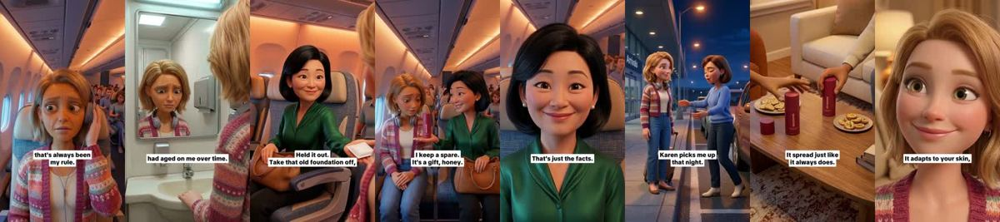
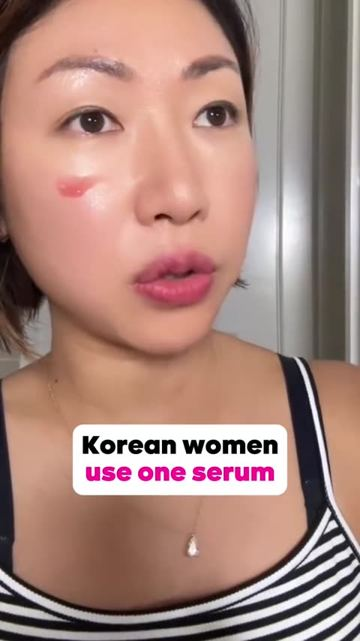
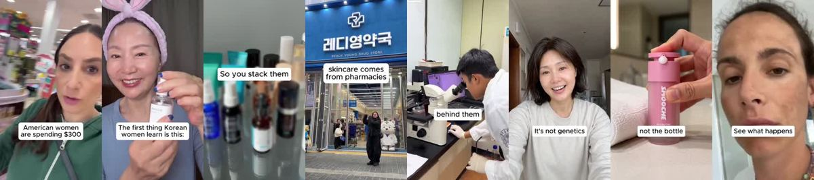
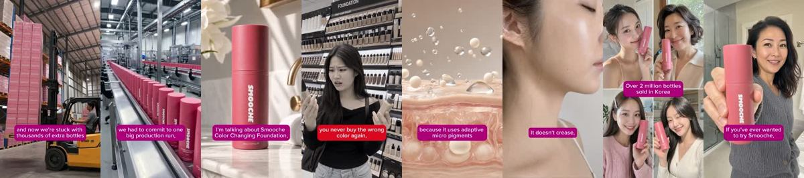
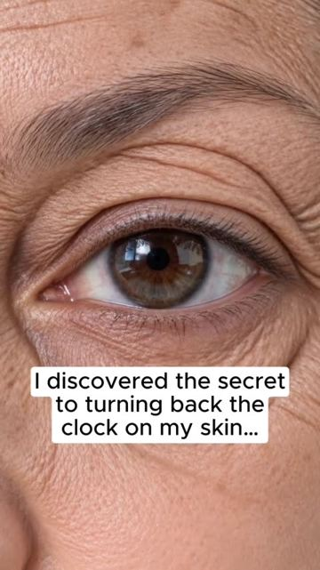
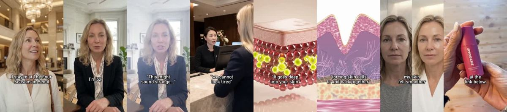
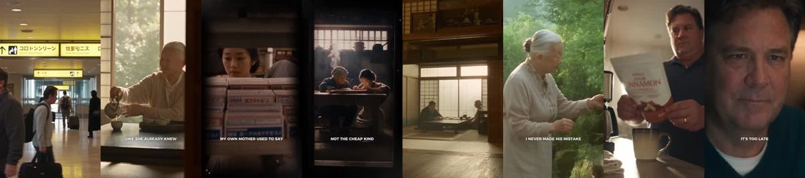

# Meta ad-library examples for F92

<!-- WAVE6 -->
## Wave 6: Resilia & Smooche live Meta ads (Oct 2026)

Pulled from the public Meta Ad Library on 2026-10-09 (Resilia: aged garlic, Ceylon cinnamon, oil of oregano; Smooche: color-changing foundation, Reverse Time peptide serum). Days live are counted to 2026-10-09; most video ads were new tests that week, while the long runners are statics and catalog templates. Transcripts are automatic. Brand claims are the advertisers', not verified, and many are health claims we would never make. The **Do not copy** line flags deceptive tactics (persona "publication" pages, undisclosed AI actors and "experts", fake stock counts).

### Smooche · Korean Beauty Tips: “A woman I ignored five hours, 30,000 The Failed Flying out to Denver…” (21 days live)

- **Ad:** [Meta Ad Library #1084704331072976](https://www.facebook.com/ads/library/?id=1084704331072976) · video 3:42 · page “Korean Beauty Tips” · started 2026-09-17 · 1 copies · lands on `smooche.com/pages/reverse`
- **What happens:** Opens: “A woman I ignored five hours, 30,000 The Failed Flying out to Denver, windows, see the sky Going by a woman by my side Korean maybe 60 and we ignored each other the whole right around hour before I…”
- **Why it works:** "Korean women use one serum. American women stack six." and "I flew to Japan after my doctor told me my A1C was 10.3". A foreign insider's secret explains why the product exists.
- **How to make one:** Open with the cultural contrast line, show the insider setting (a pharmacy, a grandmother's kitchen), and present the product as the exported secret.
- **Do not copy:** The insider stories are fabricated. Keep the cultural claim factual.
- **LC remake:** "In Italy, women buy one gold chain and wear it for 30 years. In America we buy 30 that turn green."

Transcript (auto, first ~70 s)

> A woman I ignored five hours, 30,000 The Failed Flying out to Denver, windows, see the sky Going by a woman by my side Korean maybe 60 and we ignored each other the whole right around hour before I hit the bathroom And that light should be a crime I face what the day had left of it had aged on me all the time Cracked into every line gone patchy orange and dry and tired I looked like I'd aged ten years in the air And this a woman who can Said, oh, how brand new Still sealed held it out Take that old foundation off honey No words wasted Plain and real low I couldn't but she said it Call the things been aging you off that it's bad Cracks in your lines That's how it burns And now she pulls a little bottle Turned from white to my own skin Even glowing all of it occurred My face looked right like me on my best day Everywhere

### Smooche · Cosmetic Times: “Korean women use one serum. American women stack six bottles. Each one…” (20 days live)

- **Ad:** [Meta Ad Library #1591340065263053](https://www.facebook.com/ads/library/?id=1591340065263053) · video 1:44 · page “Cosmetic Times” · started 2026-09-18 · 1 copies · lands on `smooche.com/pages/srm01`
- **What happens:** Opens: “Korean women use one serum. American women stack six bottles.”
- **Why it works:** "Korean women use one serum. American women stack six." and "I flew to Japan after my doctor told me my A1C was 10.3". A foreign insider's secret explains why the product exists.
- **How to make one:** Open with the cultural contrast line, show the insider setting (a pharmacy, a grandmother's kitchen), and present the product as the exported secret.
- **Do not copy:** The insider stories are fabricated. Keep the cultural claim factual.
- **LC remake:** "In Italy, women buy one gold chain and wear it for 30 years. In America we buy 30 that turn green."

Transcript (auto, first ~70 s)

> Korean women use one serum. American women stack six bottles. Each one doing one small job. and stable vitamin C that fade

### Smooche · Korean Beauty Tips: “We have a confession. Our-team in Korea overproduced this batch and now…” (10 days live)

- **Ad:** [Meta Ad Library #2154104285180218](https://www.facebook.com/ads/library/?id=2154104285180218) · video 1:24 · page “Korean Beauty Tips” · started 2026-09-28 · 2 copies · lands on `smooche.com/products/ccf2`
- **What happens:** Opens: “We have a confession. Our-team in Korea overproduced this batch and now we're stuck with thousands of extra bottles we have to move fast.”
- **Why it works:** "Korean women use one serum. American women stack six." and "I flew to Japan after my doctor told me my A1C was 10.3". A foreign insider's secret explains why the product exists.
- **How to make one:** Open with the cultural contrast line, show the insider setting (a pharmacy, a grandmother's kitchen), and present the product as the exported secret.
- **Do not copy:** The insider stories are fabricated. Keep the cultural claim factual.
- **LC remake:** "In Italy, women buy one gold chain and wear it for 30 years. In America we buy 30 that turn green."

Transcript (auto, first ~70 s)

> We have a confession. Our-team in Korea overproduced this batch and now we're stuck with thousands of extra bottles we have to move fast. We're really sorry, but we messed up. e manufacturing team in Korea made way too many. Because to lock in this year's Centella harvest, we had to commit to one big production run and we badly overestimated. Now we have a thousand of extra bottles and we have to clear them out at a massive discount. I'm talking about smooch color changing foundation. The one that goes on white and reads your skin's warmth Commissioning. In the end, with the end of the day we're in the middle of the day. So your skin actually looks smoother and more even the longer you keep it on. It doesn't crease, it doesn't shift color, and it never gives you that mask effect. The first time you use it, give it 15 seconds. Just wait and watch it become your exact shade right in front of you. Over 2 million bottles sold in

### Smooche · Korean Beauty Tips: “I discovered the secret to turning back the clock on my skin at the…” (7 days live)

- **Ad:** [Meta Ad Library #2091697274886848](https://www.facebook.com/ads/library/?id=2091697274886848) · video 2:38 · page “Korean Beauty Tips” · started 2026-10-01 · 1 copies · lands on `smooche.com/pages/reverse`
- **What happens:** Opens: “I discovered the secret to turning back the clock on my skin at the four seasons in Korea last year. I finally discovered the secret Korean women have to flawless complexions.”
- **Why it works:** "Korean women use one serum. American women stack six." and "I flew to Japan after my doctor told me my A1C was 10.3". A foreign insider's secret explains why the product exists.
- **How to make one:** Open with the cultural contrast line, show the insider setting (a pharmacy, a grandmother's kitchen), and present the product as the exported secret.
- **Do not copy:** The insider stories are fabricated. Keep the cultural claim factual.
- **LC remake:** "In Italy, women buy one gold chain and wear it for 30 years. In America we buy 30 that turn green."

Transcript (auto, first ~70 s)

> I discovered the secret to turning back the clock on my skin at the four seasons in Korea last year. I finally discovered the secret Korean women have to flawless complexions. Last spring And I stayed, at I've had lots of fine lines and blemishes since my forties. I tried every concealer at every price point. By mid afternoon, they all failed. Crest, caked or completely disappeared. My lines and blemishes announced my age to everyone I met. On my last afternoon, I waited at the reception desk and asked one of the girls. This might sound strange. Your skin looks perfect. It's 6 p.m. and you've been here all day. How? She smiled that quiet Korean smile. It's not strange at all. You are the second guest to ask this question. When I started here, I was using expensive French concealers. Dior, Chanel, YSL. By lunchtime, theys they creased into every line on my skin. At the four seasons, we cannot look tired.

### Resilia · Insulin Response Review: “I flew to Japan after my doctor told E.A.1C was 10.3 and I had to go to…” (1 day live)

- **Ad:** [Meta Ad Library #1019726471127971](https://www.facebook.com/ads/library/?id=1019726471127971) · video 4:19 · page “Insulin Response Review” · started 2026-10-07 · 1 copies · lands on `resilia.shop/products/resilia-ceylon-cinnamon`
- **What happens:** Opens: “I flew to Japan after my doctor told E.A.1C was 10.3 and I had to go to the T-slo like she already knew where this was going and then she started started talking and didn't stop for the next few…”
- **Why it works:** "Korean women use one serum. American women stack six." and "I flew to Japan after my doctor told me my A1C was 10.3". A foreign insider's secret explains why the product exists.
- **How to make one:** Open with the cultural contrast line, show the insider setting (a pharmacy, a grandmother's kitchen), and present the product as the exported secret.
- **Do not copy:** The insider stories are fabricated. Keep the cultural claim factual.
- **LC remake:** "In Italy, women buy one gold chain and wear it for 30 years. In America we buy 30 that turn green."

Transcript (auto, first ~70 s)

> I flew to Japan after my doctor told E.A.1C was 10.3 and I had to go to the T-slo like she already knew where this was going and then she started started talking and didn't stop for the next few hours. This is her story in her own words. I was a girl when the war ended. Everything was gone and everything had to be rebuilt at once. This is the very in a jaw for decoration. It didn't save everyone. My husband worked long hours at a company that fed him what was fast, not what was good. He thought tradition was for the women at home, not for a man building a career. He died at 58. His blood sugar had been high for years, and none of of us knew until it was already too late. She said this without bitterness, just fact. Like she'd made peace with it decades ago. Your number is...

<!-- /WAVE6 -->

<!-- WAVE4 -->
## Wave 4: Alex Fedotoff's October 2026 swipe boards (GetHookd public previews)

Each ad below is from the free 10-ad preview of a public GetHookd board that [@FedotOff90](https://x.com/FedotOff90) shared on X. Days live are as of 2026-10-09; brand claims are the advertisers', not verified.

### Petra Weber: "Swiss urologist challenge" CGI x-ray explainer (prostate) (265 days live)

- **Board:** [AI & CGI Ads That Actually Convert](https://x.com/FedotOff90/status/2107892934050037807) · video 78 s
- **What happens:** "Swiss urologist challenge: if you're not sleeping through the night within five days using this method, your prostate problems aren't what you think… Austrian urologists found… inflamed prostate tissue blocks the active ingredients…" CGI anatomy plus a plant-watering analogy. 78 s.
- **Why it lasts:** 265 days. Foreign-insider authority ("Swiss / Austrian research") plus a 5-day challenge plus an x-ray mechanism plus an analogy.
- **How to make one:** A challenge hook with a time limit, a foreign-research mechanism, CGI anatomy inserts, a simple analogy (watering leaves versus roots).
- **LC remake:** "The 7-day shower challenge."

