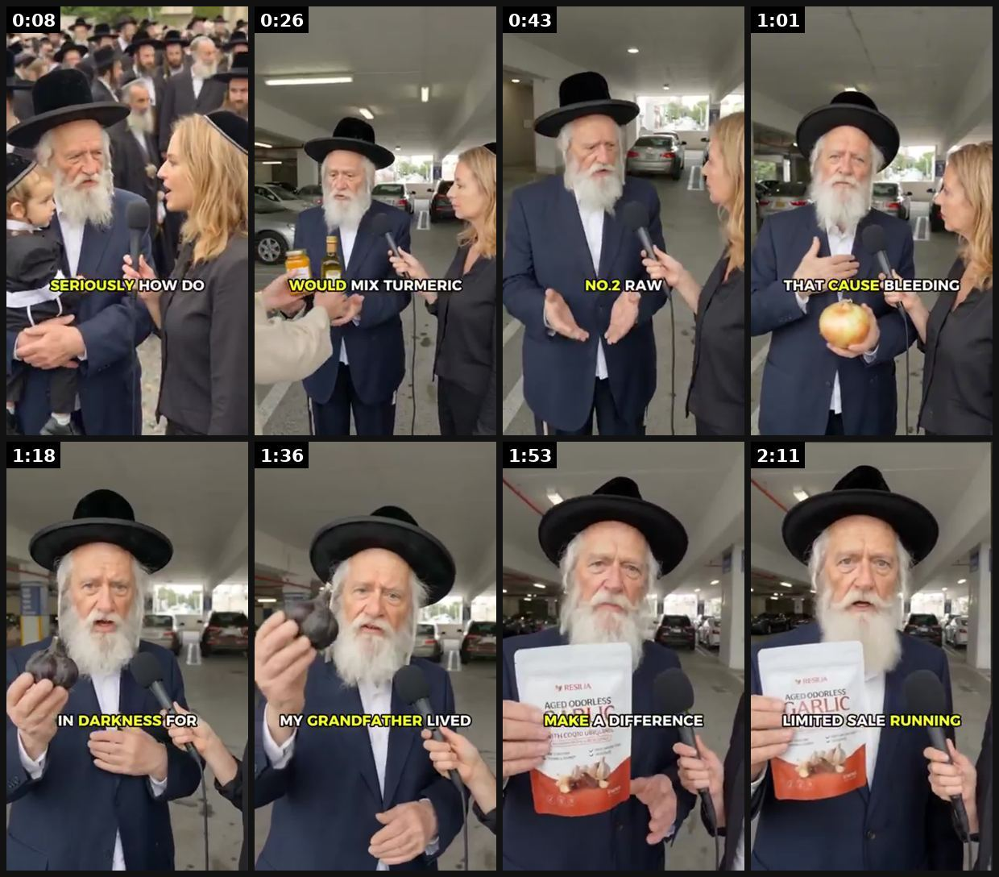

# 93 · Elder-wisdom street interview + '3 things' countdown (the product is #3): see it, then make it

[](https://x.com/ZedNilm1/status/2101280447154036917)

**The example:** [@ZedNilm1 on X](https://x.com/ZedNilm1/status/2101280447154036917) · 2:20 video · 116 likes, 17K views

**Watch it:** [open the post on X](https://x.com/ZedNilm1/status/2101280447154036917) · [play the video file](https://video.twimg.com/amplify_video/2101280417735192576/vid/avc1/320x568/CiulmNxT0EyBnz5G.mp4?tag=14)

> resilia is doing something pretty smart with their ads they’re using really old people as the entire creative angle street interviews 90+ year olds weirdly believable conversations almost zero “ad” feeling except none of it is real the people are ai and the realism is getting ridiculous this is basically age-based authority marketing without needing the actual talent added this + more hyper-realistic ai ads to the sw…

## What you are seeing

An AI-generated street interview with a 90+ year-old man in a hat and long beard. The reporter asks him questions, he answers with captions ("MY GRANDFATHER LIVED"), then holds up the product ("MAKE A DIFFERENCE").

## Beat by beat

The storyboard above samples the video every 0:17. Lines are the transcript for that stretch; on-screen text comes from OCR, so treat it as rough.

| Frame | Time | On screen | Said / sung |
|---|---|---|---|
| 1 | 0:00–0:17 | be ee av HOW DO po | 1. All the oil and turmeric. Every morning, the old Jewish grandmothers |
| 2 | 0:17–0:35 | · | · |
| 3 | 0:35–0:52 | · | · |
| 4 | 0:52–1:10 | ST al BLEEDING ae fy if | · |
| 5 | 1:10–1:27 | as IN DARKNESS FOR a he | · |
| 6 | 1:27–1:45 | · | and their children. The Jewish men in my family ate aged garlic every single morning. My grandfather, 96, my father is 89 89. Not one of them ever had a heart attack. The thing is, most aged garlic on the market |
| 7 | 1:45–2:02 | Aaa ED ODOR! DIFFERENCE ia | is fake. Only aged a few weeks. The only one I trust is called Resilia. Aged the full 20 months in completely darkness. Full clinical dose. Enough to actually make a difference. Two soft gels every morning. That's it. I've told people in their 50s and 60s about it. And within a few weeks they come b |
| 8 | 2:02–2:20 | · | blood pressure numbers dropping for the first time in years. If you want to try it, I left a link below. They have a limited sale running right now. These four foods kept my family alive for generations. Now they can keep yours alive too. God bless you and protect your heart, my friend. |

<details><summary>Full transcript (timestamped)</summary>

- `0:00` 1. All the oil and turmeric. Every morning, the old Jewish grandmothers
- `1:30` and their children. The Jewish men in my family ate aged garlic
- `1:34` every single morning. My grandfather, 96, my father is 89
- `1:36` 89. Not one of them ever had a heart attack. The thing is, most aged garlic on the market
- `1:44` is fake. Only aged a few weeks. The only one I trust is called
- `1:48` Resilia. Aged the full 20 months in completely darkness. Full clinical dose. Enough to
- `1:53` actually make a difference. Two soft gels every morning. That's it. I've told people
- `1:58` in their 50s and 60s about it. And within a few weeks they come back lighter, more energy,
- `2:04` blood pressure numbers dropping for the first time in years. If you want to try it, I left
- `2:08` a link below. They have a limited sale running right now. These four foods kept my family
- `2:13` alive for generations. Now they can keep yours alive too. God bless you and protect
- `2:18` your heart, my friend.

</details>

## More real examples (1)

Other posts that show this format, or a close cousin of it. Click a thumbnail to open it on X.

| | | |
|---|---|---|
| [](https://x.com/father_rmv/status/2100219781668356485)<br>**@father_rmv** · image · 2K views<br>Saint Thascius Caecilius Cyprianus, commonly known as Saint Cyprian of Carthage, stands as one of the most influential figures in early Christianity, |   |   |

## How to make one like it

**The format in one line:** A street-interview hook ("How old is your grandson?" "That's my grandson's grandson") reveals a startlingly old, healthy elder, who then counts down three habits. The first two are free, familiar tips (olive oil, onions); the third is the product. Age is the authority; the countdown hides the pitch until the end.

**Why it works:** - Age surprise is a strong scroll-stopper and reads as organic street content. - Two free tips build trust before the product appears as #3. - "Save this video, you never know when you'll need it" drives saves and shares. - Resilia produces it entirely with AI people; @ZedNilm1: "none of it is real… age-based authority without the actual talent". That is the compliance problem.

**Contents:** [1. Structure](#1-copy-the-structure) · [2. Shot by shot](#2-shot-by-shot-remake) · [3. Script and hooks](#3-write-the-script) · [4. Prompts](#4-prompts) · [5. Tools and settings](#5-tools-and-settings) · [6. Louise Carter remake](#6-louise-carter-remake) · [7. Variants and test](#7-variants-and-test-plan) · [8. Pitfalls](#8-pitfalls)

### 1. Copy the structure

Use the example's timing as your beat sheet. Keep the beat, change the words and the product.

| Beat | Time | In the example | Your version |
|---|---|---|---|
| 1 | 0:08 | 1. All the oil and turmeric. Every morning, the old Jewish grandmothers | … |
| 2 | 0:26 | (visual beat, see frame 2) | … |
| 3 | 0:43 | (visual beat, see frame 3) | … |
| 4 | 1:01 | on screen: ST al BLEEDING ae fy if | … |
| 5 | 1:18 | on screen: as IN DARKNESS FOR a he | … |
| 6 | 1:36 | and their children. The Jewish men in my family ate aged garlic every single morning. My grandfather, 96, my father is 89 89. Not one of the | … |
| 7 | 1:53 | is fake. Only aged a few weeks. The only one I trust is called Resilia. Aged the full 20 months in completely darkness. Full clinical dose. | … |
| 8 | 2:11 | blood pressure numbers dropping for the first time in years. If you want to try it, I left a link below. They have a limited sale running ri | … |

### 2. Shot-by-shot remake

**Target length / size:** 45-75s, 1080x1920

| # | Time / slot | What we see (visual + camera) | Dialogue / on-screen text |
|---|---|---|---|
| 1 | 0-5s | Street interview: a lively 80-year-old woman in gold jewellery, reporter holds a mic | Reporter: "What's your secret?" She laughs: "Three things." |
| 2 | 5-20s | Thing #3 (save the product for #1) | "I walk every day, rain or not." |
| 3 | 20-35s | Thing #2 | "I never let anyone tell me I'm too old for anything." |
| 4 | 35-50s | Thing #1: she holds up her necklace | "And I wear what I love, every day. My granddaughter got me this. I swim in it." |
| 5 | End | Product + offer | "Any 7 for $85." |

<details><summary>Playbook shot list (Louise Carter version from the README)</summary>

| Time / slot | Visual | Audio / copy |
|---|---|---|
| 0:00-0:06 | Interviewer with mic stops a stylish 84-year-old woman with a gold chain | "How long have you been wearing that necklace?" "Every day since 1968." |
| 0:06-0:20 | #1 free tip | "Number one: buy fewer pieces and wear them every day." |
| 0:20-0:35 | #2 free tip | "Number two: never buy anything that turns your skin green." |
| 0:35-0:55 | #3 = product (only if she is a real LC customer) | "Number three: my granddaughter got me these. I swim in them." |
| 0:55-1:00 | CTA card | "Any 7 for $85." |

</details>

### 3. Write the script

Open with one of these hooks (first 1–3 seconds, or the headline on a static):

- "How long have you been wearing that necklace?" "Every day since 1968."
- "I'm 84 and I've never taken my jewelry off. Three rules."
- "Save this, my grandmother's three jewelry rules."

Then fill the beats from the table above. Pull the wording from real customer reviews, not from ad copy: a review line beats a copywriter line almost every time. Read every line out loud and cut anything you would not say to a friend. Ready-made Louise Carter scripts are in section 6; hand [BOT.md](BOT.md) to any AI agent to write versions for another brand.

### 4. Prompts

**Veo 3**

```text
street interview, an elegant 80-year-old woman with silver hair and a thin gold necklace laughing, handheld mic, sunny European street, shallow depth of field, 8s, 9:16
```

**Real version**

```text
Interview a real older customer (with consent); film handheld with a lav mic.
```

**Full creative-agent prompt (from the playbook):**

```
Write a 60-second elder-interview countdown for LC with a REAL customer {{NAME_AGE}}: surprise-age opener, 2 genuine jewelry-care rules, #3 = her LC piece (only what she actually said), save-this line, CTA. No invented ages, quotes or people.
```

### 5. Tools and settings

1. Only real people: LC customers 65+ (or their grandchildren) with written consent.
2. Shoot vertical, handheld, lav mic; keep the countdown tips genuinely useful.
3. The product must be #3 only if she really wears LC.

| Setting | Value |
|---|---|
| Canvas | 1080×1920 (9:16) master; crop a 1080×1350 (4:5) cut for feed placements |
| Frame rate | 30 fps (shoot 60 fps for slow-motion water or sparkle shots) |
| Camera | Phone main lens at 1x, exposure locked on skin, HDR off, grid on; tripod or a phone clamp for product shots |
| Light | One soft key at 45° (window or ring light), white card as fill; side light for metal sparkle |
| Audio | Lavalier or phone 15–20 cm from the mouth; mix voice at -14 LUFS, music at -28 to -30 dB under voice |
| Captions | Burned in, 2–5 words per line, 64–80 px bold sans, white with a black stroke or pill; keep text inside the safe zone (top 220 px and bottom 420 px clear, 64 px side margins) |
| Pacing | A visual change every 1.5–3 s; the hook lands in the first 1.5 s with no logo intro |
| Edit / export | CapCut or Premiere; H.264, 12–20 Mbps, AAC 320 kbps; upload natively to each platform, not via links |

### 6. Louise Carter remake

- A · Grandmother + granddaughter duo (she was gifted the stack).
- B · "Three jewelry rules from my 90-year-old nana."
- C · Organic-only version without a product (brand-building).

Brand rules, claims you can and cannot make, and more scripts: [brands/louise-carter.md](brands/louise-carter.md). Step-by-step from idea to scale: [STAGES.md](STAGES.md).

### 7. Variants and test plan

- Interview vs to-camera
- Product #3 vs no product

**Test plan:** - **Budget/structure:** 2 cuts, $40/day, 7 days; organic first - **Primary KPIs:** 3 s hold, saves, CPA; Omni (F93-*) - **Kill rule:** 3 s hold <25% - **Scale rule:** Boost the organic winner as a Partnership ad - **Naming:** `utm_content=F93-<concept>-<variant>`; weekly Omni roll-up of new-customer revenue by format.

**Naming:** `F93-<variant>-<hook##>-<date>` so results map back to this folder. Change one thing per test (hook, narrator, length or offer), never two.

### 8. Pitfalls

- AI people must be labelled; never present an AI elder as a real customer.
- No health or longevity promises; jewellery is a habit, not a cure.
- Keep the elder dignified; she is the hero, not the punchline.
- Slow open: if the first 1.5 s does not show the hook visually, most people swipe.
- Logo or brand intro at the start reads as an ad; put the brand at the end.
- Captions covered by the platform UI: check the safe zone on a real phone before posting.
- Music over the voice: keep music at least 14 dB under speech.

**Compliance:** Baseline: [_COMPLIANCE.md](../_COMPLIANCE.md) (no fake testimonials, AI disclosure, no bulk/spoofed accounts, copy structure not assets, PDP-only claims). - Do not use AI-generated elders or fake ages. AI personas presented as real people are deceptive (FTC), and Rosabella faces a lawsuit over AI "doctors" and authority figures (404 Media). - No "ancient ethnic secret" framing.

## Field notes

Newer observations live in the playbook: [Wave 4 update: Fedotoff October 2026 swipe boards](README.md)

## More examples

Every post we found for this format, with transcripts: [examples/](examples/README.md). Playbook: [README.md](README.md). Agent brief: [BOT.md](BOT.md).
