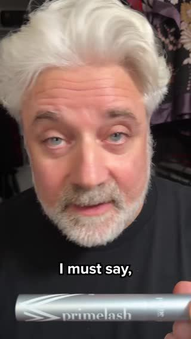

# Meta ad-library examples for F93

<!-- WAVE4 -->
## Wave 4: Alex Fedotoff's October 2026 swipe boards (GetHookd public previews)

Each ad below is from the free 10-ad preview of a public GetHookd board that [@FedotOff90](https://x.com/FedotOff90) shared on X. Days live are as of 2026-10-09; brand claims are the advertisers', not verified.

### Prime Prometics: Older-man talking head (Prime Prometics persona ad) (331 days live)

- **Board:** [Yapper Ads (raw talking-head UGC) - Oct 2026](https://x.com/FedotOff90/status/2108196484403663180) · video 153 s
- **What happens:** A white-haired man in a black shirt talks and laughs to camera, holding the product tube, with captions ("…called PrimeLash", "but I'm going to try", "My wife would", "The girls."). 153 s. Prime Prometics has 2,702 active ads.
- **Why it lasts:** 331 days. Fedotoff's avatar-diversity point: Prime Prometics runs 24 avatars and about 28 narrators; this one is a husband talking about his wife's result.
- **How to make one:** Cast avatar faces outside the buyer (spouse, son, grandpa), let them talk loosely, and keep the brand pitch light.
- **LC remake:** A husband yapper: "My wife wouldn't stop showing me her necklace, so I tried to find a flaw."

