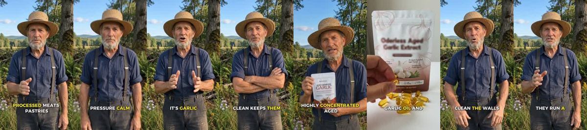
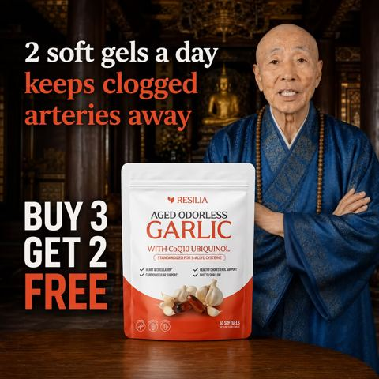

# Meta ad-library examples for F93

<!-- WAVE6 -->
## Wave 6: Resilia & Smooche live Meta ads (Oct 2026)

Pulled from the public Meta Ad Library on 2026-10-09 (Resilia: aged garlic, Ceylon cinnamon, oil of oregano; Smooche: color-changing foundation, Reverse Time peptide serum). Days live are counted to 2026-10-09; most video ads were new tests that week, while the long runners are statics and catalog templates. Transcripts are automatic. Brand claims are the advertisers', not verified, and many are health claims we would never make. The **Do not copy** line flags deceptive tactics (persona "publication" pages, undisclosed AI actors and "experts", fake stock counts).

### Resilia · Moshe Goldberg: “I'm 93 years old. I've never had high blood pressure. I've never had a…” (1 day live)

- **Ad:** [Meta Ad Library #1573975423894651](https://www.facebook.com/ads/library/?id=1573975423894651) · video 3:06 · page “Moshe Goldberg” · started 2026-10-07 · 1 copies · lands on `resilia.shop/products/resilia-aged-odorless-garlic`
- **What happens:** Opens: “I'm 93 years old. I've never had high blood pressure.”
- **Why it works:** The 93-year-old and monk elder personas give "three things" or "2 softgels a day" wisdom. Age stands in for proof.
- **How to make one:** Give an elder's 3-item countdown with the product at #3, and use a real person.
- **Do not copy:** The monks and elders appear AI-generated. Use real people.
- **LC remake:** A grandmother shows the gold chain she has worn since 1962: "buy one good thing."

Transcript (auto, first ~70 s)

> I'm 93 years old. I've never had high blood pressure. I've never had a single heart problem in my life. If I could give you three pieces of advice, it would be this. The last one can save your life. Number one, stop eating garbage food, processed meats, pastries, sugary drinks. Anything that comes out of a box with a list of ingredients you can't pronounce it inflames your arteries and make calcium and cholesterol start to accumulate against the walls until they're blocked. Number two, stay active. You don't need to run a marathon every week. Karma could ever give you. It's garlic, but not the raw kind you have in your kitchen right now. It's garlic that has been fermented for twenty full months in total darkness. Here's how it works. When garlic is aged that long, it creates a golden...

### Resilia · Active Longevity Review: A monk holding the pouch (1 day live)

- **Ad:** [Meta Ad Library #2167935664066980](https://www.facebook.com/ads/library/?id=2167935664066980) · static image · page “Active Longevity Review” · started 2026-10-07 · lands on `resilia.shop/products/resilia-aged-odorless-garlic`
- **What happens:** A monk holding the pouch: "2 soft gels a day keeps clogged arteries away. BUY 3 GET 2 FREE."
- **Why it works:** The 93-year-old and monk elder personas give "three things" or "2 softgels a day" wisdom. Age stands in for proof.
- **How to make one:** Give an elder's 3-item countdown with the product at #3, and use a real person.
- **Do not copy:** The monks and elders appear AI-generated. Use real people.
- **LC remake:** A grandmother shows the gold chain she has worn since 1962: "buy one good thing."

Primary text

> Looking to Take Control of Your Heart Health Naturally?❤️ Experience the Power of Resilia Aged Garlic Extract! ✅: Supports cardiovascular health naturally ✅: Completely odorless formula ✅: Supports arterial health ✅: 20-month aging process ✅: 900+ clinical studies ✅: SAC-standardized aged garlic extract ✅: Plus CoQ10 Ubiquinol & Vitamin K2 MK-7 Transform your cardiovascular health with three clinically studied ingredients backed by modern science — 30-Day Risk-Free Guarantee.

<!-- /WAVE6 -->

<!-- WAVE4 -->
## Wave 4: Alex Fedotoff's October 2026 swipe boards (GetHookd public previews)

Each ad below is from the free 10-ad preview of a public GetHookd board that [@FedotOff90](https://x.com/FedotOff90) shared on X. Days live are as of 2026-10-09; brand claims are the advertisers', not verified.

### Prime Prometics: Older-man talking head (Prime Prometics persona ad) (331 days live)

- **Board:** [Yapper Ads (raw talking-head UGC) - Oct 2026](https://x.com/FedotOff90/status/2108196484403663180) · video 153 s
- **What happens:** A white-haired man in a black shirt talks and laughs to camera, holding the product tube, with captions ("…called PrimeLash", "but I'm going to try", "My wife would", "The girls."). 153 s. Prime Prometics has 2,702 active ads.
- **Why it lasts:** 331 days. Fedotoff's avatar-diversity point: Prime Prometics runs 24 avatars and about 28 narrators; this one is a husband talking about his wife's result.
- **How to make one:** Cast avatar faces outside the buyer (spouse, son, grandpa), let them talk loosely, and keep the brand pitch light.
- **LC remake:** A husband yapper: "My wife wouldn't stop showing me her necklace, so I tried to find a flaw."

