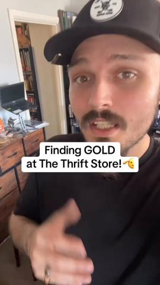
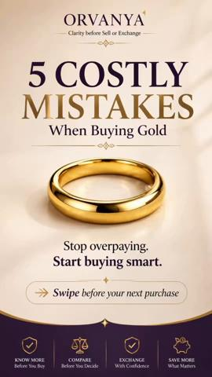
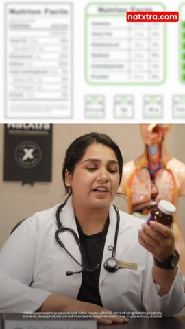
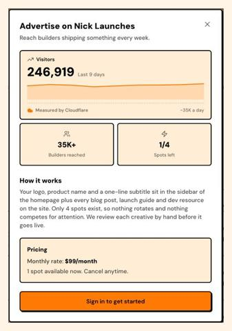

# 94 · Buyer's-guide warning: 'Before you buy X, flip the label' (3-2-1 countdown, only one passes): see it, then make it

[](https://x.com/HenryCrochemore/status/2087894849618087981)

**The example:** [@HenryCrochemore on X](https://x.com/HenryCrochemore/status/2087894849618087981) · 2:22 video · 6 likes, 1K views

**Watch it:** [open the post on X](https://x.com/HenryCrochemore/status/2087894849618087981) · [play the video file](https://video.twimg.com/amplify_video/2087894766180868098/vid/avc1/320x572/oNiiz2-uvm8nGS0-.mp4?tag=29)

> Worth breaking this one down. brand: thriving through midlife. hook: "spring sale | up to 63% off . today only". specific: sounds too good to be true? try it before you buy it. we let everyone try it for 60 days . or your money back, guaranteed. and for a limited time, take https://t.co/8AwwHvwCTU

## What you are seeing

A grotesque, stretched-face claymation character at a podcast mic reading the label of a skincare product ("WE JUST MOVED", "EVERY CREAM BEFORE", "HYDROLYZED HYALURONIC ACID", "61% OFF"). It is a buyer's guide delivered by an unforgettable character.

## Beat by beat

The storyboard above samples the video every 0:17. Lines are the transcript for that stretch; on-screen text comes from OCR, so treat it as rough.

| Frame | Time | On screen | Said / sung |
|---|---|---|---|
| 1 | 0:00–0:17 | ONE vA OO VE JU | Why are you so down, Chucky? What's going on? Our time's over, Gobbler. They finally figured it out after decades of nobody being able to touch us. Decades. Every woman who dropped the weight, we just moved right in under the chin. Living rent-freef. Rent-freef. The good old days. And the best part? |
| 2 | 0:17–0:35 | · | A neck lift? Eight grand? Under the knife? Exactly. So she'd say I'll save up for it, but the surgery never came. Remember her trying to angle her head in every photo to hide us? Never worked. She even stopped letting her own kids take pictures of her. We weren't just sagging, Gobbler. We were thriv |
| 3 | 0:35–0:53 | oc CRT BEFORE | Why'd you say were? Because of the lab, Gobbler. In France. Chucky, don't talk about the lab. They figured it out, mate. But how? See, every cream before them just sat on top of her skin. Couldn't reach us down deep. We were safe. And those other products? They only ever solved half the problem. Ret |
| 4 | 0:53–1:11 | · | Please, too harsh made her crepia. We loved retinol. Red light just softened the surface. Never touched us. And those expensive firming creams from Boots? Pilled right off, pathetic. But this French thing, it is small enough to slip into the tiny pores in her neck. And once it goes down there, it ac |
| 5 | 1:11–1:29 | · | Collagen and Elastin. Elastin? It's what gives skin its elasticity and natural tightness. It's what the neck needs to snap back after being stretched out for years. Every other product only went after Collagen because it's trendy. This one actually restores both. But that's not enough to get rid of  |
| 6 | 1:29–1:47 | ls ee eo Md FED ON IC ACID | Xyren. I hate that cream. Not only does it have the French peptide, but the exact concentration proven to work best against us. They paired it with hydrolyzed hyaluronic acid, caffeine and kupuaku butter. To plump wrinkles from within, smooth, crepy texture and hydrate the skin for 24 hours straight |
| 7 | 1:47–2:04 | a ff 7, ONLY GONE | I've never seen anything work so good and fast on us. You remember that turkey guy? Live two houses down? Oh, he's gone. She used it for six weeks only. Turkey gone, never seen again. How many of us have gone already, Chuki? Over a hundred thousand, and it's not slowing down. A hundred thousand? But |
| 8 | 2:04–2:22 | · | That's the worst part. She gets 60 days. If we don't shrink, she pays nothing, and it gets even worse. Right now there's a discount. Up to 63% off until midnight. Oh no! So please, we're begging you. If you're watching this and you want us to stay hanging loose below your chin, please don't tap belo |

<details><summary>Full transcript (timestamped)</summary>

- `0:00` Why are you so down, Chucky? What's going on?
- `0:02` Our time's over, Gobbler.
- `0:03` They finally figured it out after decades of nobody being able to touch us.
- `0:06` Decades.
- `0:07` Every woman who dropped the weight, we just moved right in under the chin.
- `0:10` Living rent-freef.
- `0:11` Rent-freef.
- `0:12` The good old days.
- `0:13` And the best part?
- `0:14` She had no clue how to get rid of us.
- `0:16` I mean, what was she gonna do?
- `0:18` A neck lift?
- `0:19` Eight grand?
- `0:20` Under the knife?
- `0:21` Exactly.
- `0:21` So she'd say I'll save up for it, but the surgery never came.
- `0:24` Remember her trying to angle her head in every photo to hide us?
- `0:28` Never worked.
- `0:28` She even stopped letting her own kids take pictures of her.
- `0:32` We weren't just sagging, Gobbler.
- `0:33` We were thriving.
- `0:34` Were?
- `0:35` Why'd you say were?
- `0:36` Because of the lab, Gobbler.
- `0:38` In France.
- `0:39` Chucky, don't talk about the lab.
- `0:41` They figured it out, mate.
- `0:42` But how?
- `0:43` See, every cream before them just sat on top of her skin.
- `0:47` Couldn't reach us down deep.
- `0:48` We were safe.
- `0:49` And those other products?
- `0:50` They only ever solved half the problem.
- `0:52` Retinol?
- `0:53` Please, too harsh made her crepia.
- `0:55` We loved retinol.
- `0:56` Red light just softened the surface.
- `0:58` Never touched us.
- `1:00` And those expensive firming creams from Boots?
- `1:02` Pilled right off, pathetic.
- `1:03` But this French thing, it is small enough to slip into the tiny pores in her neck.
- `1:07` And once it goes down there, it actually rebuilds the two things she needs to get rid of us.
- `1:11` Collagen and Elastin.
- `1:13` Elastin?
- `1:13` It's what gives skin its elasticity and natural tightness.
- `1:17` It's what the neck needs to snap back after being stretched out for years.
- `1:20` Every other product only went after Collagen because it's trendy.
- `1:23` This one actually restores both.
- `1:25` But that's not enough to get rid of us, right?
- `1:27` No, that's why they started using that cream.
- `1:30` Xyren.
- `1:30` I hate that cream.
- `1:32` Not only does it have the French peptide,
- `1:34` but the exact concentration proven to work best against us.
- `1:37` They paired it with hydrolyzed hyaluronic acid, caffeine and kupuaku butter.
- `1:41` To plump wrinkles from within, smooth,
- `1:43` crepy texture and hydrate the skin for 24 hours straight.
- `1:46` I've never seen anything work so good and fast on us.
- `1:49` You remember that turkey guy?
- `1:51` Live two houses down?
- `1:52` Oh, he's gone.
- `1:53` She used it for six weeks only.
- `1:55` Turkey gone, never seen again.
- `1:57` How many of us have gone already, Chuki?
- `1:59` Over a hundred thousand, and it's not slowing down.
- `2:02` A hundred thousand?
- `2:03` But maybe it won't even work on her, right?
- `2:05` That's the worst part.
- `2:06` She gets 60 days.
- `2:07` If we don't shrink, she pays nothing, and it gets even worse.
- `2:10` Right now there's a discount.
- `2:12` Up to 63% off until midnight.
- `2:14` Oh no!
- `2:15` So please, we're begging you.
- `2:17` If you're watching this and you want us to stay hanging loose below your chin,
- `2:21` please don't tap below.

</details>

## More real examples (5)

Other posts that show this format, or a close cousin of it. Click a thumbnail to open it on X.

| | | |
|---|---|---|
| [](https://x.com/SuurajN35299/status/2038318041457741869)<br>**@SuurajN35299** · 0:39 video · 11 views<br>Stop! 🛑 Before you buy that gold chain, check the clasp for these 3 stamps: GP GEP HGE If you see them, you're buying plated jewelry, not solid gold. | [](https://x.com/Amiragoldgroup/status/2080124641826242894)<br>**@Amiragoldgroup** · 2:46 video · 95 views<br>Thrift stores can hide incredible treasures—but never assume every piece is real. Always verify, test, and inspect before you buy. A few minutes of ch | [](https://x.com/OrvanyaIndia/status/2084213867505435020)<br>**@OrvanyaIndia** · 0:22 video · 25 views<br>Before you buy gold as an investment or commodity/wearable next time, remember these 5 common mistakes and plan accordingly #gold #investment #jewelle |
| [](https://x.com/NatxtraSynthite/status/2078344172885700790)<br>**@NatxtraSynthite** · 0:31 video · 5 views<br>Don't buy a supplement without reading the label. The real story is in the ingredients, dosage, and hidden extras—not the marketing. Read the label be | [](https://x.com/nicklaunches/status/2105130548155056153)<br>**@nicklaunches** · image · 977 views<br>Before you buy ANY directory ad, ask these 4. &gt; who measures the traffic, them or a third party &gt; how many ads rotate through the same spot &gt; |   |

## How to make one like it

**The format in one line:** An educational warning video aimed at people already shopping the category: "Before you buy X, watch this." The presenter picks up typical products, flips them over, reads the small print, and counts down 3 reasons (3, 2, 1) why only one option meets the standard. It is a buyer's guide where the standard is defined so only the brand passes.

**Why it works:** - It catches product-aware shoppers comparing options (and Amazon look-alikes) at the moment of choice. - "Flip it over and read the small print" is a demonstrable, repeatable proof the viewer can do at home. - The countdown structure keeps people watching to #1. - Defining the standard ("bonded, not painted") makes cheaper alternatives disqualify themselves.

**Contents:** [1. Structure](#1-copy-the-structure) · [2. Shot by shot](#2-shot-by-shot-remake) · [3. Script and hooks](#3-write-the-script) · [4. Prompts](#4-prompts) · [5. Tools and settings](#5-tools-and-settings) · [6. Louise Carter remake](#6-louise-carter-remake) · [7. Variants and test](#7-variants-and-test-plan) · [8. Pitfalls](#8-pitfalls)

### 1. Copy the structure

Use the example's timing as your beat sheet. Keep the beat, change the words and the product.

| Beat | Time | In the example | Your version |
|---|---|---|---|
| 1 | 0:08 | Why are you so down, Chucky? What's going on? Our time's over, Gobbler. They finally figured it out after decades of nobody being able to to | … |
| 2 | 0:26 | A neck lift? Eight grand? Under the knife? Exactly. So she'd say I'll save up for it, but the surgery never came. Remember her trying to ang | … |
| 3 | 0:44 | Why'd you say were? Because of the lab, Gobbler. In France. Chucky, don't talk about the lab. They figured it out, mate. But how? See, every | … |
| 4 | 1:02 | Please, too harsh made her crepia. We loved retinol. Red light just softened the surface. Never touched us. And those expensive firming crea | … |
| 5 | 1:20 | Collagen and Elastin. Elastin? It's what gives skin its elasticity and natural tightness. It's what the neck needs to snap back after being | … |
| 6 | 1:38 | Xyren. I hate that cream. Not only does it have the French peptide, but the exact concentration proven to work best against us. They paired | … |
| 7 | 1:56 | I've never seen anything work so good and fast on us. You remember that turkey guy? Live two houses down? Oh, he's gone. She used it for six | … |
| 8 | 2:13 | That's the worst part. She gets 60 days. If we don't shrink, she pays nothing, and it gets even worse. Right now there's a discount. Up to 6 | … |

### 2. Shot-by-shot remake

**Target length / size:** 30-50s, 1080x1920

| # | Time / slot | What we see (visual + camera) | Dialogue / on-screen text |
|---|---|---|---|
| 1 | 0-3s | Presenter at a table with 3 typical gold pieces (generic, unbranded packaging) | "Before you buy gold jewellery, flip the label." |
| 2 | 3-12s | Check 3: picks up piece 1, label close-up | "'Gold tone' means there's no gold. Fails." |
| 3 | 12-22s | Check 2: piece 2 | "'Gold plated' with no thickness listed means it wears off. Fails." |
| 4 | 22-32s | Check 1: the PVD piece | "'14K PVD over stainless steel'. Bonded, waterproof. This one passes." |
| 5 | 32-40s | Drops it in a glass of water, lifts it out | "That's the one I wear." |
| 6 | End | Offer | "Any 7 for $85." |

<details><summary>Playbook shot list (Louise Carter version from the README)</summary>

| Time / slot | Visual | Audio / copy |
|---|---|---|
| 0:00-0:04 | Hands hold 3 generic gold necklaces on cards | "Warning: before you buy waterproof gold jewelry, flip the card over." |
| 0:04-0:20 | #3: card reads "gold tone" / "gold plated" | "Three: 'gold tone' means paint over brass. That's what turns green." |
| 0:20-0:35 | #2: "18K gold-plated, 0.5 micron" | "Two: plating thinner than a hair wears off in weeks of showers." |
| 0:35-0:50 | #1: LC card "14K PVD bonded, stainless base" | "One: PVD is bonded, not painted. That's why you can swim in it." |
| 0:50-1:00 | Shower demo + offer | "Any 7 for $85, waterproof. Link below." |

</details>

### 3. Write the script

Open with one of these hooks (first 1–3 seconds, or the headline on a static):

- "Before you buy 'waterproof' gold jewelry, flip the card over."
- "Warning: most 'gold' necklaces under $50 say this in the small print."
- "Three things to check before you buy gold jewelry online."

Then fill the beats from the table above. Pull the wording from real customer reviews, not from ad copy: a review line beats a copywriter line almost every time. Read every line out loud and cut anything you would not say to a friend. Ready-made Louise Carter scripts are in section 6; hand [BOT.md](BOT.md) to any AI agent to write versions for another brand.

### 4. Prompts

**Script (Claude)**

```text
Write 3 label checks shoppers can do themselves for [category], each one true and verifiable, from weakest to the product. Max 15 words per line.
```

**Shoot**

```text
Top-down + presenter angle, macro on labels, neutral packaging with competitor names removed.
```

**Full creative-agent prompt (from the playbook):**

```
Write a 60-second "before you buy, flip the label" countdown for LC: 3 label terms shoppers see (from {{LABEL_FACTS}}), what each means in one sentence, #1 = LC 14K PVD bonded. All statements must be factually accurate and generic (no brand names). End with a demo line and the offer.
```

### 5. Tools and settings

1. List the 3-4 label terms a buyer meets (gold tone, gold plated, gold filled, vermeil, PVD) and what each truly means.
2. Buy 3 generic unbranded pieces as props; never show a competitor brand name.
3. Shoot hands-only (cheap, scalable) plus one presenter version.
4. End with a real shower or ocean demo.

| Setting | Value |
|---|---|
| What you are building | A repeatable system (account, page, offer or pipeline), not one ad |
| Cadence | Decide the posting or launch rhythm up front (e.g. daily, or 3 new ads a week) and keep it for 30 days |
| Template | Lock one caption, layout and naming template so output is consistent |
| Tracking | One UTM pattern per system (`utm_campaign=F<NN>`) and a weekly sheet: spend, CTR, hook rate, CPA |
| Tools | Meta Ads Manager / TikTok Ads Manager, a shared Drive folder per format, the agent brief in BOT.md |

### 6. Louise Carter remake

- A · Hands-only flip-the-card.
- B · Jeweller presenter at a bench.
- C · Static carousel version (5 cards).

Brand rules, claims you can and cannot make, and more scripts: [brands/louise-carter.md](brands/louise-carter.md). Step-by-step from idea to scale: [STAGES.md](STAGES.md).

### 7. Variants and test plan

- Hands vs presenter
- Countdown vs checklist
- Warning hook vs question hook

**Test plan:** - **Budget/structure:** 3 cuts, $50/day, 7 days - **Primary KPIs:** CPA, CVR (product-aware); Omni (F94-*) - **Kill rule:** CPA >1.8× after $150 - **Scale rule:** Retarget site visitors + Amazon-comparers - **Naming:** `utm_content=F94-<concept>-<variant>`; weekly Omni roll-up of new-customer revenue by format.

**Naming:** `F94-<variant>-<hook##>-<date>` so results map back to this folder. Change one thing per test (hook, narrator, length or offer), never two.

### 8. Pitfalls

- Don't name or show competitor brands; use generic packaging.
- Every label claim must be accurate (e.g. what "gold tone" legally means).
- Show the product passing a test it really passes.
- Changing the template every week: the system only learns if it stays consistent for at least 30 days.
- No tracking: without one naming and UTM pattern you cannot tell which piece of the system works.

**Compliance:** Baseline: [_COMPLIANCE.md](../_COMPLIANCE.md) (no fake testimonials, AI disclosure, no bulk/spoofed accounts, copy structure not assets, PDP-only claims). - Statements about materials must be accurate; no competitor names or "every other brand" claims you can't prove (Resilia says "every other brand cuts corners"). - Don't claim "the only" unless substantiated.

## Field notes

Newer observations live in the playbook: [Wave 3 update: Meta ad-library long-runners (Fedotoff gut-health board)](README.md) · [Wave 4 update: Fedotoff October 2026 swipe boards](README.md)

## More examples

Every post we found for this format, with transcripts: [examples/](examples/README.md). Playbook: [README.md](README.md). Agent brief: [BOT.md](BOT.md).
