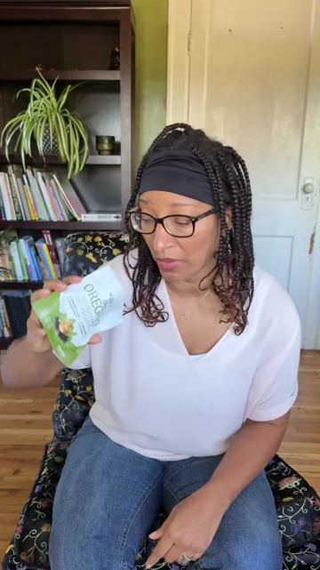
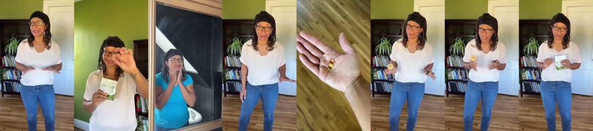
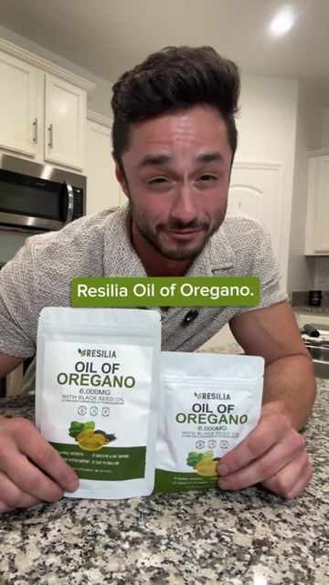
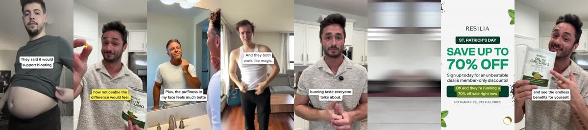
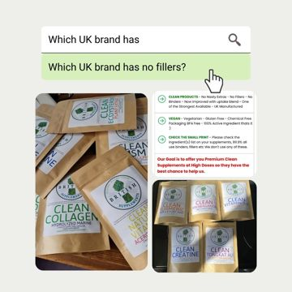

# Meta ad-library examples for F94 (GetHookd board 155932, gut health)

<!-- WAVE6 -->
## Wave 6: Resilia & Smooche live Meta ads (Oct 2026)

Pulled from the public Meta Ad Library on 2026-10-09 (Resilia: aged garlic, Ceylon cinnamon, oil of oregano; Smooche: color-changing foundation, Reverse Time peptide serum). Days live are counted to 2026-10-09; most video ads were new tests that week, while the long runners are statics and catalog templates. Transcripts are automatic. Brand claims are the advertisers', not verified, and many are health claims we would never make. The **Do not copy** line flags deceptive tactics (persona "publication" pages, undisclosed AI actors and "experts", fake stock counts).

### Resilia · Resilia: “Do not believe resilient oil of oregano. They said it would support…” (2 days live)

- **Ad:** [Meta Ad Library #1627333582177094](https://www.facebook.com/ads/library/?id=1627333582177094) · video 0:45 · page “Resilia” · started 2026-10-06 · 2 copies · lands on `resilia.shop/products/resilia-oil-of-oregano-softgels`
- **What happens:** Opens: “Do not believe resilient oil of oregano. They said it would support bloating and improve digestion.”
- **Why it works:** "Do not buy Resilia oil of oregano over regular…" opens on a warning and turns it into a comparison that favours the brand. The same lines were posted from both the brand page and a "Natural Defense Report" page.
- **How to make one:** Open with "Do not buy X over regular X…", give 2-3 differences you can show on camera (label, capsule, test), and finish with "…unless you want it to actually work."
- **LC remake:** "Do not buy LC over regular gold-plated jewelry… unless you want it to survive the shower." Then a tarnish test.

Transcript (auto, first ~70 s)

> Do not believe resilient oil of oregano. They said it would support bloating and improve digestion. Alright. But they didn't warn me about how noticeably different I would feel. I've only been taking this for two weeks and just look at my belly. Ugh. Plus the puffiness in my face feels so much better. It has two ingredients, oregano oil and black seed oil. And they both work like match. I thought I was gonna get that burning tape that everyone talks about, but it's a soft gel. It's super easy to swallow and you don't get that aftertaste. sth free shipping and 70% off with your order. I put the link below. Grab yours and fill the endless benefits for yourself. Don't take my word for it, but I'm right.

### Resilia · Natural Defense Report: “Do not buy resilient oil over regular. They said it was to support…” (0 days live)

- **Ad:** [Meta Ad Library #1418191836484523](https://www.facebook.com/ads/library/?id=1418191836484523) · video 0:37 · page “Natural Defense Report” · started 2026-10-08 · 1 copies · lands on `resilia.shop/products/resilia-oil-of-oregano-softgels`
- **What happens:** Opens: “Do not buy resilient oil over regular. They said it was to support bloating and improve digestion.”
- **Why it works:** "Do not buy Resilia oil of oregano over regular…" opens on a warning and turns it into a comparison that favours the brand. The same lines were posted from both the brand page and a "Natural Defense Report" page.
- **How to make one:** Open with "Do not buy X over regular X…", give 2-3 differences you can show on camera (label, capsule, test), and finish with "…unless you want it to actually work."
- **LC remake:** "Do not buy LC over regular gold-plated jewelry… unless you want it to survive the shower." Then a tarnish test.

Transcript (auto, first ~70 s)

> Do not buy resilient oil over regular. They said it was to support bloating and improve digestion. Okay, but they didn't tell me how noticeable the difference would feel. I've only been taking this for one week and just look at my belly. Plus, the puffiness in my face feels much better. It's just two ingredients, a regular oil and black seed oil and they both work like magic. I thought I was going to get that burning taste everyone talks about, but it's a soft gel. Super easy to swallow, no burn, no aftertaste, nothing. Y'all keep doing your crunches. I'll see you in a few days. Oh, and they're running 70% off right now with a 30 day money back guarantee. I put the link below. Go grab a bag now and see the endless benefits for yourself. Don't take my word for it but I'm right.

<!-- /WAVE6 -->

From [@FedotOff90](https://x.com/FedotOff90/status/2108212319113412929)'s public board preview. Days live are as of 2026-10-09. Full board breakdown is in the internal sources folder.

## British Supplements: Google-search UI static ('Which UK brand has no fillers?') (331 days live)

- **What happens:** A Google search bar with an autocomplete question 'Which UK brand has no fillers?', a cursor clicking it, then a featured-snippet style answer box with ticks and product photos.
- **Why it lasts:** 331 days live. It mimics the moment the buyer is already in (searching), and the brand appears as the 'answer'.
- **How to make one:** Figma: Google search bar 1080 wide, Roboto 40px, autocomplete row highlighted, answer card with 3 ticks; no Google logo misuse; 1080x1350.
- **LC remake:** 'Which gold jewelry can you shower in?' search bar → answer card: 14K PVD, stainless core, waterproof → LC product photos.

<!-- WAVE4 -->
## Wave 4: Alex Fedotoff's October 2026 swipe boards (GetHookd public previews)

Each ad below is from the free 10-ad preview of a public GetHookd board that [@FedotOff90](https://x.com/FedotOff90) shared on X. Days live are as of 2026-10-09; brand claims are the advertisers', not verified.

### BioRoot Labs: "Relief like ibuprofen without the stomach pain" ingredient static (179 days live)

- **Board:** [AI Storytelling Ads: 13 Brands x 50 Longest-Running (Oct 2026)](https://x.com/FedotOff90/status/2107177846070202853) · image
- **What happens:** A static: "Relief Like Ibuprofen, Without the stomach pain", 3 bottles, a "45,000+ trusted" badge, and an ingredient grid (turmeric anti-inflammatory, black pepper absorption, bee propolis immune, ginger digestive, coconut oil lipid carrier, vitamin C antioxidant).
- **Why it lasts:** 179 days. "Like X without the side effect": the known drug as an anchor, the side effect as the enemy.
- **How to make one:** Headline "[benefit] like [familiar drug], without [its side effect]", product, ingredient grid with one benefit each.
- **LC remake:** "The look of solid gold, without the green neck."

