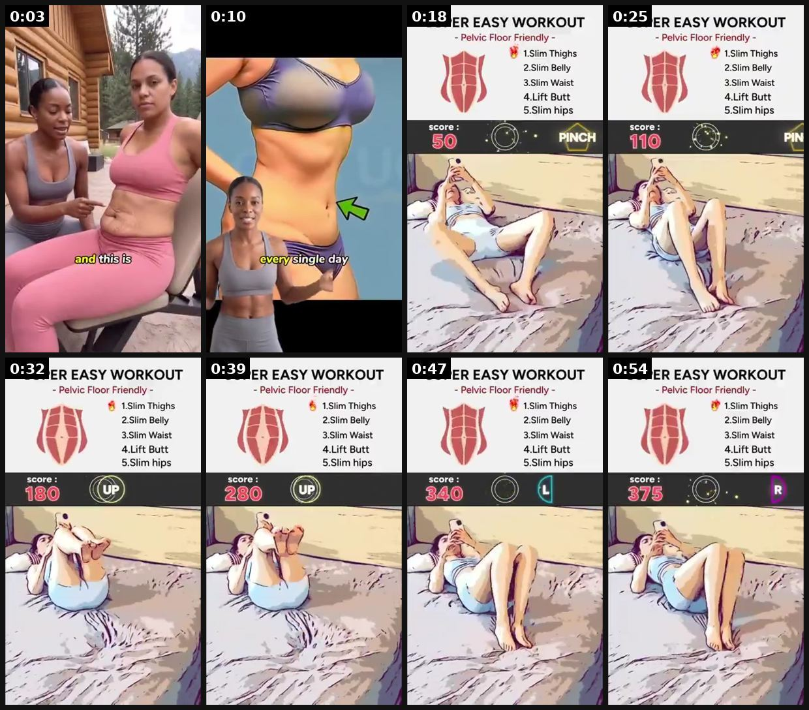

# 95 · Visual-diagnosis roll-call ('This is X. This is X. That's X.' symptom montage → hidden cause): see it, then make it

[](https://x.com/thousif_maker/status/2107161552377819648)

**The example:** [@thousif_maker on X](https://x.com/thousif_maker/status/2107161552377819648) · 0:57 video · 0 likes, 76 views

**Watch it:** [open the post on X](https://x.com/thousif_maker/status/2107161552377819648) · [play the video file](https://video.twimg.com/ext_tw_video/2107161508329279488/pu/vid/avc1/320x568/_DMzPmGJ29q_yMOQ.mp4?tag=12)

> JustFit ($300K+/month) launched this ad 10 days ago. It's trending. A trainer points at a woman's body: "this is stress belly." Then: the fix isn't the gym. It's a workout game you play in bed. Complete breakdown of their ads & acquisition tactic below 👇

## What you are seeing

A fitness-app ad that opens like a body diagnosis: a trainer stands behind a woman and points at her stomach, caption "All plus-size girls need to do this to get rid of belly fat". It then cuts to an app screen ('Lazy easy workout') with a short routine list while a woman does the moves on a bed. The format points at a visible sign, names its cause, then shows the fix.

## Beat by beat

The storyboard above samples the video every 0:07. Lines are the transcript for that stretch; on-screen text comes from OCR, so treat it as rough.

| Frame | Time | On screen | Said / sung |
|---|---|---|---|
| 1 | 0:00–0:07 | · | This is hormone back and this is sitting all day legs and this is stress belly. The best way to fix them isn't go to the gym. |
| 2 | 0:07–0:14 | · | All you need to do this workout game routine at home every single day. |
| 3 | 0:14–0:21 | SUPER EASY WORKOUT Pelvic Floor Friendly 1.Slim Thighs 2.Slim Belly 3.Slim Waist 4.Lift Butt 5.Slim hips score: 50 PINCH | · |
| 4 | 0:21–0:28 | SUPER EASY WORKOUT Pelvic Floor Friendly 1.Slim Thighs 2.Slim Belly 3.Slim Waist 4.Lift Butt 5.Slim hips score 110 | · |
| 5 | 0:28–0:36 | SUPER EASY WORKOUT Pelvic Floor Friendly 1.Slim Thighs 2.Slim Belly 3.Slim Waist 4.Lift Butt 5.Slim hips score: 180 OF … a a a a | · |
| 6 | 0:36–0:43 | SUPER EASY WORKOUT Pelvic Floor Friendly 1.Slim Thighs 2.Slim Belly 3.Slim Waist 4.Lift Butt 5.Slim hips score: … as a cain | · |
| 7 | 0:43–0:50 | SUPER EASY WORKOUT Pelvic … Friendly 1.Slim Thighs 2.Slim Belly 3.Slim Waist 4.Lift Butt 5.Slim hips score 840 | · |
| 8 | 0:50–0:57 | SUPER EASY WORKOUT Pelvic Floor Friendly 1.Slim Thighs 2.Slim Belly 3.Slim Waist 4.Lift Butt 5.Slim hips score | · |

<details><summary>Full transcript (timestamped)</summary>

- `0:00` This is hormone back and this is sitting all day legs and this is stress belly.
- `0:05` The best way to fix them isn't go to the gym.
- `0:07` All you need to do this workout game routine at home every single day.

</details>

## How to make one like it

**The format in one line:** The ad opens on a rapid montage of everyday symptoms, each captioned with the same label ("This is clogged arteries"), so the viewer re-attributes many small annoyances to one hidden cause. Then it explains the cause (often with CGI) and presents the one product that "reaches" it. Resilia calls the move cause relocation: every complaint gets the same root.

**Why it works:** - Repetition plus a visual makes the reframe stick in 5 seconds, even muted. - The viewer self-diagnoses: "I have that one". - One cause absorbs many symptoms, so one script reskins for dozens of avatars and pages. - Works as hooks for statics, carousels and long VSLs alike.

**Contents:** [1. Structure](#1-copy-the-structure) · [2. Shot by shot](#2-shot-by-shot-remake) · [3. Script and hooks](#3-write-the-script) · [4. Prompts](#4-prompts) · [5. Tools and settings](#5-tools-and-settings) · [6. Louise Carter remake](#6-louise-carter-remake) · [7. Variants and test](#7-variants-and-test-plan) · [8. Pitfalls](#8-pitfalls)

### 1. Copy the structure

Use the example's timing as your beat sheet. Keep the beat, change the words and the product.

| Beat | Time | In the example | Your version |
|---|---|---|---|
| 1 | 0:03 | This is hormone back and this is sitting all day legs and this is stress belly. The best way to fix them isn't go to the gym. | … |
| 2 | 0:10 | All you need to do this workout game routine at home every single day. | … |
| 3 | 0:18 | on screen: SUPER EASY WORKOUT Pelvic Floor Friendly 1.Slim Thighs 2.Slim Belly 3.Slim Waist 4.Lift Butt 5.Slim hips score: 50 PINCH | … |
| 4 | 0:25 | on screen: SUPER EASY WORKOUT Pelvic Floor Friendly 1.Slim Thighs 2.Slim Belly 3.Slim Waist 4.Lift Butt 5.Slim hips score 110 | … |
| 5 | 0:32 | on screen: SUPER EASY WORKOUT Pelvic Floor Friendly 1.Slim Thighs 2.Slim Belly 3.Slim Waist 4.Lift Butt 5.Slim hips score: 180 OF … | … |
| 6 | 0:39 | on screen: SUPER EASY WORKOUT Pelvic Floor Friendly 1.Slim Thighs 2.Slim Belly 3.Slim Waist 4.Lift Butt 5.Slim hips score: … as a c | … |
| 7 | 0:47 | on screen: SUPER EASY WORKOUT Pelvic … Friendly 1.Slim Thighs 2.Slim Belly 3.Slim Waist 4.Lift Butt 5.Slim hips score 840 | … |
| 8 | 0:54 | on screen: SUPER EASY WORKOUT Pelvic Floor Friendly 1.Slim Thighs 2.Slim Belly 3.Slim Waist 4.Lift Butt 5.Slim hips score | … |

### 2. Shot-by-shot remake

**Target length / size:** 15-30s, 1080x1920

| # | Time / slot | What we see (visual + camera) | Dialogue / on-screen text |
|---|---|---|---|
| 1 | 0-2s | Close-up: a green mark on a finger | Big caption: "This is cheap plating." |
| 2 | 2-4s | A flaking chain on a neck | "This is cheap plating." |
| 3 | 4-6s | A dull, scratched bracelet | "That's cheap plating." |
| 4 | 6-9s | Hard stop on a black frame | "It's not your skin. It's the metal." |
| 5 | 9-18s | The fix: PVD stack in the shower, then in the sea | "14K PVD over stainless steel. Nothing to wear off." |
| 6 | End | Offer | "Any 7 for $85." |

<details><summary>Playbook shot list (Louise Carter version from the README)</summary>

| Time / slot | Visual | Audio / copy |
|---|---|---|
| 0:00-0:06 | Quick cuts: green ring line on a finger, dull chain, flaking gold on a hoop, a rash under a pendant | On-screen + VO each time: "This is plating." |
| 0:06-0:25 | Macro or CGI: thin gold paint on brass, worn through by water and sweat | "Plating is a layer of gold paint thinner than a hair. Water gets under it." |
| 0:25-0:45 | Bonded PVD explainer + shower demo | "14K PVD is bonded to steel. Nothing to wear off." |
| 0:45-0:55 | Offer | "Any 7 for $85. Never take it off." |

</details>

### 3. Write the script

Open with one of these hooks (first 1–3 seconds, or the headline on a static):

- "This is plating. This is plating. This green line? Plating."
- "If your necklace does this, it was never gold."
- "Every one of these is the same problem."

Then fill the beats from the table above. Pull the wording from real customer reviews, not from ad copy: a review line beats a copywriter line almost every time. Read every line out loud and cut anything you would not say to a friend. Ready-made Louise Carter scripts are in section 6; hand [BOT.md](BOT.md) to any AI agent to write versions for another brand.

### 4. Prompts

**Edit**

```text
Cut every 1.5-2s, identical caption style and position on each "this is" clip, a beat of silence before the turn, then music in.
```

**Sourcing**

```text
Use real photos of real wear (team or customers with permission); no makeup-faked damage.
```

**Full creative-agent prompt (from the playbook):**

```
Write 3 visual-diagnosis roll-call hooks for LC: 5 one-second jewelry "symptoms" each captioned with the same label, then a 2-sentence cause explanation (plating wears through) and the LC fix (bonded 14K PVD). No health claims (do not imply allergies are cured).
```

### 5. Tools and settings

1. List 5-6 visible jewelry "symptoms" (green ring line, dull chain, flaking, itchy rash, broken clasp after the pool).
2. Shoot each as a 1-second macro shot; caption with the same label.
3. Reveal: plating vs bonded PVD in one sentence + demo.
4. Make a static carousel version (one symptom per card).

| Setting | Value |
|---|---|
| Canvas | 1080×1920 (9:16) master; crop a 1080×1350 (4:5) cut for feed placements |
| Frame rate | 30 fps (shoot 60 fps for slow-motion water or sparkle shots) |
| Camera | Phone main lens at 1x, exposure locked on skin, HDR off, grid on; tripod or a phone clamp for product shots |
| Light | One soft key at 45° (window or ring light), white card as fill; side light for metal sparkle |
| Audio | Lavalier or phone 15–20 cm from the mouth; mix voice at -14 LUFS, music at -28 to -30 dB under voice |
| Captions | Burned in, 2–5 words per line, 64–80 px bold sans, white with a black stroke or pill; keep text inside the safe zone (top 220 px and bottom 420 px clear, 64 px side margins) |
| Pacing | A visual change every 1.5–3 s; the hook lands in the first 1.5 s with no logo intro |
| Edit / export | CapCut or Premiere; H.264, 12–20 Mbps, AAC 320 kbps; upload natively to each platform, not via links |

### 6. Louise Carter remake

- A · "This is plating" montage.
- B · "That's not you, that's brass" (green skin).
- C · Carousel: 5 symptom cards + 1 fix card.

Brand rules, claims you can and cannot make, and more scripts: [brands/louise-carter.md](brands/louise-carter.md). Step-by-step from idea to scale: [STAGES.md](STAGES.md).

### 7. Variants and test plan

- Label wording
- Montage length 4 vs 8 s
- Real photos vs CGI

**Test plan:** - **Budget/structure:** 3 hooks on one body, $40/day each, 5 days - **Primary KPIs:** 3 s hold, CTR, CPA; Omni (F95-*) - **Kill rule:** Hold <30% - **Scale rule:** Winning hook → all LC long-form bodies - **Naming:** `utm_content=F95-<concept>-<variant>`; weekly Omni roll-up of new-customer revenue by format.

**Naming:** `F95-<variant>-<hook##>-<date>` so results map back to this folder. Change one thing per test (hook, narrator, length or offer), never two.

### 8. Pitfalls

- No medical diagnosis framing ("this is an allergy").
- Use only real examples of wear.
- Keep the montage short; three examples is enough.
- Slow open: if the first 1.5 s does not show the hook visually, most people swipe.
- Logo or brand intro at the start reads as an ad; put the brand at the end.
- Captions covered by the platform UI: check the safe zone on a real phone before posting.
- Music over the voice: keep music at least 14 dB under speech.

**Compliance:** Baseline: [_COMPLIANCE.md](../_COMPLIANCE.md) (no fake testimonials, AI disclosure, no bulk/spoofed accounts, copy structure not assets, PDP-only claims). - Show real photos of real issues; no fake medical framing ("rash" is ok only as a customer-reported symptom; don't claim hypoallergenic unless substantiated). - Resilia's version carries disease claims (arteries, parasites) that LC must never imitate.

## More examples

Every post we found for this format, with transcripts: [examples/](examples/README.md). Playbook: [README.md](README.md). Agent brief: [BOT.md](BOT.md).
