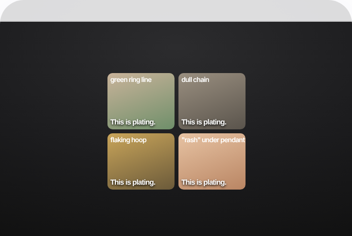

# 95 · Visual-diagnosis roll-call ("This is X. This is X. That's X." symptom montage → hidden cause)

<!-- HERO:START -->
[](EXAMPLE.md)

**[See the example and how to make it →](EXAMPLE.md)**
<!-- HERO:END -->


> **LC priority P1** · evidence: High (multi-brand engine) · hype risk: Medium · cost $0-200 · 2-4 h

## What it is
The ad opens on a rapid montage of everyday symptoms, each captioned with the same label ("This is clogged arteries"), so the viewer re-attributes many small annoyances to one hidden cause. Then it explains the cause (often with CGI) and presents the one product that "reaches" it. Resilia calls the move cause relocation: every complaint gets the same root.

## Why it works
- Repetition plus a visual makes the reframe stick in 5 seconds, even muted.
- The viewer self-diagnoses: "I have that one".
- One cause absorbs many symptoms, so one script reskins for dozens of avatars and pages.
- Works as hooks for statics, carousels and long VSLs alike.

## Shot-by-shot (LC version)

| Time / slot | Visual | Audio / copy |
|---|---|---|
| 0:00-0:06 | Quick cuts: green ring line on a finger, dull chain, flaking gold on a hoop, a rash under a pendant | On-screen + VO each time: "This is plating." |
| 0:06-0:25 | Macro or CGI: thin gold paint on brass, worn through by water and sweat | "Plating is a layer of gold paint thinner than a hair. Water gets under it." |
| 0:25-0:45 | Bonded PVD explainer + shower demo | "14K PVD is bonded to steel. Nothing to wear off." |
| 0:45-0:55 | Offer | "Any 7 for $85. Never take it off." |

## Hooks (swap-in openers)
- "This is plating. This is plating. This green line? Plating."
- "If your necklace does this, it was never gold."
- "Every one of these is the same problem."

## Real examples from X (studied)
- Resilia ads in the public GetHookd board preview open "This is clogged arteries. This is clogged arteries. This is clogged arteries… It's not aging. It's calcium." (transcribed; 117 days live) ([board](https://app.gethookd.ai/share/board/331297?signature=67e55d45fd1139ee96a9b3b8ec4d776be0d3b45520e1ff38ce31cd44463a926c)).
- @lorenzo_pravata: "jaw clenching, skin that crawls at night, waking up at 2-3am… after each one the line is the same: 'That's parasites'"; the relocation "absorbs almost any complaint" ([article](https://x.com/lorenzo_pravata/status/2065407167515984348)).
- Felipe Gomes (LinkedIn): Lymphoria's 3,600-ad engine = "specific symptom → reframe → hidden villain → sludge/buildup → 4 herbs → timeline → discount/guarantee" ([post](https://www.linkedin.com/posts/felipe-gomes-617a70263_i-analyzed-lymphoria-a-dtc-brand-running-activity-7465831063827804160-8M2M)).
- AdWhispr sample of 169 Resilia ads: 60% animation, 64% authority hooks ([page](https://adwhispr.com/library/brands/resilia)).

## Production recipe
1. List 5-6 visible jewelry "symptoms" (green ring line, dull chain, flaking, itchy rash, broken clasp after the pool).
2. Shoot each as a 1-second macro shot; caption with the same label.
3. Reveal: plating vs bonded PVD in one sentence + demo.
4. Make a static carousel version (one symptom per card).

## Bot prompt (copy into the creative agent)
```
Write 3 visual-diagnosis roll-call hooks for LC: 5 one-second jewelry "symptoms" each captioned with the same label, then a 2-sentence cause explanation (plating wears through) and the LC fix (bonded 14K PVD). No health claims (do not imply allergies are cured).
```

## 3 LC scripts
- A · "This is plating" montage.
- B · "That's not you, that's brass" (green skin).
- C · Carousel: 5 symptom cards + 1 fix card.

## Variants to test
- Label wording
- Montage length 4 vs 8 s
- Real photos vs CGI

## Omni test plan
- **Budget/structure:** 3 hooks on one body, $40/day each, 5 days
- **Primary KPIs:** 3 s hold, CTR, CPA; Omni (F95-*)
- **Kill rule:** Hold <30%
- **Scale rule:** Winning hook → all LC long-form bodies
- **Naming:** `utm_content=F95-<concept>-<variant>`; weekly Omni roll-up of new-customer revenue by format.

## Compliance
Baseline: [_COMPLIANCE.md](../_COMPLIANCE.md) (no fake testimonials, AI disclosure, no bulk/spoofed accounts, copy structure not assets, PDP-only claims).
- Show real photos of real issues; no fake medical framing ("rash" is ok only as a customer-reported symptom; don't claim hypoallergenic unless substantiated).
- Resilia's version carries disease claims (arteries, parasites) that LC must never imitate.

## Related
- Strategies: 10-skit-and-problem-first-ugc-hooks, 35-mass-awareness-placement-to-advertorial
- Formats: [34-callout-statics-signs-myths-warnings](../34-callout-statics-signs-myths-warnings/README.md), [59-problem-solution-pas-ad](../59-problem-solution-pas-ad/README.md), [82-hyperreal-cgi-mechanism-xray](../82-hyperreal-cgi-mechanism-xray/README.md)

<!-- EVIDENCE:START -->
## Evidence from X discovery (auto-generated)

| Date | Author | Post | Engagement | Grade | Gist |
|---|---|---|---|---|---|
| 2026-06-12 | [@lorenzo_pravata](https://x.com/lorenzo_pravata) | [link](https://x.com/lorenzo_pravata/status/2065407167515984348) | 71L/148BM/18kV | VALUE | Resilia 6,000 ads, parasite cause-relocation angle, "That's parasites" roll-call, carvacrol gate; 10+ subpages to avoid bans. |
<!-- EVIDENCE:END -->
