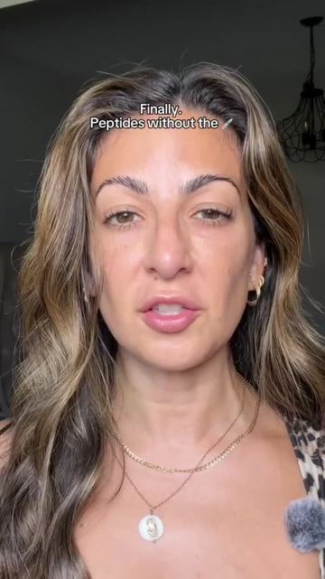
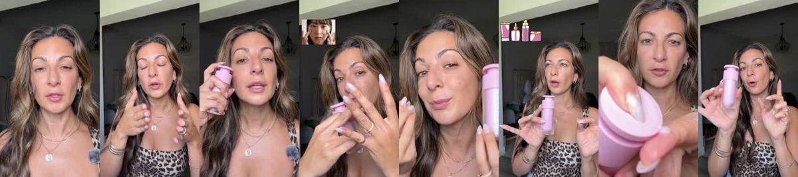
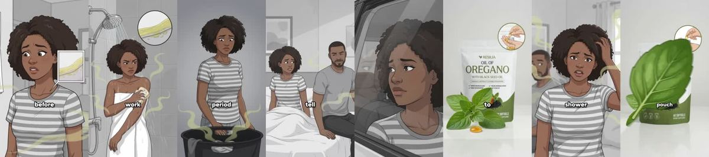

# Meta ad-library examples for F95

<!-- WAVE6 -->
## Wave 6: Resilia & Smooche live Meta ads (Oct 2026)

Pulled from the public Meta Ad Library on 2026-10-09 (Resilia: aged garlic, Ceylon cinnamon, oil of oregano; Smooche: color-changing foundation, Reverse Time peptide serum). Days live are counted to 2026-10-09; most video ads were new tests that week, while the long runners are statics and catalog templates. Transcripts are automatic. Brand claims are the advertisers', not verified, and many are health claims we would never make. The **Do not copy** line flags deceptive tactics (persona "publication" pages, undisclosed AI actors and "experts", fake stock counts).

### Smooche · Smooche: “If this drips on like this, you need peptides. If you have bags under…” (4 days live)

- **Ad:** [Meta Ad Library #1532795755534228](https://www.facebook.com/ads/library/?id=1532795755534228) · video 1:06 · page “Smooche” · started 2026-10-04 · 2 copies · lands on `smooche.com/products/reverse-time-peptide-serum`
- **What happens:** Opens: “If this drips on like this, you need peptides. If you have bags under your eyes, you need peptides.”
- **Why it works:** A roll-call of symptoms ("If this drips like this, you need peptides. If you have bags…") lets each viewer find their own problem inside 10 seconds.
- **How to make one:** Give 4-6 rapid "If you have X, you need Y" lines, each over a close-up, then the product.
- **LC remake:** "If your necklace turns green, you need PVD. If your earrings itch, you need PVD. If your rings tarnish in the shower…"

Transcript (auto, first ~70 s)

> If this drips on like this, you need peptides. If you have bags under your eyes, you need peptides. If this is looking like this, you need peptides. And if you have a turkey neck, you definitely need peptides. And as a 40-year-old with aging skin, what we're not going to do is listen to the teeny bobbers telling us what to do. We're going to listen to the 40s, the 50s, the 60-year-olds that are actually getting results. You put it here, here, here, and here. This is Smooch Reversed Time peptide serum. And it's a multi-benefit serum made for the look of fine lines, dark spots, dullness, and uneven tones. It's made with peptides, the same peptides that people are literally shooting up to the bloodstream. But Smooch figured out how your skin can actually absorb them. It's going to help with those fine lines of wrinkles, brighter looking skin, and of course, the hydrated look. The fact that I was using so many separate bottles when I could have just been doing this this whole time. And I did not expect for this to be the first thing I'm reaching for before I makeup. Now I don't feel ugly without makeup. Your makeup has been settling into dry patches. Maybe it's time to give this peptide serum a dry. The only thing is anything that Smooch puts out usually does sell out, so hopefully you can get your hands on them too. And if you don't see it above my name, they probably just hold out again, sorry.

### Resilia · Natural Defense Report: “If you smell yourself the week before your period, you're already at…” (1 day live)

- **Ad:** [Meta Ad Library #1634124788354262](https://www.facebook.com/ads/library/?id=1634124788354262) · video 1:53 · page “Natural Defense Report” · started 2026-10-07 · 1 copies · lands on `resilia.shop/products/resilia-oil-of-oregano-softgels`
- **What happens:** Opens: “If you smell yourself the week before your period, you're already at stage one. There are five.”
- **Why it works:** A roll-call of symptoms ("If this drips like this, you need peptides. If you have bags…") lets each viewer find their own problem inside 10 seconds.
- **How to make one:** Give 4-6 rapid "If you have X, you need Y" lines, each over a close-up, then the product.
- **LC remake:** "If your necklace turns green, you need PVD. If your earrings itch, you need PVD. If your rings tarnish in the shower…"

Transcript (auto, first ~70 s)

> If you smell yourself the week before your period, you're already at stage one. There are five. Number one, week before your period. You smell yourself and tell yourself it's hormones. It's not your hormones. It's bad bacteria. You're sticky shield on your vaginal walls and it gets thicker every cycle. Number two. The second shower. One before work. One at lunch. Body spray in your purse just in case. Soak, it's behind the shield. Number. Three. The checking. The checking. You smell your underwear before they go in the hamper. Pads every day. Not even for your period. You sit on the edge of the couch in case... anybody gets close. He goes down there, stops and comes back up with that look. So now you pull him up before he gets there and you tell him you're tired. Number five. It's just you. Your tests come back clean. Your gyno says some women just smell like that. So you believe her. You think you're dirty. Five warnings. All from one shield of bad bacteria on your vaginal walls. While the film washes, the boric acid and the probiotics never...

<!-- /WAVE6 -->

