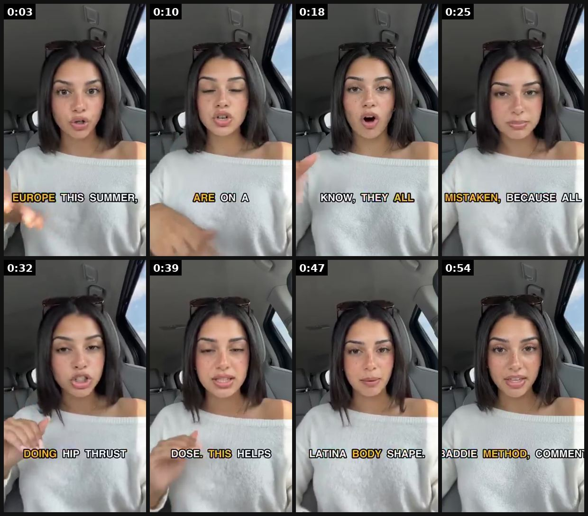

# 96 · Result reveal → expert stitch ('Y'all, this is my dad… after listening to this man. Just listen.'): see it, then make it

[](https://x.com/CalixAVelarde/status/2083448214431351004)

**The example:** [@CalixAVelarde on X](https://x.com/CalixAVelarde/status/2083448214431351004) · 0:58 video · 4 likes, 461 views

**Watch it:** [open the post on X](https://x.com/CalixAVelarde/status/2083448214431351004) · [play the video file](https://video.twimg.com/amplify_video/2083448093736091648/vid/avc1/320x568/SQurizgcr-70hrar.mp4?tag=29)

> this girl-in-car ai ugc format is actually insane this entire clip is ONE generation i didn't stitch anything together. dropped the script in and it came back talking, in the car, start to finish i've run this format to death for ecom brands and cracked the exact setup that https://t.co/TXs7qBd8jG

## What you are seeing

A girl in a car talking to camera with bold yellow word-by-word captions ("EUROPE THIS SUMMER", "DOING HIP THRUST"): a result-reveal story told AI-UGC style.

## Beat by beat

The storyboard above samples the video every 0:07. Lines are the transcript for that stretch; on-screen text comes from OCR, so treat it as rough.

| Frame | Time | On screen | Said / sung |
|---|---|---|---|
| 1 | 0:00–0:07 | · | This is definitely going to trigger a lot of you girls but if you're letting your man go Europe this summer just know he is going to be cracking cheeks every single night |
| 2 | 0:07–0:14 | · | I've lived in Spain for almost two years now and these, these girls are on a whole other level I have around three Spanish girlfriends |
| 3 | 0:14–0:21 | · | and their looks maxing is top tier these girls know what to take your man little did I know they all follow this thing called the el truco de belleza or in in English, the baddie method |
| 4 | 0:21–0:29 | · | if you think these girls are just blessed with amazing genetics then you are sorely mistaken because all these beautiful Europeans are using the exact same formula |
| 5 | 0:29–0:36 | · | so let me put you on game first of all your booty three days a week maximum only doing hip thrust squats, RDLs progressive overload that's it |
| 6 | 0:36–0:43 | · | aesthetics and that ass both got to be on point you need a daily creatine dose this helps you lift more in the gym so you can build that booty quicker |
| 7 | 0:43–0:50 | · | and it adds water to hips, thighs and booty cheeks this gets you that Latina body shape everyone be using the bulk creatine gummies for this |
| 8 | 0:50–0:58 | · | I got a run I'm about to go into work but if you want the rest of the baddie method comment I'm a baddie and I'll send it over to y'all |

<details><summary>Full transcript (timestamped)</summary>

- `0:00` This is definitely going to trigger a lot of you girls
- `0:02` but if you're letting your man go Europe this summer
- `0:04` just know he is going to be cracking cheeks every single night
- `0:07` I've lived in Spain for almost two years now
- `0:10` and these, these girls are on a whole other level
- `0:12` I have around three Spanish girlfriends
- `0:13` and their looks maxing is top tier
- `0:15` these girls know what to take your man
- `0:17` little did I know they all follow this thing called the el truco de belleza
- `0:20` or in in English, the baddie method
- `0:22` if you think these girls are just blessed with amazing genetics
- `0:24` then you are sorely mistaken
- `0:25` because all these beautiful Europeans are using
- `0:27` the exact same formula
- `0:28` so let me put you on game
- `0:30` first of all your booty
- `0:31` three days a week maximum only doing hip thrust squats, RDLs
- `0:34` progressive overload that's it
- `0:35` aesthetics and that ass both got to be on point
- `0:38` you need a daily creatine dose
- `0:39` this helps you lift more in the gym
- `0:41` so you can build that booty quicker
- `0:43` and it adds water to hips, thighs and booty cheeks
- `0:46` this gets you that Latina body shape
- `0:48` everyone be using the bulk creatine gummies for this
- `0:51` I got a run I'm about to go into work
- `0:52` but if you want the rest of the baddie method
- `0:54` comment I'm a baddie and I'll send it over to y'all

</details>

## How to make one like it

**The format in one line:** Two layers in one vertical video: a relatable person shows a result on someone close (their dad, themselves on Day 1 vs Day 42) and credits "this woman/this man", then the video hands over to an expert clip that explains the mechanism. The personal result earns attention; the expert carries the explanation.

**Why it works:** - Third-person proof ("my dad") feels less like bragging and more like a recommendation. - "Just listen" sets up the expert as a discovery, not an ad. - Stitch/duet grammar is native to TikTok and Reels. - The expert clip can be reused under many result intros.

**Contents:** [1. Structure](#1-copy-the-structure) · [2. Shot by shot](#2-shot-by-shot-remake) · [3. Script and hooks](#3-write-the-script) · [4. Prompts](#4-prompts) · [5. Tools and settings](#5-tools-and-settings) · [6. Louise Carter remake](#6-louise-carter-remake) · [7. Variants and test](#7-variants-and-test-plan) · [8. Pitfalls](#8-pitfalls)

### 1. Copy the structure

Use the example's timing as your beat sheet. Keep the beat, change the words and the product.

| Beat | Time | In the example | Your version |
|---|---|---|---|
| 1 | 0:03 | This is definitely going to trigger a lot of you girls but if you're letting your man go Europe this summer just know he is going to be crac | … |
| 2 | 0:10 | I've lived in Spain for almost two years now and these, these girls are on a whole other level I have around three Spanish girlfriends | … |
| 3 | 0:18 | and their looks maxing is top tier these girls know what to take your man little did I know they all follow this thing called the el truco d | … |
| 4 | 0:25 | if you think these girls are just blessed with amazing genetics then you are sorely mistaken because all these beautiful Europeans are using | … |
| 5 | 0:32 | so let me put you on game first of all your booty three days a week maximum only doing hip thrust squats, RDLs progressive overload that's i | … |
| 6 | 0:39 | aesthetics and that ass both got to be on point you need a daily creatine dose this helps you lift more in the gym so you can build that boo | … |
| 7 | 0:47 | and it adds water to hips, thighs and booty cheeks this gets you that Latina body shape everyone be using the bulk creatine gummies for this | … |
| 8 | 0:54 | I got a run I'm about to go into work but if you want the rest of the baddie method comment I'm a baddie and I'll send it over to y'all | … |

### 2. Shot-by-shot remake

**Target length / size:** 30-60s

| # | Time / slot | What we see (visual + camera) | Dialogue / on-screen text |
|---|---|---|---|
| 1 | 0-10s | A result on someone close | "Y'all, this is my mom after 6 months of wearing it in the pool." |
| 2 | 10-40s | Stitch to the source (your expert or founder) | - |
| 3 | End | - | CTA |

<details><summary>Playbook shot list (Louise Carter version from the README)</summary>

| Time / slot | Visual | Audio / copy |
|---|---|---|
| 0:00-0:08 | Daughter holds up a photo of mom's green-stained wrist, then mom now wearing an LC stack in the pool | "Y'all, this is my mom's wrist last summer. This is her now. Just listen to this woman." |
| 0:08-0:45 | Stitched clip: LC jeweller or founder at the bench | "Most gold jewelry is plated: a layer thinner than a hair over brass. We bond 14K PVD to steel…" |
| 0:45-0:55 | Back to daughter + CTA | "She hasn't taken it off in a year. Link's below." |

</details>

### 3. Write the script

Open with one of these hooks (first 1–3 seconds, or the headline on a static):

- "Y'all, this is my mom's wrist last summer. Just listen."
- "Day 1 vs day 365 of never taking it off."
- "I didn't believe this woman until I tried it."

Then fill the beats from the table above. Pull the wording from real customer reviews, not from ad copy: a review line beats a copywriter line almost every time. Read every line out loud and cut anything you would not say to a friend. Ready-made Louise Carter scripts are in section 6; hand [BOT.md](BOT.md) to any AI agent to write versions for another brand.

### 4. Prompts

**TikTok Stitch**

```text
Stitch your own or licensed source clip; keep the reveal under 10s.
```

**Full creative-agent prompt (from the playbook):**

```
Write 5 result-reveal intros (≤8 s each) from real LC customer stories {{STORIES}} and one 35-second expert explanation of bonded 14K PVD for the stitch. No exaggerated results.
```

### 5. Tools and settings

1. Film 1 expert clip (founder or jeweller) explaining PVD in 30-40 s.
2. Collect real customer result intros (with consent) and stitch each onto the expert clip.
3. Keep the result honest: time worn, what she did (showers, pool).

| Setting | Value |
|---|---|
| Canvas | 1080×1920 (9:16) master; crop a 1080×1350 (4:5) cut for feed placements |
| Frame rate | 30 fps (shoot 60 fps for slow-motion water or sparkle shots) |
| Camera | Phone main lens at 1x, exposure locked on skin, HDR off, grid on; tripod or a phone clamp for product shots |
| Light | One soft key at 45° (window or ring light), white card as fill; side light for metal sparkle |
| Audio | Lavalier or phone 15–20 cm from the mouth; mix voice at -14 LUFS, music at -28 to -30 dB under voice |
| Captions | Burned in, 2–5 words per line, 64–80 px bold sans, white with a black stroke or pill; keep text inside the safe zone (top 220 px and bottom 420 px clear, 64 px side margins) |
| Pacing | A visual change every 1.5–3 s; the hook lands in the first 1.5 s with no logo intro |
| Edit / export | CapCut or Premiere; H.264, 12–20 Mbps, AAC 320 kbps; upload natively to each platform, not via links |

### 6. Louise Carter remake

- A · Daughter → mom.
- B · Day 1 vs Day 365 selfie.
- C · Husband shows wife's gift a year later.

Brand rules, claims you can and cannot make, and more scripts: [brands/louise-carter.md](brands/louise-carter.md). Step-by-step from idea to scale: [STAGES.md](STAGES.md).

### 7. Variants and test plan

- Third-person vs self
- Expert = founder vs jeweller

**Test plan:** - **Budget/structure:** 5 intros × 1 expert, $30/day each, 7 days - **Primary KPIs:** Hold to expert, CPA; Omni (F96-*) - **Kill rule:** CPA >2× after $100 - **Scale rule:** Winning intro → Spark ad - **Naming:** `utm_content=F96-<concept>-<variant>`; weekly Omni roll-up of new-customer revenue by format.

**Naming:** `F96-<variant>-<hook##>-<date>` so results map back to this folder. Change one thing per test (hook, narrator, length or offer), never two.

### 8. Pitfalls

- Results must be real.
- Slow open: if the first 1.5 s does not show the hook visually, most people swipe.
- Logo or brand intro at the start reads as an ad; put the brand at the end.
- Captions covered by the platform UI: check the safe zone on a real phone before posting.
- Music over the voice: keep music at least 14 dB under speech.

**Compliance:** Baseline: [_COMPLIANCE.md](../_COMPLIANCE.md) (no fake testimonials, AI disclosure, no bulk/spoofed accounts, copy structure not assets, PDP-only claims). - Results and people must be real; Resilia's "expert" and medical claims are exactly what LC must not copy. - Disclose any paid creator (#ad).

## More examples

Every post we found for this format, with transcripts: [examples/](examples/README.md). Playbook: [README.md](README.md). Agent brief: [BOT.md](BOT.md).
