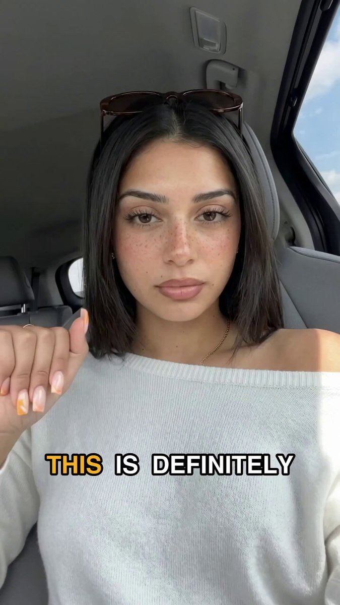

# 96 · Result reveal → expert stitch ("Y'all, this is my dad… after listening to this man. Just listen.")

<!-- HERO:START -->
[](EXAMPLE.md)

**[See the example and how to make it →](EXAMPLE.md)** · [watch on X](https://x.com/CalixAVelarde/status/2083448214431351004)
<!-- HERO:END -->


> **LC priority P2** · evidence: Medium (live long-runners) · hype risk: Medium · cost $0-150 · 2-3 h

## What it is
Two layers in one vertical video: a relatable person shows a result on someone close (their dad, themselves on Day 1 vs Day 42) and credits "this woman/this man", then the video hands over to an expert clip that explains the mechanism. The personal result earns attention; the expert carries the explanation.

## Why it works
- Third-person proof ("my dad") feels less like bragging and more like a recommendation.
- "Just listen" sets up the expert as a discovery, not an ad.
- Stitch/duet grammar is native to TikTok and Reels.
- The expert clip can be reused under many result intros.

## Shot-by-shot (LC version)

| Time / slot | Visual | Audio / copy |
|---|---|---|
| 0:00-0:08 | Daughter holds up a photo of mom's green-stained wrist, then mom now wearing an LC stack in the pool | "Y'all, this is my mom's wrist last summer. This is her now. Just listen to this woman." |
| 0:08-0:45 | Stitched clip: LC jeweller or founder at the bench | "Most gold jewelry is plated: a layer thinner than a hair over brass. We bond 14K PVD to steel…" |
| 0:45-0:55 | Back to daughter + CTA | "She hasn't taken it off in a year. Link's below." |

## Hooks (swap-in openers)
- "Y'all, this is my mom's wrist last summer. Just listen."
- "Day 1 vs day 365 of never taking it off."
- "I didn't believe this woman until I tried it."

## Real examples from X (studied)
- Resilia ad (public GetHookd preview): "Y'all this is my father. The doctor said this is from clogged arteries… And this is what he looks like now after listening to this man… Just listen" → expert monologue (transcribed) ([board](https://app.gethookd.ai/share/board/331297?signature=67e55d45fd1139ee96a9b3b8ec4d776be0d3b45520e1ff38ce31cd44463a926c)).
- Resilia ad (same board): "Okay, this is day one of taking this aged garlic thing… Day 42… this woman, she knew exactly what she was talking about. Watch this" → podium expert clip (transcribed).

## Production recipe
1. Film 1 expert clip (founder or jeweller) explaining PVD in 30-40 s.
2. Collect real customer result intros (with consent) and stitch each onto the expert clip.
3. Keep the result honest: time worn, what she did (showers, pool).

## Bot prompt (copy into the creative agent)
```
Write 5 result-reveal intros (≤8 s each) from real LC customer stories {{STORIES}} and one 35-second expert explanation of bonded 14K PVD for the stitch. No exaggerated results.
```

## 3 LC scripts
- A · Daughter → mom.
- B · Day 1 vs Day 365 selfie.
- C · Husband shows wife's gift a year later.

## Variants to test
- Third-person vs self
- Expert = founder vs jeweller

## Omni test plan
- **Budget/structure:** 5 intros × 1 expert, $30/day each, 7 days
- **Primary KPIs:** Hold to expert, CPA; Omni (F96-*)
- **Kill rule:** CPA >2× after $100
- **Scale rule:** Winning intro → Spark ad
- **Naming:** `utm_content=F96-<concept>-<variant>`; weekly Omni roll-up of new-customer revenue by format.

## Compliance
Baseline: [_COMPLIANCE.md](../_COMPLIANCE.md) (no fake testimonials, AI disclosure, no bulk/spoofed accounts, copy structure not assets, PDP-only claims).
- Results and people must be real; Resilia's "expert" and medical claims are exactly what LC must not copy.
- Disclose any paid creator (#ad).

## Related
- Strategies: 11-social-proof-credibility-engine, 36-owned-winner-video-remix
- Formats: [18-green-screen-reaction-and-comment-reply](../18-green-screen-reaction-and-comment-reply/README.md), [28-reaction-hook-plus-demo](../28-reaction-hook-plus-demo/README.md), [40-testimonial-mashup](../40-testimonial-mashup/README.md)

<!-- EVIDENCE:START -->
## Wave 3 update: Meta ad-library long-runners (Fedotoff gut-health board)
- Smriti Kochar: Nutritionist 3-product stack explainer (Hinglish), 301 days live. An expert-recommended routine sells a bundle, not a single SKU; mixing local language keeps it native for the market.
- Stills, transcripts and LC remakes: [adlibrary/](adlibrary/README.md).

## Wave 4 update: Fedotoff October 2026 swipe boards
- BioRoot Labs: Podcast-plus-doctor stitched explainer (turmeric), 345 days live (AI Storytelling Ads: 13 Brands x 50 Longest-Running board). It mixes podcast credibility with doctor stitches; 32 media variations of one idea.
- Stills, how-to and LC remakes: [adlibrary/](adlibrary/README.md).

## Evidence from X discovery (auto-generated)

| Date | Author | Post | Engagement | Grade | Gist |
|---|---|---|---|---|---|
<!-- EVIDENCE:END -->
