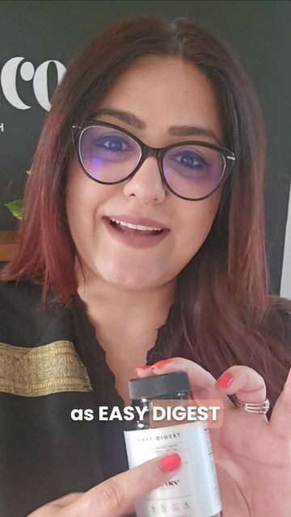

# Meta ad-library examples for F96 (GetHookd board 155932, gut health)

From [@FedotOff90](https://x.com/FedotOff90/status/2108212319113412929)'s public board preview. Days live are as of 2026-10-09. Full board breakdown is in the internal sources folder.

## Smriti Kochar: Nutritionist 3-product stack explainer (Hinglish) (301 days live)

- **What happens:** Smriti Kochar (nutritionist) talks to camera, cut with gym b-roll and belly close-up: 'Major pain point for men and women is belly fat…' then presents 3 products (digestion, gallbladder, cortisol) as a routine, 'try all three for a month'.
- **Why it lasts:** 301 days live. An expert-recommended routine sells a bundle, not a single SKU; mixing local language keeps it native for the market.
- **How to make one:** Expert talking head + 4-6 b-roll cutaways, 70-80 s, product held up at each mention, captions.
- **LC remake:** Stylist presents 'the 3 pieces I tell every bride to own' (necklace, huggies, bracelet) as a routine → bundle.

Transcript

> Major pain point for men and women is belly fat. Kirtna bhi exercise kardo, it doesn't go by. Most of the belly fat guys is a body's response to stress and cortisol and indigestion. If you don't digest proteins, where you don't digest fats, where you don't break down your liver is fatty and your high cortisol. We have the perfect solution for you. And the solution is something called as easy digest. This is to break down all the protein you eat. Protein shakes, eggs, chicken, dals, whatever protein you eat. This will melt your inches. Big time. The other great product we have is gallbladder support. This is made for choked gallbladder than fatty liver. When your liver is fatty, the bile starts to thicken. You can't break down fats and cholesterol starts to rise. This is your answer. Yeh leti, with every meal you will see your inches melting. Literally all the cholesterol that comes out of your body. And cortisol support made of adeptogens, ashram, etc. This is meant to be taken at night before sleeping. You will see a lot of change in how you look the next morning and how deep you sleep. And these are your formulas for that very fat that just doesn't go away. You try it for a month all these three and give me your feedback. You will see a very positive change.

