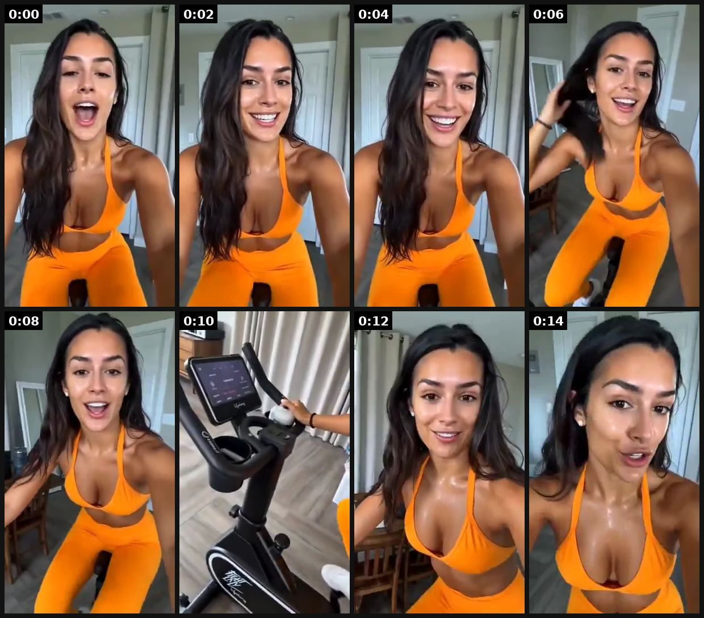
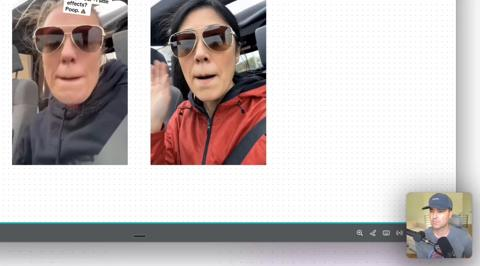
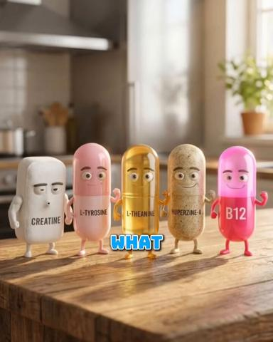
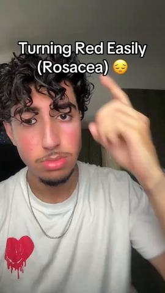

# 97 · Persona-swap script cloning (one winning script, re-told by 6-10 different narrators and settings): see it, then make it

[](https://x.com/SparkifyAI/status/2078068798314422644)

**The example:** [@SparkifyAI on X](https://x.com/SparkifyAI/status/2078068798314422644) · 0:15 video · 57 likes, 5K views

**Watch it:** [open the post on X](https://x.com/SparkifyAI/status/2078068798314422644) · [play the video file](https://video.twimg.com/amplify_video/2078068780241199104/vid/avc1/320x568/xLHWLrGbKxDcMWpt.mp4?tag=14)

> Real UGC creators are becoming optional. This video is 100% AI-generated with Arcads. Why spend time sourcing creators, coordinating shoots, and managing revisions when you can generate hyper-realistic UGC videos in minutes? Arcads has perfected: • Cost (a fraction of traditional UGC production) • Audio & Video (natural voices and realistic creator-style content) • Scale (E-commerce, SaaS, Apps, generate unlimited va…

## What you are seeing

An AI-cloned UGC creator in an orange gym set talking excitedly to camera in a home gym. It is the same script performed by an AI persona instead of a real creator.

## Beat by beat

The storyboard above samples the video every 0:01. Lines are the transcript for that stretch; on-screen text comes from OCR, so treat it as rough.

| Frame | Time | On screen | Said / sung |
|---|---|---|---|
| 1 | 0:00–0:01 | · | · |
| 2 | 0:01–0:03 | · | Okay, I genuinely thought this was going to be easy. It's definitely not. But honestly, |
| 3 | 0:03–0:05 | · | · |
| 4 | 0:05–0:07 | · | · |
| 5 | 0:07–0:09 | · | it's such a good workout. I've been using this at home almost every day |
| 6 | 0:09–0:11 | · | · |
| 7 | 0:11–0:13 | he a we | · |
| 8 | 0:13–0:15 | · | and not having to leave the house is the best part. You need this. |

<details><summary>Full transcript (timestamped)</summary>

- `0:00` Okay, I genuinely thought this was going to be easy. It's definitely not. But honestly,
- `0:06` it's such a good workout. I've been using this at home almost every day
- `0:11` and not having to leave the house is the best part. You need this.

</details>

## More real examples (6)

Other posts that show this format, or a close cousin of it. Click a thumbnail to open it on X.

| | | |
|---|---|---|
| [](https://x.com/mikefutia/status/2080734489529971056)<br>**@mikefutia** · 0:10 video · 4K views<br>I just cracked the code on cloning UGC ads with AI 🤯 One ad that's already converting → 20 different creators delivering the exact same script. New fa | [](https://x.com/lorenzo_pravata/status/2079246318191403496)<br>**@lorenzo_pravata** · 1:58 video · 5K views<br>Resilia ~8,000 ads, "$10-15M/month" (unverified); mostly AI avatars/doctors/claymation; gap = real authority reshoots + long unaware VSL. | [](https://x.com/edwardlavinel_/status/2082467046034702738)<br>**@edwardlavinel_** · 1:24 video · 127 views<br>Shit. Analyzed 800+ active ads from creatine gummy. one pattern doing all the work. want the beats? Here is the breakdown: - uses a magazine cutout ae |
| [](https://x.com/oliverxmedia/status/2075560773657694682)<br>**@oliverxmedia** · 0:21 video · 2K views<br>I genuinely had to do a double take the first time I watched this. If nobody told me it was AI-generated, I would've assumed it was filmed by a real c | [](https://x.com/wabilaura/status/2082918789470208150)<br>**@wabilaura** · 4:29 video · 486 views<br>Ladies in the algo. Dr turner from féline skinscience is printing. 800+ active ads and the winner is the same hook every time. why is nobody copying i | [](https://x.com/wabilaura/status/2083215336971858040)<br>**@wabilaura** · 4:29 video · 450 views<br>Ladies in the algo. Dr turner from féline skinscience is printing. 800+ active ads and the winner is the same hook every time. why is nobody copying i |

## How to make one like it

**The format in one line:** A production system rather than a single look: lock a winning script and its claims, then re-shoot it with many different narrators (age, ethnicity, setting, wardrobe) and visual treatments (to-camera, podcast, podium, animation), and launch each as a separate creative. Meta reads each persona/setting as a new creative, the script stays proven, and each audience segment sees someone like them.

**Why it works:** - The script is the proven asset; the narrator is the variable that finds new pockets of audience. - Different people and settings create genuinely different Entity IDs under Andromeda. - Lowers creative risk: you are only testing the messenger. - Resilia pairs it with 12+ persona Pages to split risk; that part is the compliance problem.

**Contents:** [1. Structure](#1-copy-the-structure) · [2. Shot by shot](#2-shot-by-shot-remake) · [3. Script and hooks](#3-write-the-script) · [4. Prompts](#4-prompts) · [5. Tools and settings](#5-tools-and-settings) · [6. Louise Carter remake](#6-louise-carter-remake) · [7. Variants and test](#7-variants-and-test-plan) · [8. Pitfalls](#8-pitfalls)

### 1. Copy the structure

Use the example's timing as your beat sheet. Keep the beat, change the words and the product.

| Beat | Time | In the example | Your version |
|---|---|---|---|
| 1 | 0:00 | Okay, I genuinely thought this was going to be easy. It's definitely not. But honestly, | … |
| 2 | 0:02 | Okay, I genuinely thought this was going to be easy. It's definitely not. But honestly, | … |
| 3 | 0:04 | Okay, I genuinely thought this was going to be easy. It's definitely not. But honestly, | … |
| 4 | 0:06 | it's such a good workout. I've been using this at home almost every day | … |
| 5 | 0:08 | it's such a good workout. I've been using this at home almost every day | … |
| 6 | 0:10 | it's such a good workout. I've been using this at home almost every day and not having to leave the house is the best part. You need this. | … |
| 7 | 0:12 | and not having to leave the house is the best part. You need this. | … |
| 8 | 0:14 | and not having to leave the house is the best part. You need this. | … |

### 2. Shot-by-shot remake

**Target length / size:** One locked script x 6-10 narrators, 20-40s each

| # | Time / slot | What we see (visual + camera) | Dialogue / on-screen text |
|---|---|---|---|
| 1 | Lock the script | Take a winning script (e.g. from F14 or F06) and freeze it word for word | - |
| 2 | Narrator 1-3 | Real creators of different ages (20s, 40s, 60s), each in their own setting (car, kitchen, beach) | Exactly the same words |
| 3 | Narrator 4-6 | Different ethnicities and styles; one man buying a gift | Same words, his own delivery |
| 4 | Narrator 7-10 | AI avatars (labelled) to fill gaps fast | Same words |
| 5 | Test | Launch all versions in one ad set with Dynamic Creative off | Naming F97-narratorNN |

<details><summary>Playbook shot list (Louise Carter version from the README)</summary>

| Time / slot | Visual | Audio / copy |
|---|---|---|
| Script lock | One 45-60 s script with fixed claims and a fixed CTA | "Your jewelry turned green because it was plated…" |
| Takes 1-8 | Same words: a 24-year-old nurse in scrubs, a 58-year-old grandmother at a kitchen table, a lifeguard, a bride, a gym owner, a jeweller at a bench | Each records the same script in her own voice |
| Launch | Each take = its own ad; same primary text; Omni tags by narrator | — |

</details>

### 3. Write the script

Open with one of these hooks (first 1–3 seconds, or the headline on a static):

- Same script, 8 narrators: hook stays identical
- "I'm a lifeguard. Here's the jewelry I never take off."
- "I'm 61 and this is the only necklace I swim in."

Then fill the beats from the table above. Pull the wording from real customer reviews, not from ad copy: a review line beats a copywriter line almost every time. Read every line out loud and cut anything you would not say to a friend. Ready-made Louise Carter scripts are in section 6; hand [BOT.md](BOT.md) to any AI agent to write versions for another brand.

### 4. Prompts

**Arcads / HeyGen**

```text
Upload the locked script, pick 4 avatars that differ in age and setting, export 9:16 and 4:5, burn captions in the same style as the real versions.
```

**Creator brief**

```text
Say the script exactly; film in your own space; 3 takes; natural light; phone at eye level.
```

**Full creative-agent prompt (from the playbook):**

```
Take the LC winning script {{SCRIPT}}. Produce 8 narrator briefs (age, job, setting, wardrobe, first-frame B-roll, one-line personal intro) that keep the script word-for-word after the intro. Diverse but authentic; every narrator must be a real paid creator with disclosure.
```

### 5. Tools and settings

1. Pick LC's current best-CPA script (any format).
2. Cast 8 real creators across ages 22-65 and settings (beach, kitchen, office, gym, bench).
3. Shoot all with the same script; vary only the first 2 seconds of B-roll.
4. Launch as 8 ads in one ad set; tag Omni by narrator; keep the winners, recast the losers.

| Setting | Value |
|---|---|
| Canvas | 1080×1920 (9:16) master; crop a 1080×1350 (4:5) cut for feed placements |
| Frame rate | 30 fps (shoot 60 fps for slow-motion water or sparkle shots) |
| Camera | Phone main lens at 1x, exposure locked on skin, HDR off, grid on; tripod or a phone clamp for product shots |
| Light | One soft key at 45° (window or ring light), white card as fill; side light for metal sparkle |
| Audio | Lavalier or phone 15–20 cm from the mouth; mix voice at -14 LUFS, music at -28 to -30 dB under voice |
| Captions | Burned in, 2–5 words per line, 64–80 px bold sans, white with a black stroke or pill; keep text inside the safe zone (top 220 px and bottom 420 px clear, 64 px side margins) |
| Pacing | A visual change every 1.5–3 s; the hook lands in the first 1.5 s with no logo intro |
| Edit / export | CapCut or Premiere; H.264, 12–20 Mbps, AAC 320 kbps; upload natively to each platform, not via links |

### 6. Louise Carter remake

- A · 8 real creators, same script.
- B · Same creator, 4 settings.
- C · Founder + 3 customers.

Brand rules, claims you can and cannot make, and more scripts: [brands/louise-carter.md](brands/louise-carter.md). Step-by-step from idea to scale: [STAGES.md](STAGES.md).

### 7. Variants and test plan

- Narrator age
- Setting
- Intro line

**Test plan:** - **Budget/structure:** 8 takes, $25/day each, 7 days - **Primary KPIs:** CPA by narrator; Omni (F97-*) - **Kill rule:** Bottom half after $75 each - **Scale rule:** Recast the losing slots monthly; scale the top 2 - **Naming:** `utm_content=F97-<concept>-<variant>`; weekly Omni roll-up of new-customer revenue by format.

**Naming:** `F97-<variant>-<hook##>-<date>` so results map back to this folder. Change one thing per test (hook, narrator, length or offer), never two.

### 8. Pitfalls

- Label AI avatars.
- Don't change the script while testing narrators, or you won't know what moved results.
- Match caption style across versions so only the narrator differs.
- Slow open: if the first 1.5 s does not show the hook visually, most people swipe.
- Logo or brand intro at the start reads as an ad; put the brand at the end.
- Captions covered by the platform UI: check the safe zone on a real phone before posting.
- Music over the voice: keep music at least 14 dB under speech.

**Compliance:** Baseline: [_COMPLIANCE.md](../_COMPLIANCE.md) (no fake testimonials, AI disclosure, no bulk/spoofed accounts, copy structure not assets, PDP-only claims). - Real, disclosed creators only. No AI doctors/nutritionists or fake persona Pages: Resilia runs 12 authority-persona Pages (e.g. "Dr. Anna Reyes", "Nutritionist Allison Langford, PhD"), and Rosabella is being sued over AI "doctors" (404 Media / Humann v. Ambrosia). - Keep claims identical across takes so compliance review happens once.

## Field notes

Newer observations live in the playbook: [Wave 3 update: brands & apps crushing it (Oct 2026)](README.md) · [Wave 4 update: Fedotoff October 2026 swipe boards](README.md)

## More examples

Every post we found for this format, with transcripts: [examples/](examples/README.md). Playbook: [README.md](README.md). Agent brief: [BOT.md](BOT.md).
