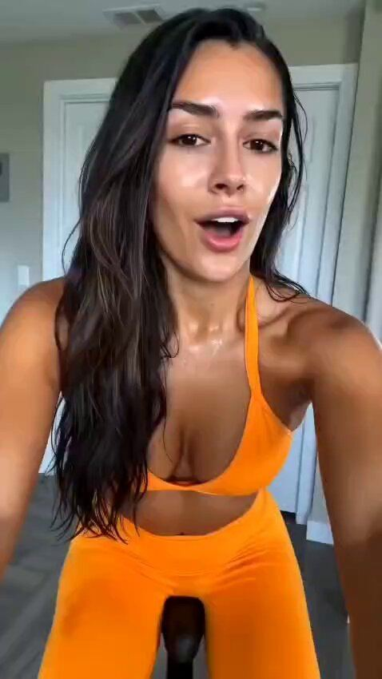

# 97 · Persona-swap script cloning (one winning script, re-told by 6-10 different narrators and settings)

<!-- HERO:START -->
[](EXAMPLE.md)

**[See the example and how to make it →](EXAMPLE.md)** · [watch on X](https://x.com/SparkifyAI/status/2078068798314422644)
<!-- HERO:END -->


> **LC priority P1** · evidence: High (the core of the highest-volume account in DTC) · hype risk: Medium · cost $50-150 per creator take · 1 week for 8 takes

## What it is
A production system rather than a single look: lock a winning script and its claims, then re-shoot it with many different narrators (age, ethnicity, setting, wardrobe) and visual treatments (to-camera, podcast, podium, animation), and launch each as a separate creative. Meta reads each persona/setting as a new creative, the script stays proven, and each audience segment sees someone like them.

## Why it works
- The script is the proven asset; the narrator is the variable that finds new pockets of audience.
- Different people and settings create genuinely different Entity IDs under Andromeda.
- Lowers creative risk: you are only testing the messenger.
- Resilia pairs it with 12+ persona Pages to split risk; that part is the compliance problem.

## Shot-by-shot (LC version)

| Time / slot | Visual | Audio / copy |
|---|---|---|
| Script lock | One 45-60 s script with fixed claims and a fixed CTA | "Your jewelry turned green because it was plated…" |
| Takes 1-8 | Same words: a 24-year-old nurse in scrubs, a 58-year-old grandmother at a kitchen table, a lifeguard, a bride, a gym owner, a jeweller at a bench | Each records the same script in her own voice |
| Launch | Each take = its own ad; same primary text; Omni tags by narrator | — |

## Hooks (swap-in openers)
- Same script, 8 narrators: hook stays identical
- "I'm a lifeguard. Here's the jewelry I never take off."
- "I'm 61 and this is the only necklace I swim in."

## Real examples from X (studied)
- GetHookd public board "Resilia.shop: Longest-Running Active Ads (Aug 2026)": 300 ads, 10-ad public preview; 4 different narrators/settings deliver the same clogged-arteries script, all 117 days live ([board](https://app.gethookd.ai/share/board/331297?signature=67e55d45fd1139ee96a9b3b8ec4d776be0d3b45520e1ff38ce31cd44463a926c)).
- Funnel of the Week: "They use about 3 to 4 ad copy templates total… across hundreds of different video creatives, each with different hooks, presenters, and visual styles" ([article](https://blog.funneloftheweek.com/p/12-facebook-pages-funnel-all-their-traffic-to-one-advertorial-4m-visits-mo)).
- @LachezarVoynov: "a minimum of 26 creative pods… 26 × 15 concepts/week × 3 variations = 1,170 new ads per week" ([post](https://x.com/LachezarVoynov/status/2107135814585000273)); creatives labelled Pod1…Pod26 and hosted unlisted on YouTube to accumulate views (@grok summary of @coleschfr thread, [post](https://x.com/grok/status/2105957466420703499)).
- @thevslguy: "resillia and lymphoria are running this same ad, but with their own mechanism/product in the end" ([post](https://x.com/thevslguy/status/2089344767293567232)).

## Production recipe
1. Pick LC's current best-CPA script (any format).
2. Cast 8 real creators across ages 22-65 and settings (beach, kitchen, office, gym, bench).
3. Shoot all with the same script; vary only the first 2 seconds of B-roll.
4. Launch as 8 ads in one ad set; tag Omni by narrator; keep the winners, recast the losers.

## Bot prompt (copy into the creative agent)
```
Take the LC winning script {{SCRIPT}}. Produce 8 narrator briefs (age, job, setting, wardrobe, first-frame B-roll, one-line personal intro) that keep the script word-for-word after the intro. Diverse but authentic; every narrator must be a real paid creator with disclosure.
```

## 3 LC scripts
- A · 8 real creators, same script.
- B · Same creator, 4 settings.
- C · Founder + 3 customers.

## Variants to test
- Narrator age
- Setting
- Intro line

## Omni test plan
- **Budget/structure:** 8 takes, $25/day each, 7 days
- **Primary KPIs:** CPA by narrator; Omni (F97-*)
- **Kill rule:** Bottom half after $75 each
- **Scale rule:** Recast the losing slots monthly; scale the top 2
- **Naming:** `utm_content=F97-<concept>-<variant>`; weekly Omni roll-up of new-customer revenue by format.

## Compliance
Baseline: [_COMPLIANCE.md](../_COMPLIANCE.md) (no fake testimonials, AI disclosure, no bulk/spoofed accounts, copy structure not assets, PDP-only claims).
- Real, disclosed creators only. No AI doctors/nutritionists or fake persona Pages: Resilia runs 12 authority-persona Pages (e.g. "Dr. Anna Reyes", "Nutritionist Allison Langford, PhD"), and Rosabella is being sued over AI "doctors" (404 Media / Humann v. Ambrosia).
- Keep claims identical across takes so compliance review happens once.

## Related
- Strategies: 03-creative-volume-flooding, 34-persona-archetype-ai-ugc-engine
- Formats: [43-hudson-method-creator-swarm](../43-hudson-method-creator-swarm/README.md), [05-ai-animation-format-swap](../05-ai-animation-format-swap/README.md), [77-ugc-voiceover-hook-swap-remix](../77-ugc-voiceover-hook-swap-remix/README.md)

<!-- EVIDENCE:START -->
## Wave 3 update: brands & apps crushing it (Oct 2026)
- Prime Prometics (mature-skin makeup): 2,828 active ads, 24 distinct avatars all women 40-65+, six of them life-event avatars (mother of the bride, reunion, divorcee, first date, local-news clip, church community), ~28 narrator personas across 11 types on 15 pages ([@FedotOff90](https://x.com/FedotOff90/status/2108188222710862166)); winning ad = a woman over 50 on colour-changing foundation, "doesn't sit in the creases": one objection killed in 7 words ([@edwardlavinel_](https://x.com/edwardlavinel_/status/2082829380376723726)).
- LC life-event avatars to clone into: bride, mother of the bride, bridesmaid, new mom, 40th-birthday trip, divorcee glow-up, retirement beach trip.

## Wave 4 update: Fedotoff October 2026 swipe boards
- Prime Prometics: Older-man talking head (Prime Prometics persona ad), 331 days live (Yapper Ads board). Fedotoff's avatar-diversity point: Prime Prometics runs 24 avatars and about 28 narrators; this one is a husband talking about his wife's result.
- Stills, how-to and LC remakes: [adlibrary/](adlibrary/README.md).

## Evidence from X discovery (auto-generated)

| Date | Author | Post | Engagement | Grade | Gist |
|---|---|---|---|---|---|
| 2026-04-15 | [@funneloftheweek](https://x.com/funneloftheweek) | [link](https://x.com/funneloftheweek/status/2044464896104857850) | 14L/23BM/3kV | VALUE | Resilia: 12 persona Pages → one 7-min advertorial (30-50% of traffic), 3-4 copy templates × hundreds of creatives, 544 new ads/30d, OTO flow $30→$83. |
| 2026-10-05 | [@LachezarVoynov](https://x.com/LachezarVoynov) | [link](https://x.com/LachezarVoynov/status/2107135814585000273) | 293L/256BM/28kV | SOME | Resilia ≥26 creative pods × 15 concepts × 3 variants ≈ 1,170 ads/week (estimate). |
| 2026-02-26 | [@holmisthename](https://x.com/holmisthename) | [link](https://x.com/holmisthename/status/2026947587450789980) | 244L/502BM/16kV | SOME | Top 8-9 fig DR brands printing with AI ads: Norse Organics, Gruns, Kovaria, Serene Herbs, Rosabella, Kind Patches, Happy Mammoth, Primal Queen, Resilia, 40 Plus & Fabulous, Emma, Nooro. |
| 2026-07-20 | [@lorenzo_pravata](https://x.com/lorenzo_pravata) | [link](https://x.com/lorenzo_pravata/status/2079246318191403496) | 56L/78BM/5kV | SOME | Resilia ~8,000 ads, "$10-15M/month" (unverified); mostly AI avatars/doctors/claymation; gap = real authority reshoots + long unaware VSL. |
| 2026-10-02 | [@grok](https://x.com/grok) | [link](https://x.com/grok/status/2105957466420703499) | 16L/38BM/3kV | SOME | Pod strategy: creatives labelled Pod1…Pod26, hosted unlisted on YouTube to build view counts (Pod26 420K views in 3 weeks). |
| 2026-08-17 | [@thevslguy](https://x.com/thevslguy) | [link](https://x.com/thevslguy/status/2089344767293567232) | 5L/2BM/1kV | SOME | Resilia and Lymphoria run the same ad with their own mechanism at the end. |
| 2026-09-30 | [@Best_OFPages](https://x.com/Best_OFPages) | [link](https://x.com/Best_OFPages/status/2105176364748054721) | 3L/1BM/0kV | SOME | Claim: Smooche (Ooak Brands) runs only AI ads at ~$1M/day (unverified). |
<!-- EVIDENCE:END -->
