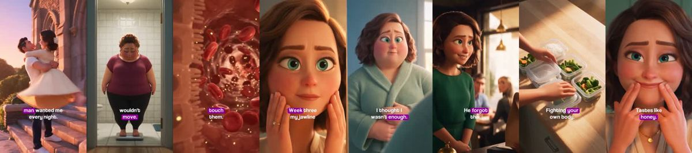
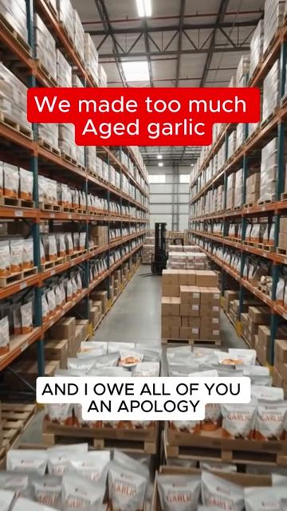
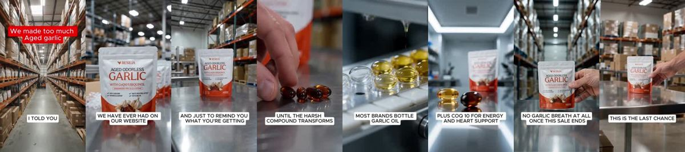
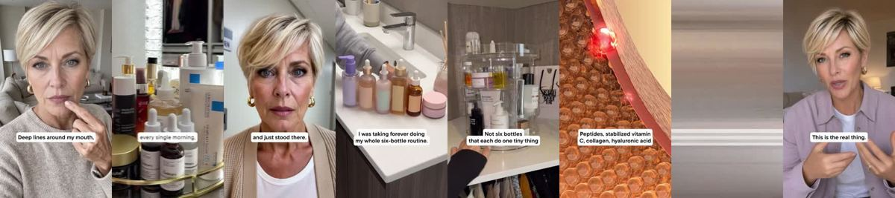
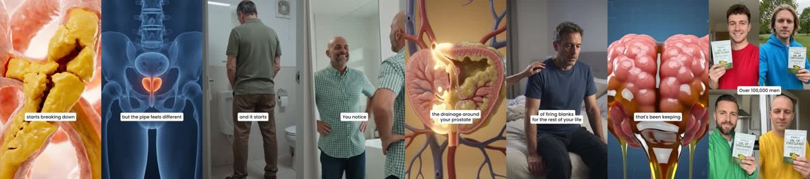
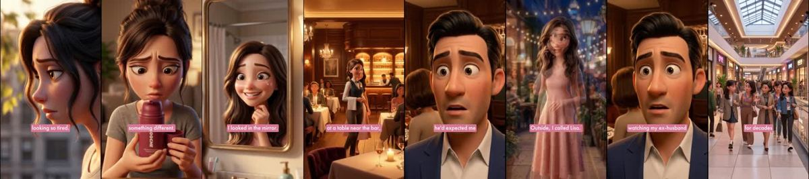

# Meta ad-library examples for F97

<!-- WAVE6 -->
## Wave 6: Resilia & Smooche live Meta ads (Oct 2026)

Pulled from the public Meta Ad Library on 2026-10-09 (Resilia: aged garlic, Ceylon cinnamon, oil of oregano; Smooche: color-changing foundation, Reverse Time peptide serum). Days live are counted to 2026-10-09; most video ads were new tests that week, while the long runners are statics and catalog templates. Transcripts are automatic. Brand claims are the advertisers', not verified, and many are health claims we would never make. The **Do not copy** line flags deceptive tactics (persona "publication" pages, undisclosed AI actors and "experts", fake stock counts).

### Resilia · Midlife Wellness Journal: “One night my husband asked me to keep my shirt on 22 years of marriage…” (0 days live)

- **Ad:** [Meta Ad Library #1704445254533342](https://www.facebook.com/ads/library/?id=1704445254533342) · video 4:49 · page “Midlife Wellness Journal” · started 2026-10-08 · 2 copies · lands on `resilia.shop/products/resilia-oil-of-oregano-softgels`
- **What happens:** Opens: “One night my husband asked me to keep my shirt on 22 years of marriage and that's what we've come, too He has no idea what that night cost him. We met when we were six Mary 22 years and for two…” The same script appears in 3 ads across 2 pages (Midlife Wellness Journal, Resilia).
- **Why it works:** Smooche and Resilia re-tell one winning script across many narrator pages (Natural Defense Report, Resilia, Gut Health Insider, Health Insider Daily…). The transcripts are word-for-word or nearly so.
- **How to make one:** Lock the script and swap the narrator, setting and first frame. Run each version from a different (real, disclosed) creator handle.
- **Do not copy:** The pages pose as independent reviews and publications. Running the same script from fake independent pages is deceptive. Use real creators who disclose the partnership.
- **LC remake:** One "I stopped buying cheap jewelry" script read by 6 real LC customers (age, style and city vary).

Transcript (auto, first ~70 s)

> One night my husband asked me to keep my shirt on 22 years of marriage and that's what we've come, too He has no idea what that night cost him. We met when we were six Mary 22 years and for two decades That man wanted me every night all of me lights on He couldn't keep his hands off me and somewhere it started to fade the new job lunches He never mentioned his phone face down and the lights went off and the night it couldn't Then he asked me to keep my shirt on I never said a word. What can you even say? Why won't you look at me? You can't ask that out loud. I blame my body the puppy face the jawline I'm bound to blow by dinner no matter what I hit and I try God knows I try The class is a polite he's walking every morning eating clean all week and the scale would have moved the mirror would have moved It felt like I was fighting my own body and losing I get ready for back some nights and catch my self hope in he look he never that my sister came over She saw it on my face she sat me down put us

### Resilia · Arterial Health Review: “I'm the founder of Resilia and I owe all of you an apology. I told you…” (1 day live)

- **Ad:** [Meta Ad Library #28840116722285872](https://www.facebook.com/ads/library/?id=28840116722285872) · video 0:52 · page “Arterial Health Review” · started 2026-10-07 · 1 copies · lands on `resilia.shop/products/resilia-aged-odorless-garlic`
- **What happens:** Opens: “I'm the founder of Resilia and I owe all of you an apology. I told you the last sale was the best price you'd ever get, and then we overproduced.” The same script appears in 2 ads across 2 pages (Arterial Health Review, Vascular Wellness Report).
- **Why it works:** Smooche and Resilia re-tell one winning script across many narrator pages (Natural Defense Report, Resilia, Gut Health Insider, Health Insider Daily…). The transcripts are word-for-word or nearly so.
- **How to make one:** Lock the script and swap the narrator, setting and first frame. Run each version from a different (real, disclosed) creator handle.
- **Do not copy:** The pages pose as independent reviews and publications. Running the same script from fake independent pages is deceptive. Use real creators who disclose the partnership.
- **LC remake:** One "I stopped buying cheap jewelry" script read by 6 real LC customers (age, style and city vary).

Transcript (auto, first ~70 s)

> I'm the founder of Resilia and I owe all of you an apology. I told you the last sale was the best price you'd ever get, and then we overproduced. This is the last chance to get the best deal we for a very long time.

### Smooche · Cosmetic Times: “I'm going to be a high loronic acid, a peptide serum, a night cream…” (4 days live)

- **Ad:** [Meta Ad Library #1705908880514674](https://www.facebook.com/ads/library/?id=1705908880514674) · video 2:37 · page “Cosmetic Times” · started 2026-10-04 · 2 copies · lands on `quiz.smooche.com/`
- **What happens:** Opens: “I'm going to be a high loronic acid, a peptide serum, a night cream, and none of it moved the needle. I was doing all of that because I had a trip booked.” The same script appears in 2 ads across 2 pages (Cosmetic Times, Vascular Wellness Report).
- **Why it works:** Smooche and Resilia re-tell one winning script across many narrator pages (Natural Defense Report, Resilia, Gut Health Insider, Health Insider Daily…). The transcripts are word-for-word or nearly so.
- **How to make one:** Lock the script and swap the narrator, setting and first frame. Run each version from a different (real, disclosed) creator handle.
- **Do not copy:** The pages pose as independent reviews and publications. Running the same script from fake independent pages is deceptive. Use real creators who disclose the partnership.
- **LC remake:** One "I stopped buying cheap jewelry" script read by 6 real LC customers (age, style and city vary).

Transcript (auto, first ~70 s)

> I'm going to be a high loronic acid, a peptide serum, a night cream, and none of it moved the needle. I was doing all of that because I had a trip booked. My college roommate Meena was turning 60 in soul, and I did not want to stand next to her, looking like her mother. I landed into her apartment and just stood there. She's about all 60 and she looks like she's in her 30s. I always figured it was genetics. I figured I just got unlucky. On, we were getting ready to move into the future, so the

### Resilia · Ancient Remedy Co: “This is what happens to your swollen prostate that's been killing your…” (0 days live)

- **Ad:** [Meta Ad Library #1438536384876129](https://www.facebook.com/ads/library/?id=1438536384876129) · video 2:53 · page “Ancient Remedy Co” · started 2026-10-08 · 1 copies · lands on `resilia.shop/products/resilia-oil-of-oregano-softgels`
- **What happens:** Opens: “This is what happens to your swollen prostate that's been killing your wood and the nerves that make everything work downstairs. It's finally being reached.” The same script appears in 2 ads across 2 pages (Ancient Remedy Co, Jennifer Williams - Gut Health).
- **Why it works:** Smooche and Resilia re-tell one winning script across many narrator pages (Natural Defense Report, Resilia, Gut Health Insider, Health Insider Daily…). The transcripts are word-for-word or nearly so.
- **How to make one:** Lock the script and swap the narrator, setting and first frame. Run each version from a different (real, disclosed) creator handle.
- **Do not copy:** The pages pose as independent reviews and publications. Running the same script from fake independent pages is deceptive. Use real creators who disclose the partnership.
- **LC remake:** One "I stopped buying cheap jewelry" script read by 6 real LC customers (age, style and city vary).

Transcript (auto, first ~70 s)

> This is what happens to your swollen prostate that's been killing your wood and the nerves that make everything work downstairs. It's finally being reached. Within hours, the oregano oil is getting to what sore palmetto never touched and flowmax never even tried to fix. You'll notice something shifting, not dramatic yet, but the pipe feels different. The black seed oil is already flushing out, out loosened waste and calming the inflammation that's been keeping your prostate swollen for years. Week 2, your nights are completely different. You're not up at 2,

### Smooche · Smooche: “My ex has been locked in A woman he left me for Young enough to be her…” (21 days live)

- **Ad:** [Meta Ad Library #1820776122428554](https://www.facebook.com/ads/library/?id=1820776122428554) · video 10:01 · page “Smooche” · started 2026-09-17 · 1 copies · lands on `smooche.com/pages/reverse`
- **What happens:** Opens: “My ex has been locked in A woman he left me for Young enough to be her daughter On the first date, I've been on in 22 years And the only reason I didn't fall apart On both of them So, the day before,…” The same script appears in 2 ads across 2 pages (Cosmetic Times, Smooche).
- **Why it works:** Smooche and Resilia re-tell one winning script across many narrator pages (Natural Defense Report, Resilia, Gut Health Insider, Health Insider Daily…). The transcripts are word-for-word or nearly so.
- **How to make one:** Lock the script and swap the narrator, setting and first frame. Run each version from a different (real, disclosed) creator handle.
- **Do not copy:** The pages pose as independent reviews and publications. Running the same script from fake independent pages is deceptive. Use real creators who disclose the partnership.
- **LC remake:** One "I stopped buying cheap jewelry" script read by 6 real LC customers (age, style and city vary).

Transcript (auto, first ~70 s)

> My ex has been locked in A woman he left me for Young enough to be her daughter On the first date, I've been on in 22 years And the only reason I didn't fall apart On both of them So, the day before, so here Here's what happened, my daughter had set up a dating app for me Because I couldn't figure it out She kept saying mom, your 48 not a year Three months after the divorce was finalized Three months of staring at myself Then the mirror every morning wondering when I started looking so tired Hi, hi, hi, hi I spent the whole week dreading that day Not because of him, because of my face The lines around my eye seem deeper every morning The dull grey skin that made me look exhausted

<!-- /WAVE6 -->

<!-- WAVE4 -->
## Wave 4: Alex Fedotoff's October 2026 swipe boards (GetHookd public previews)

Each ad below is from the free 10-ad preview of a public GetHookd board that [@FedotOff90](https://x.com/FedotOff90) shared on X. Days live are as of 2026-10-09; brand claims are the advertisers', not verified.

### Prime Prometics: Older-man talking head (Prime Prometics persona ad) (331 days live)

- **Board:** [Yapper Ads (raw talking-head UGC) - Oct 2026](https://x.com/FedotOff90/status/2108196484403663180) · video 153 s
- **What happens:** A white-haired man in a black shirt talks and laughs to camera, holding the product tube, with captions ("…called PrimeLash", "but I'm going to try", "My wife would", "The girls."). 153 s. Prime Prometics has 2,702 active ads.
- **Why it lasts:** 331 days. Fedotoff's avatar-diversity point: Prime Prometics runs 24 avatars and about 28 narrators; this one is a husband talking about his wife's result.
- **How to make one:** Cast avatar faces outside the buyer (spouse, son, grandpa), let them talk loosely, and keep the brand pitch light.
- **LC remake:** A husband yapper: "My wife wouldn't stop showing me her necklace, so I tried to find a flaw."

