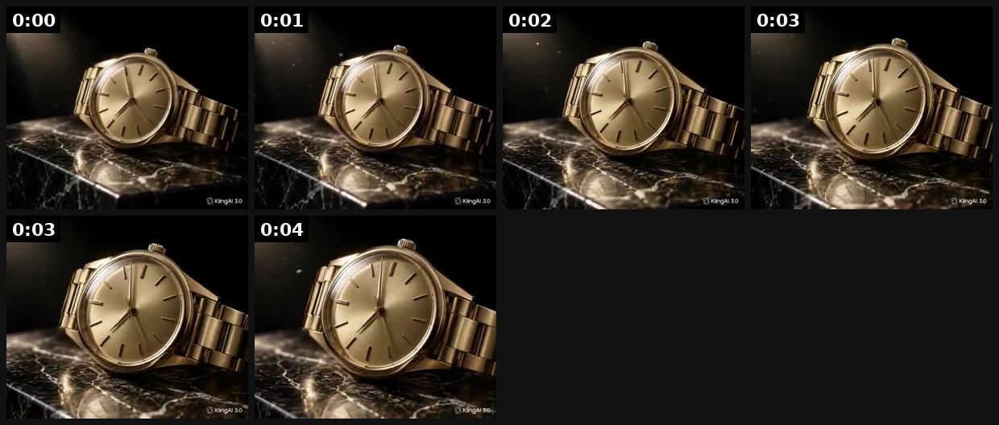

# 98 · 6-second micro-demo loop with a native headline ('omg I think I finally found…'): see it, then make it

[](https://x.com/fablecut/status/2102944927868965360)

**The example:** [@fablecut on X](https://x.com/fablecut/status/2102944927868965360) · 0:05 video · 0 likes, 11 views

**Watch it:** [open the post on X](https://x.com/fablecut/status/2102944927868965360) · [play the video file](https://video.twimg.com/ext_tw_video/2102943179519467521/pu/vid/avc1/428x360/2gMPKn3E0SSXvoy1.mp4?tag=12)

> This 5-second luxury watch ad cost $0. One product photo. No camera crew.

## What you are seeing

A 5-second AI product loop: a gold watch on black marble with light gliding across it, looping without a cut. It was made from one product photo.

## Beat by beat

The storyboard above samples the video every 0:00. Lines are the transcript for that stretch; on-screen text comes from OCR, so treat it as rough.

| Frame | Time | On screen | Said / sung |
|---|---|---|---|
| 1 | 0:00–0:00 | · | · |
| 2 | 0:00–0:01 | Ye IT a GB 3.0 | · |
| 3 | 0:01–0:02 | · | · |
| 4 | 0:02–0:03 | ly Hi 2, Biking! 30 | · |
| 5 | 0:03–0:04 | · | · |
| 6 | 0:04–0:05 | ly ee Se iD RR | · |

## How to make one like it

**The format in one line:** A silent 5-8 second clip of the product doing its one job (foundation blending to skin tone; a chain under a shower) with a casual, first-person headline written like a friend's caption. No story, no VO. It runs as the short, cheap counterweight to the brand's 3-10 minute films.

**Why it works:** - The whole ad fits inside the time people actually watch. - One visible proof plus one native line works muted. - Easy to duplicate across placements and ad sets (Smooche runs 12 copies). - It balances an account that is otherwise long-form.

**Contents:** [1. Structure](#1-copy-the-structure) · [2. Shot by shot](#2-shot-by-shot-remake) · [3. Script and hooks](#3-write-the-script) · [4. Prompts](#4-prompts) · [5. Tools and settings](#5-tools-and-settings) · [6. Louise Carter remake](#6-louise-carter-remake) · [7. Variants and test](#7-variants-and-test-plan) · [8. Pitfalls](#8-pitfalls)

### 1. Copy the structure

Use the example's timing as your beat sheet. Keep the beat, change the words and the product.

| Beat | Time | In the example | Your version |
|---|---|---|---|
| 1 | 0:00 | (visual beat, see frame 1) | … |
| 2 | 0:01 | on screen: Ye IT a GB 3.0 | … |
| 3 | 0:02 | (visual beat, see frame 3) | … |
| 4 | 0:03 | on screen: ly Hi 2, Biking! 30 | … |
| 5 | 0:03 | (visual beat, see frame 5) | … |
| 6 | 0:04 | on screen: ly ee Se iD RR | … |

### 2. Shot-by-shot remake

**Target length / size:** 5-8s loop

| # | Time / slot | What we see (visual + camera) | Dialogue / on-screen text |
|---|---|---|---|
| 1 | 0-6s | The product doing its one job, silent, seamless loop | Native headline: "omg I think I finally found it" |

<details><summary>Playbook shot list (Louise Carter version from the README)</summary>

| Time / slot | Visual | Audio / copy |
|---|---|---|
| 0:00-0:06 | Hand runs the LC necklace under a showerhead, macro, water beading, still gold | Text: "omg I think I finally found gold I can shower in" |
| end card | Optional 1 s product + price | "Any 7 for $85" |

</details>

### 3. Write the script

Open with one of these hooks (first 1–3 seconds, or the headline on a static):

- "omg I think I finally found gold I can shower in"
- "ok this is the necklace that survived the ocean"
- "6 months, every shower, still this color"

Then fill the beats from the table above. Pull the wording from real customer reviews, not from ad copy: a review line beats a copywriter line almost every time. Read every line out loud and cut anything you would not say to a friend. Ready-made Louise Carter scripts are in section 6; hand [BOT.md](BOT.md) to any AI agent to write versions for another brand.

### 4. Prompts

**Real macro or Seedance**

```text
5s seamless loop of a gold chain under running shower water, close-up
```

**Full creative-agent prompt (from the playbook):**

```
Write 10 casual first-person headlines (≤12 words, lowercase ok) for a 6-second clip of an LC necklace under a shower. They should sound like a friend's caption, not ad copy. No claims beyond "waterproof, 14K PVD".
```

### 5. Tools and settings

1. Shoot 10 macro clips of the single proof (shower, pool, sweat, saltwater).
2. Write 10 native one-line headlines in a friend's voice.
3. Launch 5 clip × headline pairs; duplicate the winner into 3 ad sets.

| Setting | Value |
|---|---|
| Canvas | 1080×1920 (9:16) master; crop a 1080×1350 (4:5) cut for feed placements |
| Frame rate | 30 fps (shoot 60 fps for slow-motion water or sparkle shots) |
| Camera | Phone main lens at 1x, exposure locked on skin, HDR off, grid on; tripod or a phone clamp for product shots |
| Light | One soft key at 45° (window or ring light), white card as fill; side light for metal sparkle |
| Audio | Lavalier or phone 15–20 cm from the mouth; mix voice at -14 LUFS, music at -28 to -30 dB under voice |
| Captions | Burned in, 2–5 words per line, 64–80 px bold sans, white with a black stroke or pill; keep text inside the safe zone (top 220 px and bottom 420 px clear, 64 px side margins) |
| Pacing | A visual change every 1.5–3 s; the hook lands in the first 1.5 s with no logo intro |
| Edit / export | CapCut or Premiere; H.264, 12–20 Mbps, AAC 320 kbps; upload natively to each platform, not via links |

### 6. Louise Carter remake

- A · Shower clip.
- B · Ocean wave clip.
- C · Sweaty gym clip.

Brand rules, claims you can and cannot make, and more scripts: [brands/louise-carter.md](brands/louise-carter.md). Step-by-step from idea to scale: [STAGES.md](STAGES.md).

### 7. Variants and test plan

- Clip
- Headline voice

**Test plan:** - **Budget/structure:** 5 pairs, $20/day each, 5 days - **Primary KPIs:** CTR, CPA; Omni (F98-*) - **Kill rule:** CTR <1% - **Scale rule:** Duplicate the winner across 3 ad sets; leave it alone - **Naming:** `utm_content=F98-<concept>-<variant>`; weekly Omni roll-up of new-customer revenue by format.

**Naming:** `F98-<variant>-<hook##>-<date>` so results map back to this folder. Change one thing per test (hook, narrator, length or offer), never two.

### 8. Pitfalls

- The loop must be seamless or it looks like an ad.
- Slow open: if the first 1.5 s does not show the hook visually, most people swipe.
- Logo or brand intro at the start reads as an ad; put the brand at the end.
- Captions covered by the platform UI: check the safe zone on a real phone before posting.
- Music over the voice: keep music at least 14 dB under speech.

**Compliance:** Baseline: [_COMPLIANCE.md](../_COMPLIANCE.md) (no fake testimonials, AI disclosure, no bulk/spoofed accounts, copy structure not assets, PDP-only claims). - Use real, unedited footage of the claim; no CGI water tricks.

## More examples

Every post we found for this format, with transcripts: [examples/](examples/README.md). Playbook: [README.md](README.md). Agent brief: [BOT.md](BOT.md).
