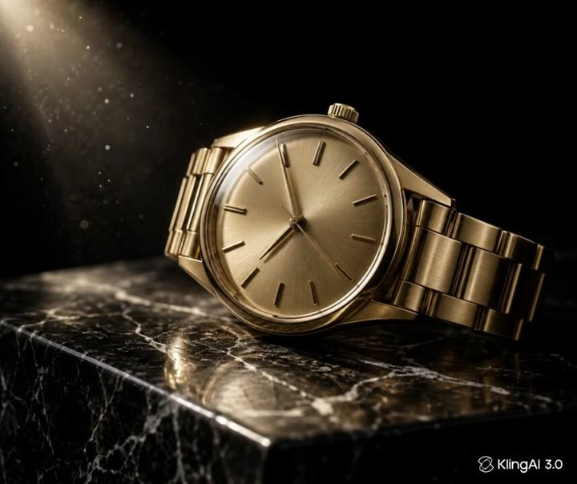

# 98 · 6-second micro-demo loop with a native headline ("omg I think I finally found…")

<!-- HERO:START -->
[](EXAMPLE.md)

**[See the example and how to make it →](EXAMPLE.md)** · [watch on X](https://x.com/fablecut/status/2102944927868965360)
<!-- HERO:END -->


> **LC priority P1** · evidence: Medium (225-day live ad) · hype risk: Medium · cost $0 · 30 min

## What it is
A silent 5-8 second clip of the product doing its one job (foundation blending to skin tone; a chain under a shower) with a casual, first-person headline written like a friend's caption. No story, no VO. It runs as the short, cheap counterweight to the brand's 3-10 minute films.

## Why it works
- The whole ad fits inside the time people actually watch.
- One visible proof plus one native line works muted.
- Easy to duplicate across placements and ad sets (Smooche runs 12 copies).
- It balances an account that is otherwise long-form.

## Shot-by-shot (LC version)

| Time / slot | Visual | Audio / copy |
|---|---|---|
| 0:00-0:06 | Hand runs the LC necklace under a showerhead, macro, water beading, still gold | Text: "omg I think I finally found gold I can shower in" |
| end card | Optional 1 s product + price | "Any 7 for $85" |

## Hooks (swap-in openers)
- "omg I think I finally found gold I can shower in"
- "ok this is the necklace that survived the ocean"
- "6 months, every shower, still this color"

## Real examples from X (studied)
- @ecomrudolfs: Smooche ad "has 12 duplicates and has been running for 225 days… I think it is 6 seconds long… 'omg I think I finally found a foundation that looks like second skin'" ([post](https://x.com/ecomrudolfs/status/2102762930886336763)); lands on smooche.com/products/color-changing-foundation.
- Playhead teardown of a Resilia hands-only deal ad: 28.8 s, product on screen at 0:00.6, "works muted: yes" ([teardown](https://tryplayhead.com/ads/resilia-urgency-zbdapp)).

## Production recipe
1. Shoot 10 macro clips of the single proof (shower, pool, sweat, saltwater).
2. Write 10 native one-line headlines in a friend's voice.
3. Launch 5 clip × headline pairs; duplicate the winner into 3 ad sets.

## Bot prompt (copy into the creative agent)
```
Write 10 casual first-person headlines (≤12 words, lowercase ok) for a 6-second clip of an LC necklace under a shower. They should sound like a friend's caption, not ad copy. No claims beyond "waterproof, 14K PVD".
```

## 3 LC scripts
- A · Shower clip.
- B · Ocean wave clip.
- C · Sweaty gym clip.

## Variants to test
- Clip
- Headline voice

## Omni test plan
- **Budget/structure:** 5 pairs, $20/day each, 5 days
- **Primary KPIs:** CTR, CPA; Omni (F98-*)
- **Kill rule:** CTR <1%
- **Scale rule:** Duplicate the winner across 3 ad sets; leave it alone
- **Naming:** `utm_content=F98-<concept>-<variant>`; weekly Omni roll-up of new-customer revenue by format.

## Compliance
Baseline: [_COMPLIANCE.md](../_COMPLIANCE.md) (no fake testimonials, AI disclosure, no bulk/spoofed accounts, copy structure not assets, PDP-only claims).
- Use real, unedited footage of the claim; no CGI water tricks.

## Related
- Strategies: 27-satisfying-product-loop-recordings, 03-creative-volume-flooding
- Formats: [28-reaction-hook-plus-demo](../28-reaction-hook-plus-demo/README.md), [54-regret-discovery-hook-silent-demo](../54-regret-discovery-hook-silent-demo/README.md), [49-cinematic-macro-product-film](../49-cinematic-macro-product-film/README.md)

<!-- EVIDENCE:START -->
## Evidence from X discovery (auto-generated)

| Date | Author | Post | Engagement | Grade | Gist |
|---|---|---|---|---|---|
| 2026-09-23 | [@ecomrudolfs](https://x.com/ecomrudolfs) | [link](https://x.com/ecomrudolfs/status/2102762930886336763) | 108L/111BM/29kV | VALUE | Smooche 6-second foundation clip, 12 duplicates, 225 days, "omg I think I finally found a foundation that looks like second skin". |
<!-- EVIDENCE:END -->
