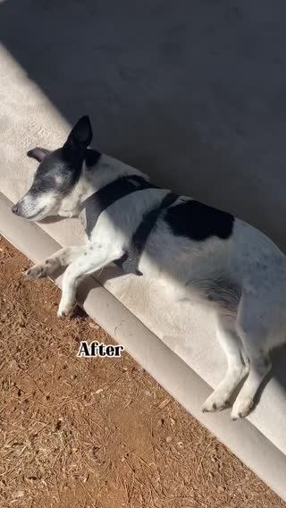

# Meta ad-library examples for F98

<!-- WAVE4 -->
## Wave 4: Alex Fedotoff's October 2026 swipe boards (GetHookd public previews)

Each ad below is from the free 10-ad preview of a public GetHookd board that [@FedotOff90](https://x.com/FedotOff90) shared on X. Days live are as of 2026-10-09; brand claims are the advertisers', not verified.

### Muscle Mat: Dog-test visual hook (Muscle Mat, 859 days) (859 days live)

- **Board:** [Hook Frameworks That Stop the Scroll (Top 150)](https://x.com/FedotOff90/status/2106774251777020286) · dco 44 s
- **What happens:** A dog flops on the mattress topper and a woman presses it; captions "what makes our campsite super comfy… 35 mm thick". DCO.
- **Why it lasts:** 859 days. The visual hook (an animal test) and the copy hook (the comfort question) run together: Fedotoff's "every hook is 2 hooks".
- **How to make one:** Pair an unexpected visual tester (dog, kid, grandpa) with a plain question in copy.
- **LC remake:** Visual: a toddler yanks the necklace; copy: "built for real life."

