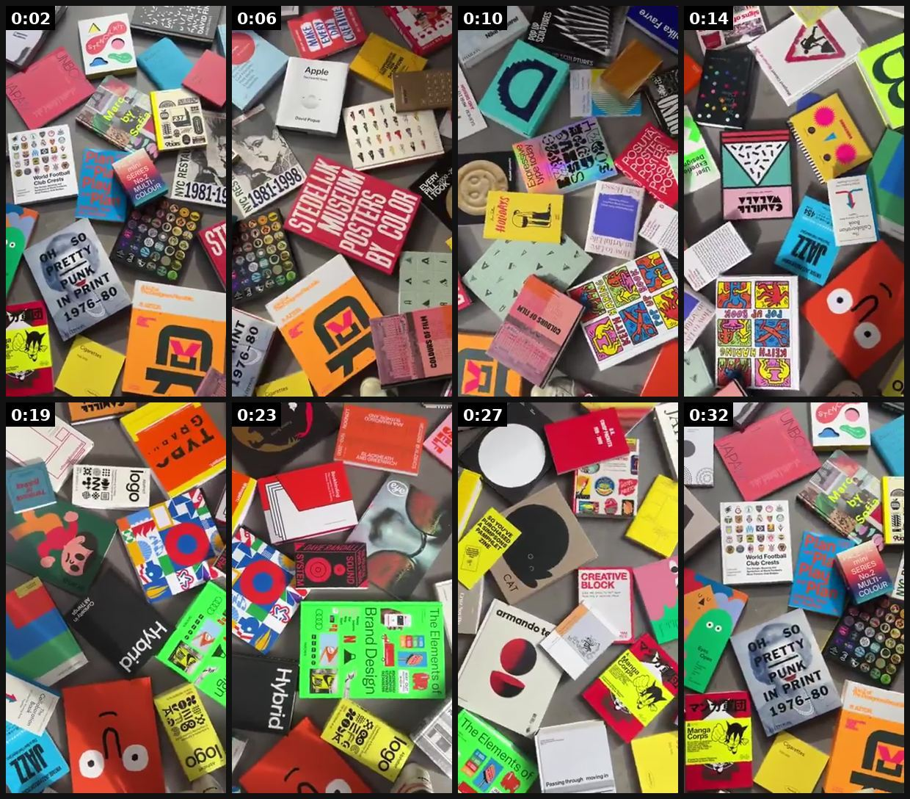

# 99 · Deadline-urgency video (two-line sale-ends skit, 'don't say I didn't warn you', hands-only deal clip): see it, then make it

[](https://x.com/Counterprint/status/2107894146140631180)

**The example:** [@Counterprint on X](https://x.com/Counterprint/status/2107894146140631180) · 0:34 video · 11 likes, 2K views

**Watch it:** [open the post on X](https://x.com/Counterprint/status/2107894146140631180) · [play the video file](https://video.twimg.com/amplify_video/2107894068478922753/vid/avc1/320x568/2iqSPstU0esxWupN.mp4?tag=29)

> Last chance! Our Sample Sale ENDS TONIGHT! https://www.counter-print.co.uk/collections/sample-sale

## What you are seeing

A sample-sale "LAST CHANCE! ENDS TONIGHT" video: a fast top-down scroll across piles of colourful printed books, packaging and merch on a table.

## Beat by beat

The storyboard above samples the video every 0:04. Lines are the transcript for that stretch; on-screen text comes from OCR, so treat it as rough.

| Frame | Time | On screen | Said / sung |
|---|---|---|---|
| 1 | 0:00–0:04 | See IN $9 ec Om ou 329 oO 1987 tee cs vt 16 yt ms aa ot | · |
| 2 | 0:04–0:08 | Ee es eS SS ToLD a 44% yah a oh ss oO vu mee ak eG | · |
| 3 | 0:08–0:12 | ss 3S SS Ne 73 va AN, a a Go Dae | · |
| 4 | 0:12–0:17 | vr at. ic M4 es eh 608 dA INDIES an ia Le | · |
| 5 | 0:17–0:21 | il Ye 423 76 axe RS rA | · |
| 6 | 0:21–0:25 | me ny a mane AR, iN Ja a UD or a: Lis or oO | · |
| 7 | 0:25–0:29 | ok. CREATIVE BLOCK by Pass through Tr | · |
| 8 | 0:29–0:34 | ey a oO SS a NS es World Football ae nt sae Po a Oy rah 7s se 499 ae Te | · |

## How to make one like it

**The format in one line:** Short (10-30 s) bottom-of-funnel videos whose only job is the deadline: a two-person micro-skit ("Wait, the sale ends today?"), a hands-only product clip with "THIS DEAL WON'T LAST" text, or a blunt to-camera warning. They sit under the long-form story ads and close the people those ads warmed up.

**Why it works:** - Long story ads create desire; these convert it before it fades. - Ten seconds, one message, works muted. - Skits make urgency feel like gossip instead of a banner. - Strategists report BOF statics and deal videos now take top impression rank in these accounts.

**Contents:** [1. Structure](#1-copy-the-structure) · [2. Shot by shot](#2-shot-by-shot-remake) · [3. Script and hooks](#3-write-the-script) · [4. Prompts](#4-prompts) · [5. Tools and settings](#5-tools-and-settings) · [6. Louise Carter remake](#6-louise-carter-remake) · [7. Variants and test](#7-variants-and-test-plan) · [8. Pitfalls](#8-pitfalls)

### 1. Copy the structure

Use the example's timing as your beat sheet. Keep the beat, change the words and the product.

| Beat | Time | In the example | Your version |
|---|---|---|---|
| 1 | 0:02 | on screen: See IN $9 ec Om ou 329 oO 1987 tee cs vt 16 yt ms aa ot | … |
| 2 | 0:06 | on screen: Ee es eS SS ToLD a 44% yah a oh ss oO vu mee ak eG | … |
| 3 | 0:10 | on screen: ss 3S SS Ne 73 va AN, a a Go Dae | … |
| 4 | 0:14 | on screen: vr at. ic M4 es eh 608 dA INDIES an ia Le | … |
| 5 | 0:19 | on screen: il Ye 423 76 axe RS rA | … |
| 6 | 0:23 | on screen: me ny a mane AR, iN Ja a UD or a: Lis or oO | … |
| 7 | 0:27 | on screen: ok. CREATIVE BLOCK by Pass through Tr | … |
| 8 | 0:32 | on screen: ey a oO SS a NS es World Football ae nt sae Po a Oy rah 7s se 499 ae Te | … |

### 2. Shot-by-shot remake

**Target length / size:** 10-30s

| # | Time / slot | What we see (visual + camera) | Dialogue / on-screen text |
|---|---|---|---|
| 1 | 0-3s | Two-person micro-skit | "Wait, the sale ends TODAY?" |
| 2 | 3-15s | Product clip with big deadline text | "THIS DEAL ENDS MIDNIGHT" |
| 3 | End | - | CTA |

<details><summary>Playbook shot list (Louise Carter version from the README)</summary>

| Time / slot | Visual | Audio / copy |
|---|---|---|
| 0:00-0:03 | Two friends in a car, one scrolling | "Wait, what do you mean the sale ends tonight?" |
| 0:03-0:10 | Other friend holds up her stack | "Any 7 for $85 ends at midnight. I'm getting the gold huggies for Mom." |
| 0:10-0:15 | Hands-only end card, text "ENDS MIDNIGHT" | "Link below." |

</details>

### 3. Write the script

Open with one of these hooks (first 1–3 seconds, or the headline on a static):

- "Wait, what do you mean the sale ends tonight?"
- "Don't say I didn't warn you: last day for 7 for $85."
- "Restock is live. Last time it lasted 9 days."

Then fill the beats from the table above. Pull the wording from real customer reviews, not from ad copy: a review line beats a copywriter line almost every time. Read every line out loud and cut anything you would not say to a friend. Ready-made Louise Carter scripts are in section 6; hand [BOT.md](BOT.md) to any AI agent to write versions for another brand.

### 4. Prompts

**Edit**

```text
Big date/time text, 2-3 cuts, end on the offer.
```

**Full creative-agent prompt (from the playbook):**

```
Write 6 deadline-urgency videos (≤15 s) for LC's real deadline {{DEADLINE}}: 2 two-person skits, 2 hands-only clips, 2 to-camera warnings. Each states the real end time and the offer (any 7 for $85). No fake stock counters.
```

### 5. Tools and settings

1. Build a calendar of REAL deadlines (BFCM, Mother's Day ship-by, restock windows).
2. Shoot 3 skits and 3 hands-only clips per deadline; swap only the date card.
3. Run only to warm audiences (video viewers 50%+, site visitors).

| Setting | Value |
|---|---|
| Canvas | 1080×1920 (9:16) master; crop a 1080×1350 (4:5) cut for feed placements |
| Frame rate | 30 fps (shoot 60 fps for slow-motion water or sparkle shots) |
| Camera | Phone main lens at 1x, exposure locked on skin, HDR off, grid on; tripod or a phone clamp for product shots |
| Light | One soft key at 45° (window or ring light), white card as fill; side light for metal sparkle |
| Audio | Lavalier or phone 15–20 cm from the mouth; mix voice at -14 LUFS, music at -28 to -30 dB under voice |
| Captions | Burned in, 2–5 words per line, 64–80 px bold sans, white with a black stroke or pill; keep text inside the safe zone (top 220 px and bottom 420 px clear, 64 px side margins) |
| Pacing | A visual change every 1.5–3 s; the hook lands in the first 1.5 s with no logo intro |
| Edit / export | CapCut or Premiere; H.264, 12–20 Mbps, AAC 320 kbps; upload natively to each platform, not via links |

### 6. Louise Carter remake

- A · Skit.
- B · Hands-only + countdown text.
- C · To-camera "don't say I didn't warn you".

Brand rules, claims you can and cannot make, and more scripts: [brands/louise-carter.md](brands/louise-carter.md). Step-by-step from idea to scale: [STAGES.md](STAGES.md).

### 7. Variants and test plan

- Skit vs hands-only
- Gift vs self-purchase angle

**Test plan:** - **Budget/structure:** 6 clips, warm audiences, $50/day total during the deadline window - **Primary KPIs:** CPA, ROAS; Omni (F99-*) - **Kill rule:** Pause when the deadline passes - **Scale rule:** Reuse the template every deadline - **Naming:** `utm_content=F99-<concept>-<variant>`; weekly Omni roll-up of new-customer revenue by format.

**Naming:** `F99-<variant>-<hook##>-<date>` so results map back to this folder. Change one thing per test (hook, narrator, length or offer), never two.

### 8. Pitfalls

- Real deadlines only.
- Slow open: if the first 1.5 s does not show the hook visually, most people swipe.
- Logo or brand intro at the start reads as an ad; put the brand at the end.
- Captions covered by the platform UI: check the safe zone on a real phone before posting.
- Music over the voice: keep music at least 14 dB under speech.

**Compliance:** Baseline: [_COMPLIANCE.md](../_COMPLIANCE.md) (no fake testimonials, AI disclosure, no bulk/spoofed accounts, copy structure not assets, PDP-only claims). - Deadlines and stock numbers must be true; fake "847 orders in the last hour" counters or evergreen "last day" claims are deceptive (FTC). - Don't pre-select subscriptions or hide recurring charges (@EcomSapo flagged Smooche's checkout).

## More examples

Every post we found for this format, with transcripts: [examples/](examples/README.md). Playbook: [README.md](README.md). Agent brief: [BOT.md](BOT.md).
