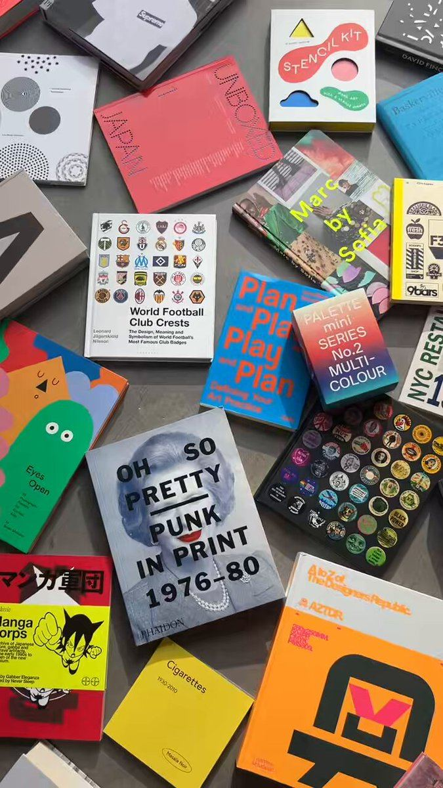

# 99 · Deadline-urgency video (two-line sale-ends skit, "don't say I didn't warn you", hands-only deal clip)

<!-- HERO:START -->
[](EXAMPLE.md)

**[See the example and how to make it →](EXAMPLE.md)** · [watch on X](https://x.com/Counterprint/status/2107894146140631180)
<!-- HERO:END -->


> **LC priority P1** · evidence: Medium-High (multiple live BOF ads) · hype risk: Medium · cost $0-100 · 1-2 h

## What it is
Short (10-30 s) bottom-of-funnel videos whose only job is the deadline: a two-person micro-skit ("Wait, the sale ends today?"), a hands-only product clip with "THIS DEAL WON'T LAST" text, or a blunt to-camera warning. They sit under the long-form story ads and close the people those ads warmed up.

## Why it works
- Long story ads create desire; these convert it before it fades.
- Ten seconds, one message, works muted.
- Skits make urgency feel like gossip instead of a banner.
- Strategists report BOF statics and deal videos now take top impression rank in these accounts.

## Shot-by-shot (LC version)

| Time / slot | Visual | Audio / copy |
|---|---|---|
| 0:00-0:03 | Two friends in a car, one scrolling | "Wait, what do you mean the sale ends tonight?" |
| 0:03-0:10 | Other friend holds up her stack | "Any 7 for $85 ends at midnight. I'm getting the gold huggies for Mom." |
| 0:10-0:15 | Hands-only end card, text "ENDS MIDNIGHT" | "Link below." |

## Hooks (swap-in openers)
- "Wait, what do you mean the sale ends tonight?"
- "Don't say I didn't warn you: last day for 7 for $85."
- "Restock is live. Last time it lasted 9 days."

## Real examples from X (studied)
- Resilia skit (GetHookd public preview): "What do you mean the sale ends today? Yes, the sale ends today… buying two right now because these are the last few hours" (transcribed) ([board](https://app.gethookd.ai/share/board/331297?signature=67e55d45fd1139ee96a9b3b8ec4d776be0d3b45520e1ff38ce31cd44463a926c)).
- Playhead teardown "Resilia Oil of Oregano Deal Urgency Promotion": 28.8 s UGC, hands holding the pouch, hook "Don't say I didn't warn you. Today is the absolute last day…", text "THIS DEAL WON'T LAST" ([teardown](https://tryplayhead.com/ads/resilia-urgency-zbdapp)).
- Smooche static via GetHookd share: title "847 Orders in Last Hour: Almost Gone", body "LIVE UPDATE: Stock is disappearing faster than we expected…" (36 days live; [ad](https://app.gethookd.ai/share/ad/171952533?signature=eb84990900fe197a023d48e2cebaba1f402dca253a778db45fe4e0f9215b3429), via @jackolivieri_).
- @ErJithin: story-song ads "now ranked behind BOF static ads" in Koriderm/Resilia libraries ([post](https://x.com/ErJithin/status/2107419279872360910)).

## Production recipe
1. Build a calendar of REAL deadlines (BFCM, Mother's Day ship-by, restock windows).
2. Shoot 3 skits and 3 hands-only clips per deadline; swap only the date card.
3. Run only to warm audiences (video viewers 50%+, site visitors).

## Bot prompt (copy into the creative agent)
```
Write 6 deadline-urgency videos (≤15 s) for LC's real deadline {{DEADLINE}}: 2 two-person skits, 2 hands-only clips, 2 to-camera warnings. Each states the real end time and the offer (any 7 for $85). No fake stock counters.
```

## 3 LC scripts
- A · Skit.
- B · Hands-only + countdown text.
- C · To-camera "don't say I didn't warn you".

## Variants to test
- Skit vs hands-only
- Gift vs self-purchase angle

## Omni test plan
- **Budget/structure:** 6 clips, warm audiences, $50/day total during the deadline window
- **Primary KPIs:** CPA, ROAS; Omni (F99-*)
- **Kill rule:** Pause when the deadline passes
- **Scale rule:** Reuse the template every deadline
- **Naming:** `utm_content=F99-<concept>-<variant>`; weekly Omni roll-up of new-customer revenue by format.

## Compliance
Baseline: [_COMPLIANCE.md](../_COMPLIANCE.md) (no fake testimonials, AI disclosure, no bulk/spoofed accounts, copy structure not assets, PDP-only claims).
- Deadlines and stock numbers must be true; fake "847 orders in the last hour" counters or evergreen "last day" claims are deceptive (FTC).
- Don't pre-select subscriptions or hide recurring charges (@EcomSapo flagged Smooche's checkout).

## Related
- Strategies: 05-offer-page-engineering, 40-modular-variation-testing-review
- Formats: [37-urgency-offer-statics](../37-urgency-offer-statics/README.md), [75-were-sorry-sold-out-apology](../75-were-sorry-sold-out-apology/README.md), [64-reminder-retargeting-sequence](../64-reminder-retargeting-sequence/README.md)

<!-- W8NOTE -->
## Wave 8 update: Voynov page, Adam Taylor teardowns, queued posts (Oct 9, 2026)
- **Flash-sale story (Wuffes):** "7 seconds. Looks like a story post, not an ad. Pure BOF retargeting" ([@adamtaylorl](https://x.com/adamtaylorl/status/2090038016685351362)). PetLab keeps price out of cold video entirely; the discount only appears on the offer page, after a quiz, or as a creator code ([thread](https://x.com/adamtaylorl/status/2108558106984595660)).
<!-- /W8NOTE -->

<!-- EVIDENCE:START -->
## Evidence from X discovery (auto-generated)

| Date | Author | Post | Engagement | Grade | Gist |
|---|---|---|---|---|---|
| 2026-09-18 | [@MaximilianMoj](https://x.com/MaximilianMoj) | [link](https://x.com/MaximilianMoj/status/2101002307160731848) | 1L/0BM/0kV | SOME | Resilia "$36M/month" (unverified) top 5 ads via Playhead teardowns: candida, aged garlic 4-week arteries, GLP-1, urgency (8 at once), animated explainer. |
| 2026-09-09 | [@jackolivieri_](https://x.com/jackolivieri_) | [link](https://x.com/jackolivieri_/status/2097798592010547583) | 0L/0BM/0kV | SOME | Smooche static "847 Orders in Last Hour, Almost Gone" / "LIVE UPDATE" stock copy (GetHookd share). |
| 2026-10-06 | [@ErJithin](https://x.com/ErJithin) | [link](https://x.com/ErJithin/status/2107419279872360910) | 0L/1BM/0kV | SOME | Story-song ads losing top impression rank to BOF statics in Koriderm/Resilia libraries. |
<!-- EVIDENCE:END -->
