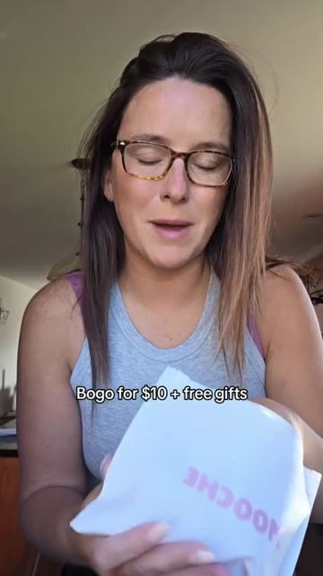
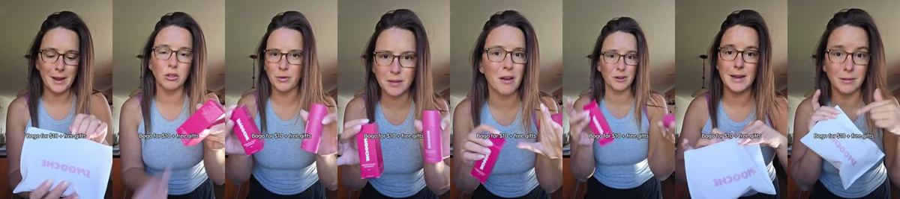
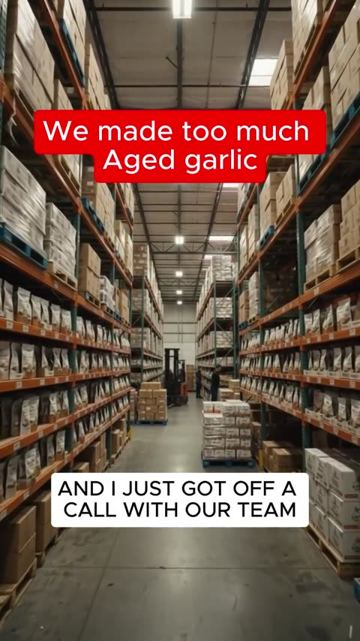
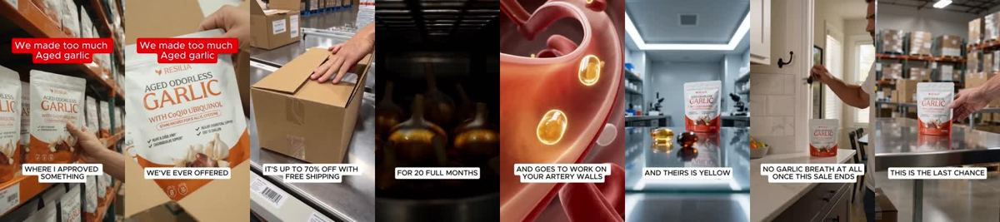
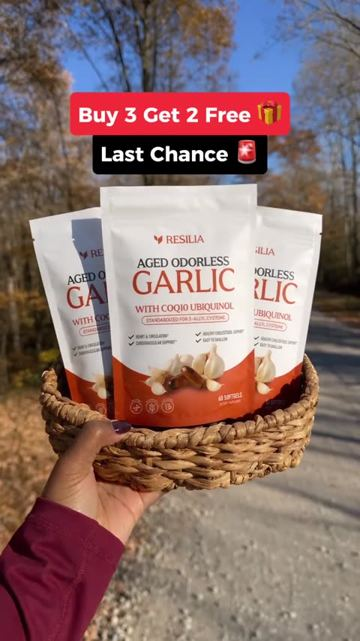
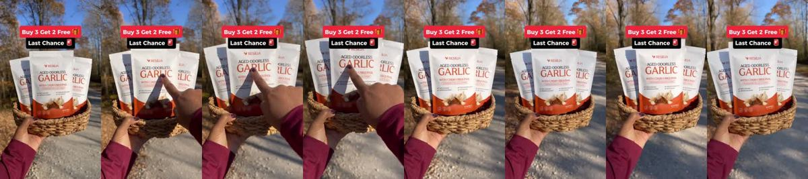
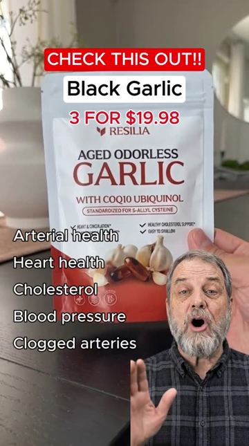
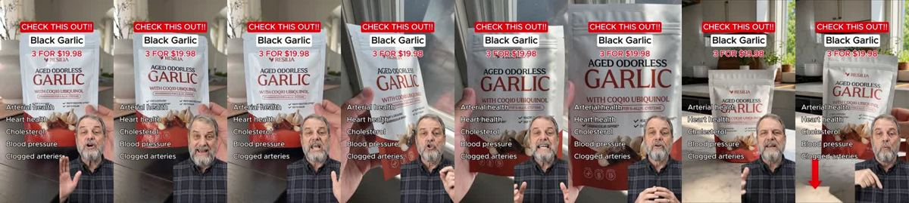
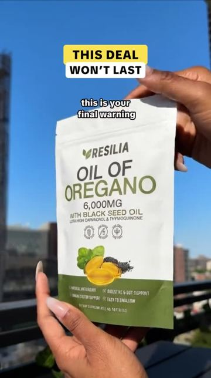
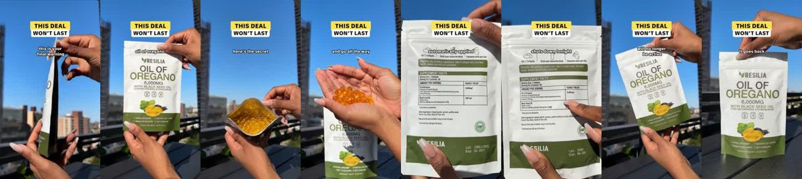

# Meta ad-library examples for F99

<!-- WAVE6 -->
## Wave 6: Resilia & Smooche live Meta ads (Oct 2026)

Pulled from the public Meta Ad Library on 2026-10-09 (Resilia: aged garlic, Ceylon cinnamon, oil of oregano; Smooche: color-changing foundation, Reverse Time peptide serum). Days live are counted to 2026-10-09; most video ads were new tests that week, while the long runners are statics and catalog templates. Transcripts are automatic. Brand claims are the advertisers', not verified, and many are health claims we would never make. The **Do not copy** line flags deceptive tactics (persona "publication" pages, undisclosed AI actors and "experts", fake stock counts).

### Smooche · Smooche: “I must stop. I got one model of the Smooch Color Changing Foundation…” (6 days live)

- **Ad:** [Meta Ad Library #1614464443499501](https://www.facebook.com/ads/library/?id=1614464443499501) · video 0:15 · page “Smooche” · started 2026-10-02 · 1 copies · lands on `smooche.com/products/ccf2`
- **What happens:** Opens: “I must stop. I got one model of the Smooch Color Changing Foundation.”
- **Why it works:** These are 15-35 s two-line skits ("What do you mean the sale ends today?" / "Yes, the sale ends today.") that run only in the final days of an offer, as the retargeting layer under the long dramas.
- **How to make one:** Use 2 characters, one disbelief line and one confirmation line, then the offer card and the deadline. Shoot 3 variants (shock, whisper, scolding).
- **Do not copy:** Only use a deadline that is real.
- **LC remake:** "Wait, any 7 for $85 ends TONIGHT?" "Tonight." Then the 7-piece flat lay and countdown.

Transcript (auto, first ~70 s)

> I must stop. I got one model of the Smooch Color Changing Foundation. For only $10 more, I could have got a second model of the Color Changing Foundation, a free blender, a free gift, and free shipping. Like the same mistake I did, and get the most bang for your buck. I'll link it below.

### Resilia · Vascular Wellness Report: “I'm the founder of Resilia, and I just got to go to the gym where I…” (1 day live)

- **Ad:** [Meta Ad Library #1631735288396529](https://www.facebook.com/ads/library/?id=1631735288396529) · video 0:56 · page “Vascular Wellness Report” · started 2026-10-07 · 1 copies · lands on `resilia.shop/products/resilia-aged-odorless-garlic`
- **What happens:** Opens: “I'm the founder of Resilia, and I just got to go to the gym where I never thought I'd prove. We overproduced.”
- **Why it works:** These are 15-35 s two-line skits ("What do you mean the sale ends today?" / "Yes, the sale ends today.") that run only in the final days of an offer, as the retargeting layer under the long dramas.
- **How to make one:** Use 2 characters, one disbelief line and one confirmation line, then the offer card and the deadline. Shoot 3 variants (shock, whisper, scolding).
- **Do not copy:** Only use a deadline that is real.
- **LC remake:** "Wait, any 7 for $85 ends TONIGHT?" "Tonight." Then the 7-piece flat lay and countdown.

Transcript (auto, first ~70 s)

> I'm the founder of Resilia, and I just got to go to the gym where I never thought I'd prove. We overproduced. And instead of sitting on the inventory, we're letting it go at the biggest discount we've ever offered. This is the last chance to get the best deal we have ever had on our website. Go take full advantage. Right now Now it's up to 70% off with free shipping. And just to remind you what you're getting, Resilia is aged garlic that sits sealed in total darkness for 20 full months until the harsh compound transforms into S-A-L-E-S-T-E-N. The only form that actually gets into the blood and blood, and it's working on the blood. And I'm the only one who's been in the blood. And I'm the only one who's been in the blood. And I'm the only one who's been in the blood a lot and I'm the only one who's been in the blood.

### Resilia · Active Longevity Review: “Last chance, everyone… this deal doesn't come around often and if you…” (1 day live)

- **Ad:** [Meta Ad Library #1590274756169404](https://www.facebook.com/ads/library/?id=1590274756169404) · video 0:21 · page “Active Longevity Review” · started 2026-10-07 · 1 copies · lands on `resilia.shop/products/resilia-aged-odorless-garlic`
- **What happens:** Opens: “Last chance, everyone… this deal doesn't come around often and if you don't move quick, it'll be gone before you know it. These are the final hours.”
- **Why it works:** These are 15-35 s two-line skits ("What do you mean the sale ends today?" / "Yes, the sale ends today.") that run only in the final days of an offer, as the retargeting layer under the long dramas.
- **How to make one:** Use 2 characters, one disbelief line and one confirmation line, then the offer card and the deadline. Shoot 3 variants (shock, whisper, scolding).
- **Do not copy:** Only use a deadline that is real.
- **LC remake:** "Wait, any 7 for $85 ends TONIGHT?" "Tonight." Then the 7-piece flat lay and countdown.

Transcript (auto, first ~70 s)

> Last chance, everyone… this deal doesn't come around often and if you don't move quick, it'll be gone before you know it. These are the final hours. The one one takes 20 months and can't be rushed. Once this batch is gone, people wait months for the next one. You are going to regret missing this one. Tap the link and grab your Rizilia right now.

### Resilia · Arterial Health Review: “Yes, the A ends today. Yes, this sale ends today. This is your last…” (1 day live)

- **Ad:** [Meta Ad Library #1638128141161941](https://www.facebook.com/ads/library/?id=1638128141161941) · video 0:22 · page “Arterial Health Review” · started 2026-10-07 · 1 copies · lands on `resilia.shop/products/resilia-aged-odorless-garlic`
- **What happens:** Opens: “Yes, the A ends today. Yes, this sale ends today.”
- **Why it works:** These are 15-35 s two-line skits ("What do you mean the sale ends today?" / "Yes, the sale ends today.") that run only in the final days of an offer, as the retargeting layer under the long dramas.
- **How to make one:** Use 2 characters, one disbelief line and one confirmation line, then the offer card and the deadline. Shoot 3 variants (shock, whisper, scolding).
- **Do not copy:** Only use a deadline that is real.
- **LC remake:** "Wait, any 7 for $85 ends TONIGHT?" "Tonight." Then the 7-piece flat lay and countdown.

Transcript (auto, first ~70 s)

> Yes, the A ends today. Yes, this sale ends today. This is your last chance to get the one with CoQ10,

### Resilia · Natural Defense Report: “This is your final warning. Today is the absolute last day to grab…” (0 days live)

- **Ad:** [Meta Ad Library #4632101840369339](https://www.facebook.com/ads/library/?id=4632101840369339) · video 0:28 · page “Natural Defense Report” · started 2026-10-08 · 1 copies · lands on `resilia.shop/products/resilia-oil-of-oregano-softgels`
- **What happens:** Opens: “This is your final warning. Today is the absolute last day to grab Brasilias ore.”
- **Why it works:** These are 15-35 s two-line skits ("What do you mean the sale ends today?" / "Yes, the sale ends today.") that run only in the final days of an offer, as the retargeting layer under the long dramas.
- **How to make one:** Use 2 characters, one disbelief line and one confirmation line, then the offer card and the deadline. Shoot 3 variants (shock, whisper, scolding).
- **Do not copy:** Only use a deadline that is real.
- **LC remake:** "Wait, any 7 for $85 ends TONIGHT?" "Tonight." Then the 7-piece flat lay and countdown.

Transcript (auto, first ~70 s)

> This is your final warning. Today is the absolute last day to grab Brasilias ore. Let's see what we can do at this insane price. Here's the secret. Click the link below, add it to your cart, and go all the a way to check out. That's where you'll get a discount automatically applied to your cart. The entire sale shuts down tonight at exactly midnight, and the link below will no longer be active. So don't wait. Get your steal now before it goes back to full price.

<!-- /WAVE6 -->

